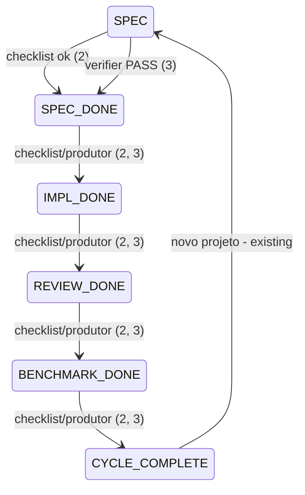

# Autoridade de escrita do pipeline: uma verdade de transição, carimbada

> Registro anterior, preservado como fonte. O contrato executado e atualizado
> está em [.tasks/context-authority.md](context-authority.md); use esse registro
> para os nomes dos writers, limites e provas vigentes.

> Build this with **tlc-implement**.
> Every criterion below becomes a check with a proof, referenced by its number. Nothing under
> `Unresolved` gets settled while building.

## Intent

`learner/pipeline_status.yaml` é o estado de máquina do ciclo de projeto — e hoje três
writers aplicam **verdades de transição diferentes** ao mesmo campo `phase`, governados só
por convenção:

- `engines/openclaw/runner/scheduler.py` avança impl-done→review-done→benchmark-done→
  cycle-complete por **presença + tamanho de artefato** (simulate-grade, por design do
  ADR-0002).
- `engines/miniMaxEvolutionEngine/.claude/commands/devschool/phaserunner.md:38` manda
  "Status advances only on PASS. Never write YAML machine state before the verifier
  returns PASS."
- `engines/miniMaxEvolutionEngine/supervisor/autonomous.py:20` importa e chama
  `save_status` diretamente; o CLI `python3 -m engines.openclaw --phase/--project`
  (`engines/openclaw/__main__.py`) escreve estado por override, resetando blockers — seam
  que o próprio AGENTS.md do openclaw flag.

Nada em código impede o openclaw de avançar uma fase que o MME gateria em verifier PASS; o
únco guard do scheduler é o learning gate, não o verificador. Não há lock — só atomic
writes e o rollback de dois arquivos do próprio scheduler, que não cobre writers
concorrentes. E `save_status` é um *helper* de escrita única, não um *writer* único.
Quem paga: qualquer consumidor de `phase` (briefing.sh, `os_adapter.py:COMMAND_BY_PHASE`,
comandos /devschool-*) lê um valor cuja verdade depende de quem gravou por último —
invisível no arquivo.

A mudança: todo avanço carimba **provenance** (`grade: simulate|verified` +
`advanced_by`); os três writers funneled pelo helper carimbado; a contradição
ADR-0002 × regra 3 do phaserunner deixa de ser convenção e vira campo documentado que o
consumidor pode rejeitar.

7 critérios em 3 slices · 1 one-way door · 1 aberta

## Criteria

### Slice 1 — Provenance no estado

1. Given `learner/pipeline_status.yaml` atual (sem o campo novo), when `load_status` roda,
   then carrega sem erro com default `grade: "unspecified"`, `advanced_by: ""` — arquivos
   existentes não quebram (`_from_mapping` em `engines/openclaw/runner/pipeline_status.py`
   ganha os dois defaults).
2. When o Scheduler do openclaw avança uma fase via checklist, then o YAML gravado contém
   `grade: "simulate"` e `advanced_by: "openclaw-checklist"`.
3. When um writer do MME grava avanço pós-verificador via `save_status`, then o YAML contém
   `grade: "verified"` e `advanced_by` nomeando o command (ex.: `devschool-optimizer`).

### Slice 2 — Escrita única carimbada

4. When `python3 -m engines.openclaw --phase spec-done` roda (override CLI), then o YAML
   resultante contém `grade: "simulate"` — o caminho de override também passa pelo helper
   carimbado, sem escrita direta fora dele.
5. Always, `grep -rn "yaml.safe_dump\|atomic_write_text" engines/openclaw/__main__.py
   engines/miniMaxEvolutionEngine/supervisor/` retorna vazio para gravações de pipeline —
   nenhum writer escreve o YAML fora de `save_status`.
6. Given duas gravações em sequência (openclaw depois MME), when se lê o arquivo, then o
   campo `grade`/`advanced_by` identifica o último writer — last-writer-wins permanece
   (sem lock, escolha documentada), mas deixa de ser invisível.

### Slice 3 — Verdade de transição documentada (emenda da fonte)

7. When se lê `phaserunner.md` (regra 3) e o output do `briefing.sh`, then ambos nomeiam o
   campo `grade` e a regra de consumo: transições `simulate` não autorizam trabalho que
   exige `verified` (a contradição entre ADR-0002 e a regra 3 fica resolvida em campo, não
   em convenção); o mapa de fases `scheduler._PHASE_MAP` ganha teste que o pina
   (SPEC_DONE→IMPL, IMPL_DONE→REVIEW, REVIEW_DONE→BENCHMARK, BENCHMARK_DONE→cycle-complete).

## States

Cada aresta nova carrega provenance no arquivo; a máquina de fases em si não muda.

## Out of scope

- Lock/arquivo de trava entre writers — detecção via provenance (critério 6); prevenção
  seria novo mecanismo que ninguém pediu.
- Deduplicar o enum `Phase` coarse do curriculum (M8) — só o pino do `_PHASE_MAP` entra
  (critério 7); a fusão dos enums é refactor próprio.
- Tornar o openclaw preview-only (perder o avanço simulate) — é a alternativa rejeitada no
  Decided; se você preferir strict, é a Unresolved 1.

## Observable

| Surface | Decision | Landing |
| --- | --- | --- |
| command `python3 -m engines.openclaw` | output de avanço inclui grade/advanced_by | 2, 4 |
| command `python3 -m engines.openclaw --preview` | receipt read-only inalterado | existing |
| documento `learner/pipeline_status.yaml` | campos novos com default compatível | 1, 2, 3 |
| command SessionStart `briefing.sh` | imprime grade junto do phase | 7 |

## Swept

- validation: 1 (arquivo legado sem o campo → default explícito)
- failure modes: existing — rollback transacional de dois arquivos no scheduler.step
- idempotency and retry: existing — uma transição por step; `save_status` idempotente por rewrite atômico
- authorization: existing — learning gate check (`gate.implementation_blocked`) continua guardando o scheduler
- concurrency and ordering: 6 (provenance torna o last-writer visível; sem lock, documentado)
- data lifecycle: 1 (campo aditivo; arquivos antigos carregam)
- external-dependency failure: n/a — filesystem apenas
- state transitions: States acima — máquina inalterada, arestas carimbadas
- observability: 2, 3, 7 (o campo grade é o sensor; briefing o expõe)

## Impact

| Front | What changes |
|---|---|
| domain | new term: `grade` (`simulate|verified|unspecified`) - verdade que produziu a transição, vive em `PipelineStatus` |
| domain | new term: `advanced_by` - writer que gravou, vive em `PipelineStatus` |
| domain | existing term: `phase` meant "estado do ciclo", now means "estado do ciclo **+ provenance obrigatória ao interpretar**" - quem faz branch hoje: `briefing.sh`, `os_adapter.py:COMMAND_BY_PHASE`, `/devschool-*` commands |
| stored data | nothing to migrate - campo aditivo com default |

## Decided

| Decision | Shape | Alternative rejected |
|---|---|---|
| Modelo de verdade dupla | Campo `grade` + `advanced_by` no contrato publicado do YAML; ambas as verdades continuam legítimas nos seus modos, consumidor decide se aceita `simulate` | Strict PASS-only (openclaw vira preview-only) — quebraria o ADR-0002 committed (openclaw avança simulate por design); fica como Unresolved 1 |
| Schema do campo | `grade: "simulate"|"verified"|"unspecified"`, `advanced_by: <string>`; defaults tolerados por `_from_mapping` | Enum aberto de grades — consumidores não conseguem exaustivamente rejeitar |

## Sources

- Análise de domínio desta sessão (chat 2026-09-13, sem endereço) — H3: writers, verdades
  e ausência de lock, com os símbolos citados no Intent
- `engines/openclaw/runner/pipeline_status.py` — `PipelineStatus` (6 campos), `save_status`,
  `_from_mapping` (tolera defaults)
- `engines/miniMaxEvolutionEngine/.claude/commands/devschool/phaserunner.md:36-38` — regra 3
  (PASS-only) e o mandato do `save_status` como helper único
- ADR-0002 — openclaw como simulate-grade runner (commitment que a alternativa strict quebraria)
- `engines/miniMaxEvolutionEngine/supervisor/autonomous.py:20` — segundo writer programático

## Unresolved

| # | Kind | Question | Until answered |
|---|---|---|---|
| 1 | open | Provenance (default escrito) ou strict PASS-only com openclaw preview-only? | Default: provenance (Decided linha 1). Se strict, teardown: critérios 2 e 4 mudam de shape (openclaw para de avançar; `--phase` vira preview) e o Decided linha 1 inverte |
