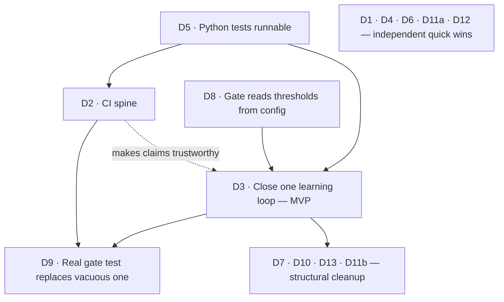

# AI DevSchool — Remediation Roadmap

**Created:** 2026-06-28 · **Source:** [TECH_DEBT_AUDIT_2026-06-28.md](TECH_DEBT_AUDIT_2026-06-28.md) · **Horizon:** Q3 2026 (through Sep 30)
**Covers:** tech-debt items D1–D13 + the 3 report-restructure fixes from the design critique.

---

## The spine (read this first)

One critical path runs through everything, and it ends at the product's reason to exist — a learning loop that actually closes:

> **D5 → D2 → D3** — make the Python tests runnable, stand up CI to enforce them, then close one real learning loop. Everything else is either a cheap parallel quick win or post-MVP cleanup.

If only three things happen this quarter: **runnable tests (D5), CI (D2), one closed loop (D3).**

Five milestones, anchored to real weeks:

| Milestone | What "done" means | Target | Items |
|---|---|---|---|
| **R · Report restructure** | The audit reads verdict-first and is a living tracker | Tue Jun 30 | R1, R2, R3 |
| **M0 · Clean baseline** | Honest docs, no committed cruft, tests run with one command | Fri Jul 3 | D1, D4, D5, D6, D11a, D12 |
| **M1 · Enforcement spine** | CI runs lint + test + build on every push, green | Fri Jul 17 | D2, D9-prep |
| **M2 · First closed loop (MVP)** | One unit graded by the gate against real evidence; streak ticks to 1 | Fri Aug 7 | D3, D8, D9 |
| **M3 · Structural cleanup** | Duplication and structural risks paid down opportunistically | Aug 10 → Sep 30 | D7, D10, D13, D11b |

Assumptions: solo developer, roughly one focused day per workday available. Dates are *targets that protect sequencing*, not commitments — if a week slips, the dependency order still holds. Each item below has an acceptance criterion ("Done when…") so completion is testable, not vibes.

---

## Dependency graph

Critical path: **D5 → D2 → D3** (with D8 feeding D3, and D9 riding on both D2 and D3).
Everything in `QW` has no dependencies — do them first because they're cheap and unblock nothing-but-also-block-nothing, clearing mental overhead. The structural items depend only on D3 being settled (so you're not refactoring code the loop is about to change).

---

## Track R — Report restructure (Mon Jun 29 – Tue Jun 30)

The cheapest win on the board: apply the design critique to the audit so it's usable as a living document. ~45 min total.

| Item | Action | Depends on | Est. | Done when… |
|---|---|---|---|---|
| **R1** | Add a 2-line verdict + "do this week" block above the executive summary | — | 10 min | A first-time reader knows the verdict and the 4 next actions without scrolling |
| **R2** | Make the register a tracker: add a plain-word severity band and `Owner`/`Status` columns; lift D3 into a "Strategic blocker" callout above the table | — | 20 min | Register rows are apples-to-apples; each has a status; D3 no longer skews the comparison |
| **R3** | Cut density ~30%: trim the exec summary to ~5 lines, halve inline bold | — | 15 min | Exec summary fits one screen; bold marks only the key clause per item |

Milestone R exit: the audit opens with a verdict, the register doubles as a status board, and D3 is framed as the strategic blocker rather than a debt line item.

---

## M0 — Clean baseline (Mon Jun 29 – Fri Jul 3)

Mechanical, low-risk, mostly parallel. Goal: stop lying to your future self (stale docs), stop committing cruft, and make the test suite runnable so M1 has something to run.

| Item | Action | Depends on | Est. | Done when… |
|---|---|---|---|---|
| **D1** | Banner `SUPERSEDED → BACKLOG_STATUS.md` on REFACTOR_PLAN.md, CONTEXT.md, stale half of catalog.md; name one canonical status doc | — | 1 h | Exactly one doc claims to describe current state; the rest point to it |
| **D12** | Add `pyproject.toml`/`requirements.txt` declaring PyYAML (pinned); pin `three` to `~0.182.0`; note the jsdom major to review | — | 1 h | `pip install` from a clean env resolves every import the tests use |
| **D5** | Add root `conftest.py`/`pyproject.toml` defining package roots; one `make test` entry point covering both Python islands | D12 | 3 h | `make test` runs minimaxDojo + substrate suites from a clean checkout, any CWD |
| **D6** | Make `.codegraph` relative, or gitignore it and generate locally | — | 30 min | Fresh clone on another machine has no dangling/abs-path symlink |
| **D11a** | `.gitignore` + `git rm --cached` generated artifacts (graphify-out HTML/report), MCP/OMO session state, dashboard PNG | — | 1 h | `git status` clean; no derived/tool files tracked; working tree builds them locally |
| **D4** | Add `.claude/settings.json` registering the SessionStart briefing hook (or document it's user-global) | — | 45 min | A fresh checkout auto-briefs on session start, or the doc says where it's registered |

Milestone M0 exit: `git status` is clean of cruft, `make test` works, every planning doc is either canonical or explicitly superseded. **~1 focused day of work spread across the week.**

---

## M1 — Enforcement spine (Mon Jul 6 – Fri Jul 17)

The machine that makes the project's own "no claims without evidence" rule real. Build CI; everything downstream becomes trustworthy.

| Item | Action | Depends on | Est. | Done when… |
|---|---|---|---|---|
| **D2 (slice 1)** | GitHub Actions: lint + test + build for codexDojo and pixelDojo on push/PR (path-filtered) | M0 | 1 day | A red test blocks a green check on both TS engines |
| **D2 (slice 2)** | Extend CI to `go test ./...`, `cargo test`, and `make test` (Python/substrate) | D5, slice 1 | 1 day | All four language suites run in CI; badge/status visible on the repo |
| **D9 (prep)** | Delete the vacuous `test_config_seam.py` assertion; stub the real gate-behavior test it will replace | D2 | 0.5 day | CI no longer reports false-green from the empty `⟨config:⟩` check |

Milestone M1 exit: every push runs lint/test/build across TS, Go, Rust, and Python; no suite is silently skipped. This is the single highest-leverage milestone — it converts the rest of the roadmap from "trust me" to "CI says so."

---

## M2 — First closed learning loop · the MVP (Mon Jul 20 – Fri Aug 7)

The north star. Drive one challenge end to end so the gate fires for real and the streak moves off zero.

| Item | Action | Depends on | Est. | Done when… |
|---|---|---|---|---|
| **D8** | Load `DEFAULT_MUTATION_THRESHOLD`/`COVERAGE`/`MAX_RETRIES` from `config/learner.yaml`; remove hardcoded duplicates | M1 | 1 day | Changing a threshold in config changes gate behavior; no constant is duplicated in code |
| **D3** | Pick 01_rate_limiter: fill a real attempt, unblock the gate (`implementation_blocked: false`), grade it against executable evidence, record the `units_log` review + streak | D5, D8, (M1) | 4 days | `learning_state.yaml` shows a `graded` event with a pass/fail from real evidence; `streak.current: 1`; `last_gate_date` set |
| **D9** | Finish the real gate-behavior test (started in M1) asserting the loop's pass/fail logic | D2, D3 | 1.5 days | CI fails if the gate would wrongly pass/fail a known-good and known-bad attempt |

Milestone M2 exit: the school has run once. One unit is genuinely mastered (or genuinely failed) on executable evidence, the gate is config-driven, and CI guards the gate's logic. **This is the deliverable that proves the product thesis.**

---

## M3 — Structural cleanup (Mon Aug 10 → Wed Sep 30, rolling)

Opportunistic, post-MVP. Pay these down alongside feature work; none blocks the loop, so they wait until the loop exists (don't refactor code the MVP is about to reshape).

| Item | Action | Depends on | Est. | Done when… |
|---|---|---|---|---|
| **D7** | codexDojo: add `escapeHtml()` at innerHTML interpolation seams (or escaping tagged template) | — | 2 h | Rendering a string with `<>&"` produces escaped output; test covers it |
| **D10** | pixelDojo: extract a common `Encounter` interface + shared `buildEvidence`; drive thresholds from `evidence_contract`; replace console-scraping with a typed emitter | D3 | 2 days | Adding an encounter touches one place; token-bucket reads its contract; no `console.log("EVIDENCE")` |
| **D13** | Curriculum: shared parity test vectors per challenge; relabel stubs honestly; split largest `lib.rs`; standardize one ESLint flat + one golangci config | — | 1 wk+ | One vector set validates all 3 impls of a challenge; no impl mislabeled; lint config is uniform |
| **D11b** | `git filter-repo` to reclaim the 142 MB `.git` (after D11a stops the bleeding) | D11a | 0.5 day | Fresh clone is single-digit MB; history rewrite documented for any collaborators |

Milestone M3 exit: duplication and the latent XSS pattern are gone, curriculum parity is enforced by shared vectors, and the repo is lean. Sequence by appetite — D7 and D11b are quick; D13 is the long tail and can stretch to quarter-end.

---

## Risks & sequencing notes

- **Do M0 before M1.** CI (D2) that can't run the Python tests (D5) just enforces TS — half a spine. D5 first.
- **Don't start M3 structural refactors before M2.** D10 touches the exact pixelDojo evidence code the closed loop exercises; refactoring it first risks reworking it twice.
- **D11b (history rewrite) is the one irreversible step.** Do it last, after D11a, and only once you've confirmed no collaborator depends on current hashes (solo today — low risk, but document it).
- **D3 is sized at 4 days but is the least predictable item** — it's product work, not a mechanical fix. If it slips, M1 (CI) still delivers standalone value, so the roadmap degrades gracefully.
- **The whole core (R + M0 + M1 + M2) is ~6 weeks of part-time solo work.** M3 is explicitly rolling and not on the critical path.

## Definition of done (quarter)

By Sep 30: the audit is a living verdict-first tracker (R); the tree is clean and tests run with one command (M0); CI enforces all four language suites on every push (M1); the learning loop has closed at least once on real evidence with a config-driven gate (M2); and the highest structural risks — duplication, the XSS pattern, repo bloat — are paid down (M3). The project moves from "the factory ran" to "the school ran, and CI proves it."
