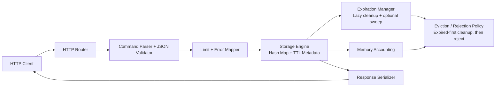

# Key-Value Store (in-memory) — Specification

> **Project ID:** 02_key_value_store  
> **Level:** 1 — Fundamentals  
> **Status:** spec-ready

## Overview

This project builds a single-node, in-memory key-value store with a small HTTP API. A key-value store keeps opaque values addressable by unique string keys, so clients can create, read, update, delete, expire, and enumerate entries without knowing the storage internals. The store does not use a database; the authoritative state is process memory.

The educational value is in implementing a deceptively simple storage service correctly. Learners must choose a hash-map-backed data model, define deterministic command semantics, handle serialization boundaries, manage TTL metadata, and protect shared mutable state under concurrent read/write pressure.

The canonical comparison question is: **How does each language's map/dictionary implementation compare under concurrent read/write pressure?** Implementations in Go, Rust, and Node/TypeScript must expose the same behavior so tests, reviews, and benchmarks can compare runtime trade-offs rather than feature drift.

## Learning Objectives

- Primary concept: hash-map-backed CRUD storage under concurrent access.
- Secondary concepts: HTTP API design, JSON serialization, TTL expiration, deterministic error handling, memory accounting basics, snapshot/persistence preparation, and benchmarkable language comparison.

## Functional Requirements

- **RF-001: SET stores or replaces one value.** The service MUST store a value at a non-empty string key. Setting an existing key MUST overwrite the value and replace any previous TTL according to the request body.
- **RF-002: GET returns an existing unexpired value.** The service MUST return the current value and TTL metadata for a key that exists and has not expired.
- **RF-003: DEL removes one or more keys.** The service MUST delete all supplied keys and return the count of keys that existed and were removed. Deleting missing or expired keys MUST be successful with no error.
- **RF-004: EXPIRE assigns or replaces a TTL.** The service MUST set a key's expiry to `now + ttlSeconds` for an existing unexpired key and MUST report whether the key was updated.
- **RF-005: TTL reports remaining lifetime.** The service MUST report remaining TTL in whole seconds for expiring keys, `-1` for existing keys without expiry, and `-2` for missing or expired keys.
- **RF-006: PERSIST removes expiry.** The service MUST remove TTL metadata from an existing unexpired key and return whether an expiry was actually removed.
- **RF-007: KEYS lists keys by prefix.** The service MUST list unexpired keys. A missing prefix filter means all keys; a supplied prefix returns only keys that start with that prefix.
- **RF-008: FLUSHDB clears the store.** The service MUST remove all keys and TTL metadata, returning the number of keys removed.
- **RF-009: MGET fetches multiple keys in one request.** The service MUST return one result per requested key in the original request order, using `null` for missing or expired keys.
- **RF-010: MSET stores multiple key-value pairs atomically.** The service MUST validate every item first, then store all pairs or none. A shared `ttlSeconds` MAY be applied to every stored pair.
- **RF-011: Expired keys are invisible.** Expired keys MUST behave as missing for GET, DEL, TTL, PERSIST, KEYS, MGET, and subsequent SET. Implementations MAY delete expired keys lazily during access or proactively in a background sweep, but externally visible behavior MUST match.
- **RF-012: Health endpoint reports service state.** The service MUST expose a lightweight health response including `ok`, current key count, and approximate memory usage.

## Non-Functional Requirements

- **RNF-001: Read latency target.** On a local machine with 10,000 resident keys and no artificial network delay, p95 GET latency SHOULD be under 5 ms for single-key requests.
- **RNF-002: Write latency target.** On a local machine with 10,000 resident keys, p95 SET latency SHOULD be under 10 ms for values up to 16 KiB.
- **RNF-003: Concurrency safety.** Concurrent requests MUST NOT corrupt store state, resurrect expired keys, lose successful writes, or expose partially applied MSET operations.
- **RNF-004: Memory bounds.** Implementations MUST enforce configurable maximum key length, maximum value size, maximum item count, and approximate maximum memory bytes. Defaults are defined in the API contract.
- **RNF-005: Deterministic serialization.** All request and response bodies MUST be JSON encoded as UTF-8 and MUST use the response envelopes defined below.
- **RNF-006: Portable implementation.** Go, Rust, and Node/TypeScript implementations MUST use only their standard runtime plus minimal HTTP/test tooling chosen inside each implementation package. No external database, cache server, or message broker is allowed.
- **RNF-007: Graceful shutdown.** The service SHOULD stop accepting new requests on termination and allow in-flight requests to complete for up to 5 seconds.
- **RNF-008: Observability baseline.** The service MUST expose enough health data for benchmarks: key count, expired key cleanup count, total commands processed, and approximate memory usage.

## API / Interface Contract

All implementations MUST expose the same HTTP interface. The default bind address is `127.0.0.1`; the default port is implementation-defined but MUST be documented by each implementation. Clients send `Content-Type: application/json` for bodies and receive JSON responses.

### Shared Response Envelopes

Successful responses MUST use:

```json
{
  "ok": true,
  "data": {}
}
```

Error responses MUST use:

```json
{
  "ok": false,
  "error": {
    "code": "INVALID_COMMAND",
    "message": "Human-readable explanation",
    "details": {}
  }
}
```

### Limits and Defaults

| Setting | Default | Requirement |
|---------|---------|-------------|
| Maximum key length | 512 bytes UTF-8 | Reject longer keys with `KEY_TOO_LONG`. |
| Maximum value size | 1 MiB serialized JSON | Reject larger values with `VALUE_TOO_LARGE`. |
| Maximum keys | 100,000 | Reject new keys with `STORE_FULL`; updates to existing keys MAY proceed if memory limits allow. |
| Maximum approximate memory | 256 MiB | Reject writes that would exceed the limit with `MEMORY_LIMIT_EXCEEDED`. |
| Minimum TTL | 1 second | Reject `ttlSeconds <= 0` with `INVALID_TTL`. |
| Maximum TTL | 30 days | Reject larger TTLs with `INVALID_TTL`. |

### Endpoints

```text
PUT /v1/kv/{key} → SET one key
  Request: { "value": JsonValue, "ttlSeconds"?: number }
  Response 200: { "ok": true, "data": { "key": string, "stored": true, "expiresAt"?: string } }
  Errors: 400 INVALID_KEY | INVALID_JSON | INVALID_TTL, 413 VALUE_TOO_LARGE, 507 STORE_FULL | MEMORY_LIMIT_EXCEEDED

GET /v1/kv/{key} → GET one key
  Response 200: { "ok": true, "data": { "key": string, "value": JsonValue, "ttlSeconds": number | null, "expiresAt": string | null } }
  Errors: 404 KEY_NOT_FOUND

DELETE /v1/kv/{key} → DEL one key
  Response 200: { "ok": true, "data": { "deleted": 0 | 1 } }
  Errors: 400 INVALID_KEY

POST /v1/kv/{key}/expire → EXPIRE one key
  Request: { "ttlSeconds": number }
  Response 200: { "ok": true, "data": { "updated": boolean, "ttlSeconds": number, "expiresAt"?: string } }
  Errors: 400 INVALID_TTL | INVALID_KEY, 404 KEY_NOT_FOUND

GET /v1/kv/{key}/ttl → TTL one key
  Response 200: { "ok": true, "data": { "ttlSeconds": number } }
  Notes: ttlSeconds is -2 for missing/expired, -1 for no expiry, >= 0 for expiring keys.
  Errors: 400 INVALID_KEY

POST /v1/kv/{key}/persist → PERSIST one key
  Response 200: { "ok": true, "data": { "updated": boolean } }
  Errors: 400 INVALID_KEY, 404 KEY_NOT_FOUND

GET /v1/keys?prefix={prefix}&limit={limit} → KEYS with optional prefix
  Response 200: { "ok": true, "data": { "keys": string[], "count": number } }
  Errors: 400 INVALID_LIMIT | KEY_TOO_LONG

POST /v1/mget → MGET many keys
  Request: { "keys": string[] }
  Response 200: { "ok": true, "data": { "items": [{ "key": string, "value": JsonValue | null, "found": boolean }] } }
  Errors: 400 INVALID_KEY | INVALID_JSON

POST /v1/mset → MSET many keys atomically
  Request: { "items": [{ "key": string, "value": JsonValue }], "ttlSeconds"?: number }
  Response 200: { "ok": true, "data": { "stored": number, "expiresAt"?: string } }
  Errors: 400 INVALID_KEY | INVALID_JSON | INVALID_TTL, 413 VALUE_TOO_LARGE, 507 STORE_FULL | MEMORY_LIMIT_EXCEEDED

POST /v1/flushdb → FLUSHDB
  Request: {}
  Response 200: { "ok": true, "data": { "deleted": number } }
  Errors: none expected for a valid HTTP request

GET /health → service health
  Response 200: { "ok": true, "data": { "status": "ok", "keyCount": number, "approxMemoryBytes": number, "commandsProcessed": number, "expiredKeysRemoved": number } }
  Errors: none expected for a valid HTTP request
```

## Data Models

```text
Key:
  raw: string
  encoding: UTF-8
  constraints: non-empty after URL decoding, max 512 bytes, no normalization required

JsonValue:
  type: JSON null | boolean | number | string | array | object
  constraints: serialized request value max 1 MiB
  storage: preserve JSON value semantics; object key ordering is not significant

StoredEntry:
  key: Key
  value: JsonValue
  createdAt: Instant / monotonic-compatible timestamp
  updatedAt: Instant / monotonic-compatible timestamp
  expiresAt: Instant | null
  approxBytes: number

StoreState:
  entries: map<Key, StoredEntry>
  maxKeys: number
  maxMemoryBytes: number
  approxMemoryBytes: number
  commandsProcessed: number
  expiredKeysRemoved: number
```

TTL comparisons MUST use the implementation's monotonic time source where available. ISO-8601 timestamps returned to clients are for observability only and MUST NOT be used internally for expiry comparisons.

## Architecture

### Diagram



### Components

| Component | Responsibility |
|-----------|----------------|
| HTTP Router | Maps routes and methods to command handlers; rejects unsupported methods. |
| Command Parser + JSON Validator | Decodes JSON, validates key/value/TTL shapes, and produces typed commands. |
| Limit + Error Mapper | Applies configured size/count/memory limits and converts domain failures to HTTP errors. |
| Storage Engine | Owns the in-memory map, atomic command semantics, TTL checks, and concurrency control. |
| Expiration Manager | Ensures expired keys are invisible and removes stale entries lazily or by optional background sweep. |
| Memory Accounting | Tracks approximate bytes for keys, serialized values, and metadata. |
| Eviction / Rejection Policy | Removes expired keys before rejecting writes; does not evict live keys in Project 02. |
| Response Serializer | Emits deterministic JSON envelopes for success and error responses. |

### Design Decisions

| Decision | Alternatives | Justification |
|----------|--------------|---------------|
| HTTP JSON API | TCP text protocol, Redis RESP-like protocol | HTTP keeps the first Project 02 implementation accessible across Go, Rust, and Node while still teaching serialization and command contracts. |
| In-memory authoritative state | Embedded database, filesystem-backed log | The project focus is map behavior, TTL, and concurrency, not durable storage. Snapshot/persistence basics remain conceptual for later extension. |
| Reject live-key eviction | LRU/LFU eviction | Live-key eviction belongs to the later Distributed Cache project; Project 02 should only clean expired keys and reject writes under pressure. |
| Atomic MSET | Partial success | Atomicity creates a clear concurrency and validation requirement and prevents ambiguous client recovery. |
| Lazy expiry required; sweep optional | Background-only expiration | Lazy expiry guarantees correctness without scheduler timing assumptions; optional sweeping improves memory behavior. |

## Error Handling Strategy

- Errors MUST be categorized as validation errors (`400`), missing resources (`404`), oversized payloads (`413`), unsupported methods (`405`), and capacity failures (`507`).
- Every error MUST return the shared error envelope with a stable machine-readable `code` and a human-readable `message`.
- GET and PERSIST on missing or expired keys MUST return `404 KEY_NOT_FOUND`; TTL MUST return `-2` instead of `404` by design.
- DEL MUST be idempotent: deleting a missing or expired key returns success with `deleted: 0`.
- FLUSHDB MUST be idempotent: flushing an empty store returns success with `deleted: 0`.
- MSET MUST be all-or-nothing. If any item is invalid or capacity would be exceeded, the store MUST remain unchanged.
- Expired entries encountered during request handling SHOULD be removed before responding, and MUST be treated as absent even if physical cleanup is deferred.

### Error Codes

| Code | HTTP Status | Meaning |
|------|-------------|---------|
| `INVALID_COMMAND` | 400 | Route, method, or command shape is invalid. |
| `INVALID_JSON` | 400 | Request body is missing, malformed, or not a JSON object where required. |
| `INVALID_KEY` | 400 | Key is empty or otherwise not accepted by the key rules. |
| `KEY_TOO_LONG` | 400 | Key exceeds the configured byte length. |
| `INVALID_TTL` | 400 | TTL is absent, non-numeric, non-integer, too small, or too large. |
| `INVALID_LIMIT` | 400 | Query limit is non-numeric, negative, or above the allowed maximum. |
| `KEY_NOT_FOUND` | 404 | Key does not exist or has expired. |
| `VALUE_TOO_LARGE` | 413 | Serialized value exceeds the configured maximum size. |
| `STORE_FULL` | 507 | Maximum item count would be exceeded by a new key. |
| `MEMORY_LIMIT_EXCEEDED` | 507 | Approximate memory limit would be exceeded by a write. |

## Edge Cases

- Empty key after URL decoding → reject with `400 INVALID_KEY`.
- Key longer than 512 UTF-8 bytes → reject with `400 KEY_TOO_LONG`.
- Key containing `/` → clients MUST URL-encode it; the server treats the decoded string as the key.
- JSON `null` value → valid stored value; it is distinct from MGET's missing-key `value: null` because MGET also returns `found`.
- Missing GET key → return `404 KEY_NOT_FOUND`.
- Expired key still present in the map → treat as missing and remove opportunistically.
- TTL exactly reaches zero between check and response → response MAY report `0`, but the next command MUST treat the key as expired.
- MSET contains duplicate keys → reject with `400 INVALID_KEY` to avoid order-dependent semantics.
- MGET contains duplicate keys → allowed; return duplicate result entries in request order.
- Concurrent SET to the same key → last completed write wins; no torn values or mixed TTL metadata are allowed.
- Concurrent GET during SET → response MUST be either the complete old entry or the complete new entry, never partial data.
- Concurrent EXPIRE/PERSIST with SET → the operation that commits last defines the final TTL metadata.
- Memory pressure with expired keys present → implementation SHOULD clean expired keys first, then decide whether to accept or reject the write.
- FLUSHDB racing with other commands → operations MUST be serialized enough that each request observes either pre-flush or post-flush state consistently.
- Invalid JSON body → reject without changing store state.
- Large KEYS result → `limit` defaults to 1,000 and MUST NOT exceed 10,000; clients needing more can change prefix filters, but pagination is out of scope.

## Acceptance Criteria

- **RF-001:** PUT `/v1/kv/{key}` stores a JSON value; a later GET returns the replacement value and correct TTL metadata.
- **RF-002:** GET returns `200` and the stored value for an unexpired key; expired or missing keys return `404 KEY_NOT_FOUND`.
- **RF-003:** DELETE removes one key and reports `deleted`; missing keys return `deleted: 0` without error.
- **RF-004:** POST `/expire` assigns a new expiry to an existing key and the key becomes unavailable after that TTL elapses.
- **RF-005:** GET `/ttl` returns `-2`, `-1`, or a non-negative remaining TTL according to key state.
- **RF-006:** POST `/persist` removes expiry from an expiring key and reports whether metadata changed.
- **RF-007:** GET `/v1/keys` returns only unexpired keys and honors prefix filtering and limits.
- **RF-008:** POST `/flushdb` removes all entries and resets key count to zero.
- **RF-009:** POST `/mget` returns one ordered result per input key, including duplicates and missing markers.
- **RF-010:** POST `/mset` stores all entries when valid and stores none when any entry or limit check fails.
- **RF-011:** Expired keys are invisible across all read/list/delete/TTL operations regardless of cleanup strategy.
- **RF-012:** GET `/health` returns service metrics without mutating store state except optional expired-key cleanup counters.

Implementation packages MUST eventually include automated tests with at least 80% coverage, but this specification task does not create those tests.

## Language-Specific Notes

### Go

- Use `map[string]StoredEntry` as the backing store protected by `sync.RWMutex` or an equivalent concurrency primitive.
- Prefer `net/http` for the HTTP server and `encoding/json` for JSON serialization unless an implementation-specific rationale is documented.
- Use `time.Now()` values that preserve monotonic clock behavior for TTL comparisons; serialize `expiresAt` separately as RFC3339/ISO-8601 for responses.
- Keep write operations under an exclusive lock for validation-plus-commit when atomicity is required, especially MSET and FLUSHDB.
- Avoid returning references to mutable internal entries after unlocking; copy values into response DTOs.

### Rust

- Use `HashMap<String, StoredEntry>` behind `Arc<RwLock<_>>`/`tokio::sync::RwLock` for a straightforward baseline, or `DashMap` if the implementation explicitly documents sharded-lock trade-offs.
- Prefer `axum`, `hyper`, or a comparable minimal HTTP stack selected by the Rust implementation owner; keep the storage core independent from the web framework.
- Use `std::time::Instant` for expiry comparisons and `SystemTime` or a time crate only for client-facing timestamp serialization.
- Ensure MSET validation and commit are atomic with respect to other writers; do not interleave partially validated items with live state.
- Model `JsonValue` with `serde_json::Value` and keep domain errors as explicit enums mapped to HTTP responses at the boundary.

### Node/TypeScript

- Use `Map<string, StoredEntry>` as the backing store. Node's single-threaded event loop prevents simultaneous JavaScript execution in one process, but async handlers can still interleave at await points.
- Keep storage mutations synchronous and avoid `await` between validation and commit for atomic operations such as MSET and FLUSHDB.
- Use `process.hrtime.bigint()` or another monotonic source for TTL calculations; use `Date` only for response timestamps.
- Preserve TypeScript types for request DTOs, response envelopes, store entries, and domain errors so tests can target public behavior without reaching into internals.
- Do not use Node clusters or worker threads for Project 02 unless the implementation explicitly documents how shared state remains single-authority and behavior-compatible.

## Dependencies

- Prerequisite projects: `01_rate_limiter` for concurrency basics.
- External services: none. Implementations MUST NOT depend on Redis, Memcached, SQLite, Postgres, MongoDB, or any other external data store.
- Future implementation targets: Go, Rust, and Node/TypeScript packages with behavior-compatible APIs and at least 80% test coverage.
