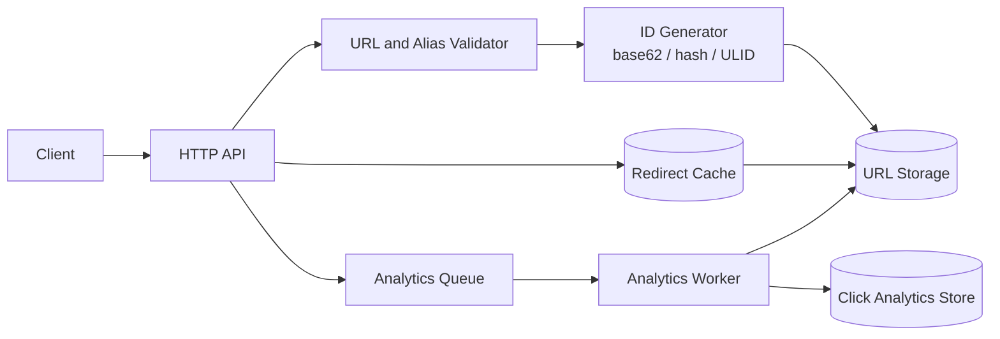

# URL Shortener — Specification

> **Project ID:** 03_url_shortener  
> **Level:** 1 — Fundamentals  
> **Status:** spec-in-progress

## Overview

Build a small HTTP URL shortener that accepts long URLs, creates compact short codes, redirects visitors to the original URL, and records click analytics without slowing down redirects. The service must expose a clear API contract so Go, Rust, and Node.js/TypeScript teams can implement comparable behavior.

This project teaches hashing and ID generation through base62 encodings, SHA-256 truncation, auto-increment IDs, ULIDs, snowflake-style IDs, and collision handling. It also introduces relational data modeling, HTTP redirect semantics, URL validation, cache-aware read paths, rate limiting, and asynchronous analytics pipelines.

The implementation should remain intentionally small: one HTTP API, one persistent URL store, one redirect cache, and one asynchronous analytics path. Teams may choose their language-specific libraries, but observable behavior, response shapes, validation rules, and error handling must match this specification.

## Learning Objectives

- Primary concept: unique short-code generation with base62/hash-based encodings and explicit collision handling.
- Secondary concepts: relational DB design, HTTP 301 redirects, URL validation, redirect caching, asynchronous click analytics, batch API design, and cross-language performance comparison.

## Functional Requirements

- **RF-001:** The service MUST create a short URL for a valid `http://` or `https://` URL via `POST /shorten`.
- **RF-002:** The service MUST return the same API response schema for every successful URL creation, including `code`, `short_url`, `original_url`, `created_at`, and optional `expires_at`.
- **RF-003:** The service MUST redirect `GET /:code` requests to the stored `original_url` using HTTP `301 Moved Permanently` by default.
- **RF-004:** The service MUST support caller-provided custom aliases when `custom_alias` is supplied to `POST /shorten`.
- **RF-005:** The service MUST reject a custom alias that already exists and MUST NOT overwrite the existing URL mapping.
- **RF-006:** The service MUST record click analytics for every successful redirect, including at minimum `code`, timestamp, and request metadata that can be derived safely from headers.
- **RF-007:** The service MUST expose aggregate analytics for a code via `GET /:code/stats`, including total clicks and recent click timestamps.
- **RF-008:** The service MUST delete or deactivate a short URL via `DELETE /:code`; deleted codes MUST stop redirecting.
- **RF-009:** The service MUST list stored short URLs via `GET /urls` with pagination parameters `limit` and `cursor`.
- **RF-010:** The service MUST support batch URL creation via `POST /shorten/batch` for 1-100 URLs in a single request.
- **RF-011:** The service MUST detect generated-code collisions and retry generation before failing the request.
- **RF-012:** The service MUST enforce per-client creation rate limits and return a structured rate-limit error when exceeded.

## Non-Functional Requirements

- **RNF-001:** Redirect lookup latency MUST be p95 `< 10ms` at 1,000 requests per second when the code is present in the redirect cache.
- **RNF-002:** URL creation latency SHOULD be p95 `< 50ms` at 100 requests per second when storage is healthy.
- **RNF-003:** Click analytics recording MUST be asynchronous relative to redirect responses; analytics failures MUST NOT block or fail a successful redirect.
- **RNF-004:** Code generation MUST provide collision resistance appropriate for at least 1,000,000 stored URLs with a collision retry strategy documented by each implementation.
- **RNF-005:** Persistent URL mappings MUST survive process restarts.
- **RNF-006:** The service MUST validate input deterministically and return JSON errors with stable machine-readable error codes.
- **RNF-007:** Batch creation MUST be atomic per item, not per request: one invalid item MUST NOT prevent valid items in the same batch from being created.
- **RNF-008:** Benchmarks MUST report redirect throughput, URL creation throughput, collision behavior, and analytics overhead separately for each language implementation.

## API / Interface Contract

### Endpoints

```text
POST /shorten → create one short URL
  Request:
    {
      "url": "https://example.com/a/long/path?with=query",
      "custom_alias": "optional-human-code",
      "expires_at": "2026-12-31T23:59:59Z"
    }
  Response 201:
    {
      "code": "aB93xZ",
      "short_url": "http://localhost:8080/aB93xZ",
      "original_url": "https://example.com/a/long/path?with=query",
      "created_at": "2026-06-17T12:00:00Z",
      "expires_at": "2026-12-31T23:59:59Z"
    }
  Errors:
    400 invalid_url | invalid_alias | max_url_length_exceeded
    409 alias_conflict
    429 rate_limit_exceeded
    500 storage_error | code_generation_failed

GET /:code → redirect to the original URL
  Request: no body
  Response 301:
    Location: https://example.com/a/long/path?with=query
  Errors:
    404 code_not_found
    410 code_deleted | code_expired
    429 rate_limit_exceeded

GET /:code/stats → fetch aggregate analytics for one short code
  Request: no body
  Response 200:
    {
      "code": "aB93xZ",
      "original_url": "https://example.com/a/long/path?with=query",
      "total_clicks": 42,
      "created_at": "2026-06-17T12:00:00Z",
      "last_clicked_at": "2026-06-17T12:30:00Z",
      "recent_clicks": [
        { "clicked_at": "2026-06-17T12:30:00Z", "referrer": "https://search.example" }
      ]
    }
  Errors:
    404 code_not_found
    410 code_deleted | code_expired

DELETE /:code → deactivate one short URL
  Request: no body
  Response 204: no body
  Errors:
    404 code_not_found
    410 code_deleted

GET /urls?limit=50&cursor=<opaque> → list stored short URLs
  Request: no body
  Response 200:
    {
      "items": [
        {
          "code": "aB93xZ",
          "short_url": "http://localhost:8080/aB93xZ",
          "original_url": "https://example.com/a/long/path?with=query",
          "created_at": "2026-06-17T12:00:00Z",
          "clicks": 42,
          "deleted_at": null
        }
      ],
      "next_cursor": "opaque-or-null"
    }
  Errors:
    400 invalid_pagination

POST /shorten/batch → create multiple short URLs
  Request:
    {
      "urls": [
        { "url": "https://example.com/one", "custom_alias": "one" },
        { "url": "https://example.com/two" }
      ]
    }
  Response 207:
    {
      "results": [
        { "index": 0, "status": 201, "code": "one", "short_url": "http://localhost:8080/one" },
        { "index": 1, "status": 201, "code": "k9Zp01", "short_url": "http://localhost:8080/k9Zp01" }
      ]
    }
  Errors:
    400 invalid_batch | batch_too_large
    429 rate_limit_exceeded
```

All JSON error responses MUST use this shape:

```json
{
  "error": {
    "code": "invalid_url",
    "message": "URL must use http or https and be no longer than 2048 characters."
  }
}
```

### Data Models

```text
URL:
  code: string (primary key, base62 or custom alias, 3-32 chars)
  original_url: string (required, absolute http/https URL, max 2048 chars)
  created_at: timestamp (required, UTC)
  updated_at: timestamp (required, UTC)
  expires_at: timestamp | null (optional, UTC)
  deleted_at: timestamp | null (null means active)
  clicks: integer (required, starts at 0, eventually consistent with ClickEvent count)

ClickEvent:
  id: string | integer (primary key)
  code: string (foreign key to URL.code)
  clicked_at: timestamp (required, UTC)
  referrer: string | null (optional, max 2048 chars)
  user_agent: string | null (optional, max 512 chars)
  client_ip_hash: string | null (optional, hashed if recorded)

RateLimitBucket:
  client_key: string (primary key, derived from IP or configured client identity)
  tokens_remaining: integer (required)
  reset_at: timestamp (required, UTC)
```

## Architecture

### Diagram



### Components

| Component | Responsibility |
|-----------|----------------|
| HTTP API | Parses requests, routes endpoints, writes JSON responses, and emits redirects. |
| URL and Alias Validator | Enforces URL scheme, max length, alias format, batch size, and pagination constraints. |
| ID Generator | Produces compact unique codes and retries on collision. |
| URL Storage | Persists URL mappings, deletion state, expiry, and click counters. |
| Redirect Cache | Serves hot code-to-URL lookups within the `< 10ms` redirect target. |
| Analytics Queue | Buffers redirect events so analytics work is not on the critical redirect path. |
| Analytics Worker | Consumes click events, stores event records, and updates aggregate click counts. |
| Rate Limiter | Protects creation endpoints from excessive requests per client. |

### Design Decisions

| Decision | Alternatives | Justification |
|----------|--------------|---------------|
| Use `301` for redirects by default | `302`, `307`, JSON response | The catalog explicitly teaches HTTP redirects; `301` is stable and easy to benchmark. |
| Store URL mappings persistently | In-memory only | Project 02 already covers storage basics; Project 03 must preserve mappings after restart. |
| Keep analytics asynchronous | Synchronous counter update during redirect | Redirect latency is a core NFR; analytics must not block the response path. |
| Treat batch results independently | All-or-nothing batch transaction | Independent results teach partial failure handling and are easier to compare across languages. |
| Allow multiple ID strategies | Require one algorithm | The canonical key question compares snowflake, ULID, and auto-increment strategies across languages. |

## Error Handling Strategy

- Validation errors return `400` with stable error codes such as `invalid_url`, `invalid_alias`, `invalid_batch`, `batch_too_large`, and `max_url_length_exceeded`.
- Custom alias conflicts return `409 alias_conflict`; generated collisions are internal and MUST be retried before surfacing `500 code_generation_failed`.
- Missing, deleted, and expired codes are distinct: `404 code_not_found`, `410 code_deleted`, and `410 code_expired`.
- Rate limit violations return `429 rate_limit_exceeded` and SHOULD include `Retry-After` when a reset time is known.
- Storage failures return `500 storage_error`; implementations SHOULD log internal details but MUST NOT expose stack traces or database internals in responses.
- `POST /shorten` is not globally idempotent unless the caller provides a custom alias. Repeating a request without `custom_alias` MAY create distinct short codes.
- `DELETE /:code` is idempotent for already-deleted codes at the storage layer, but the API MUST return `410 code_deleted` so clients can distinguish deleted from never-created codes.

## Edge Cases

- Empty URL input → reject with `400 invalid_url`.
- Non-HTTP(S) schemes such as `ftp:`, `file:`, `javascript:`, and relative URLs → reject with `400 invalid_url`.
- URL longer than 2048 characters → reject with `400 max_url_length_exceeded`.
- Custom alias containing non-base62 characters, reserved route names (`urls`, `shorten`, `health`), or length outside 3-32 characters → reject with `400 invalid_alias`.
- Custom alias already mapped to an active or deleted URL → reject with `409 alias_conflict`; aliases MUST NOT be reused in this project.
- Generated code collision → retry with a new code up to an implementation-defined limit of at least 5 attempts; then return `500 code_generation_failed`.
- Expired URL → return `410 code_expired` and do not record click analytics.
- Deleted URL → return `410 code_deleted` and do not record click analytics.
- Analytics queue unavailable → redirect still succeeds; event loss or retry behavior must be documented in implementation notes.
- Batch request with more than 100 items → reject the whole request with `400 batch_too_large`.
- Batch request with mixed valid and invalid items → return per-item statuses in `207` and create all valid items.
- Concurrent requests for the same custom alias → exactly one request succeeds; the others return `409 alias_conflict`.

## Acceptance Criteria

- RF-001: `POST /shorten` with a valid HTTP(S) URL returns `201` and a retrievable short code.
- RF-002: Successful creation responses include `code`, `short_url`, `original_url`, `created_at`, and `expires_at` fields with stable types.
- RF-003: `GET /:code` for an active code returns `301` and a `Location` header equal to the original URL.
- RF-004: `POST /shorten` with an unused valid `custom_alias` returns that alias as `code`.
- RF-005: Reusing an existing custom alias returns `409 alias_conflict` and leaves the original mapping unchanged.
- RF-006: A successful redirect eventually creates a click event or increments observable click statistics.
- RF-007: `GET /:code/stats` returns `total_clicks` and recent click data for an active code.
- RF-008: After `DELETE /:code`, `GET /:code` no longer redirects and returns `410 code_deleted`.
- RF-009: `GET /urls` returns paginated URL records and a `next_cursor` field.
- RF-010: `POST /shorten/batch` creates valid entries independently and reports invalid entries by index.
- RF-011: A forced or simulated generated-code collision retries generation without corrupting existing mappings.
- RF-012: Exceeding the configured creation limit returns `429 rate_limit_exceeded`.
- RNF-001: Redirect benchmark with cached lookups reports p95 latency `< 10ms` at 1,000 RPS.
- RNF-003: Injected analytics failure does not change the redirect response status or `Location` header.

## Language-Specific Notes

### Go

- Prefer the standard `net/http` package or a small router; keep middleware explicit for validation, rate limiting, and metrics.
- Use `context.Context` for request cancellation and storage calls.
- Model async analytics with a buffered channel plus worker goroutine; define backpressure behavior when the channel is full.
- Compare ID generation strategies with `crypto/sha256`, base62 encoding helpers, `sync/atomic` counters, or ULID libraries if chosen.
- Use `database/sql` with a lightweight relational database driver for persistent URL mappings.

### Rust

- Prefer `axum` or `actix-web` for HTTP routing and typed extractors.
- Use `tokio` tasks and channels for asynchronous analytics; make event-loss and shutdown behavior explicit.
- Represent validation failures with a typed error enum mapped to HTTP status codes.
- Compare ID generation with `sha2`, base62 encoding crates, atomic counters, or ULID crates if chosen.
- Use `sqlx`, `rusqlite`, or another documented relational storage layer with explicit migrations or schema setup.

### Node/TS

- Prefer Express, Fastify, or the built-in HTTP server with TypeScript types for request and response bodies.
- Keep URL validation and alias validation in reusable pure functions so behavior is testable through the API and at the boundary.
- Model async analytics with an in-process queue, worker promise loop, or event emitter; redirects must not `await` analytics persistence.
- Compare ID generation with Node `crypto`, base62 helpers, monotonic counters, or ULID packages if chosen.
- Use a relational database client with typed query results where possible; avoid storing URL mappings only in process memory.

## Dependencies

- Prerequisite projects: `02_key_value_store` for storage basics and persistence thinking.
- External tools: an HTTP load generator for redirect and creation benchmarks; a relational database or embedded SQL store; optional Docker for reproducible service + database runs.
- No implementation code, tests, package manifests, or language-specific project scaffolding are required by this specification artifact.
