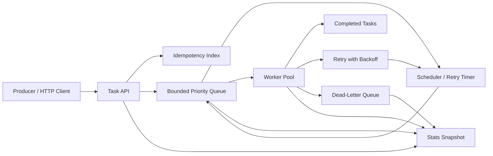

# Concurrent Task Queue — Specification

> **Project ID:** 04_concurrent_task_queue  
> **Level:** 2 — Concurrency and Performance  
> **Status:** spec-in-progress

## Overview

Build an in-memory concurrent task queue service that accepts tasks from producers, stores them in bounded queues, dispatches them to a configurable worker pool, retries transient failures with backoff, and moves exhausted or poison tasks into a dead-letter queue. The service exposes a small HTTP API for creating tasks, querying task state, cancelling pending/running work, and inspecting operational stats.

This project is the curriculum's first focused worker-pool and job-processing challenge. It teaches how each runtime models concurrency under pressure: goroutines and channels in Go, async tasks and ownership boundaries in Rust, and the event loop plus worker abstractions in Node.js/TypeScript.

The implementation must remain single-process and language-neutral in behavior. Persistence may be in-memory for the baseline, but the design must make task state transitions, idempotency, retry policy, backpressure, and graceful shutdown explicit enough to benchmark and compare across languages.

## Learning Objectives

- Primary concept: bounded concurrent job processing with worker pools.
- Secondary concepts: scheduling, priority queues, backpressure, retries with exponential backoff, dead-letter queues, idempotency keys, cancellation, graceful shutdown, and observable queue metrics.

## Functional Requirements

- **RF-001:** The service MUST accept task creation requests through `POST /tasks` with a JSON payload, optional priority, optional idempotency key, optional scheduled time, and optional retry policy overrides.
- **RF-002:** The service MUST assign every accepted task a stable unique `id` and initial status of `queued` unless `scheduled_for` is in the future, in which case the initial status MUST be `scheduled`.
- **RF-003:** The service MUST support idempotent enqueue by `idempotency_key`; a duplicate active key MUST return the existing task instead of creating a second task.
- **RF-004:** The queue MUST dequeue tasks only when they are eligible to run: status is `queued`, `scheduled_for` is absent or due, and the task has not been cancelled.
- **RF-005:** The worker pool MUST run up to `worker_count` tasks concurrently and MUST NOT run more tasks than configured workers.
- **RF-006:** The service MUST support `worker_count = 0` as a valid paused mode where tasks can be accepted but none are executed.
- **RF-007:** The queue MUST support priority ordering where higher-priority eligible tasks are dispatched before lower-priority eligible tasks, while preserving FIFO order within the same priority.
- **RF-008:** The service MUST support scheduled tasks through `scheduled_for`; scheduled tasks MUST become eligible only at or after their scheduled timestamp.
- **RF-009:** The service MUST retry failed tasks up to `max_retries` using exponential backoff with jitter; each retry MUST increment the task's `retries` count and record the next eligible time.
- **RF-010:** The service MUST move tasks to a dead-letter queue when retries are exhausted, task payloads are invalid after acceptance, or the worker marks the task as a poison message.
- **RF-011:** The service MUST allow cancellation through `DELETE /tasks/:id`; pending or scheduled tasks MUST become `cancelled`, and running tasks MUST receive a cancellation signal or be marked `cancelling` until the worker acknowledges.
- **RF-012:** The service MUST expose `GET /tasks/:id` to query task status, retry count, timestamps, last error, priority, idempotency key, and whether the task is in the dead-letter queue.
- **RF-013:** The service MUST expose `GET /stats` with queue depth, scheduled count, running count, completed count, failed count, cancelled count, dead-letter count, worker count, busy worker count, and backpressure state.
- **RF-014:** The service MUST record valid task state transitions and reject invalid transitions, for example `completed` tasks cannot be retried, cancelled, or moved back to `queued`.

## Non-Functional Requirements

- **RNF-001:** Throughput target: with 8 workers and no artificial task delay, the service SHOULD accept at least 1,000 enqueue requests per second on commodity developer hardware during local benchmarks.
- **RNF-002:** Dispatch target: under a steady queue of immediately eligible tasks, idle workers SHOULD receive new tasks within 50 ms p95.
- **RNF-003:** Backpressure: the service MUST enforce a configurable maximum queue capacity and return a deterministic error when the queue is full instead of growing memory without bound.
- **RNF-004:** Memory boundedness: queued, scheduled, running, completed-retention, and dead-letter collections MUST all have explicit limits or retention policies documented in configuration.
- **RNF-005:** Graceful shutdown: on shutdown, the service MUST stop accepting new tasks, keep query endpoints available while draining, wait up to a configurable timeout for running workers, then mark unfinished work as `queued` or `failed` according to the shutdown policy.
- **RNF-006:** Thread safety: concurrent enqueue, cancel, status query, stats query, worker completion, retry scheduling, and DLQ movement MUST be safe under race detection or equivalent tooling for each language.
- **RNF-007:** Observability: every state transition MUST update stats and SHOULD emit structured logs containing task id, previous status, next status, retry count, and worker id when applicable.
- **RNF-008:** Deterministic testing: the retry scheduler and task clock MUST be injectable or controllable so backoff, scheduling, timeout, and shutdown behavior can be tested without real-time sleeps.

## API / Interface Contract

### Endpoints

```http
POST /tasks → enqueue a task
  Request:
    {
      "payload": object,
      "priority": integer optional, default 0,
      "idempotency_key": string optional,
      "scheduled_for": RFC3339 timestamp optional,
      "max_retries": integer optional, default from config,
      "timeout_ms": integer optional, default from config
    }
  Response 201:
    Task
  Response 200:
    Task returned for an existing idempotency_key
  Errors:
    400 invalid payload, invalid priority, invalid timestamp, or invalid retry settings
    409 idempotency_key conflicts with a completed retained task when replay is disallowed
    429 queue capacity reached
    503 service is shutting down

GET /tasks/:id → query task status
  Request: no body
  Response 200:
    Task
  Errors:
    404 task not found

DELETE /tasks/:id → cancel a task
  Request: no body
  Response 200:
    Task with status cancelled or cancelling
  Errors:
    404 task not found
    409 task already completed, failed, or dead-lettered

GET /stats → query queue and worker stats
  Request: no body
  Response 200:
    {
      "queue_depth": integer,
      "scheduled_count": integer,
      "running_count": integer,
      "completed_count": integer,
      "failed_count": integer,
      "cancelled_count": integer,
      "dead_letter_count": integer,
      "worker_count": integer,
      "busy_worker_count": integer,
      "backpressure": "open" | "limited" | "full" | "shutting_down"
    }
```

### Data Models

```yaml
Task:
  id: string (unique, server-generated)
  payload: object (JSON-serializable task data)
  status: enum(scheduled, queued, running, succeeded, failed, cancelling, cancelled, dead_lettered)
  retries: integer (number of failed attempts already made, starts at 0)
  max_retries: integer (>= 0)
  priority: integer (higher value dispatches first; default 0)
  idempotency_key: string optional (unique among retained active tasks)
  scheduled_for: RFC3339 timestamp optional (first time task is eligible)
  next_attempt_at: RFC3339 timestamp optional (retry eligibility time)
  timeout_ms: integer optional (> 0)
  created_at: RFC3339 timestamp
  updated_at: RFC3339 timestamp
  started_at: RFC3339 timestamp optional
  completed_at: RFC3339 timestamp optional
  cancelled_at: RFC3339 timestamp optional
  last_error: string optional

TaskAttempt:
  task_id: string
  attempt: integer (1-based)
  worker_id: string
  started_at: RFC3339 timestamp
  finished_at: RFC3339 timestamp optional
  result: enum(succeeded, failed, timed_out, cancelled, poison)
  error: string optional

QueueStats:
  queue_depth: integer
  scheduled_count: integer
  running_count: integer
  completed_count: integer
  failed_count: integer
  cancelled_count: integer
  dead_letter_count: integer
  worker_count: integer
  busy_worker_count: integer
  backpressure: enum(open, limited, full, shutting_down)
```

## Architecture

### Diagram



### Components

| Component | Responsibility |
|-----------|----------------|
| Task API | Validates requests, creates tasks, handles status/cancel/stats endpoints, and maps service errors to HTTP responses. |
| Idempotency Index | Tracks active `idempotency_key` values and returns existing tasks for duplicate submissions. |
| Bounded Priority Queue | Stores eligible tasks by priority and FIFO sequence while enforcing maximum capacity. |
| Scheduler | Holds future scheduled tasks and retry-delayed tasks until they become eligible for the queue. |
| Worker Pool | Owns worker lifecycle, dispatch concurrency, task execution timeout, cancellation signalling, and worker crash recovery. |
| Retry Policy | Computes exponential backoff with jitter and determines whether a failed task should retry or move to DLQ. |
| Dead-Letter Queue | Stores poison or exhausted tasks for inspection without blocking healthy queue processing. |
| Stats Store | Maintains a consistent snapshot of queue depth, worker utilization, state counts, and backpressure state. |

### Design Decisions

| Decision | Alternatives | Justification |
|----------|--------------|---------------|
| Single-process queue for baseline | External broker or database-backed queue | Keeps the project focused on language concurrency models before distributed queue complexity. |
| Bounded queue capacity | Unbounded in-memory collection | Makes backpressure visible and prevents memory growth from hiding design problems. |
| Priority plus FIFO tie-break | Strict FIFO only or priority only | Teaches scheduling trade-offs while preserving fairness inside each priority level. |
| Explicit DLQ | Drop exhausted tasks or keep retrying forever | Makes poison-message handling testable and prevents a bad task from monopolizing workers. |
| Injectable clock | Real timers only | Enables deterministic tests for scheduled tasks, retry backoff, timeouts, and graceful shutdown. |

## Error Handling Strategy

- Validation errors return `400` and MUST NOT enqueue a task.
- Queue capacity errors return `429` with a clear `queue_full` error code and SHOULD include current capacity stats.
- Shutdown rejection returns `503` with a `shutting_down` error code.
- Missing tasks return `404`; invalid cancellation of terminal tasks returns `409`.
- Task execution timeout MUST mark the current attempt as `timed_out`; the task is retried or dead-lettered according to the retry policy.
- Worker crash or panic MUST NOT lose the task. The task MUST be returned to retry scheduling or moved to DLQ if retries are exhausted.
- Poison messages MUST bypass further retries when explicitly classified as poison by the worker and MUST move directly to DLQ.
- Idempotency guarantees apply to accepted task creation. Duplicate active keys return the original task; expired or completed-key behavior MUST be documented by retention policy.

## Edge Cases

- Duplicate `idempotency_key` while original task is `scheduled`, `queued`, `running`, or retry-delayed → return the original task without enqueuing a duplicate.
- Duplicate `idempotency_key` after retention expiry → allow a new task because the previous key is no longer tracked.
- `worker_count = 0` → accept eligible tasks until capacity, report workers as zero, and leave tasks queued or scheduled without execution.
- All workers busy → keep additional eligible tasks queued and report `busy_worker_count == worker_count`.
- Queue capacity full → reject new immediate tasks with `429`; scheduled tasks also count toward configured memory bounds.
- Task serialization failure before acceptance → return `400` and create no task record.
- Task serialization failure after acceptance, such as worker cannot decode payload → mark attempt failed and retry or DLQ according to retry policy.
- `scheduled_for` in the past → accept as immediately eligible and set status to `queued`.
- Cancellation races with dispatch → final state MUST be deterministic: either cancelled before execution, cancelling while running, or conflict if already terminal.
- Retry backoff time arrives while service is shutting down → do not dispatch new attempts after shutdown begins.
- Worker crashes while holding a task → task is recovered exactly once into retry scheduling or DLQ; stats must not count it as permanently running.
- Poison message reaches DLQ → it MUST NOT be automatically re-queued by normal retry scheduling.

## Acceptance Criteria

- RF-001: Creating a valid task via `POST /tasks` returns a task object with stored payload and configured options.
- RF-002: Accepted immediate tasks start as `queued`; future scheduled tasks start as `scheduled`.
- RF-003: Repeating `POST /tasks` with the same active `idempotency_key` returns the original task id.
- RF-004: Workers never receive cancelled tasks or tasks scheduled for the future.
- RF-005: A concurrency test proves running task count never exceeds `worker_count`.
- RF-006: With `worker_count = 0`, tasks remain accepted but no task reaches `running` or terminal execution states.
- RF-007: Given mixed priorities, higher-priority tasks dispatch first and same-priority tasks dispatch FIFO.
- RF-008: A scheduled task becomes eligible only after the configured clock reaches `scheduled_for`.
- RF-009: Failed tasks retry up to `max_retries`, with increasing `next_attempt_at` values and incremented retry counts.
- RF-010: Exhausted or poison tasks appear in DLQ and are reflected by status and stats.
- RF-011: Cancelling scheduled or queued work produces `cancelled`; cancelling running work produces deterministic cancellation handling.
- RF-012: `GET /tasks/:id` returns complete task state and returns `404` for unknown ids.
- RF-013: `GET /stats` reflects queue, scheduled, running, terminal, DLQ, worker, busy-worker, and backpressure counts after state changes.
- RF-014: Invalid state transitions are rejected or impossible through public APIs and worker completion paths.

## Language-Specific Notes

### Go

- Prefer goroutines plus channels for worker signalling, with `context.Context` for cancellation and shutdown.
- Protect shared task state with `sync.Mutex`, `sync.RWMutex`, or a single owner goroutine; race detector must pass.
- `container/heap` is appropriate for the priority queue and scheduler heap.
- Use `time.Timer`/`time.Ticker` behind an injectable clock abstraction for deterministic scheduling tests.

### Rust

- Prefer async execution with Tokio for HTTP and worker orchestration, or document any synchronous-threaded baseline clearly.
- Model task status as an enum and state transitions as explicit methods to prevent invalid transitions.
- Use `Arc`, `Mutex`/`RwLock`, channels, and `BinaryHeap` carefully; avoid holding locks across `.await` points.
- Use injectable time with Tokio's paused time utilities or a project clock trait for deterministic tests.

### Node/TS

- Prefer an async HTTP server with a bounded in-memory queue and explicit worker loop promises.
- CPU-bound task simulation should not block the event loop; use async handlers or worker threads only if the implementation documents the trade-off.
- Represent task status with discriminated unions or literal types to keep transition handling explicit.
- Use fake timers in tests for scheduled tasks, backoff, timeouts, and shutdown behavior.

## Dependencies

- Prerequisite projects: Projects 01-03 (`01_rate_limiter`, `02_key_value_store`, `03_url_shortener`).
- External tools: language test runners, race/concurrency tooling where available, and a benchmark tool such as k6 or wrk for enqueue/status throughput comparisons.
