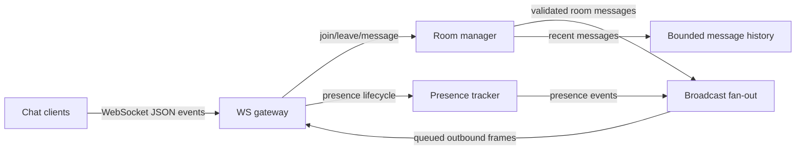

# WebSocket Chat Server — Specification

> **Project ID:** `05_websocket_chat`  
> **Level:** 2 — Concurrency and Performance  
> **Status:** spec-in-progress

## Overview

Build a WebSocket chat server in Go, Rust, and Node.js/TypeScript that supports persistent client connections, room-based broadcast, direct messaging, presence, typing signals, message history, heartbeat detection, and graceful disconnects. The server is intentionally stateful while running, but it does not require durable persistence for this project; in-memory state is enough as long as connection lifecycle and cleanup are correct.

The educational focus is persistent connection management under load. Unlike request/response HTTP services, a chat server must keep thousands of sockets open, track which client belongs to which rooms, fan out events efficiently, avoid slow-consumer collapse, and detect dead peers without leaking memory.

The cross-language comparison question is: **How does each runtime handle 10k+ concurrent persistent connections?** Implementations must expose enough metrics and benchmark hooks to compare connection capacity, fan-out latency, heartbeat overhead, memory per connection, and behavior during connection churn.

## Learning Objectives

- Primary concept: WebSocket connection lifecycle and broadcast fan-out under high concurrency.
- Secondary concepts: room membership, presence tracking, heartbeat/ping-pong, backpressure, message ordering, reconnection behavior, and runtime memory/latency tradeoffs.

## Functional Requirements

- **RF-001:** Clients must connect to the server via WebSocket and receive a connection acknowledgment containing a server-generated `clientId` and current heartbeat policy.
- **RF-002:** Clients must join a named room with `join` and receive confirmation that includes the room name, current member count, and recent message history for that room.
- **RF-003:** Clients must leave a joined room with `leave`; the server must remove the membership and notify remaining room members of the departure.
- **RF-004:** Clients must send a room message with `message`; the server must validate the payload, assign a server timestamp and message ID, and enqueue it for delivery to that room.
- **RF-005:** Room messages must be broadcast to every connected member of the target room except where explicitly configured to exclude the sender in the event contract.
- **RF-006:** Clients must send private messages to a specific online `clientId`; only the sender and recipient may receive the private message event.
- **RF-007:** The server must track presence for connected clients and publish online/offline updates to relevant room members when clients connect, join rooms, leave rooms, or disconnect.
- **RF-008:** Clients must send typing indicators for a room; the server must broadcast transient typing state to other room members without storing it in message history.
- **RF-009:** The server must keep bounded in-memory message history per room and return the most recent messages when a client joins or requests history.
- **RF-010:** The server must implement heartbeat health checks with ping/pong or application-level heartbeat messages and disconnect clients that miss the configured threshold.
- **RF-011:** The server must handle graceful disconnect: when a socket closes normally, all room memberships and presence records for that client must be cleaned up and relevant rooms notified.
- **RF-012:** The server must reject invalid events without closing the connection unless the error is fatal, and must return a structured `error` event describing the failed event and reason.
- **RF-013:** The server must enforce configurable room capacity and reject joins to full rooms with a structured error.
- **RF-014:** The server must expose runtime metrics for active connections, active rooms, room memberships, messages received, messages delivered, heartbeat timeouts, rejected events, and dropped slow consumers.

## Non-Functional Requirements

- **RNF-001:** The server must support **10,000+ concurrent WebSocket connections** on a single developer machine or documented benchmark environment, with caveats recorded for OS file-descriptor and port limits.
- **RNF-002:** Room message delivery latency must be **p95 < 50ms** for rooms with up to 100 active clients under steady load on the benchmark environment.
- **RNF-003:** Per-connection server memory overhead must be **< 100KB** at 10k idle connections, excluding fixed process startup memory.
- **RNF-004:** Heartbeat processing must not consume more than **10% CPU** at 10k idle connections using the default heartbeat interval.
- **RNF-005:** The server must clean up disconnected clients and empty rooms within **30 seconds** of detecting disconnect or heartbeat timeout.
- **RNF-006:** The server must preserve per-room message order as observed by clients for messages accepted by the server in a single room.
- **RNF-007:** A single slow or stalled client must not block message delivery to healthy clients in the same room.
- **RNF-008:** Implementations must provide comparable configuration knobs across languages for heartbeat interval, heartbeat timeout, room capacity, message size limit, and history size.

## API / Interface Contract

### WebSocket Endpoint

```text
WS /ws?token={optionalAuthToken}&name={displayName}
  Protocol: WebSocket over HTTP upgrade
  Encoding: UTF-8 JSON text frames
  Client identity: server-generated clientId after successful connect
  Message envelope: every application event uses { "type": string, "requestId"?: string, ... }
```

Authentication is intentionally minimal for this project. Implementations may accept anonymous clients by default, but they must reserve the `token` field and report authentication failures through the error strategy so later projects can compare authenticated WebSocket handshakes.

### Event Envelope

All client-to-server and server-to-client application messages must be JSON objects with a `type` field. Client requests should include `requestId` when the client expects a direct acknowledgment. Server acknowledgments must echo `requestId` when present.

```json
{
  "type": "join",
  "requestId": "req-123",
  "roomId": "general"
}
```

### Client → Server Events

```text
connect → implicit WebSocket upgrade
  Query: token?: string, name?: string
  Success event: connected
  Errors: authentication_failed, connection_limit_exceeded

join → join a room
  Request: { type: "join", requestId?: string, roomId: string }
  Success event: joined
  Errors: invalid_message_format, room_full, room_not_found_or_disallowed

leave → leave a room
  Request: { type: "leave", requestId?: string, roomId: string }
  Success event: left
  Errors: not_in_room, invalid_message_format

message → send a room message
  Request: { type: "message", requestId?: string, roomId: string, body: string }
  Success events: message_ack to sender, message to room members
  Errors: not_in_room, message_too_large, invalid_message_format

private_message → send direct message
  Request: { type: "private_message", requestId?: string, toClientId: string, body: string }
  Success events: private_message_ack to sender, private_message to recipient
  Errors: recipient_offline, message_too_large, invalid_message_format

typing → publish transient typing state
  Request: { type: "typing", roomId: string, isTyping: boolean }
  Success event: typing broadcast to other room members
  Errors: not_in_room, invalid_message_format

history → request recent room messages
  Request: { type: "history", requestId?: string, roomId: string, limit?: number, beforeMessageId?: string }
  Success event: history
  Errors: not_in_room, invalid_message_format

pong → heartbeat response, when application-level heartbeats are used
  Request: { type: "pong", heartbeatId: string }
  Success event: none required
  Errors: invalid_message_format
```

### Server → Client Events

```text
connected
  Payload: { type: "connected", clientId: string, heartbeatIntervalMs: number, heartbeatTimeoutMs: number }

joined
  Payload: { type: "joined", requestId?: string, roomId: string, memberCount: number, history: Message[] }

left
  Payload: { type: "left", requestId?: string, roomId: string }

message
  Payload: { type: "message", message: Message }

message_ack
  Payload: { type: "message_ack", requestId?: string, messageId: string, roomId: string, acceptedAt: string }

private_message
  Payload: { type: "private_message", message: Message }

presence
  Payload: { type: "presence", roomId?: string, clientId: string, status: "online" | "offline" | "away", at: string }

typing
  Payload: { type: "typing", roomId: string, clientId: string, isTyping: boolean, at: string }

history
  Payload: { type: "history", requestId?: string, roomId: string, messages: Message[] }

ping
  Payload: { type: "ping", heartbeatId: string, sentAt: string }

error
  Payload: { type: "error", requestId?: string, code: string, message: string, fatal: boolean }
```

## Data Models

```text
Client:
  clientId: string (server-generated, unique while connected)
  displayName: string (optional, sanitized, max 64 characters)
  connectedAt: timestamp
  lastSeenAt: timestamp
  rooms: set<roomId>
  presence: Presence
  outboundQueueDepth: integer
  remoteAddress: string

Room:
  roomId: string (normalized, non-empty, max 80 characters)
  members: set<clientId>
  capacity: integer
  history: bounded list<Message>
  createdAt: timestamp
  lastActiveAt: timestamp

Message:
  messageId: string (server-generated, sortable or timestamp-correlated)
  kind: "room" | "private"
  fromClientId: string
  toClientId: string (private messages only)
  roomId: string (room messages only)
  body: string (non-empty, max configured size)
  sentAt: timestamp (server time)
  sequence: integer (monotonic per room for room messages)

Presence:
  clientId: string
  status: "online" | "offline" | "away"
  rooms: set<roomId>
  updatedAt: timestamp
```

## Architecture

### Diagram



### Components

| Component | Responsibility |
|-----------|----------------|
| WS gateway | Accepts WebSocket upgrades, parses frames, validates event envelopes, writes outbound frames, and manages heartbeat timers. |
| Client registry | Tracks active clients, socket handles, metadata, last-seen timestamps, and outbound queue health. |
| Room manager | Owns room creation, room capacity, membership sets, join/leave rules, and empty-room cleanup. |
| Broadcast fan-out | Delivers accepted room events to room members without letting one slow client block others. |
| Presence tracker | Maintains online/offline/away state and emits presence updates for relevant rooms. |
| History buffer | Stores bounded in-memory message history per room and supports recent-history retrieval. |
| Metrics collector | Counts connections, rooms, message ingress/egress, latency, drops, errors, and heartbeat timeouts. |

### Design Decisions

| Decision | Alternatives | Justification |
|----------|-------------|---------------|
| WebSocket JSON text frames | Binary protocol, Server-Sent Events, long polling | JSON keeps the teaching focus on connection lifecycle and fan-out while remaining easy to inspect across languages. |
| In-memory room and history state | External database or message broker | Project 05 teaches runtime connection behavior; durable persistence and distributed pub/sub appear in later projects. |
| Bounded per-room history | Unbounded history, no history | Bounded history teaches memory limits and gives reconnecting clients useful context without adding database scope. |
| Per-client outbound buffering | Direct synchronous writes during broadcast | Buffers isolate slow clients so fan-out remains healthy for the rest of the room. |
| Configurable heartbeat policy | No heartbeat, fixed constants | Persistent connections need dead-peer detection, and configurable intervals support fair runtime comparison. |

## Error Handling Strategy

- Protocol errors are returned as structured `error` events with `fatal: false` when the connection can continue.
- Fatal handshake or authentication errors must reject the WebSocket upgrade or close the connection with an appropriate WebSocket close code and a logged reason.
- Invalid JSON, missing `type`, unknown event type, missing required fields, and invalid field types map to `invalid_message_format`.
- Room-capacity failures map to `room_full`; the connection stays open and the client may join another room.
- Messages from clients that are not members of the target room map to `not_in_room`.
- Messages larger than the configured limit map to `message_too_large`; repeated oversized messages may be treated as abusive and closed.
- Connection drops and heartbeat timeouts trigger the same cleanup path as graceful disconnects: remove memberships, update presence, notify rooms, and release buffers.
- Slow consumers are handled by bounded outbound queues. When a queue exceeds the configured threshold, the server may drop that client with a structured final error or close reason, but it must not block room broadcast.

## Edge Cases

- Reconnection: a reconnecting user receives a new `clientId` unless an implementation documents optional token-based identity restoration; recent room history is the recovery mechanism for missed room messages.
- Message ordering: accepted room messages must be assigned a per-room `sequence` and delivered in sequence order for each room, even when multiple clients send concurrently.
- Partial sends: fragmented WebSocket frames must be handled by the WebSocket library/runtime; application logic must process only complete JSON messages.
- Connection flood: rapid connection attempts must be bounded by configurable connection limits and must not exhaust memory or file descriptors without a controlled rejection path.
- Duplicate joins: joining a room the client is already in must be idempotent and return the current membership state.
- Duplicate leaves: leaving a room the client is not in must return `not_in_room` without affecting other rooms.
- Empty rooms: a room with zero members must be eligible for cleanup after the configured idle interval.
- Simultaneous disconnect and broadcast: a disconnecting client may miss in-flight messages, but the server must not panic, leak membership, or block fan-out.
- Presence after disconnect: offline presence must be emitted once per relevant room even if the socket closes unexpectedly.
- Clock differences: all message timestamps and heartbeat deadlines must use server time, not client-provided time.

## Acceptance Criteria

- RF-001: A WebSocket client can connect and receives `connected` with `clientId` and heartbeat settings.
- RF-002: Joining a valid room returns `joined` with member count and bounded recent history.
- RF-003: Leaving a room removes membership and emits presence/leave notification to remaining members.
- RF-004: Sending a valid room message returns `message_ack` and creates a server-stamped `Message`.
- RF-005: Multiple clients in the same room receive room broadcasts; clients outside the room do not.
- RF-006: Private messages are visible only to sender and recipient.
- RF-007: Presence updates are emitted on connect, join, leave, disconnect, and heartbeat timeout.
- RF-008: Typing indicators reach other room members and are not stored in history.
- RF-009: Room history is bounded, ordered, and returned on join/history requests.
- RF-010: Missed heartbeat thresholds close stale clients and clean up state.
- RF-011: Normal socket close cleans all room memberships and emits offline presence.
- RF-012: Invalid events return structured `error` events without crashing the server.
- RF-013: Full rooms reject additional joins with `room_full`.
- RF-014: Metrics expose connection, room, message, heartbeat, error, and slow-consumer counts.

## Language-Specific Notes

### Go

- Favor goroutines with explicit cancellation for connection read/write loops.
- Use channel or mutex ownership carefully for room membership and per-client outbound queues.
- Compare memory behavior with many goroutines, timer usage, and bounded channels at 10k idle sockets.
- Recommended ecosystem options may include the standard `net/http` upgrade path plus a well-maintained WebSocket package.

### Rust

- Favor async I/O with Tokio and explicit ownership of shared state through `Arc` plus appropriate synchronization primitives.
- Keep per-connection tasks and buffers bounded so 10k connections do not create unbounded heap growth.
- Model message/event types strongly enough to reject invalid payloads consistently.
- Recommended ecosystem options may include Axum or another Tokio-compatible WebSocket stack.

### Node/TS

- Favor event-loop-friendly nonblocking handlers and avoid synchronous work in broadcast paths.
- Watch memory per socket, closure capture, and large object retention during room churn.
- Use TypeScript schemas or runtime validation for incoming events so invalid client payloads produce consistent errors.
- Recommended ecosystem options may include a minimal HTTP server plus a WebSocket library suited for high connection counts.

## Dependencies

- Prerequisite projects: Projects 01-03, especially concurrency basics, HTTP/networking basics, and in-memory state management.
- External tools: WebSocket load generator or custom benchmark client, OS file-descriptor tuning for 10k connections, and metrics collection for latency and memory comparison.
