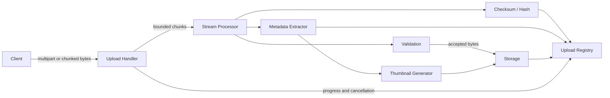

# File Upload/Processing Pipeline — Specification

> **Project ID:** `06_file_upload_pipeline`
> **Level:** 2 — Concurrency and Performance
> **Status:** spec-in-progress

## Overview

Build a language-neutral HTTP file upload service in Go, Rust, and Node.js/TypeScript that accepts large files, processes them as streams, validates their contents, stores accepted uploads, and exposes upload status and metadata through a small REST API.

This project teaches the difference between buffering an entire file in memory and processing bytes incrementally. Implementations must demonstrate bounded memory usage while handling multipart uploads, chunked transfer, hashing, validation, thumbnail generation, metadata extraction, progress reporting, cancellation, and retrieval of completed upload records.

The central comparison question is: **How do streaming vs buffering approaches compare for large file handling?** Benchmarks and reviews should focus on memory pressure, throughput, cancellation behavior, and runtime ergonomics rather than subjective language preference.

## Learning Objectives

- Primary concept: streaming I/O with bounded memory during large file handling.
- Secondary concepts: multipart parsing, chunked processing, backpressure, checksums, file validation, concurrent upload coordination, metadata extraction, and pipeline-style processing.

## Functional Requirements

- **RF-001:** The service MUST accept multipart file uploads through `POST /upload` with a `file` part and optional client metadata fields.
- **RF-002:** The service MUST accept HTTP chunked transfer uploads without requiring `Content-Length`, while still enforcing configured maximum file size as bytes arrive.
- **RF-003:** The service MUST process file bytes as a stream and MUST NOT require buffering the complete file in application memory before validation, hashing, or storage.
- **RF-004:** The service MUST validate each upload against an allowlist of MIME types and file extensions before marking the upload as accepted.
- **RF-005:** The service MUST compute a SHA-256 checksum while streaming and store it with the upload record.
- **RF-006:** If the client provides an expected checksum, the service MUST compare it against the computed checksum and reject the upload on mismatch.
- **RF-007:** For image uploads in supported formats, the service MUST generate a thumbnail artifact without loading the original file fully into memory.
- **RF-008:** The service MUST extract metadata such as original filename, detected MIME type, size in bytes, checksum, upload timestamps, and image dimensions when available.
- **RF-009:** The service MUST expose upload progress through `GET /files/:id/status`, including received bytes, total bytes when known, status, and failure reason when applicable.
- **RF-010:** The service MUST allow cancellation of in-progress uploads through `DELETE /files/:id`; cancellation must stop further processing and remove incomplete temporary artifacts.
- **RF-011:** The service MUST expose completed or failed upload details through `GET /files/:id`.
- **RF-012:** The service MUST list upload records through `GET /files`, with pagination and optional filtering by status.

## Non-Functional Requirements

- **RNF-001:** The default maximum accepted file size MUST be 1 GiB, configurable at startup without code changes.
- **RNF-002:** Application memory used per active upload MUST remain below 50 MB during streaming for files up to the configured maximum size, excluding runtime baseline and external image-processing tool memory when separately measured.
- **RNF-003:** The service MUST support at least 25 concurrent uploads of 100 MB each without process crashes, data corruption, or unbounded memory growth.
- **RNF-004:** Sustained upload throughput MUST reach at least 50 MB/s on local disk for a single 1 GiB upload in benchmark conditions, or document the runtime/environment bottleneck if this target is not met.
- **RNF-005:** Progress status for active uploads MUST update at least once per second or every 5 MB received, whichever happens first.
- **RNF-006:** The upload pipeline MUST apply backpressure rather than reading faster than downstream validation, hashing, processing, or storage can consume.
- **RNF-007:** Temporary files and partial artifacts MUST be cleaned up within 60 seconds after cancellation, validation failure, checksum mismatch, or client disconnect.
- **RNF-008:** The service MUST persist enough upload state to report terminal statuses (`completed`, `failed`, `cancelled`) after process restart when using the chosen local persistence mechanism.

## API / Interface Contract

### Endpoints

```text
POST /upload -> start and complete a file upload
  Request: multipart/form-data
    file: binary stream (required)
    expectedChecksum: string (optional, SHA-256 hex)
    metadata: object/string fields (optional, implementation-defined client metadata)
  Response 201:
    {
      "id": "upl_01J...",
      "filename": "photo.jpg",
      "size": 2483912,
      "status": "completed",
      "checksum": "sha256:...",
      "metadata": { "mimeType": "image/jpeg", "width": 1920, "height": 1080 },
      "thumbnailUrl": "/files/upl_01J.../thumbnail"
    }
  Response 202:
    Returned when processing continues asynchronously after upload bytes are received.
  Errors: 400 malformed multipart, 409 checksum mismatch, 413 size exceeded, 415 invalid file type, 499 client closed request, 507 storage unavailable.

GET /files -> list uploads
  Query: status? string, limit? integer, cursor? string
  Response 200:
    {
      "items": [Upload],
      "nextCursor": "opaque-cursor-or-null"
    }
  Errors: 400 invalid pagination/filter parameters.

GET /files/:id -> fetch upload record
  Response 200: Upload
  Errors: 404 upload not found.

GET /files/:id/status -> fetch upload progress and terminal state
  Response 200:
    {
      "id": "upl_01J...",
      "status": "receiving|processing|completed|failed|cancelled",
      "receivedBytes": 10485760,
      "totalBytes": 104857600,
      "progressPercent": 10.0,
      "error": null
    }
  Errors: 404 upload not found.

DELETE /files/:id -> cancel an in-progress upload or delete a stored upload record
  Response 202:
    { "id": "upl_01J...", "status": "cancelled" }
  Response 204:
    Returned when deleting a completed stored upload is supported by the implementation.
  Errors: 404 upload not found, 409 upload cannot be cancelled in current state.
```

### Data Models

```text
Upload:
  id: string (stable unique identifier, server-generated)
  filename: string (original client filename, sanitized for display only)
  size: integer (bytes received; final file size when terminal)
  chunks: Chunk[] (observed chunks or chunk summary records)
  status: enum(receiving, processing, completed, failed, cancelled)
  checksum: string (computed SHA-256 in "sha256:<hex>" form; nullable until available)
  expectedChecksum: string? (client-provided SHA-256, if supplied)
  metadata: UploadMetadata
  storagePath: string (internal path or object key; never trust client input)
  thumbnailPath: string? (internal thumbnail path when generated)
  error: UploadError? (terminal failure details)
  createdAt: timestamp
  updatedAt: timestamp
  completedAt: timestamp?

Chunk:
  index: integer (monotonic sequence number)
  offset: integer (starting byte offset)
  size: integer (bytes in this chunk)
  receivedAt: timestamp

UploadMetadata:
  mimeType: string
  extension: string
  width: integer? (images only)
  height: integer? (images only)
  clientMetadata: object? (optional fields provided by caller)

UploadError:
  code: enum(invalid_file_type, size_exceeded, checksum_mismatch, disk_full, network_interruption, malformed_multipart, internal_error)
  message: string
  retryable: boolean
```

## Architecture

### Diagram



### Components

| Component | Responsibility |
|-----------|----------------|
| Upload Handler | Owns HTTP parsing, request limits, upload IDs, cancellation hooks, and response mapping. |
| Stream Processor | Reads bytes incrementally, coordinates backpressure, and fans chunks into validation, hashing, metadata, and storage steps. |
| Validation | Checks MIME type, extension, max size, malformed chunk boundaries, and policy violations. |
| Checksum / Hash | Computes SHA-256 incrementally and verifies optional expected checksums. |
| Metadata Extractor | Derives file metadata from streamed headers or bounded probes without full-file buffering. |
| Thumbnail Generator | Produces thumbnails for supported image types using streaming or temporary-file-backed processing. |
| Storage | Persists accepted file bytes, thumbnails, and temporary artifacts with safe cleanup semantics. |
| Upload Registry | Tracks Upload records, progress, terminal states, and status queries. |

### Design Decisions

| Decision | Alternatives | Justification |
|----------|--------------|---------------|
| Stream-first processing | Buffer entire request before processing | The project exists to teach memory-bounded large file handling. |
| Incremental SHA-256 | Hash after writing complete file | Streaming hash proves bytes can feed multiple pipeline stages without rereading everything. |
| Temporary artifact then promote | Write directly to final path | Promotion avoids exposing partial files and simplifies cleanup on failures. |
| Status registry separate from storage | Infer status from files on disk only | Explicit status supports progress tracking, cancellation, and precise error reporting. |

## Error Handling Strategy

- Errors MUST be categorized as client input errors, policy violations, storage/resource failures, network interruptions, or internal failures.
- Client-facing errors MUST use stable error codes from `UploadError.code`; logs may include implementation-specific details.
- Invalid file type MUST return `415 Unsupported Media Type` and mark the Upload as `failed` with `invalid_file_type`.
- Size exceeded MUST return `413 Payload Too Large`, stop reading as soon as safely possible, and clean up partial bytes.
- Checksum mismatch MUST return `409 Conflict`, delete temporary artifacts, and store the computed checksum for diagnostics when safe.
- Disk full or storage exhaustion MUST return `507 Insufficient Storage`; the Upload status MUST become `failed` with `disk_full`.
- Network interruption or client disconnect MUST mark the Upload as `failed` with `network_interruption` unless a prior cancellation was requested.
- Malformed multipart bodies MUST return `400 Bad Request` and MUST NOT create a completed Upload record.
- Cancellation MUST be idempotent for active uploads: repeated `DELETE /files/:id` calls after cancellation should return the existing cancelled state or `204` if the record was removed.

## Edge Cases

- Empty file: accept only if zero-byte files are explicitly allowed by configuration; otherwise reject with `400 Bad Request` and `invalid_file_type` or validation failure details.
- Zero-byte chunks: ignore as transport artifacts when legal, but reject streams that never make progress before timeout.
- Concurrent same-file upload: allow separate Upload records even when filename and checksum match; do not overwrite another upload's temporary or final artifact.
- Very large file over 1 GiB: reject once the configured byte limit is exceeded, not after reading the entire request.
- Malformed multipart: reject with `400 Bad Request`, clean up any partial artifacts, and avoid leaking parser internals in the response.
- Missing `Content-Length`: allow chunked transfer, report `totalBytes: null`, and enforce maximum size incrementally.
- Client disconnect during processing: stop downstream work, close file handles, remove temporary artifacts, and record `network_interruption`.
- Thumbnail generation failure after valid upload: mark thumbnail generation as failed in metadata if the original file is still valid; do not discard the upload solely because thumbnail creation failed unless the implementation documents stricter policy.
- Filename path traversal attempts: sanitize filename for display and never use the client filename directly as a filesystem path.

## Acceptance Criteria

- RF-001: A multipart upload with a valid file returns an Upload record with `completed` or `processing` status.
- RF-002: A chunked transfer request without `Content-Length` can complete successfully and reports progress with unknown total size.
- RF-003: A large upload can be processed while measured per-upload memory remains below the configured bound.
- RF-004: Disallowed MIME type or extension is rejected with `415` and a stable `invalid_file_type` error.
- RF-005: Completed uploads include a SHA-256 checksum matching an independently computed checksum of stored bytes.
- RF-006: Uploads with incorrect expected checksum fail with `409` and do not leave final stored artifacts.
- RF-007: Supported image uploads produce a thumbnail artifact or a documented thumbnail status when generation is asynchronous.
- RF-008: Completed records include filename, size, MIME type, checksum, timestamps, and image dimensions when applicable.
- RF-009: `GET /files/:id/status` reports received bytes and status while an upload is active.
- RF-010: `DELETE /files/:id` cancels an active upload and removes incomplete temporary artifacts.
- RF-011: `GET /files/:id` returns completed, failed, or cancelled upload records by ID.
- RF-012: `GET /files` returns paginated upload records and supports filtering by status.

## Language-Specific Notes

### Go

- Prefer `net/http` multipart streaming APIs, `io.Reader`/`io.Writer`, `io.Pipe`, and `context.Context` cancellation.
- Use incremental hashing with `crypto/sha256` while copying chunks through bounded buffers.
- Use goroutines carefully for pipeline stages; prove backpressure with channels or synchronous writer chains rather than unbounded queues.
- Track upload state with explicit synchronization (`sync.Mutex`, `sync.RWMutex`, or a storage-backed repository).

### Rust

- Prefer async streaming primitives from the chosen HTTP framework, plus `tokio::io` and bounded buffers.
- Use incremental hashing with a SHA-256 crate and propagate cancellation through dropped futures or cancellation tokens.
- Model upload status and errors with enums so terminal states are explicit and exhaustively handled.
- Be careful with image metadata/thumbnail crates that require full buffers; document and isolate any bounded probe or temporary-file requirement.

### Node/TS

- Prefer Node streams and async iterators over buffering middleware defaults; avoid libraries/configurations that load whole files into memory.
- Use `crypto.createHash("sha256")` as part of the stream pipeline.
- Use `stream.pipeline` or equivalent promise-based flow to propagate backpressure and errors.
- Treat multipart parser limits as defense-in-depth, not a substitute for explicit streaming byte counts.

## Dependencies

- Prerequisite projects: Projects 01-03.
- External tools: HTTP upload client (`curl` or equivalent), large-file generator for benchmarks, image fixture set, and OS/runtime memory measurement tools.
