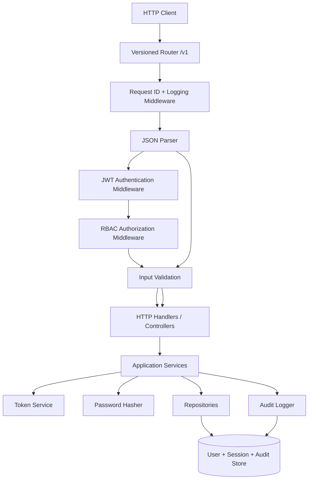

# REST API with Auth — Specification

> **Project ID:** `07_rest_api_auth`  
> **Level:** 3 — Architecture and Design Patterns  
> **Status:** spec-in-progress

## Overview

Build a small REST API service with authentication and authorization in **Go**, **Rust**, and **Node.js/TypeScript**. The service teaches how to structure security-sensitive HTTP APIs using layered architecture, dependency injection, middleware chains, input validation, API versioning, and auditable authentication events.

The project deliberately stays compact: users can register, log in, refresh tokens, and access or modify user records according to role-based access control (RBAC). The educational focus is not feature breadth; it is comparing how each language and framework composes authentication middleware, validates request boundaries, injects services, and keeps security policy out of route handlers.

The API must be language-neutral in behavior. Implementations may use idiomatic framework primitives, but all observable contracts, security rules, error shapes, audit events, and expiry semantics must match unless an implementation-specific caveat is documented.

## Learning Objectives

- Primary concept: Compose authentication and authorization middleware around a layered REST API.
- Secondary concepts: JWT signing and verification, RBAC, refresh-token sessions, input validation, API versioning, dependency injection, audit logging, secure error handling, and testable service boundaries.

## Functional Requirements

- **RF-001:** The service MUST expose versioned API routes under `/v1` and reject unsupported API versions with a structured `404` or `410` response.
- **RF-002:** A client MUST be able to register a new user through `POST /v1/auth/register` using a unique email and password.
- **RF-003:** Registration MUST validate input before any persistence attempt, including email format, password length, password complexity, optional display-name length, and duplicate email detection.
- **RF-004:** Stored user passwords MUST be hashed with a password-hashing algorithm appropriate for credentials; plaintext passwords MUST never be returned, logged, or persisted.
- **RF-005:** A registered active user MUST be able to log in through `POST /v1/auth/login` with valid credentials.
- **RF-006:** Login MUST issue a short-lived access JWT and a refresh token bound to a persisted `Session` record.
- **RF-007:** Access JWTs MUST include enough claims to authorize requests without a database lookup on every request: `sub`, `email`, `roles`, `iat`, `exp`, and `jti`.
- **RF-008:** Protected endpoints MUST verify the access JWT signature, issuer, audience, expiry, and token identifier before route handlers run.
- **RF-009:** Expired, malformed, unsigned, wrongly signed, or wrong-audience JWTs MUST be rejected with `401 Unauthorized` and MUST NOT reach protected handlers.
- **RF-010:** The middleware chain MUST run in this order for protected routes: request ID/correlation → structured request logging → API version routing → input parsing → authentication → authorization → validation where route-specific body validation is needed → handler.
- **RF-011:** RBAC MUST support at least `user` and `admin` roles. A user may have one or more roles.
- **RF-012:** `GET /v1/users` MUST require the `admin` role and return a paginated list of users.
- **RF-013:** `PUT /v1/users/:id` MUST require authentication. An `admin` may update any user; a non-admin `user` may update only their own allowed profile fields.
- **RF-014:** Authorization failures for authenticated users MUST return `403 Forbidden`; unauthenticated requests MUST return `401 Unauthorized`.
- **RF-015:** A client MUST be able to exchange a valid refresh token for a new access token and rotated refresh token through `POST /v1/auth/refresh`.
- **RF-016:** Refresh-token rotation MUST revoke or invalidate the previous refresh token so replay attempts can be detected.
- **RF-017:** The service MUST record audit entries for registration, login success, login failure, access-token verification failure, forbidden role check, refresh success, refresh-token replay, and user update.
- **RF-018:** Audit entries MUST include timestamp, action, actor when known, target when relevant, request ID, outcome, and sanitized metadata.
- **RF-019:** All JSON request bodies MUST reject unknown or invalid fields with a structured validation error.
- **RF-020:** All implementations MUST keep transport handlers, middleware, domain services, token services, password hashing, repositories, and audit logging as separable layers that can be dependency-injected.

## Non-Functional Requirements

- **RNF-001:** Access-token verification middleware MUST add less than **5ms p95 latency** under local benchmark conditions when token verification does not require external network I/O.
- **RNF-002:** Access-token expiry, refresh-token expiry, issuer, audience, and signing secret/key source MUST be configurable without code changes.
- **RNF-003:** Access tokens SHOULD default to a short lifetime, recommended `15 minutes`; refresh tokens SHOULD default to `7 days`.
- **RNF-004:** Authentication and authorization failures MUST not reveal whether an email exists, which password rule failed during login, or which role would have been sufficient.
- **RNF-005:** Password hashing parameters MUST be configurable so implementations can tune cost for local learning and benchmark parity.
- **RNF-006:** API responses MUST be deterministic across languages for status code, top-level JSON shape, and semantic error code.
- **RNF-007:** The service MUST use structured logs with request IDs and MUST exclude passwords, refresh-token plaintext, access tokens, and password hashes.
- **RNF-008:** The service MUST be safe under concurrent login and refresh attempts for the same user; refresh-token rotation must not create two simultaneously valid child sessions from one token.
- **RNF-009:** The service MUST use clock abstractions or injectable time sources in domain/token services so expiry behavior can be tested without sleeping.
- **RNF-010:** The API MUST be benchmarkable and testable without third-party identity providers or managed cloud services.

## API / Interface Contract

All endpoints are under `/v1`. All request and response bodies use `application/json` unless otherwise stated.

### Common Headers

- `Authorization: Bearer <access_token>` — required for protected endpoints.
- `X-Request-ID: <id>` — optional client-provided request ID. If missing, the server generates one and returns it.

### Common Success Envelope

```json
{
  "data": {},
  "request_id": "req_01HZY..."
}
```

### Common Error Envelope

```json
{
  "error": {
    "code": "VALIDATION_FAILED",
    "message": "Request validation failed.",
    "details": [
      { "field": "email", "reason": "must be a valid email address" }
    ]
  },
  "request_id": "req_01HZY..."
}
```

### Endpoints

#### `POST /v1/auth/register` → register a user

Authentication: none.

Request:
```json
{
  "email": "learner@example.com",
  "password": "correct-horse-battery-staple-1",
  "display_name": "Ada Learner"
}
```

Response `201 Created`:
```json
{
  "data": {
    "user": {
      "id": "usr_01HZY...",
      "email": "learner@example.com",
      "display_name": "Ada Learner",
      "roles": ["user"],
      "status": "active",
      "created_at": "2026-06-17T00:00:00Z",
      "updated_at": "2026-06-17T00:00:00Z"
    }
  },
  "request_id": "req_01HZY..."
}
```

Errors:
- `400 VALIDATION_FAILED` — invalid email, weak password, unknown field, malformed JSON.
- `409 EMAIL_ALREADY_REGISTERED` — email is already registered.
- `500 INTERNAL_ERROR` — unexpected persistence or hashing failure.

#### `POST /v1/auth/login` → authenticate and issue tokens

Authentication: none.

Request:
```json
{
  "email": "learner@example.com",
  "password": "correct-horse-battery-staple-1"
}
```

Response `200 OK`:
```json
{
  "data": {
    "access_token": "<jwt>",
    "token_type": "Bearer",
    "expires_in_seconds": 900,
    "refresh_token": "<opaque-refresh-token>",
    "refresh_expires_in_seconds": 604800,
    "user": {
      "id": "usr_01HZY...",
      "email": "learner@example.com",
      "display_name": "Ada Learner",
      "roles": ["user"],
      "status": "active"
    }
  },
  "request_id": "req_01HZY..."
}
```

Errors:
- `400 VALIDATION_FAILED` — malformed body or missing fields.
- `401 INVALID_CREDENTIALS` — email/password pair is invalid or user is inactive.
- `500 INTERNAL_ERROR` — unexpected token, hashing, or persistence failure.

#### `POST /v1/auth/refresh` → rotate refresh token and issue a new access token

Authentication: refresh token in request body; access token is not required.

Request:
```json
{
  "refresh_token": "<opaque-refresh-token>"
}
```

Response `200 OK`:
```json
{
  "data": {
    "access_token": "<jwt>",
    "token_type": "Bearer",
    "expires_in_seconds": 900,
    "refresh_token": "<new-opaque-refresh-token>",
    "refresh_expires_in_seconds": 604800
  },
  "request_id": "req_01HZY..."
}
```

Errors:
- `400 VALIDATION_FAILED` — missing or malformed refresh token.
- `401 INVALID_REFRESH_TOKEN` — token not found, expired, revoked, or mismatched.
- `401 REFRESH_TOKEN_REPLAYED` — token was already rotated or reused after revocation.

#### `GET /v1/users` → list users

Authentication: required. Authorization: `admin` role required.

Query parameters:
- `limit` — integer `1..100`, default `25`.
- `cursor` — optional opaque pagination cursor.

Response `200 OK`:
```json
{
  "data": {
    "users": [
      {
        "id": "usr_01HZY...",
        "email": "learner@example.com",
        "display_name": "Ada Learner",
        "roles": ["user"],
        "status": "active",
        "created_at": "2026-06-17T00:00:00Z",
        "updated_at": "2026-06-17T00:00:00Z"
      }
    ],
    "next_cursor": null
  },
  "request_id": "req_01HZY..."
}
```

Errors:
- `401 UNAUTHENTICATED` — missing or invalid access token.
- `403 FORBIDDEN` — token is valid but lacks `admin` role.
- `400 VALIDATION_FAILED` — invalid pagination parameters.

#### `PUT /v1/users/:id` → update a user

Authentication: required. Authorization: `admin` role, or same authenticated user for self-service profile updates.

Request:
```json
{
  "display_name": "Ada L.",
  "roles": ["user"],
  "status": "active"
}
```

Role rules:
- `admin` may update `display_name`, `roles`, and `status` for any user.
- Non-admin users may update only their own `display_name`.
- Non-admin users MUST NOT update `roles`, `status`, or another user's record.

Response `200 OK`:
```json
{
  "data": {
    "user": {
      "id": "usr_01HZY...",
      "email": "learner@example.com",
      "display_name": "Ada L.",
      "roles": ["user"],
      "status": "active",
      "created_at": "2026-06-17T00:00:00Z",
      "updated_at": "2026-06-17T00:10:00Z"
    }
  },
  "request_id": "req_01HZY..."
}
```

Errors:
- `400 VALIDATION_FAILED` — invalid body, unknown field, invalid role/status.
- `401 UNAUTHENTICATED` — missing or invalid access token.
- `403 FORBIDDEN` — authenticated user is not allowed to update the requested field or target user.
- `404 USER_NOT_FOUND` — target user does not exist.
- `409 VERSION_CONFLICT` — optional optimistic concurrency check fails if implemented.

## Data Models

```text
User:
  id: string (stable unique identifier, e.g. usr_*)
  email: string (unique, normalized lowercase, valid email format)
  password_hash: string (never returned by API)
  display_name: string (1..100 characters)
  roles: Role[] (non-empty; default [user])
  status: enum(active, disabled)
  created_at: timestamp
  updated_at: timestamp

Role:
  name: enum(user, admin)
  description: string

Session:
  id: string (stable unique identifier, e.g. ses_*)
  user_id: string (references User.id)
  refresh_token_hash: string (hash of opaque refresh token)
  access_token_jti: string (last issued access token id)
  status: enum(active, rotated, revoked, expired, replayed)
  parent_session_id: string | null (previous session when rotated)
  created_at: timestamp
  expires_at: timestamp
  rotated_at: timestamp | null
  revoked_at: timestamp | null
  last_used_at: timestamp | null

AuditEntry:
  id: string (stable unique identifier, e.g. aud_*)
  action: enum(user_registered, login_succeeded, login_failed, token_verify_failed, authorization_forbidden, token_refreshed, refresh_replayed, user_updated)
  actor_user_id: string | null
  target_user_id: string | null
  session_id: string | null
  request_id: string
  outcome: enum(success, failure, denied)
  metadata: object (sanitized, no secrets)
  created_at: timestamp
```

## Architecture

### Diagram



### Components

| Component | Responsibility |
|-----------|----------------|
| Versioned Router | Mounts `/v1` routes and isolates future API versions. |
| Request Middleware | Creates/propagates request IDs and emits structured request logs. |
| Authentication Middleware | Extracts bearer token, verifies JWT claims, and attaches authenticated principal to request context. |
| Authorization Middleware | Enforces role and ownership policies before handlers run. |
| Validation Layer | Validates JSON shape, route params, query params, and business-safe field constraints. |
| HTTP Handlers | Translate HTTP requests/responses; no password hashing, token signing, or RBAC decision logic. |
| Application Services | Coordinate use cases: register, login, refresh, list users, update user. |
| Token Service | Signs access JWTs, verifies JWTs, creates opaque refresh tokens, hashes refresh tokens. |
| Password Hasher | Hashes and verifies passwords behind an injectable interface. |
| Repositories | Persist and retrieve `User`, `Session`, and `AuditEntry` records. |
| Audit Logger | Writes sanitized security events with request correlation. |
| Configuration Provider | Supplies expiry, issuer, audience, hashing cost, and signing key/secret. |

### Design Decisions

| Decision | Alternatives | Justification |
|----------|--------------|---------------|
| Use stateless access JWTs plus stateful refresh sessions | Server-side sessions only; access tokens stored in DB | Teaches JWT verification and keeps hot auth middleware under the `<5ms` target while still allowing refresh revocation and replay detection. |
| Use opaque refresh tokens stored as hashes | JWT refresh tokens; plaintext refresh-token storage | Opaque tokens are simpler to revoke and hashing limits damage if session storage leaks. |
| Keep RBAC in middleware/policy layer | Inline role checks in handlers | Makes composition comparable across frameworks and prevents authorization logic from scattering through route code. |
| Use versioned `/v1` routes from the start | Unversioned routes | Teaches API lifecycle discipline before compatibility becomes painful. |
| Use dependency-injected services | Global singletons | Makes token, clock, repository, hash, and audit dependencies replaceable for tests and language comparison. |

## Error Handling Strategy

- Categorize errors as validation (`400`), authentication (`401`), authorization (`403`), not found (`404`), conflict (`409`), unsupported version (`404` or `410`), and unexpected server failure (`500`).
- Return the common error envelope for every error response.
- Keep user-facing messages stable and non-sensitive; detailed causes belong only in sanitized structured logs.
- Authentication failures MUST avoid user enumeration. Login failures use `INVALID_CREDENTIALS` for both unknown email and wrong password.
- JWT verification failures use `UNAUTHENTICATED` externally and may record sanitized internal audit metadata such as `reason: expired` or `reason: invalid_signature`.
- Authorization failures use `FORBIDDEN` and MUST record the actor, target when known, and required policy name in audit metadata without leaking secrets.
- Validation errors MAY include field-level details for register/update bodies, but login errors MUST NOT reveal whether email or password was the failing credential.
- Refresh-token replay is a security event: return `401 REFRESH_TOKEN_REPLAYED`, mark the session chain suspicious where possible, and write an audit entry.
- Idempotency: registration is not idempotent and returns `409` for duplicate email; login is repeatable and creates a new session per success; refresh is single-use per refresh token.

## Edge Cases

- Empty JSON body → `400 VALIDATION_FAILED` with field details.
- Malformed JSON → `400 VALIDATION_FAILED` without handler execution.
- Unknown JSON fields → `400 VALIDATION_FAILED` so clients do not assume ignored fields were accepted.
- Email casing differences → normalize email before uniqueness checks and credential lookup.
- Duplicate registration race → exactly one registration succeeds; contenders receive `409 EMAIL_ALREADY_REGISTERED`.
- Weak password on registration → `400 VALIDATION_FAILED`; password must not be logged.
- Unknown email during login → `401 INVALID_CREDENTIALS`; response must match wrong-password behavior.
- Disabled user login → `401 INVALID_CREDENTIALS` or `403 FORBIDDEN`, but response policy must be consistent and documented per implementation.
- Missing `Authorization` header on protected route → `401 UNAUTHENTICATED`.
- `Authorization` header with unsupported scheme → `401 UNAUTHENTICATED`.
- Expired access token → `401 UNAUTHENTICATED`; refresh flow remains available if refresh token is valid.
- Valid token with insufficient role → `403 FORBIDDEN` and an audit entry.
- Non-admin tries to update another user → `403 FORBIDDEN`.
- Non-admin tries to update own `roles` or `status` → `403 FORBIDDEN`.
- Refresh token used twice after rotation → `401 REFRESH_TOKEN_REPLAYED` and audit entry.
- Concurrent refresh requests with the same token → only one succeeds; the other is treated as replay or invalidated token.
- System clock skew → implementations MAY allow a small configurable leeway for JWT `iat`/`exp`, default no more than `60 seconds`.
- Unsupported route version such as `/v2/users` → structured `404` or `410` without falling through to `/v1` behavior.
- Pagination limit above maximum → `400 VALIDATION_FAILED` or clamp only if documented consistently across languages; default is reject.

## Acceptance Criteria

- **RF-001:** Requests to `/v1/...` route correctly; unsupported versions return structured version/route errors.
- **RF-002:** Registering a valid new user returns `201` with a public user object.
- **RF-003:** Invalid registration fields return `400`; duplicate normalized emails return `409`.
- **RF-004:** Stored user records contain password hashes only; API responses and logs never include plaintext passwords or hashes.
- **RF-005:** Valid login returns `200`; invalid credentials return `401` with identical public behavior for unknown email and wrong password.
- **RF-006:** Login response includes access token, refresh token, expiry seconds, token type, and public user data.
- **RF-007:** Decoded access JWT contains required claims with correct subject, roles, issued-at, expiry, and token id.
- **RF-008:** Protected routes reject requests before handler execution when token verification fails.
- **RF-009:** Expired, malformed, wrong-audience, and wrongly signed JWT cases all return `401`.
- **RF-010:** Middleware order can be demonstrated by tests or instrumentation: authentication precedes authorization and protected handlers.
- **RF-011:** Users can hold `user`, `admin`, or both roles; role checks are based on authenticated principal claims.
- **RF-012:** Admin token can list users; regular user token receives `403`.
- **RF-013:** Admin can update any allowed user field; regular user can update only own `display_name`.
- **RF-014:** Missing/invalid token returns `401`; valid token with insufficient permission returns `403`.
- **RF-015:** Valid refresh token returns new access and refresh tokens.
- **RF-016:** Reusing a rotated refresh token fails and records replay/denial state.
- **RF-017:** Required security actions create audit entries.
- **RF-018:** Audit entries contain action, actor/target when known, request ID, outcome, timestamp, and sanitized metadata.
- **RF-019:** Unknown fields and invalid field values return structured validation errors.
- **RF-020:** Implementations expose separable layers/interfaces for handlers, middleware, services, repositories, token service, password hasher, audit logger, config, and clock.
- **RNF-001:** Local benchmark evidence shows token verification middleware p95 overhead below `5ms` without network I/O.
- **RNF-002:** Changing token expiry configuration changes issued token expiry without code edits.

## Language-Specific Notes

### Go
- Favor standard `net/http` middleware or a lightweight router while keeping handlers thin.
- Use interfaces for repositories, token service, password hasher, audit logger, config, and clock.
- Prefer context values for authenticated principal and request ID; keep them typed to avoid collisions.

### Rust
- Favor an async HTTP framework with extractor/middleware support while preserving explicit service boundaries.
- Model roles, status, and audit actions as enums where practical.
- Use trait-based abstractions for repository, token, password, audit, config, and clock dependencies.

### Node/TypeScript
- Favor a framework with explicit middleware ordering and schema validation.
- Keep request-context augmentation typed so authenticated principal and request ID are available safely.
- Use dependency injection or constructor-injected services rather than importing singleton service instances inside handlers.

## Dependencies

- Prerequisite projects: `04_concurrent_task_queue`, `05_websocket_chat`, `06_file_upload_pipeline`.
- External tools: HTTP client or integration-test runner, local benchmark tool for auth latency, and language-specific JWT/password-hashing libraries.
- No external identity provider, hosted database, or cloud secret manager is required for the core learning contract.
