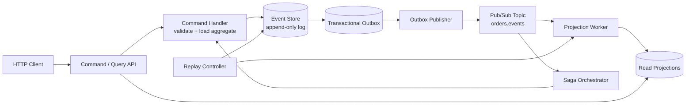

# Event-Driven Order System — Specification

> **Project ID:** 08_event_driven_order_system  
> **Level:** 3 — Architecture and Design Patterns  
> **Status:** spec-ready

## Overview

Build a small event-driven order system where every state change is recorded as an immutable event. Clients create orders through an HTTP command API, command handlers validate requested transitions, the event store becomes the authoritative source of truth, projections build read models asynchronously, and subscribers consume published order lifecycle events.

This project teaches the architectural trade-offs behind pub/sub, event sourcing, eventual consistency, projections, sagas, and the transactional outbox pattern. It should make learners confront the difference between accepting a command, durably appending an event, publishing that event, and later observing the derived read model.

The canonical comparison question is: **How do event replay and projection rebuild times compare across language runtimes?** Go, Rust, and Node/TypeScript implementations must expose the same behavior so benchmarks compare event append throughput, replay speed, projection lag, saga correctness, and pub/sub reliability instead of feature drift.

## Learning Objectives

- Primary concept: event-sourced order lifecycle with asynchronous projections.
- Secondary concepts: command validation, optimistic concurrency, pub/sub delivery, eventual consistency, projection rebuilds, saga orchestration, transactional outbox, idempotency, event replay, and cross-language architecture comparison.

## Functional Requirements

- **RF-001: Create order command.** The service MUST accept `POST /orders` with customer id, line items, and an idempotency key, then create an order by appending an `OrderCreated` event.
- **RF-002: Order lifecycle events.** The service MUST model order state transitions through immutable lifecycle events: `OrderCreated`, `PaymentAuthorized`, `PaymentFailed`, `InventoryReserved`, `InventoryRejected`, `OrderConfirmed`, `OrderCancelled`, `OrderShipped`, and `OrderDelivered`.
- **RF-003: Command-based state transitions.** The service MUST expose command endpoints for authorizing payment, reserving inventory, cancelling, shipping, and delivering orders. Each command MUST validate the current aggregate state derived from prior events before appending a new event.
- **RF-004: Event store as source of truth.** The canonical order state MUST be reconstructable solely by replaying events for that order from the event store in sequence order.
- **RF-005: Optimistic concurrency.** Commands that include an expected aggregate version MUST fail with a concurrency conflict if the stored order version has changed.
- **RF-006: Pub/sub lifecycle notifications.** Every successfully appended order event MUST be published to subscribers at least once through the project pub/sub mechanism.
- **RF-007: Transactional outbox.** Appending an event and recording the pending publication MUST be atomic from the service perspective; a process crash after event append MUST NOT permanently lose publication.
- **RF-008: Projection maintenance.** The system MUST maintain at least two asynchronous projections: an order summary projection and a customer order history projection.
- **RF-009: Projection query API.** Clients MUST query projections through read endpoints without reading the event store directly.
- **RF-010: Event replay.** The service MUST expose an administrative replay operation that rebuilds one or all projections from the event store without changing the original events.
- **RF-011: Saga orchestration.** The system MUST orchestrate order fulfillment as a saga: after `OrderCreated`, request payment authorization, request inventory reservation, confirm the order when both succeed, or cancel/compensate when either fails.
- **RF-012: Saga idempotency.** The saga MUST tolerate duplicate event delivery and duplicate command retries without creating duplicate lifecycle events for the same logical step.
- **RF-013: Event inspection.** The service MUST expose an endpoint to list events for an order in sequence order for debugging and replay verification.
- **RF-014: Idempotent command handling.** Repeating a create or lifecycle command with the same idempotency key MUST return the original result when the first command succeeded or is still known.
- **RF-015: Health and lag visibility.** The service MUST expose health data including event store status, outbox backlog, subscriber delivery failures, projection lag, and saga backlog.

## Non-Functional Requirements

- **RNF-001: Event ordering guarantee.** Events for a single order aggregate MUST have a strictly increasing `sequence` and MUST be replayed in that order. Cross-order global ordering is not required, but each event MUST also have a monotonic `global_position` for replay checkpoints.
- **RNF-002: Publication ordering guarantee.** Pub/sub delivery MUST preserve order per aggregate id for events published by one service instance. Subscribers MUST still handle duplicates because delivery is at-least-once.
- **RNF-003: Eventual consistency latency.** Under local benchmark load of 100 order commands per second, projections SHOULD reflect newly appended events within 500 ms p95 and MUST expose lag when they fall behind.
- **RNF-004: Append latency target.** Event append plus outbox recording SHOULD complete within 50 ms p95 for single-order commands on commodity developer hardware.
- **RNF-005: Replay performance target.** Rebuilding projections from 100,000 stored events SHOULD complete within 30 seconds locally, with elapsed time reported by each implementation.
- **RNF-006: Durability.** Events and outbox records MUST survive process restarts. In-memory-only event storage is not acceptable for Project 08.
- **RNF-007: At-least-once delivery.** Subscribers MAY receive duplicate events but MUST NOT permanently miss events that were durably appended and recorded in the outbox.
- **RNF-008: Deterministic serialization.** Events MUST use a stable JSON envelope with explicit schema versioning so replay works across process restarts and future schema changes.
- **RNF-009: Backpressure.** The outbox publisher, projection workers, and saga worker MUST apply bounded polling/batching and expose backlog rather than spawning unbounded work.
- **RNF-010: Observability.** Every command, event append, outbox publish, projection update, replay, and saga step SHOULD emit structured logs with `correlation_id`, `order_id`, `event_id`, and `event_type` where applicable.
- **RNF-011: Language neutrality.** Go, Rust, and Node/TypeScript implementations MUST follow this public contract even if their internal concurrency, persistence, and pub/sub mechanisms differ.

## API / Interface Contract

All implementations MUST expose a JSON HTTP interface for commands and reads. The default bind address is `127.0.0.1`; each implementation MUST document its port. Command endpoints return accepted aggregate facts from the write side. Read endpoints return projection data and may lag behind command responses.

### Shared Response Envelopes

Successful command responses MUST use:

```json
{
  "ok": true,
  "data": {},
  "metadata": {
    "correlation_id": "corr_01JZ...",
    "aggregate_version": 3
  }
}
```

Error responses MUST use:

```json
{
  "ok": false,
  "error": {
    "code": "INVALID_TRANSITION",
    "message": "Human-readable explanation",
    "details": {}
  },
  "metadata": {
    "correlation_id": "corr_01JZ..."
  }
}
```

### Endpoints

```text
POST /orders → create an order
  Request:
    {
      "customer_id": "cust_123",
      "idempotency_key": "client-generated-key",
      "items": [
        { "sku": "SKU-1", "quantity": 2, "unit_price_cents": 1299 }
      ]
    }
  Response 201:
    { "ok": true, "data": { "order_id": "ord_123", "status": "pending", "event_id": "evt_123" }, "metadata": { "aggregate_version": 1 } }
  Errors:
    400 invalid_order | invalid_item | invalid_idempotency_key
    409 idempotency_conflict
    503 event_store_unavailable

POST /orders/{order_id}/authorize-payment → record payment result
  Request: { "payment_id": "pay_123", "authorized": true, "reason"?: string, "idempotency_key": "key", "expected_version"?: 1 }
  Response 200: { "ok": true, "data": { "order_id": "ord_123", "status": "payment_authorized", "event_id": "evt_124" }, "metadata": { "aggregate_version": 2 } }
  Errors: 400 invalid_payment, 404 order_not_found, 409 concurrency_conflict | invalid_transition

POST /orders/{order_id}/reserve-inventory → record inventory result
  Request: { "reservation_id": "res_123", "reserved": true, "reason"?: string, "idempotency_key": "key", "expected_version"?: 2 }
  Response 200: { "ok": true, "data": { "order_id": "ord_123", "status": "inventory_reserved", "event_id": "evt_125" }, "metadata": { "aggregate_version": 3 } }
  Errors: 400 invalid_reservation, 404 order_not_found, 409 concurrency_conflict | invalid_transition

POST /orders/{order_id}/cancel → cancel an order
  Request: { "reason": "customer_request", "idempotency_key": "key", "expected_version"?: 3 }
  Response 200: { "ok": true, "data": { "order_id": "ord_123", "status": "cancelled", "event_id": "evt_126" }, "metadata": { "aggregate_version": 4 } }
  Errors: 400 invalid_reason, 404 order_not_found, 409 concurrency_conflict | invalid_transition

POST /orders/{order_id}/ship → mark confirmed order as shipped
  Request: { "shipment_id": "ship_123", "carrier": "example", "idempotency_key": "key", "expected_version"?: 4 }
  Response 200: { "ok": true, "data": { "order_id": "ord_123", "status": "shipped", "event_id": "evt_127" }, "metadata": { "aggregate_version": 5 } }
  Errors: 400 invalid_shipment, 404 order_not_found, 409 concurrency_conflict | invalid_transition

POST /orders/{order_id}/deliver → mark shipped order as delivered
  Request: { "delivered_at": "2026-06-17T12:00:00Z", "idempotency_key": "key", "expected_version"?: 5 }
  Response 200: { "ok": true, "data": { "order_id": "ord_123", "status": "delivered", "event_id": "evt_128" }, "metadata": { "aggregate_version": 6 } }
  Errors: 400 invalid_delivery, 404 order_not_found, 409 concurrency_conflict | invalid_transition

GET /orders/{order_id} → read order summary projection
  Response 200:
    {
      "ok": true,
      "data": {
        "order_id": "ord_123",
        "customer_id": "cust_123",
        "status": "confirmed",
        "total_cents": 2598,
        "version": 4,
        "last_event_id": "evt_126",
        "projection_updated_at": "2026-06-17T12:00:01Z"
      }
    }
  Errors: 404 projection_not_found

GET /customers/{customer_id}/orders?limit=50&cursor=<opaque> → read customer order history projection
  Response 200:
    { "ok": true, "data": { "items": [OrderSummary], "next_cursor": "opaque-or-null" } }
  Errors: 400 invalid_pagination

GET /orders/{order_id}/events → inspect events for one order
  Response 200:
    { "ok": true, "data": { "order_id": "ord_123", "events": [OrderEvent] } }
  Errors: 404 order_not_found

POST /admin/projections/replay → rebuild projections from event store
  Request: { "projection": "all" | "order_summary" | "customer_order_history", "from_global_position"?: number }
  Response 202:
    { "ok": true, "data": { "replay_id": "replay_123", "status": "running" } }
  Errors: 400 invalid_projection | invalid_checkpoint, 409 replay_already_running

GET /admin/projections/replay/{replay_id} → inspect replay status
  Response 200:
    { "ok": true, "data": { "replay_id": "replay_123", "status": "running" | "completed" | "failed", "events_processed": 1000, "duration_ms": 1234 } }
  Errors: 404 replay_not_found

GET /health → service health and lag metrics
  Response 200:
    {
      "ok": true,
      "data": {
        "status": "ok" | "degraded",
        "event_store": "ok" | "unavailable",
        "outbox_backlog": 12,
        "projection_lag_events": 4,
        "projection_lag_ms": 120,
        "saga_backlog": 2,
        "subscriber_failures": 0
      }
    }
```

## Data Models

```yaml
Order:
  order_id: string (unique aggregate id, server-generated)
  customer_id: string (required)
  status: enum(pending, payment_authorized, payment_failed, inventory_reserved, inventory_rejected, confirmed, cancelled, shipped, delivered)
  items: OrderItem[]
  total_cents: integer (>= 0)
  version: integer (starts at 1 after OrderCreated; equals last aggregate sequence)
  created_at: RFC3339 timestamp
  updated_at: RFC3339 timestamp

OrderItem:
  sku: string (required, 1-128 chars)
  quantity: integer (>= 1)
  unit_price_cents: integer (>= 0)

OrderEvent:
  event_id: string (unique)
  aggregate_id: string (order_id)
  aggregate_type: "Order"
  event_type: enum(OrderCreated, PaymentAuthorized, PaymentFailed, InventoryReserved, InventoryRejected, OrderConfirmed, OrderCancelled, OrderShipped, OrderDelivered)
  sequence: integer (strictly increasing per aggregate, starts at 1)
  global_position: integer (strictly increasing across event store)
  schema_version: integer (starts at 1)
  occurred_at: RFC3339 timestamp
  correlation_id: string
  causation_id: string | null
  idempotency_key: string | null
  payload: object (event-specific immutable facts)

OutboxRecord:
  outbox_id: string
  event_id: string
  topic: string (for example "orders.events")
  status: enum(pending, publishing, published, failed)
  attempts: integer
  next_attempt_at: RFC3339 timestamp
  last_error: string | null
  created_at: RFC3339 timestamp
  published_at: RFC3339 timestamp | null

Projection:
  name: string (order_summary | customer_order_history)
  checkpoint_global_position: integer
  lag_events: integer
  lag_ms: integer
  status: enum(active, rebuilding, failed)
  updated_at: RFC3339 timestamp

OrderSummaryProjection:
  order_id: string
  customer_id: string
  status: Order.status
  total_cents: integer
  version: integer
  last_event_id: string
  projection_updated_at: RFC3339 timestamp

CustomerOrderHistoryProjection:
  customer_id: string
  orders: ordered list of OrderSummaryProjection references or embedded summaries
  checkpoint_global_position: integer
```

Event payloads MUST contain facts, not commands. For example, `OrderCreated` stores accepted item lines and total, while `PaymentAuthorized` stores a payment id and authorization timestamp. Event payloads MUST NOT be mutated after append.

## Architecture

### Diagram



### Components

| Component | Responsibility |
|-----------|----------------|
| Command / Query API | Accepts HTTP commands, exposes projection reads, returns structured responses, and propagates correlation ids. |
| Command Handler | Validates input, reconstructs the order aggregate from events, checks transitions/idempotency/version, and appends new events. |
| Order Aggregate | Pure state machine derived from order events; defines allowed transitions and resulting events. |
| Event Store | Durable append-only log with per-aggregate sequence, global position, and optimistic concurrency checks. |
| Transactional Outbox | Records pending event publications atomically with event append so publisher crashes do not lose events. |
| Outbox Publisher | Polls pending outbox records, publishes events to the topic, marks records published, and retries failures with backoff. |
| Pub/Sub Topic | Delivers order events at least once to projection and saga subscribers while preserving per-order order where possible. |
| Projection Worker | Consumes events, updates read models idempotently, stores checkpoints, and rebuilds projections during replay. |
| Saga Orchestrator | Tracks multi-step fulfillment, reacts to events, issues follow-up commands, and performs cancellation/compensation on failure. |
| Replay Controller | Rebuilds projections from the event store using global checkpoints without mutating source events. |
| Health Reporter | Reports event store health, outbox backlog, projection lag, saga backlog, and subscriber failures. |

### Design Decisions

| Decision | Alternatives | Justification |
|----------|--------------|---------------|
| Event store is authoritative | Mutable order table as source of truth | Project 08 exists to teach event sourcing; state must be derivable from events. |
| HTTP commands plus async pub/sub | Synchronous RPC-only workflow | Separates command acceptance from downstream consistency and makes eventual consistency visible. |
| At-least-once publication | Exactly-once delivery | Exactly-once is too advanced for this level; idempotent subscribers and outbox retries teach realistic distributed behavior. |
| Transactional outbox required | Publish directly after append | Direct publishing can lose events on crash between append and publish; outbox makes the failure mode explicit. |
| Orchestrated saga baseline | Pure choreography only | Orchestration creates a clear component to inspect and compare; implementations MAY document choreographed variants later. |
| Projections queried through API | Clients read event store directly | Read models teach eventual consistency and preserve the event log as an internal write model. |
| Replay rebuilds projections only | Replay re-emits domain side effects | Replay must be safe and deterministic; external side effects belong to live saga/publishing flows, not rebuilds. |

## Error Handling Strategy

- Validation errors return `400` and MUST NOT append events or create outbox records.
- Missing orders return `404 order_not_found` for command and event-inspection endpoints.
- Invalid lifecycle transitions return `409 invalid_transition`; examples include shipping an unconfirmed order or cancelling a delivered order.
- Optimistic concurrency mismatches return `409 concurrency_conflict` and include current aggregate version when safe.
- Idempotency replay returns the original successful response when the same idempotency key and compatible command body are repeated. Reusing a key with a different body returns `409 idempotency_conflict`.
- Event store failures return `503 event_store_unavailable`; command handlers MUST NOT claim success until the event append and outbox write have committed.
- Pub/sub failures MUST NOT roll back an already committed event. The outbox record remains pending or failed and is retried according to publisher policy.
- Projection failures MUST NOT block command handling. Failed projections report degraded health and can be rebuilt by replay.
- Saga command failures MUST be recorded as saga state and retried or compensated; the saga MUST NOT spin indefinitely without backoff.
- Replay conflicts return `409 replay_already_running` when rebuilding the same projection would race with another rebuild.

### Error Codes

| Code | HTTP Status | Meaning |
|------|-------------|---------|
| `invalid_order` | 400 | Create-order payload is missing required fields or has invalid totals. |
| `invalid_item` | 400 | An order item has invalid SKU, quantity, or price. |
| `invalid_idempotency_key` | 400 | Idempotency key is absent where required or exceeds limits. |
| `invalid_payment` | 400 | Payment command shape is invalid. |
| `invalid_reservation` | 400 | Inventory reservation command shape is invalid. |
| `invalid_reason` | 400 | Cancellation reason is missing or unsupported. |
| `invalid_shipment` | 400 | Shipment command shape is invalid. |
| `invalid_delivery` | 400 | Delivery command shape is invalid. |
| `order_not_found` | 404 | No events exist for the requested order id. |
| `projection_not_found` | 404 | Projection has not yet materialized the requested read model. |
| `idempotency_conflict` | 409 | Idempotency key was reused for a different command body. |
| `concurrency_conflict` | 409 | Expected aggregate version does not match current version. |
| `invalid_transition` | 409 | Command is not allowed for the current aggregate state. |
| `replay_already_running` | 409 | A conflicting projection replay is already active. |
| `event_store_unavailable` | 503 | The durable event store cannot accept or read events. |

## Edge Cases

- Create order with empty items → reject with `400 invalid_order` and append no event.
- Item quantity `0`, negative price, or missing SKU → reject with `400 invalid_item`.
- Duplicate create command with same idempotency key and same body → return original order id and version without appending another `OrderCreated`.
- Duplicate create command with same idempotency key and different body → return `409 idempotency_conflict`.
- Command references unknown order → return `404 order_not_found`.
- Command supplies stale `expected_version` → return `409 concurrency_conflict` and append no event.
- Payment failure after inventory reservation → saga MUST cancel the order and record compensation intent; duplicate failure events MUST NOT create duplicate cancellations.
- Inventory rejection after payment authorization → saga MUST cancel the order and record compensation intent for payment release/refund.
- Both payment and inventory succeed in either delivery order → saga eventually appends exactly one `OrderConfirmed`.
- Shipping before confirmation → reject with `409 invalid_transition`.
- Cancelling a delivered order → reject with `409 invalid_transition`.
- Pub/sub publishes the same event twice → projection and saga subscribers use `event_id` or checkpoint logic to avoid duplicate side effects.
- Outbox publisher crashes after publishing but before marking `published` → event MAY be republished; subscribers MUST remain idempotent.
- Projection lags behind command response → `GET /orders/{id}` MAY return `404 projection_not_found` or stale status until projection catches up; health MUST expose lag.
- Replay starts while live events continue → projection checkpointing MUST ensure rebuilt projections include live events after replay catches up or clearly report rebuilding status.
- Replay of old event schema version → implementation MUST either handle the version or fail replay with a clear projection error; source events remain unchanged.
- Subscriber is down while events are appended → outbox backlog grows and health becomes degraded instead of dropping events silently.
- Event store contains a gap in per-order sequence → replay MUST fail fast for that aggregate and report data integrity error; implementations MUST not invent missing events.

## Acceptance Criteria

- **RF-001:** `POST /orders` with valid input returns `201`, an order id, status `pending`, aggregate version `1`, and exactly one `OrderCreated` event in `GET /orders/{id}/events`.
- **RF-002:** Each lifecycle command appends the corresponding event type with immutable payload and a valid sequence number.
- **RF-003:** Invalid commands for the current state return `409 invalid_transition` and do not append events.
- **RF-004:** Replaying an order's events reconstructs the same status, total, version, and lifecycle facts exposed by the order summary projection after it catches up.
- **RF-005:** A stale `expected_version` command returns `409 concurrency_conflict` and leaves event count unchanged.
- **RF-006:** A subscriber connected to the order topic eventually receives every appended event at least once.
- **RF-007:** Simulating a crash after event append but before publish leaves an outbox record that is later published after restart.
- **RF-008:** Order summary and customer history projections update from consumed events and store checkpoints.
- **RF-009:** Read endpoints return projection data only; they do not require clients to query or fold raw events.
- **RF-010:** `POST /admin/projections/replay` rebuilds projection state from existing events without adding, deleting, or changing events.
- **RF-011:** The saga confirms an order only after both payment authorization and inventory reservation events exist, and cancels/compensates when either fails.
- **RF-012:** Duplicate event delivery or duplicate saga wakeups do not create duplicate confirmation, cancellation, or compensation events.
- **RF-013:** `GET /orders/{id}/events` returns events sorted by per-aggregate sequence with stable event envelopes.
- **RF-014:** Repeated commands with the same idempotency key return the original result or a deterministic conflict; they do not append duplicate domain events.
- **RF-015:** `GET /health` reports event store state, outbox backlog, subscriber failures, projection lag, and saga backlog.
- **RNF-001:** Event sequence numbers are strictly increasing per order in persisted events and replay output.
- **RNF-003:** Projection lag benchmark reports p95 latency and passes the 500 ms target under the specified local load or documents measured failure.
- **RNF-005:** Replay benchmark reports duration for 100,000 events and whether it satisfies the 30 second target.

Implementation packages MUST eventually include automated tests and benchmark evidence for these criteria, but this specification task intentionally creates no implementation code and no tests.

## Language-Specific Notes

### Go

- Prefer a small `net/http` API layer with command handlers separated from aggregate/event-store logic.
- Use explicit structs for event envelopes and payloads; keep schema version mapping close to serialization boundaries.
- Model async workers with goroutines, bounded channels, context cancellation, and durable polling for the outbox/projection/saga loops.
- Use a relational or embedded durable store for events and outbox records; transactions should cover event append plus outbox insert.
- Run race detection in future implementation verification for command handling, publisher, projection, and saga workers.

### Rust

- Prefer typed enums for `OrderEvent` payloads and aggregate status transitions so invalid states are hard to represent internally.
- Use `axum` or a comparable HTTP framework with a persistence layer that supports transactions for event append plus outbox insert.
- Avoid holding locks across `.await`; event store, outbox publisher, projection worker, and saga orchestration should communicate through explicit async boundaries.
- Use durable checkpoints for projection replay and make event schema version handling explicit in deserialization.
- Treat subscriber idempotency as part of the domain design, not as best-effort logging.

### Node/TypeScript

- Prefer Fastify, Express, or the built-in HTTP server with TypeScript DTOs for commands, events, projections, and error envelopes.
- Keep aggregate folding and transition validation in pure functions so command handlers, replay, and tests can reuse the same behavior.
- Use a transactional persistence client for event append plus outbox insert; do not rely on in-memory arrays as the authoritative event store.
- Model background work with bounded async loops and avoid unbounded `Promise` fan-out for publishing, projections, sagas, or replay.
- Use discriminated unions or equivalent event type narrowing for event payload handling.

## Dependencies

- Prerequisite projects: Projects 04-06 (`04_concurrent_task_queue`, `05_websocket_chat`, `06_file_upload_pipeline`) for worker scheduling, fan-out, streaming/bounded processing, backpressure, and async I/O basics.
- External services/tools: a durable local datastore or embedded database for event store/outbox/projections; an in-process or local broker abstraction is acceptable for pub/sub if it preserves the public contract; benchmark tooling such as k6, wrk, or implementation-specific scripts for append, projection-lag, and replay measurements.
- Out of scope for this specification artifact: implementation code, package manifests, database migrations, tests, benchmark scripts, Docker setup, and production-grade distributed broker clustering.
