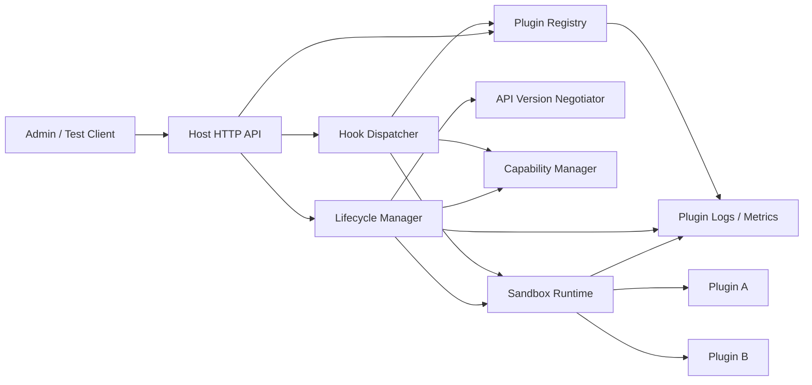

# Plugin System — Specification

> **Project ID:** `09_plugin_system`
> **Level:** 3 — Architecture and Design Patterns
> **Status:** spec-in-progress

## Overview

Build a language-neutral host application in Go, Rust, and Node.js/TypeScript that can discover, validate, load, run, and unload third-party plugins through a stable interface contract. The host exposes a small HTTP API for operating the plugin registry and a hook execution surface that lets plugins extend host behavior without changing host source code.

This project teaches extensibility as an architectural boundary. Implementations must separate the host from plugin code, model a clear plugin lifecycle (`load`, `init`, `start`, `stop`, `unload`), enforce capability declarations, support API version negotiation, isolate plugin failures, and demonstrate at least one sandbox strategy appropriate to each language/runtime.

The central comparison question is: **How does each language's FFI/WASM/dynamic-loading story compare for safe plugin isolation?** Reviews and benchmarks should focus on safety, ergonomics, lifecycle clarity, isolation cost, and extension-boundary design rather than subjective language preference.

## Learning Objectives

- Primary concept: designing stable extension interfaces with lifecycle-managed plugins.
- Secondary concepts: dynamic loading, interfaces/traits, WASM/FFI/JS sandboxing, API versioning, hook dispatch, capability-based access, error isolation, memory/resource limits, and graceful shutdown.

## Functional Requirements

- **RF-001:** The host MUST register plugins from a `PluginManifest` and reject manifests that are missing required fields, contain invalid identifiers, or request unsupported API versions.
- **RF-002:** The host MUST persist a plugin registry containing installed plugins, lifecycle state, declared hooks, declared capabilities, enabled/disabled status, and last error summary.
- **RF-003:** The host MUST implement the lifecycle transitions `load -> init -> start -> stop -> unload` and MUST reject invalid transitions such as `start` before `init` or `unload` while `running`.
- **RF-004:** The host MUST expose plugin management operations through HTTP endpoints for registration, listing, inspection, enable/disable, lifecycle transitions, and unregistration.
- **RF-005:** The host MUST negotiate plugin API compatibility using a host API version and a plugin-declared supported version range.
- **RF-006:** Plugins MUST declare every requested capability before initialization; undeclared host APIs, filesystem paths, network access, environment variables, or hook subscriptions MUST be denied.
- **RF-007:** The host MUST provide sandbox isolation so plugin code runs behind an explicit boundary rather than directly mutating host internals.
- **RF-008:** The host MUST support a hook system where plugins subscribe to named hooks and the host dispatches typed payloads to matching subscribers.
- **RF-009:** Hook execution MUST support ordered subscribers using plugin-declared priority and deterministic tie-breaking by plugin ID.
- **RF-010:** Plugin failures during `load`, `init`, `start`, `stop`, `unload`, or hook execution MUST be captured, mapped to plugin state, and MUST NOT crash or corrupt the host.
- **RF-011:** The host MUST enforce per-plugin execution timeouts for lifecycle calls and hook handlers.
- **RF-012:** The host MUST isolate plugin logs and metrics so each plugin has observable lifecycle events, hook invocation counts, failures, timeout counts, and resource usage summaries.
- **RF-013:** The host MUST support unloading a plugin and releasing its registered hooks, granted capabilities, sandbox resources, memory handles, and background tasks.
- **RF-014:** The host MUST support disabled plugins: disabled plugins remain registered but cannot be started and cannot receive hook invocations.
- **RF-015:** The host MUST expose a sample host hook flow that demonstrates at least three hook types: notification/event hooks, request/response transformation hooks, and validation/decision hooks.

## Non-Functional Requirements

- **RNF-001:** A plugin crash, panic, unhandled exception, trap, or process termination MUST NOT kill the host process.
- **RNF-002:** Plugin memory usage MUST be isolated or bounded by a per-plugin memory budget; exceeding the budget MUST stop or quarantine the plugin without corrupting host state.
- **RNF-003:** Lifecycle transition operations MUST be idempotent where safe: repeated `stop` for a stopped plugin and repeated `disable` for a disabled plugin MUST return the current state without side effects.
- **RNF-004:** Hook dispatch overhead with no subscribers MUST be below 1 ms p95 in local benchmark conditions; with 10 no-op subscribers it SHOULD remain below 10 ms p95 or document runtime-specific overhead.
- **RNF-005:** The host MUST support at least 25 registered plugins and 10 concurrently running plugins without deadlocks, registry corruption, or unbounded memory growth.
- **RNF-006:** Plugin lifecycle and hook calls MUST have configurable timeouts, with defaults no greater than 5 seconds for lifecycle calls and 1 second for hook handlers.
- **RNF-007:** Capability enforcement decisions MUST be auditable through structured logs or registry events containing plugin ID, capability, decision, and reason.
- **RNF-008:** The registry MUST remain consistent after host restart when using the chosen local persistence mechanism; plugins that were `running` before shutdown MUST restart as `loaded` or `stopped`, not silently as `running`.
- **RNF-009:** Public API responses MUST avoid leaking sandbox internals, filesystem paths, raw stack traces, secrets, or host environment values.
- **RNF-010:** The implementation MUST make isolation tradeoffs explicit for each language, including whether isolation is process-based, WASM-based, VM-based, FFI-based, or library-only.

## API / Interface Contract

### Host HTTP Endpoints

```text
POST /plugins -> register a plugin manifest
  Request: PluginManifest
  Response 201: Plugin
  Errors: 400 invalid manifest, 409 plugin already registered, 422 unsupported API version or unsupported capability.

GET /plugins -> list registered plugins
  Query: state? string, enabled? boolean, hook? string, limit? integer, cursor? string
  Response 200:
    {
      "items": [Plugin],
      "nextCursor": "opaque-cursor-or-null"
    }
  Errors: 400 invalid query parameters.

GET /plugins/:pluginId -> inspect one plugin
  Response 200: Plugin
  Errors: 404 plugin not found.

PATCH /plugins/:pluginId -> update administrative plugin settings
  Request:
    {
      "enabled": true,
      "configuration": { "key": "value" }
    }
  Response 200: Plugin
  Errors: 400 invalid configuration, 404 plugin not found, 409 update not allowed in current state.

POST /plugins/:pluginId/lifecycle/:transition -> run a lifecycle transition
  Path transition: load|init|start|stop|unload
  Response 202:
    {
      "pluginId": "plugin.audit-log",
      "state": "starting",
      "operationId": "op_01J..."
    }
  Response 200: PluginOperationResult
  Errors: 404 plugin not found, 409 invalid transition, 424 dependency/capability unavailable, 504 transition timeout.

DELETE /plugins/:pluginId -> unregister a stopped or unloaded plugin
  Response 204: plugin removed
  Errors: 404 plugin not found, 409 plugin must be stopped and unloaded before removal.

POST /hooks/:hookName/dispatch -> dispatch a host hook for demonstration and verification
  Request:
    {
      "correlationId": "req_01J...",
      "payload": { "domainSpecific": "data" }
    }
  Response 200: HookDispatchResult
  Errors: 400 invalid payload, 404 hook not defined, 504 hook dispatch timeout.
```

### Plugin Interface Contract

Each implementation MUST define a host-facing plugin interface equivalent to the following contract. The concrete syntax will differ across Go interfaces, Rust traits/ABI boundaries, and Node/TypeScript module exports.

```text
PluginRuntime:
  load(manifest: PluginManifest, context: HostContext) -> LifecycleResult
  init(config: object, grantedCapabilities: CapabilityGrant[]) -> LifecycleResult
  start() -> LifecycleResult
  stop(reason: StopReason) -> LifecycleResult
  unload() -> LifecycleResult
  handleHook(hook: HookInvocation) -> HookResult

HostContext:
  hostApiVersion: SemVer
  pluginId: string
  logger: PluginLogger (scoped to plugin ID)
  capabilityClient: CapabilityClient (only grants declared/approved operations)
  clock: Clock
```

Plugins MUST NOT access host state directly. All host interaction must pass through `HostContext`, declared capabilities, and hook payloads.

## Data Models

```text
Plugin:
  id: string (stable unique identifier, reverse-DNS or slug form)
  manifest: PluginManifest
  state: enum(registered, loaded, initialized, running, stopping, stopped, unloading, unloaded, failed, quarantined)
  enabled: boolean
  apiCompatibility: ApiCompatibility
  grantedCapabilities: CapabilityGrant[]
  registeredHooks: HookSubscription[]
  sandbox: SandboxDescriptor
  lastError: PluginError?
  metrics: PluginMetrics
  createdAt: timestamp
  updatedAt: timestamp
  lastStartedAt: timestamp?
  lastStoppedAt: timestamp?

PluginManifest:
  id: string (required, unique)
  name: string (human-readable)
  version: SemVer
  apiVersionRange: string (for example ">=1.0.0 <2.0.0")
  entrypoint: string (module path, WASM module, dynamic library, or process command)
  runtime: enum(wasm, dynamic_library, subprocess, javascript_vm, native_module)
  hooks: HookSubscription[]
  capabilities: CapabilityDeclaration[]
  configurationSchema: object? (JSON-schema-like shape or language-neutral equivalent)
  checksum: string? (sha256:<hex> for plugin artifact verification)
  metadata: object?

Hook:
  name: string (stable host-defined hook name)
  description: string
  payloadSchema: object
  resultSchema: object
  dispatchMode: enum(sequential, parallel, first_success, veto)
  timeoutMs: integer
  failurePolicy: enum(ignore_plugin_failure, fail_dispatch, quarantine_plugin)

HookSubscription:
  hookName: string
  priority: integer (lower runs first)
  handlerName: string
  requiredCapabilities: string[]

HookInvocation:
  hookName: string
  correlationId: string
  payload: object
  deadline: timestamp
  hostApiVersion: SemVer

HookResult:
  pluginId: string
  status: enum(success, skipped, rejected, failed, timeout)
  output: object?
  error: PluginError?
  durationMs: integer

HookDispatchResult:
  hookName: string
  correlationId: string
  mode: enum(sequential, parallel, first_success, veto)
  results: HookResult[]
  finalPayload: object?
  decision: enum(accepted, rejected, unchanged, failed)

CapabilityDeclaration:
  name: string (for example filesystem.read, network.http, env.read, host.storage, clock, logging)
  scope: object (paths, domains, keys, quotas, or other constraints)
  reason: string

CapabilityGrant:
  name: string
  scope: object
  grantedAt: timestamp
  expiresAt: timestamp?

SandboxDescriptor:
  type: enum(wasm, subprocess, vm_context, dynamic_library, none)
  memoryLimitBytes: integer?
  cpuTimeLimitMs: integer?
  networkPolicy: enum(none, declared_only, unrestricted)
  filesystemPolicy: enum(none, declared_paths, unrestricted)

PluginError:
  code: enum(invalid_manifest, incompatible_api, capability_denied, load_failed, init_failed, start_failed, stop_failed, unload_failed, hook_failed, timeout, memory_limit_exceeded, sandbox_violation, crash, internal_error)
  message: string
  phase: enum(registration, load, init, start, hook, stop, unload)
  retryable: boolean
  occurredAt: timestamp

PluginMetrics:
  lifecycleCalls: integer
  hookCalls: integer
  hookFailures: integer
  timeoutCount: integer
  crashCount: integer
  lastDurationMs: integer?
  approximateMemoryBytes: integer?

ApiCompatibility:
  hostApiVersion: SemVer
  pluginApiVersionRange: string
  compatible: boolean
  reason: string?
```

## Architecture

### Diagram



### Components

| Component | Responsibility |
|-----------|----------------|
| Host HTTP API | Exposes plugin registry, lifecycle, configuration, and demonstration hook dispatch operations. |
| Plugin Registry | Stores plugin manifests, states, hook subscriptions, capability grants, errors, and metrics. |
| Lifecycle Manager | Validates and executes lifecycle transitions with timeouts, ordering rules, and cleanup semantics. |
| API Version Negotiator | Compares host API version against plugin-declared compatible ranges before initialization. |
| Capability Manager | Validates declarations, grants scoped host operations, denies undeclared access, and records audit events. |
| Hook Dispatcher | Resolves subscribers, orders handlers, invokes plugins, combines hook results, and applies hook failure policies. |
| Sandbox Runtime | Loads and runs plugin artifacts behind WASM, subprocess, VM, FFI, or native boundaries with resource limits. |
| Plugin Logs / Metrics | Captures plugin-scoped logs, lifecycle events, hook durations, failures, crashes, and resource summaries. |

### Design Decisions

| Decision | Alternatives | Justification |
|----------|--------------|---------------|
| Manifest-first registration | Load arbitrary plugin artifact then inspect it | Manifest validation makes compatibility and capability decisions before executing untrusted plugin code. |
| Explicit lifecycle state machine | Boolean loaded/running flags | A state machine makes invalid transitions testable and exposes failure/quarantine states clearly. |
| Capability declarations before init | Let plugins request permissions dynamically | Up-front declarations are auditable and force extension boundaries to be visible. |
| Hook payloads are typed by host schema | Free-form plugin-specific payloads | Host-defined schemas preserve compatibility across languages and plugin versions. |
| Failure isolated per plugin | Fail the entire dispatch/host by default | The project teaches extension safety; host survival is a core requirement. |

## Error Handling Strategy

- Errors MUST be categorized by phase: registration, load, init, start, hook, stop, and unload.
- Registration errors MUST reject the plugin without executing plugin code.
- API incompatibility MUST return `422 Unprocessable Entity` and leave the plugin unregistered unless the implementation chooses to store a disabled rejected record for diagnostics.
- Capability denial MUST be explicit: the response and audit log must identify the denied capability name and scoped reason without exposing secrets.
- Lifecycle failures MUST move the plugin to `failed` unless the failure indicates a security or resource violation, in which case the plugin MUST move to `quarantined`.
- Plugin crashes, panics, traps, unhandled promise rejections, segmentation faults, or subprocess exits MUST be converted into `PluginError` records with code `crash` or a more specific code.
- Hook handler failures MUST produce a `HookResult` for the failing plugin and MUST apply the hook's `failurePolicy` without killing the host.
- Timeouts MUST stop or interrupt the plugin operation where supported; if interruption is impossible, the plugin MUST be quarantined or its sandbox MUST be recycled before further use.
- Unload MUST be best-effort but bounded: failure to unload cleanly should release host-side registrations and mark the sandbox for forced disposal.
- Client-facing errors MUST use stable error codes; logs may include implementation-specific stack traces only in plugin-scoped diagnostic storage.

## Edge Cases

- Duplicate plugin ID: reject registration with `409 Conflict` unless the request is an explicit upgrade operation documented by the implementation.
- Same plugin version registered twice: treat as duplicate; do not create two active registry entries with the same ID and version.
- Plugin requests unsupported API version: reject before `load` and report the host API version and plugin range.
- Plugin manifest declares a hook that the host does not define: reject registration with `422` or register disabled with a clear incompatibility reason; behavior must be consistent.
- Plugin declares capability not supported by this host: reject or deny the capability before `init`; never silently grant it.
- Plugin tries undeclared filesystem/network/environment access: deny the operation, record a `sandbox_violation`, and quarantine if the attempt indicates boundary escape.
- Plugin crashes during `start`: host remains healthy, plugin becomes `failed` or `quarantined`, and no hooks from that plugin are invoked.
- Plugin times out during hook dispatch: mark only that plugin invocation as `timeout` and continue according to the hook's `failurePolicy`.
- Plugin fails during `stop`: host must still prevent new hook invocations and attempt forced cleanup.
- Plugin fails during `unload`: registry must not leave dangling active hooks; sandbox resources must be marked for forced disposal.
- Host restarts while plugins were running: restore registry but require explicit `start` or controlled auto-restart; never assume in-memory plugin state survived.
- Two lifecycle requests target the same plugin concurrently: serialize per-plugin lifecycle operations and reject or queue conflicting transitions deterministically.
- Hook dispatch recursively triggers the same hook: enforce a maximum recursion depth or reject recursive dispatch with a stable error.
- Plugin output violates hook result schema: treat as `hook_failed`, discard invalid output, and apply the hook failure policy.

## Acceptance Criteria

- RF-001: A valid manifest registers successfully; invalid IDs, missing fields, and unsupported API ranges are rejected without executing plugin code.
- RF-002: `GET /plugins` returns registry entries with state, hooks, capabilities, enabled status, and last error when present.
- RF-003: Valid lifecycle transitions succeed in order and invalid transitions return `409 Conflict` without changing state.
- RF-004: HTTP endpoints support registration, listing, inspection, settings updates, lifecycle transitions, and unregistration.
- RF-005: Plugins outside the host API compatibility range cannot initialize.
- RF-006: A plugin attempting an undeclared capability receives a denied operation and an audit event is recorded.
- RF-007: Plugin execution occurs through the chosen sandbox boundary and cannot directly mutate host registry internals.
- RF-008: Dispatching a named hook invokes all running enabled subscribers for that hook.
- RF-009: Hook subscribers run in priority order with deterministic plugin ID tie-breaking.
- RF-010: A crashing plugin produces a plugin-scoped error while the host continues serving `GET /plugins`.
- RF-011: Slow lifecycle calls and hook handlers time out and update plugin metrics/error state.
- RF-012: Plugin logs/metrics expose lifecycle events, hook counts, failures, timeouts, and resource summaries.
- RF-013: Unloading a plugin removes its hook subscriptions and releases sandbox resources.
- RF-014: Disabled plugins cannot be started and do not receive hook invocations.
- RF-015: The sample hook flow demonstrates event, transformation, and validation/decision hook types.

## Language-Specific Notes

### Go

- Prefer a small host-side `Plugin` interface for lifecycle and hooks, then compare at least one stronger isolation option such as subprocess plugins, WASM modules, or Go plugin dynamic loading where platform support allows it.
- Treat Go's native `plugin` package as a tradeoff to evaluate, not a default: it has platform constraints and weak crash isolation when loaded into the host process.
- Use `context.Context` for lifecycle and hook deadlines, structured errors for plugin phases, and synchronized registry state (`sync.Mutex`, `sync.RWMutex`, or a repository abstraction).
- If subprocess isolation is chosen, define a simple JSON-RPC, gRPC, or stdio protocol that mirrors the language-neutral plugin contract.

### Rust

- Prefer traits for the in-process host contract, but isolate untrusted code through WASM or subprocess boundaries when demonstrating safety.
- Model lifecycle state, hook modes, capabilities, and plugin errors with enums so invalid states are explicit and exhaustively handled.
- For WASM, keep host imports capability-scoped and avoid giving modules direct filesystem or network access unless declared and granted.
- For FFI/dynamic libraries, document the unsafe boundary and explain why a panic or memory violation may require process isolation for robust host survival.

### Node/TS

- Prefer TypeScript interfaces for the host contract and validate manifests/hook payloads at runtime because plugin input is untrusted.
- Compare isolation options such as Worker Threads, child processes, `vm` contexts, or WASM; avoid treating plain dynamic `import()` as sufficient sandboxing for untrusted plugins.
- Use abort signals, timers, and process/worker recycling for lifecycle and hook timeouts.
- Capability grants should wrap host APIs in narrow objects passed to plugins rather than exposing broad imports, globals, environment, or filesystem access.

## Dependencies

- Prerequisite projects: Projects 04-06.
- External tools: HTTP client (`curl` or equivalent), local fixture plugins/manifests, runtime-specific WASM/FFI/subprocess tooling as chosen by each implementation, and OS/runtime memory measurement tools.
