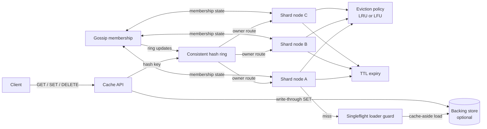

# Distributed Cache — Specification

> **Project ID:** `10_distributed_cache`  
> **Level:** 4 — Scalability and Distribution  
> **Status:** spec-in-progress

## Overview

Build a language-neutral distributed cache in Go, Rust, and Node.js/TypeScript that exposes a small HTTP API for key-value cache operations while spreading entries across multiple shard nodes with consistent hashing. Each implementation must support TTL expiration, explicit invalidation, selectable LRU/LFU eviction, cache-aside reads, optional write-through writes, gossip-based membership updates, and cache stampede prevention through singleflight/request coalescing.

The educational focus is the interaction between local cache mechanics and distributed-system behavior. A cache entry is not just a map value: it has freshness, eviction priority, ownership on a hash ring, replication or migration implications during membership change, and failure modes when callers, shard nodes, or backing stores are slow.

The central comparison question is: **How do eviction policies and sharding strategies interact under skewed access patterns?** Benchmarks and reviews should evaluate hit rate, p95/p99 GET latency, memory pressure, hot-key behavior, rebalancing cost, and implementation complexity rather than subjective language preference.

## Learning Objectives

- Primary concept: distributed cache design with consistent hashing and explicit freshness/eviction semantics.
- Secondary concepts: TTL expiration, LRU/LFU policy tradeoffs, cache-aside vs write-through, invalidation, gossip membership, request coalescing/singleflight, sharding, hot-key behavior, and failure-aware API design.

## Functional Requirements

- **RF-001:** The cache MUST support `GET`, `SET`, and `DELETE` operations for string keys and opaque byte/string values through a stable HTTP API.
- **RF-002:** `SET` MUST accept an optional TTL; entries with TTL MUST become unavailable after expiry without requiring a manual delete.
- **RF-003:** `GET` MUST distinguish cache hits from cache misses and MUST NOT return expired entries as hits.
- **RF-004:** `DELETE` MUST invalidate a key on its owning shard and be idempotent for already-missing keys.
- **RF-005:** Each shard node MUST enforce a configurable memory or entry-count capacity and evict entries when the capacity would be exceeded.
- **RF-006:** Implementations MUST support both LRU and LFU eviction policies and expose configuration to select one policy at startup.
- **RF-007:** The cluster MUST route keys to shard nodes using consistent hashing so that adding or removing a node remaps only a bounded subset of keys.
- **RF-008:** The hash ring MUST support virtual nodes/replicas per physical node to reduce key distribution imbalance.
- **RF-009:** The cache MUST support the cache-aside pattern: on a miss, the service may call a configured backing store loader, populate the cache with the loaded value, and return it to the caller.
- **RF-010:** The cache MUST support an optional write-through mode where successful `SET` requests are written to the backing store before the cache acknowledges success.
- **RF-011:** The cache MUST expose explicit invalidation for one key and for a key prefix/namespace when a namespace is configured.
- **RF-012:** Nodes MUST exchange membership information through a gossip protocol that converges on live, suspect, and failed node status.
- **RF-013:** Membership changes MUST update the consistent hash ring and route new requests to the current owner for each key.
- **RF-014:** The cache MUST prevent cache stampedes for the same missing or expired key by allowing only one in-flight loader call per key per node or cluster coordination scope; concurrent callers should wait for or reuse the same result.
- **RF-015:** The system MUST expose operational metrics for hits, misses, evictions, expirations, invalidations, loader calls, singleflight coalesces, gossip membership changes, shard ownership, and request latency.

## Non-Functional Requirements

- **RNF-001:** In-memory `GET` for a local, non-expired cache hit MUST have p95 latency **< 1ms** under benchmark conditions, excluding client network overhead when measured in-process.
- **RNF-002:** The cache SHOULD sustain **> 90% hit rate** under a realistic read-heavy workload when the working set fits within configured capacity and key popularity follows a documented Zipf/skewed distribution.
- **RNF-003:** Cluster-level `GET` p95 latency SHOULD remain **< 5ms** for cache hits routed over the local development network in the benchmark environment.
- **RNF-004:** TTL expiration lag SHOULD be **< 1 second p95** after an entry's expiry timestamp under steady load, whether expiration is lazy, active, or hybrid.
- **RNF-005:** Under node addition or removal, no more than approximately `1 / number_of_nodes` of keys SHOULD remap, adjusted for virtual-node count and documented ring imbalance.
- **RNF-006:** Gossip membership SHOULD converge across healthy nodes within **5 seconds** in a three-node local cluster after a node joins, leaves, or becomes unreachable.
- **RNF-007:** A single hot key MUST NOT trigger more than one backing-store loader call per configured singleflight window per shard owner.
- **RNF-008:** Eviction bookkeeping overhead MUST remain bounded and MUST NOT grow without limit after repeated SET/DELETE/expiry cycles.
- **RNF-009:** Implementations MUST provide comparable configuration knobs across languages for capacity, default TTL, max value size, eviction policy, virtual nodes, gossip interval, failure timeout, write-through mode, and singleflight timeout.
- **RNF-010:** Benchmarks MUST document dataset size, key distribution, read/write ratio, TTL mix, value size distribution, node count, and whether requests are local hits, remote hits, or loader-backed misses.

## API / Interface Contract

### Endpoints

```text
GET /cache/:key -> retrieve a cached value or load it through cache-aside when enabled
  Query:
    loadOnMiss?: boolean (default false unless cache-aside is globally enabled)
  Response 200:
    {
      "key": "user:123",
      "value": "opaque-string-or-base64",
      "hit": true,
      "ttlRemainingMs": 42150,
      "shardId": "shard-a",
      "nodeId": "node-a",
      "version": 7
    }
  Response 200 cache-aside loaded:
    {
      "key": "user:123",
      "value": "loaded-value",
      "hit": false,
      "loaded": true,
      "coalesced": false,
      "ttlRemainingMs": 60000,
      "shardId": "shard-a",
      "nodeId": "node-a",
      "version": 1
    }
  Response 404:
    { "key": "user:123", "hit": false, "loaded": false }
  Errors: 400 invalid key, 413 value too large when loader returns oversized value, 502 backing store unavailable, 503 shard unavailable, 504 loader timeout.

PUT /cache/:key -> set or replace a cached value
  Request:
    {
      "value": "opaque-string-or-base64",
      "ttlMs": 60000,
      "writeThrough": false,
      "namespace": "users"
    }
  Response 201:
    {
      "key": "user:123",
      "stored": true,
      "ttlExpiresAt": "2026-06-17T12:01:00Z",
      "shardId": "shard-a",
      "nodeId": "node-a",
      "version": 1,
      "evicted": []
    }
  Response 200:
    Returned when replacing an existing key; body shape matches 201 with incremented version.
  Errors: 400 invalid key or TTL, 413 value too large, 502 write-through backing store failed, 503 shard unavailable, 507 shard capacity cannot accept value.

DELETE /cache/:key -> invalidate one key
  Response 200:
    { "key": "user:123", "deleted": true, "shardId": "shard-a", "nodeId": "node-a" }
  Response 200 missing key:
    { "key": "user:123", "deleted": false, "reason": "not_found" }
  Errors: 400 invalid key, 503 shard unavailable.

POST /cache/invalidate -> invalidate a key, namespace, or prefix
  Request:
    {
      "key": "user:123",
      "namespace": "users",
      "prefix": "user:"
    }
    Exactly one of key, namespace, or prefix is required.
  Response 202:
    {
      "accepted": true,
      "scope": "prefix",
      "matchedApprox": 42,
      "completedOnNodes": ["node-a", "node-b"]
    }
  Errors: 400 invalid or ambiguous invalidation scope, 503 insufficient live nodes.

GET /cluster/ring -> inspect hash ring and shard ownership
  Response 200:
    {
      "ringVersion": 12,
      "virtualNodes": 128,
      "nodes": [NodeInfo],
      "shards": [Shard]
    }
  Errors: 503 membership unavailable.

GET /metrics -> expose implementation-neutral operational metrics
  Response 200:
    Plain text or JSON metrics including hit/miss counters, latency histograms, evictions, expirations, gossip state, loader calls, and singleflight coalesces.
```

### Data Models

```text
CacheEntry:
  key: string (non-empty, max 512 bytes after encoding)
  namespace: string? (optional invalidation grouping)
  value: bytes|string (opaque payload, max configured size)
  valueSizeBytes: integer
  ttlMs: integer? (nullable means no TTL, if allowed by configuration)
  expiresAt: timestamp? (server time, nullable for no-expiry entries)
  createdAt: timestamp
  updatedAt: timestamp
  lastAccessedAt: timestamp
  accessCount: integer (for LFU and metrics)
  version: integer (monotonic per key on owning shard)
  ownerShardId: string
  ownerNodeId: string

Shard:
  shardId: string
  nodeId: string
  hashRangeStart: integer|string (inclusive ring token)
  hashRangeEnd: integer|string (exclusive ring token)
  virtualNodeTokens: list<integer|string>
  capacityBytes: integer
  capacityEntries: integer
  usedBytes: integer
  entryCount: integer
  evictionPolicy: enum(lru, lfu)
  status: enum(active, rebalancing, degraded, unavailable)

NodeInfo:
  nodeId: string (stable unique node identifier)
  address: string (host:port or URL used for shard requests)
  gossipAddress: string (host:port or URL used for membership exchange)
  status: enum(alive, suspect, failed, leaving)
  incarnation: integer (monotonic membership version for conflict resolution)
  startedAt: timestamp
  lastHeartbeatAt: timestamp
  ringVersion: integer
  shardIds: list<string>
  metadata: object? (implementation-specific capacity/runtime tags)

EvictionRecord:
  key: string
  reason: enum(capacity_lru, capacity_lfu, expired, explicit_invalidation, ownership_moved)
  evictedAt: timestamp
  previousVersion: integer

SingleflightCall:
  key: string
  startedAt: timestamp
  waiters: integer
  status: enum(in_flight, succeeded, failed, timed_out)
```

## Architecture

### Diagram



### Components

| Component | Responsibility |
|-----------|----------------|
| Cache API | Accepts HTTP requests, validates keys/values/TTLs, maps errors to responses, and forwards operations to the current shard owner. |
| Consistent hash ring | Maps keys to shard owners using virtual nodes and updates routing when gossip membership changes. |
| Shard node | Owns a partition of cache entries, applies TTL checks, performs GET/SET/DELETE, and records local metrics. |
| Eviction policy | Maintains LRU or LFU metadata and chooses victims when shard capacity would be exceeded. |
| TTL manager | Ensures expired entries are not served and are removed through lazy lookup, active sweeps, or both. |
| Cache-aside loader | Calls the backing store on eligible misses and populates the cache with loaded values. |
| Write-through writer | Persists writes to the backing store before acknowledging cache SET when write-through is enabled. |
| Singleflight coordinator | Coalesces concurrent loader calls for the same key to prevent stampedes. |
| Gossip membership | Exchanges node liveness and incarnation data, detects failed/suspect nodes, and triggers ring version updates. |
| Metrics collector | Exposes comparable counters, gauges, and histograms for correctness and performance analysis. |

### Design Decisions

| Decision | Alternatives | Justification |
|----------|--------------|---------------|
| Consistent hashing with virtual nodes | Modulo hashing, static shard map | Consistent hashing demonstrates bounded remapping during cluster membership changes; virtual nodes reduce imbalance. |
| TTL checked on every GET | Background expiry only | Lookup-time checks prevent stale values even when sweeps are delayed under load. |
| Configurable LRU/LFU | One fixed eviction policy | The project question requires comparing policy behavior under skewed access patterns. |
| Cache-aside default, write-through optional | Write-back only, cache-only writes | Cache-aside is common and teachable; write-through introduces consistency tradeoffs without requiring asynchronous durability queues. |
| Gossip membership | Central coordinator only | Gossip teaches decentralized membership and failure detection, which fits the Level 4 distributed-systems focus. |
| Singleflight for misses | Let every miss call backing store | Coalescing is the core mitigation for cache stampedes and hot-key backend overload. |

## Error Handling Strategy

- Errors MUST be categorized as validation errors, cache misses, capacity/resource errors, shard routing errors, backing-store failures, membership failures, or internal failures.
- Invalid keys, invalid TTLs, ambiguous invalidation scopes, and malformed bodies MUST return `400 Bad Request` with stable machine-readable error codes.
- Values exceeding configured size MUST return `413 Payload Too Large` and MUST NOT evict existing entries to make room.
- A missing key on `GET` MUST return `404 Not Found` unless cache-aside loading succeeds; a missing key on `DELETE` MUST return a successful idempotent response with `deleted: false`.
- Expired entries MUST be treated as misses, removed or scheduled for removal, and counted as expirations rather than hits.
- If write-through is enabled and the backing store write fails, `SET` MUST fail with `502 Bad Gateway` and MUST NOT expose the new value as a successful cache write unless the implementation documents a compensating rollback state.
- If cache-aside loading times out, callers MUST receive `504 Gateway Timeout`; waiters coalesced behind the same singleflight call MUST receive the same terminal result.
- If the owning shard is unavailable and no valid owner can be resolved, requests MUST return `503 Service Unavailable` rather than silently routing to an arbitrary node.
- Gossip conflicts MUST be resolved by node ID plus incarnation/version rules; stale membership updates MUST NOT roll back a newer ring version.
- Error responses SHOULD include `requestId`, `code`, `message`, and `retryable` fields; internal stack traces or backing-store credentials MUST never be returned to clients.

## Edge Cases

- Empty key: reject with `400 Bad Request`; keys must be non-empty after decoding and normalization.
- Very large key: reject keys larger than the configured key byte limit before hashing or routing.
- Empty value: allow as a valid cached value unless explicitly disabled; a present empty value is still a hit.
- TTL of zero or negative: reject with `400 Bad Request` unless the API explicitly defines zero as immediate invalidation.
- Expiry during GET: if the entry expires before response construction, treat it as a miss and do not return stale data.
- SET larger than shard capacity: return `507 Insufficient Storage` or `413 Payload Too Large`; do not evict the entire shard repeatedly for an impossible value.
- LRU tie: break ties deterministically, such as oldest `createdAt` or lexical key order, so tests can verify behavior.
- LFU tie: break ties by oldest `lastAccessedAt` or oldest `createdAt` to avoid immortal entries with equal counts.
- Hot key miss storm: concurrent requests for the same missing key must coalesce behind one loader call; failed loader results must not be cached as successful values.
- Backing store slow or down: singleflight waiters must unblock on timeout and the cache must avoid unbounded waiter growth.
- Node joins: ring ownership changes must not corrupt existing entries; misses during migration are acceptable only if documented by consistency mode and metrics.
- Node fails: gossip may temporarily route to suspect/failed owners; clients should receive `503` or retryable routing errors until the ring converges.
- Split brain membership: higher incarnation/ring versions must win; stale gossip must not resurrect failed nodes without a newer incarnation.
- Prefix invalidation while writes occur: entries written after the invalidation cutoff should not be deleted unless they match a later invalidation operation.
- Clock skew: TTL uses each shard's server clock; distributed tests must document any assumptions or use monotonic durations where possible.

## Acceptance Criteria

- RF-001: `GET`, `PUT`, and `DELETE` operate on keys through the documented HTTP contract.
- RF-002: A key set with TTL becomes unavailable after expiry and is counted as an expiration.
- RF-003: `GET` returns hit metadata for present entries and miss metadata or `404` for absent/expired entries.
- RF-004: Repeated `DELETE` for the same key remains successful and reports whether anything was removed.
- RF-005: A shard at capacity evicts entries rather than exceeding configured capacity.
- RF-006: The same workload can be run with LRU and LFU selected independently at startup.
- RF-007: Adding/removing a node changes key ownership according to consistent hashing rather than modulo-wide remapping.
- RF-008: Ring inspection shows virtual-node tokens for each physical node.
- RF-009: Cache-aside miss loading stores the loaded value and returns it to the caller.
- RF-010: Write-through mode fails the cache SET when the backing store write fails.
- RF-011: Key and namespace/prefix invalidation remove matching entries from the relevant shards.
- RF-012: Gossip propagates join/failure state across a local multi-node cluster.
- RF-013: New requests route according to the updated ring after membership convergence.
- RF-014: Concurrent misses for one key produce one loader call and multiple coalesced responses.
- RF-015: Metrics expose hit rate, latency, evictions, expirations, loader calls, singleflight coalescing, and membership state.

## Language-Specific Notes

### Go

- Prefer `net/http`, `context.Context`, `sync` primitives, and explicit goroutine lifecycles for shard routing, gossip loops, TTL sweeps, and request coalescing.
- `singleflight` from `golang.org/x/sync/singleflight` is acceptable if dependencies are allowed; otherwise implement equivalent per-key coalescing with mutex-protected call state.
- Model eviction policy behind a small interface so LRU and LFU share capacity enforcement but differ in metadata updates.

### Rust

- Prefer an async HTTP framework plus `Arc`, locks or concurrent maps, and explicit enums for cache errors, node status, and eviction reasons.
- Use monotonic time for TTL durations where possible and wall-clock timestamps only for API metadata.
- Keep eviction and hash-ring ownership logic deterministic so property-style tests can compare remapping and victim selection.

### Node/TS

- Prefer explicit service modules for routing, shard state, eviction policy, gossip timers, and backing-store integration; avoid global mutable state that tests cannot isolate.
- Use `AbortController` or equivalent timeout/cancellation primitives for loader and write-through calls.
- Implement per-key promise coalescing carefully so failed promises are removed from the in-flight map and do not poison future loads.

## Dependencies

- Prerequisite projects: Projects 07-09.
- External tools: HTTP load generator (`wrk`, `autocannon`, `k6`, or equivalent), benchmark fixture generator for Zipf/skewed key distributions, optional local backing-store stub, and multi-process/local-network runner for at least three cache nodes.
