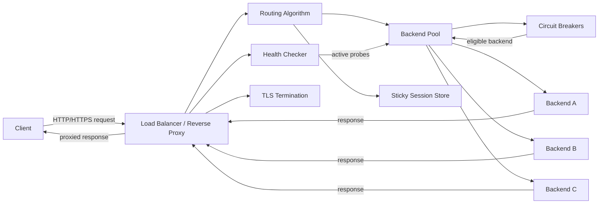

# Load Balancer — Specification

> **Project ID:** `11_load_balancer`
> **Level:** 4 — Scalability and Distribution
> **Status:** spec-in-progress

## Overview

Build a language-neutral Layer 7 HTTP/HTTPS load balancer in Go, Rust, and Node.js/TypeScript. The service acts as a reverse proxy in front of a configurable pool of backend services, forwards client requests to healthy backends, and records enough runtime state to make routing, failover, and resilience decisions observable.

This project teaches network infrastructure fundamentals: reverse proxying, backend health checks, failover, connection management, load-balancing algorithms, sticky sessions, TLS termination, and per-backend circuit breakers. Implementations must make the trade-offs visible rather than hiding them behind framework defaults.

The central comparison question is: **How does connection pooling and health-check frequency affect failover speed?** Benchmarks and reviews should focus on routing correctness, latency overhead, recovery behavior, throughput, and implementation ergonomics across runtimes.

## Learning Objectives

- Primary concept: reverse proxy load balancing with health-aware request routing.
- Secondary concepts: active/passive health checks, backend pools, round-robin, least-connections, consistent hashing, weighted distribution, sticky sessions, TLS termination, circuit breakers, failover, connection pooling, and high-throughput HTTP handling.

## Functional Requirements

- **RF-001:** The service MUST operate as a reverse proxy that accepts client HTTP requests and forwards them to a selected backend while preserving method, path, query string, headers, and body unless explicitly transformed by this specification.
- **RF-002:** The service MUST maintain a configurable backend pool loaded at startup, including backend ID, URL, weight, health-check configuration, circuit-breaker configuration, and optional connection-pool limits.
- **RF-003:** The service MUST perform active health checks against each backend at a configurable interval and mark backends healthy or unhealthy according to configurable success/failure thresholds.
- **RF-004:** The service MUST support passive health updates from proxied request outcomes, including timeouts, connection failures, and 5xx responses when configured as failure signals.
- **RF-005:** The service MUST route requests only to backends that are currently healthy and whose circuit breaker allows traffic, except for explicit half-open probe requests.
- **RF-006:** The service MUST implement round-robin routing across eligible backends.
- **RF-007:** The service MUST implement least-connections routing using the current in-flight request count per backend.
- **RF-008:** The service MUST implement consistent-hashing routing using a stable request key such as client IP, configured header, cookie, or path parameter.
- **RF-009:** The service MUST implement weighted distribution so a backend with weight `N` receives approximately `N` shares of traffic relative to other eligible backends under the selected algorithm.
- **RF-010:** The service MUST implement sticky sessions by assigning or reading a session cookie and routing subsequent requests for that session to the same backend while it remains eligible.
- **RF-011:** The service MUST support TLS termination for inbound HTTPS, including loading configured certificate and private-key files at startup.
- **RF-012:** The service MUST implement a circuit breaker per backend with `closed`, `open`, and `half_open` states, configurable failure threshold, open duration, and half-open probe limit.
- **RF-013:** When the selected backend fails before response headers are sent, the service MUST retry on another eligible backend according to configured retry limits and only for retry-safe request conditions.
- **RF-014:** The service MUST expose administrative endpoints for backend health, routing configuration summary, circuit-breaker state, and basic request metrics.
- **RF-015:** The service MUST add or update forwarding headers (`X-Forwarded-For`, `X-Forwarded-Host`, `X-Forwarded-Proto`, and `X-Request-Id`) so downstream services can identify original client context.
- **RF-016:** The service MUST support graceful shutdown by stopping new client acceptance, allowing in-flight proxied requests to complete until a configured timeout, and then closing backend connections.

## Non-Functional Requirements

- **RNF-001:** Proxy latency overhead MUST be less than 1 ms at p95 for successful local-network requests with keep-alive enabled, excluding backend application latency.
- **RNF-002:** The service MUST handle at least 50,000 requests per second in benchmark conditions with a simple healthy backend pool and small HTTP responses, or document the runtime/environment bottleneck if this target is not met.
- **RNF-003:** Health-check interval MUST be configurable without code changes, with a documented default and minimum allowed interval.
- **RNF-004:** Health state changes MUST take effect in routing decisions within one health-check interval plus one request scheduling cycle.
- **RNF-005:** The service MUST avoid unbounded memory growth under high concurrency by bounding request body buffering, connection pools, metrics retention, and session-store size.
- **RNF-006:** The service MUST support at least 10,000 simultaneous client connections with keep-alive enabled in benchmark conditions, or document the runtime/environment bottleneck if this target is not met.
- **RNF-007:** Backend connection pooling MUST be configurable per backend or globally, including idle connection timeout and maximum idle connections.
- **RNF-008:** Metrics and health endpoints MUST remain responsive under load and SHOULD return within 100 ms p95 while the proxy is handling benchmark traffic.
- **RNF-009:** Sticky session lookup MUST add less than 100 µs p95 routing overhead with the default in-memory session store under benchmark conditions.
- **RNF-010:** Configuration errors MUST fail fast at startup with actionable messages rather than starting a partially configured proxy.

## API / Interface Contract

### Proxy Interface

```text
ANY /* -> proxy client request to selected backend
  Request:
    method: any standard HTTP method
    path/query/body: forwarded to backend
    headers: forwarded except hop-by-hop headers; forwarding headers are added/updated
    cookie: optional sticky-session cookie when enabled
  Response 2xx-5xx:
    status, headers, and body from selected backend when proxying succeeds
  Errors:
    400 malformed client request
    502 no successful backend response, invalid upstream response, or all retries failed
    503 no eligible healthy backend or circuit breakers open
    504 backend connection/request timeout
```

### Administrative Endpoints

```text
GET /__lb/health -> load balancer process health
  Response 200:
    {
      "status": "ok",
      "uptimeSeconds": 3600,
      "backendSummary": { "healthy": 2, "unhealthy": 1, "openCircuits": 1 }
    }

GET /__lb/backends -> list backend pool status
  Response 200:
    {
      "items": [Backend]
    }

GET /__lb/backends/:id -> fetch one backend status
  Response 200: Backend
  Errors: 404 backend not found

GET /__lb/sessions/:id -> fetch sticky-session routing state when administrative session lookup is enabled
  Response 200: Session
  Errors: 404 session not found, 501 session lookup disabled

GET /__lb/metrics -> fetch basic load balancer metrics
  Response 200:
    {
      "requestsTotal": 1000000,
      "requestsInFlight": 128,
      "responsesByStatusClass": { "2xx": 950000, "4xx": 30000, "5xx": 20000 },
      "backendRequests": { "backend-a": 500000, "backend-b": 500000 },
      "routingAlgorithm": "round_robin|least_connections|consistent_hash"
    }
```

### Configuration Contract

```text
LoadBalancerConfig:
  listenAddress: string (host:port for inbound HTTP)
  tls: TlsConfig? (required for HTTPS termination)
  routingAlgorithm: enum(round_robin, least_connections, consistent_hash)
  stickySessions: StickySessionConfig
  healthCheckDefaults: HealthCheckConfig
  circuitBreakerDefaults: CircuitBreakerConfig
  retryPolicy: RetryPolicy
  backends: BackendConfig[] (non-empty)

BackendConfig:
  id: string (stable unique backend identifier)
  url: string (absolute HTTP or HTTPS upstream base URL)
  weight: integer (>= 1; default 1)
  healthCheck: HealthCheckConfig? (overrides defaults)
  circuitBreaker: CircuitBreakerConfig? (overrides defaults)
  maxConnections: integer? (optional backend concurrency limit)

TlsConfig:
  certificatePath: string
  privateKeyPath: string
  minVersion: string? (implementation-supported TLS version label)

StickySessionConfig:
  enabled: boolean
  cookieName: string (default "LB_SESSION")
  ttlSeconds: integer
  rebalanceOnBackendFailure: boolean

HealthCheckConfig:
  path: string
  intervalMillis: integer (configurable; default documented by implementation)
  timeoutMillis: integer
  healthyThreshold: integer
  unhealthyThreshold: integer
  expectedStatus: integer or range

CircuitBreakerConfig:
  failureThreshold: integer
  openDurationMillis: integer
  halfOpenMaxProbes: integer
  rollingWindowMillis: integer

RetryPolicy:
  maxAttempts: integer
  perAttemptTimeoutMillis: integer
  retryMethods: string[] (default excludes non-idempotent methods unless body replay is safe)
```

### Data Models

```text
Backend:
  id: string (stable unique identifier)
  url: string (upstream base URL)
  weight: integer (relative routing share)
  health: HealthStatus
  circuitBreaker: CircuitBreakerState
  activeConnections: integer (current in-flight proxied requests)
  totalRequests: integer
  failedRequests: integer
  lastSelectedAt: timestamp?
  connectionPool: ConnectionPoolStatus

HealthStatus:
  state: enum(healthy, unhealthy, unknown)
  consecutiveSuccesses: integer
  consecutiveFailures: integer
  lastCheckedAt: timestamp?
  lastSuccessfulCheckAt: timestamp?
  lastFailureReason: string?
  latencyMillis: number?

CircuitBreakerState:
  state: enum(closed, open, half_open)
  failureCount: integer
  openedAt: timestamp?
  nextProbeAt: timestamp?
  halfOpenInFlightProbes: integer

Session:
  id: string (opaque sticky-session identifier)
  backendId: string (assigned backend)
  createdAt: timestamp
  lastSeenAt: timestamp
  expiresAt: timestamp
  rebalanceCount: integer

ConnectionPoolStatus:
  active: integer
  idle: integer
  max: integer?
```

## Architecture

### Diagram



### Components

| Component | Responsibility |
|-----------|----------------|
| Listener / Reverse Proxy | Accepts client connections, parses requests, strips hop-by-hop headers, forwards traffic, streams responses, and maps proxy errors to client responses. |
| TLS Termination | Handles inbound HTTPS, certificate loading, TLS negotiation, and `X-Forwarded-Proto` updates. |
| Routing Algorithm | Selects an eligible backend using round-robin, least-connections, consistent hashing, weights, and sticky-session constraints. |
| Backend Pool | Stores configured backends, runtime counters, connection-pool state, and eligibility metadata. |
| Health Checker | Runs active probes at configured intervals and updates `HealthStatus` with threshold-based transitions. |
| Circuit Breaker Manager | Tracks per-backend failures, opens failing backends, schedules half-open probes, and closes circuits after successful recovery. |
| Sticky Session Store | Maps session IDs to backend IDs with TTL and rebalances sessions when assigned backends become ineligible if configured. |
| Metrics / Admin API | Exposes health, backend status, routing summary, circuit state, and basic traffic counters. |

### Design Decisions

| Decision | Alternatives | Justification |
|----------|--------------|---------------|
| Layer 7 HTTP reverse proxy | Layer 4 TCP load balancer | HTTP proxying exposes headers, sticky sessions, TLS termination, and request-aware routing for teaching. |
| Active plus passive health signals | Active checks only, passive failures only | Combining both shows the difference between scheduled detection and real traffic feedback. |
| Per-backend circuit breakers | One global circuit breaker | Backend-local circuits isolate failures and keep healthy backends serving traffic. |
| Configurable algorithms behind one router interface | Separate proxy implementation per algorithm | A shared interface makes algorithm behavior comparable without duplicating proxy mechanics. |
| In-memory runtime state by default | External storage dependency | The project focuses on proxy mechanics; external state can be an extension after baseline behavior is proven. |

## Error Handling Strategy

- Errors MUST be categorized as client request errors, configuration errors, routing exhaustion, backend connection failures, backend timeout failures, upstream protocol errors, TLS errors, or internal failures.
- Malformed client requests MUST return `400 Bad Request` without contacting a backend.
- If no backend is healthy and circuit-closed/half-open eligible, the proxy MUST return `503 Service Unavailable` with a stable error code such as `no_eligible_backend`.
- Backend connection refusal, DNS failure, invalid upstream response, or exhausted retry attempts MUST return `502 Bad Gateway` unless a more specific timeout applies.
- Backend request timeout MUST return `504 Gateway Timeout` and count as a passive failure for health/circuit-breaker policy when configured.
- TLS certificate/key loading errors MUST fail startup with an actionable configuration error.
- Circuit breaker transitions MUST be logged or exposed through admin state so failures are diagnosable.
- Non-idempotent requests MUST NOT be retried after any body bytes might have reached a backend unless the implementation provides a safe replay mechanism and documents it.
- In-flight counters MUST be decremented exactly once on success, failure, timeout, cancellation, or client disconnect.
- Administrative endpoint failures MUST NOT affect proxy data-plane routing unless they indicate shared state corruption.

## Edge Cases

- Empty backend pool: fail startup with a configuration error.
- All backends unhealthy: return `503 Service Unavailable` and keep health checks running until a backend recovers.
- Backend becomes unhealthy while requests are in flight: allow in-flight requests to finish or time out, but remove the backend from new routing decisions.
- Backend recovers: route traffic only after healthy threshold is met and circuit breaker allows closed or half-open traffic.
- Weighted backend with weight zero or negative: reject configuration at startup.
- Least-connections tie: break ties deterministically, for example by weighted round-robin among tied eligible backends.
- Consistent-hash key missing: fall back to a documented key source such as client IP or return a configuration/request error if no safe key exists.
- Sticky session assigned backend is unhealthy or circuit-open: rebalance to a healthy backend when configured, otherwise return `503` for strict affinity mode.
- Sticky session store grows beyond configured capacity: expire oldest or expired sessions and expose eviction metrics.
- Large request body: stream to backend without full buffering; reject or avoid retrying if body replay is not safe.
- Client disconnects before backend responds: cancel or close the upstream request and decrement in-flight counters.
- Backend returns streaming response: forward response chunks without buffering the full response in memory.
- Hop-by-hop headers (`Connection`, `Transfer-Encoding`, `Upgrade`, etc.): handle according to HTTP proxy rules and do not blindly forward invalid hop-by-hop state.
- HTTP upgrade or WebSocket request: either support tunneling explicitly or reject with a documented status; do not silently corrupt upgraded traffic.
- Health-check endpoint returns redirect: treat as success only if configured expected status allows redirects.
- Clock changes: TTLs, circuit timers, and health intervals should use monotonic time where available.

## Acceptance Criteria

- RF-001: A client request to the load balancer reaches a backend with method, path, query, headers, and body preserved except for documented proxy header changes.
- RF-002: Startup with a valid backend configuration creates the expected backend pool; invalid or empty configuration fails startup.
- RF-003: Active health checks transition a backend from `unknown` to `healthy` after configured successes and to `unhealthy` after configured failures.
- RF-004: Configured passive failure signals update backend health/circuit state after proxied request failures.
- RF-005: Routing excludes unhealthy and circuit-open backends from normal traffic.
- RF-006: Round-robin routing distributes sequential requests across eligible backends in order.
- RF-007: Least-connections routing selects the backend with the fewest active proxied requests, respecting weights and tie policy.
- RF-008: Consistent hashing sends the same stable key to the same backend while the eligible backend set is unchanged.
- RF-009: Weighted distribution approximates configured backend weights over a sufficiently large request sample.
- RF-010: Sticky sessions route repeat requests with the same session cookie to the assigned backend while eligible.
- RF-011: HTTPS clients can connect to the load balancer when valid TLS files are configured, and backends receive `X-Forwarded-Proto: https`.
- RF-012: A backend circuit breaker opens after threshold failures, blocks normal traffic while open, allows limited half-open probes, and closes after successful probes.
- RF-013: Retry-safe failures before response headers are retried on another eligible backend up to the configured attempt limit.
- RF-014: Admin endpoints report process health, backend statuses, circuit states, routing algorithm, and basic metrics.
- RF-015: Forwarding headers include original client context and a stable request ID.
- RF-016: Graceful shutdown stops accepting new requests and drains or times out in-flight work without counter leaks.

## Language-Specific Notes

### Go

- Use `net/http` and `httputil.ReverseProxy` only if the implementation still exposes the routing, health, retry, and circuit-breaker decisions required by this specification.
- Goroutines and channels are appropriate for health-check scheduling, graceful shutdown, and metrics aggregation; guard shared backend state with clear synchronization.

### Rust

- Use an async HTTP stack such as `tokio` with `hyper`/`axum` or equivalent, while keeping routing and circuit-breaker logic independent of framework glue.
- Prefer explicit ownership around backend state and monotonic timers for health/circuit transitions.

### Node/TS

- Use Node's HTTP streaming APIs or a proxy-capable framework without buffering full request/response bodies.
- Be explicit about event-loop backpressure, agent keep-alive settings, timeout handling, and cleanup on aborted requests.

## Dependencies

- Prerequisite projects: Projects 07-09 (`07_rest_api_auth`, `08_event_driven_order_system`, `09_plugin_system`).
- External tools: load generator such as `k6`, `wrk`, `hey`, or equivalent; TLS certificate generation tool for local HTTPS; optional Docker Compose for benchmark backend pools.
