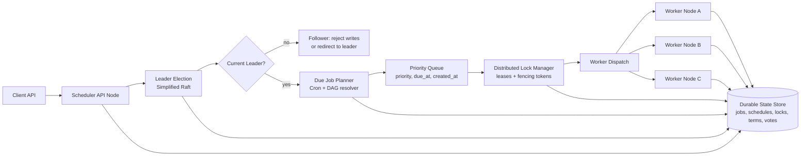

# Distributed Job Scheduler — Specification

> **Project ID:** `12_distributed_job_scheduler`  
> **Level:** 4 — Scalability and Distribution  
> **Status:** spec-in-progress

## Overview

Build a distributed job scheduler that accepts one-off and recurring jobs, elects a single scheduling leader, coordinates distributed locks, dispatches runnable work to workers, and tracks each job through completion, retry, cancellation, or failure. The scheduler must support cron-like schedules, dependency graphs, priority queues, exponential backoff retries, and status inspection through a stable HTTP API.

This project is intentionally a hard distributed-systems exercise. It teaches why a scheduler is more than a timer loop: multiple nodes may disagree about leadership, clocks may drift, workers may disappear while holding work, and dependent jobs may cascade into failure. The implementation should remain small enough for Go, Rust, and Node.js/TypeScript comparisons while still forcing each language to model consensus boundaries, lock ownership, durable state, and failure recovery explicitly.

The system does not need to implement production Raft in full. It must implement a simplified Raft-style leader election with terms, votes, heartbeats, quorum, and fencing tokens so only the current leader may schedule or dispatch jobs.

## Learning Objectives

- Primary concept: coordinating scheduled work safely across multiple nodes when only one scheduler leader may make dispatch decisions.
- Secondary concepts: simplified Raft leader election, distributed lock leases, cron parsing, priority queues, retry backoff, DAG dependency resolution, cancellation semantics, node failure recovery, split-brain mitigation, and clock-skew handling.

## Functional Requirements

- **FR-001:** The system must accept a job submission with a name, payload, optional cron expression, optional dependency list, priority, retry policy, timeout, and idempotency key.
- **FR-002:** The system must validate cron expressions at submission time and reject unsupported or invalid schedules with a structured validation error.
- **FR-003:** The scheduler must enqueue one-off jobs for immediate execution and recurring jobs for their next due time derived from the cron expression.
- **FR-004:** The cluster must elect exactly one active scheduler leader using simplified Raft terms, vote requests, majority quorum, and heartbeat timeouts.
- **FR-005:** Only the current leader may calculate due jobs, acquire dispatch locks, and assign jobs to workers.
- **FR-006:** The leader must use distributed locks with leases and fencing tokens before dispatching a job so the same job is not concurrently executed by multiple workers.
- **FR-007:** Workers must reject dispatches with stale fencing tokens or expired lock leases.
- **FR-008:** Jobs with DAG dependencies must remain blocked until all parent jobs reach `succeeded`; a failed or cancelled parent must move dependent jobs to `blocked` unless the job explicitly allows partial dependency failure.
- **FR-009:** Ready jobs must be dispatched by priority first, then by due time, then by creation time for deterministic tie-breaking.
- **FR-010:** Failed jobs with retry attempts remaining must be rescheduled with exponential backoff and jitter.
- **FR-011:** Jobs must stop retrying and move to `failed` after the configured maximum attempts or after exceeding the retry deadline.
- **FR-012:** Clients must be able to cancel queued, scheduled, running, blocked, and recurring jobs.
- **FR-013:** Cancelling a running job must mark the job as `cancelling`, notify the assigned worker, release or expire the lock, and eventually move the job to `cancelled` or `failed` if cancellation acknowledgement times out.
- **FR-014:** Clients must be able to query job status, attempt history, next scheduled run, current lock owner, dependency state, and cancellation state.
- **FR-015:** The system must expose node and cluster status, including current leader, term, known peers, heartbeat age, queue depth, running job count, and lock lease health.
- **FR-016:** When the leader fails, a new leader must be elected and resume scheduling from durable job, schedule, lock, and DAG state without losing accepted jobs.
- **FR-017:** Recurring jobs must create distinct execution attempts or run records while preserving the parent schedule identity.
- **FR-018:** The submission API must be idempotent for repeated requests with the same idempotency key and equivalent job definition.

## Non-Functional Requirements

- **NFR-001:** Scheduler accuracy must be within ±1 second of the computed due time while the cluster has an elected leader and storage is available.
- **NFR-002:** The cluster must survive one scheduler node failure in a three-node deployment without losing accepted jobs or permanently duplicating running work.
- **NFR-003:** Leader failover should complete within 5 seconds under default heartbeat and election timeout settings.
- **NFR-004:** Lock leases must be bounded and recoverable; a worker crash must not leave a job locked forever.
- **NFR-005:** Job submission and status APIs should return p95 latency under 100 ms at 100 requests/second with an empty or lightly loaded queue.
- **NFR-006:** Scheduling decisions must be deterministic from durable state so a new leader can reconstruct ready queues after restart.
- **NFR-007:** The implementation must avoid unbounded in-memory growth by paging historical attempts or pruning completed attempt history beyond a configurable retention window.
- **NFR-008:** State transitions must be auditable with timestamps, actor identity (`client`, `leader`, `worker`, `system`), previous status, next status, and reason.
- **NFR-009:** APIs must return structured JSON errors with stable error codes.
- **NFR-010:** Implementations must expose enough metrics or status fields to compare scheduling accuracy, failover time, duplicate dispatch prevention, retry timing, and queue latency across languages.

## API / Interface Contract

All endpoints exchange JSON. Timestamps are RFC 3339 UTC strings. Durations use milliseconds unless otherwise stated.

### Endpoints

```text
POST /jobs -> submit a job or recurring schedule
  Request:
    {
      "name": "string",
      "payload": object,
      "cron": "string | null",
      "run_at": "timestamp | null",
      "priority": "low | normal | high | critical",
      "dependencies": ["job_id"],
      "retry_policy": {
        "max_attempts": number,
        "initial_backoff_ms": number,
        "max_backoff_ms": number,
        "multiplier": number,
        "jitter": "none | full | equal"
      },
      "timeout_ms": number,
      "idempotency_key": "string"
    }
  Response 202:
    {
      "job_id": "string",
      "schedule_id": "string | null",
      "status": "queued | scheduled | blocked",
      "next_run_at": "timestamp | null"
    }
  Errors: 400 invalid_job_definition, 409 idempotency_conflict, 422 invalid_cron_expression

GET /jobs/{job_id} -> inspect job status
  Response 200:
    {
      "job": Job,
      "schedule": Schedule | null,
      "dependencies": [DAGNode],
      "current_lock": Lock | null,
      "attempts": [Attempt]
    }
  Errors: 404 job_not_found

POST /jobs/{job_id}/cancel -> request cancellation
  Request:
    { "reason": "string" }
  Response 202:
    { "job_id": "string", "status": "cancelling | cancelled" }
  Errors: 404 job_not_found, 409 terminal_job_state

GET /jobs -> list jobs by status, priority, schedule, or dependency state
  Query: status, priority, schedule_id, created_after, limit, cursor
  Response 200:
    { "items": [Job], "next_cursor": "string | null" }

GET /schedules/{schedule_id} -> inspect recurring schedule
  Response 200:
    { "schedule": Schedule, "recent_runs": [Job] }
  Errors: 404 schedule_not_found

POST /workers/{worker_id}/heartbeat -> worker liveness and capacity update
  Request:
    { "running_job_ids": ["job_id"], "available_slots": number }
  Response 200:
    { "accepted": true, "leader_id": "string", "server_time": "timestamp" }
  Errors: 409 not_leader, 410 worker_fenced

POST /internal/dispatch/ack -> worker acknowledges dispatch acceptance
  Request:
    { "job_id": "string", "worker_id": "string", "lock_id": "string", "fencing_token": number }
  Response 200:
    { "status": "running" }
  Errors: 409 stale_fencing_token, 423 lock_expired

POST /internal/jobs/{job_id}/complete -> worker reports terminal or retryable result
  Request:
    {
      "worker_id": "string",
      "attempt": number,
      "fencing_token": number,
      "result": "succeeded | failed | cancelled",
      "error": { "code": "string", "message": "string" } | null
    }
  Response 200:
    { "job_id": "string", "status": "succeeded | failed | cancelled | retry_scheduled" }
  Errors: 409 stale_attempt, 409 stale_fencing_token, 423 lock_expired

GET /cluster/status -> inspect scheduler cluster state
  Response 200:
    {
      "node_id": "string",
      "leader_id": "string | null",
      "term": number,
      "role": "leader | follower | candidate",
      "peers": [{ "node_id": "string", "last_heartbeat_at": "timestamp", "reachable": boolean }],
      "queue_depth": number,
      "running_jobs": number,
      "expired_locks": number
    }
```

## Data Models

```text
Job:
  id: string (stable unique identifier)
  schedule_id: string | null (recurring schedule parent, if any)
  name: string (1..128 characters)
  payload: object (JSON-serializable, max size configurable)
  status: queued | scheduled | blocked | running | cancelling | retry_scheduled | succeeded | failed | cancelled
  priority: low | normal | high | critical
  cron: string | null (copied from schedule for recurring jobs)
  run_at: timestamp | null (explicit one-off run time)
  due_at: timestamp (next eligible dispatch time)
  dependencies: string[] (parent job ids)
  retry_policy: RetryPolicy
  attempt: number (starts at 0, increments per dispatch)
  max_attempts: number
  timeout_ms: number
  idempotency_key: string
  created_at: timestamp
  updated_at: timestamp
  started_at: timestamp | null
  completed_at: timestamp | null
  last_error: ErrorInfo | null

Schedule:
  id: string
  job_template: object (name, payload, priority, retry policy, timeout)
  cron: string (validated cron expression)
  timezone: string (IANA name, default UTC)
  next_run_at: timestamp
  last_run_at: timestamp | null
  paused: boolean
  created_at: timestamp
  updated_at: timestamp

Lock:
  id: string
  resource_type: job | schedule | dag_node
  resource_id: string
  owner_node_id: string
  owner_worker_id: string | null
  term: number (leader term when acquired)
  fencing_token: number (monotonic per resource)
  lease_expires_at: timestamp
  acquired_at: timestamp
  released_at: timestamp | null

DAGNode:
  job_id: string
  parents: string[]
  children: string[]
  dependency_status: waiting | ready | blocked
  allow_partial_failure: boolean
  unresolved_parent_count: number
  created_at: timestamp
  updated_at: timestamp

RetryPolicy:
  max_attempts: number (>= 1)
  initial_backoff_ms: number (> 0)
  max_backoff_ms: number (>= initial_backoff_ms)
  multiplier: number (>= 1)
  jitter: none | full | equal

Attempt:
  job_id: string
  attempt: number
  worker_id: string | null
  status: dispatched | running | succeeded | failed | cancelled | timed_out
  started_at: timestamp
  finished_at: timestamp | null
  lock_id: string
  fencing_token: number
  error: ErrorInfo | null

ErrorInfo:
  code: string
  message: string
  retryable: boolean
```

## Architecture

### Diagram



### Components

| Component | Responsibility |
|-----------|----------------|
| Client API | Accepts job submissions, cancellation requests, and status queries. |
| Scheduler API Node | Hosts HTTP endpoints and participates in leader election. |
| Leader Election | Maintains terms, votes, heartbeats, quorum, and leader identity. |
| Due Job Planner | Computes cron due times, unblocks DAG nodes, and selects ready work. |
| Priority Queue | Orders ready jobs by priority, due time, and creation time. |
| Lock Manager | Acquires, renews, releases, and expires lock leases with fencing tokens. |
| Worker Dispatch | Assigns locked jobs to workers with capacity and heartbeat awareness. |
| Worker Node | Executes jobs, sends heartbeats, acknowledges dispatch, and reports completion. |
| Durable State Store | Persists jobs, schedules, DAG edges, terms, votes, locks, attempts, and audit events. |

### Design Decisions

| Decision | Alternatives | Justification |
|----------|--------------|---------------|
| Simplified Raft election, not full Raft log replication | Static leader, database advisory lock, full Raft | Teaches leader terms, quorum, heartbeats, and split-brain risk without turning the project into a full consensus database. |
| Durable scheduler state is required | Pure in-memory scheduler | Node failure recovery and repeatable language comparison require accepted jobs and lock state to survive restarts. |
| Lock leases include fencing tokens | Lease only, mutex only | Fencing tokens let workers reject stale leaders and stale dispatches after split-brain or delayed messages. |
| Priority ordering is deterministic | Runtime-specific priority queues | Deterministic ordering makes cross-language behavior comparable. |
| DAG state is modeled explicitly | Recompute dependencies by scanning all jobs | Explicit DAG nodes make dependency state auditable and avoid expensive full scans for each completion. |
| Retry backoff includes configurable jitter | Fixed delay, exponential only | Jitter prevents retry storms after widespread dependency or worker failure. |

## Error Handling Strategy

- Validation errors return `400` or `422` with `{ "error": { "code", "message", "field" } }`.
- Conflict errors return `409` for stale terms, stale attempts, terminal job states, duplicate idempotency keys with different payloads, and stale fencing tokens.
- Lock errors return `423` when a lock is held, expired, or has a mismatched fencing token.
- Missing resources return `404` with resource-specific codes such as `job_not_found` or `schedule_not_found`.
- Follower nodes must not silently accept leader-only writes. They must redirect to the known leader or return `409 not_leader` with the current leader id when known.
- Worker completion is idempotent for the same `job_id`, `attempt`, and `fencing_token`; duplicate completion reports must return the already-recorded result.
- A failed dispatch before worker acknowledgement must release the lock or let the lease expire, then return the job to the ready queue if the leader still owns the current term.
- Retryable worker failures transition to `retry_scheduled`; non-retryable failures transition to `failed` immediately.
- All state transitions must append an audit event before or atomically with the visible status update.

## Edge Cases

- **Split-brain:** If two nodes believe they are leader, only the node with majority quorum and the latest term may acquire new locks. Workers must reject stale fencing tokens even if a stale leader sends dispatches.
- **Clock skew:** Scheduling decisions should use the leader's monotonic time for intervals and persisted UTC timestamps for due times. Nodes with observed skew beyond 500 ms should be marked unhealthy for leadership until resynchronized.
- **Cascading failure:** If many parent jobs fail, dependent jobs must move to `blocked` without creating retry storms. Retried parents must not unblock children until they eventually succeed.
- **Leader crash after lock acquisition before dispatch:** The lock lease must expire and the new leader must requeue the job without counting it as a worker attempt unless dispatch acknowledgement was recorded.
- **Worker crash during execution:** The job remains `running` until heartbeat timeout or lock expiry, then transitions to `retry_scheduled` or `failed` according to retry policy.
- **Duplicate submission:** Same idempotency key and equivalent job definition returns the original job; same key with different definition returns `409 idempotency_conflict`.
- **Invalid DAG:** Cycles, self-dependencies, duplicate parent ids, or references to missing parent jobs must be rejected at submission time.
- **Recurring job overlap:** If a previous run of a recurring job is still running when the next cron time arrives, the schedule must follow a configured overlap policy. Default: skip the overlapping run and record `skipped_overlap`.
- **Cancellation race:** If cancellation and completion arrive concurrently, the first terminal transition wins and the loser receives the terminal state already recorded.
- **Priority starvation:** Low-priority jobs must not be starved indefinitely; implementations should include configurable priority aging or document why starvation is acceptable for the benchmark scenario.
- **Retry overflow:** Backoff calculation must cap at `max_backoff_ms` and must not overflow integer duration types.
- **Storage outage:** The leader must stop accepting new jobs and stop dispatching unlocked jobs when durable state writes are unavailable.

## Acceptance Criteria

- **FR-001:** Submitting a valid one-off job returns `202` with a `job_id` and creates a durable `queued` job.
- **FR-002:** Submitting malformed cron strings returns `422 invalid_cron_expression` and creates no schedule.
- **FR-003:** One-off jobs become dispatchable immediately; recurring jobs expose a computed `next_run_at`.
- **FR-004:** In a three-node cluster, exactly one node reports `role=leader` after election stabilizes.
- **FR-005:** Follower write attempts return redirect or `409 not_leader` and do not dispatch jobs.
- **FR-006:** Concurrent leaders or workers cannot acquire valid locks for the same job with the same fencing token.
- **FR-007:** A stale dispatch acknowledgement is rejected with `409 stale_fencing_token`.
- **FR-008:** A child job remains `blocked` until all parents succeed.
- **FR-009:** Given ready jobs with different priorities, dispatch order is critical, high, normal, low; ties use due time then creation time.
- **FR-010:** A retryable failure schedules the next attempt according to exponential backoff with configured jitter.
- **FR-011:** A job reaches `failed` after exhausting `max_attempts`.
- **FR-012:** Cancelling a queued or scheduled job moves it to `cancelled` and prevents dispatch.
- **FR-013:** Cancelling a running job sends cancellation intent to the worker and records `cancelling` before terminal resolution.
- **FR-014:** `GET /jobs/{job_id}` returns status, attempts, dependency state, and lock state.
- **FR-015:** `GET /cluster/status` returns leader, term, peers, and queue health.
- **FR-016:** Killing the leader results in a new leader that resumes scheduling accepted jobs within the failover target.
- **FR-017:** A recurring schedule creates separate run records for each due execution.
- **FR-018:** Repeating a submission with the same idempotency key returns the original job response.
- **NFR-001:** Under stable cluster conditions, measured dispatch timestamps are within ±1 second of due time.
- **NFR-002:** During one scheduler node failure in a three-node cluster, accepted jobs are neither lost nor permanently duplicated.

## Language-Specific Notes

### Go

- Prefer `net/http` or a small router, goroutines for heartbeat/election loops, context cancellation for job cancellation, and explicit mutex/channel boundaries around in-memory queues.
- Keep election, lock, and queue logic behind interfaces so failure scenarios can be exercised consistently.

### Rust

- Prefer `axum` or equivalent HTTP server, `tokio` tasks for scheduler loops, and strongly typed state transitions for job status.
- Use monotonic timers for leases and explicit serialization models for persisted state.

### Node.js/TypeScript

- Prefer an HTTP framework with typed request validation, async worker loops, and explicit timer management.
- Avoid relying on process-local timers alone; recover due jobs from durable state after restart.

## Dependencies

- Prerequisite projects: Projects 07-09 from the curriculum catalog.
- External concepts/tools: cron expression parser, local multi-node process runner or Docker Compose, durable state store abstraction, and benchmark/failure-injection scripts for failover and scheduling accuracy.
- This spec is language-neutral. Implementation-specific package choices belong in each language implementation directory, not in this behavior contract.
