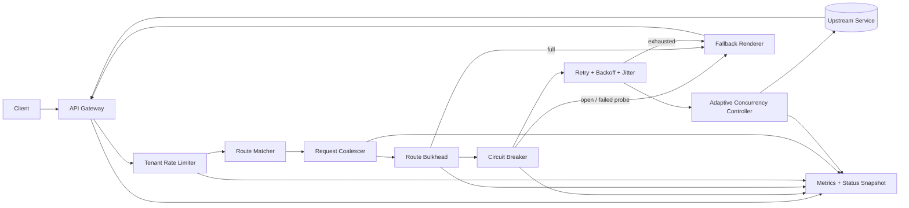

# API Gateway with Circuit Breaker — Specification

> **Project ID:** 13_api_gateway_circuit_breaker  
> **Level:** 5 — Resilience and Observability  
> **Status:** spec-in-progress

## Overview

Build a lightweight API gateway that proxies HTTP traffic to configured upstream services while applying resilience controls at the route and tenant boundaries. The gateway is intentionally small enough to implement in Go, Rust, and Node.js/TypeScript, but rich enough to teach production fault-tolerance patterns: circuit breakers, retries, fallbacks, bulkheads, per-tenant rate limits, request coalescing, and adaptive concurrency.

The educational goal is to compare how different runtime concurrency models recover from upstream failure. The gateway must expose observable state and deterministic behavior so implementations can be benchmarked against the catalog question: how do circuit breaker recovery times compare across language concurrency models?

This project depends on the distributed systems foundations from Projects 10-12 and introduces resilience as a user-facing contract, not just an internal optimization. A correct implementation should protect healthy routes from unhealthy ones, fail fast when an upstream is unavailable, and recover cautiously without causing retry storms.

## Learning Objectives

- Primary concept: implementing circuit breaker state transitions around proxied HTTP traffic.
- Secondary concepts: retry policy design, exponential backoff with jitter, fallback responses, route bulkheading, tenant-aware rate limiting, request coalescing, adaptive concurrency, gateway observability, and failure isolation.

## Functional Requirements

- **FR-001:** The gateway must load a route table containing at least one `Route` definition with a public path prefix, upstream URL, timeout, retry policy, circuit breaker policy, bulkhead policy, fallback policy, coalescing policy, and adaptive concurrency policy.
- **FR-002:** The gateway must proxy incoming requests whose path matches a configured route to the route's upstream service while preserving HTTP method, path suffix, query string, request body, and non-hop-by-hop headers.
- **FR-003:** The gateway must reject requests for unknown routes with `404 Not Found` and a structured error body.
- **FR-004:** The gateway must track circuit breaker state per route, with explicit `closed`, `open`, and `half_open` states.
- **FR-005:** In `closed` state, the gateway must forward requests normally and record successes, failures, timeouts, and latency for the route's rolling evaluation window.
- **FR-006:** The circuit must transition from `closed` to `open` when the route's configured failure threshold is reached inside the configured rolling window.
- **FR-007:** The circuit must transition from `open` to `half_open` after the configured open cooldown expires, allowing only the configured number of probe requests through.
- **FR-008:** In `half_open` state, the circuit must transition to `closed` after the configured number of successful probes and back to `open` immediately after any failed probe.
- **FR-009:** When a circuit is `open`, normal requests must fail fast without contacting the upstream and must return the configured fallback response when one exists.
- **FR-010:** The gateway must support retry for eligible upstream failures using exponential backoff with jitter. Retry must be bounded by per-route maximum attempts, total deadline, and retryable status/error classifications.
- **FR-011:** Retry logic must not retry non-idempotent requests unless the request includes an idempotency key or the route explicitly allows retrying that method.
- **FR-012:** The gateway must support fallback responses per route for open circuits, upstream timeouts, exhausted retries, and bulkhead rejection. Fallbacks may be static JSON responses or configured status/body/header templates.
- **FR-013:** The gateway must enforce bulkheading per route by limiting the number of concurrent in-flight upstream requests for that route independently from other routes.
- **FR-014:** When a route bulkhead is full, the gateway must reject additional requests immediately with `503 Service Unavailable` or the route fallback response, without queuing unbounded work.
- **FR-015:** The gateway must enforce rate limits per tenant before proxying. Tenant identity must be derived from a configured header, defaulting to `X-Tenant-ID`.
- **FR-016:** Per-tenant rate limit responses must include `429 Too Many Requests`, a structured error body, `Retry-After`, and rate-limit headers showing the effective limit and remaining capacity.
- **FR-017:** The gateway must support request coalescing for configured routes: concurrent identical safe requests must share one upstream call and receive the same response payload when coalescing is enabled.
- **FR-018:** Request coalescing keys must include route identity, method, path, query string, tenant identity, and configured vary headers; request bodies must only participate when the route explicitly marks the method as coalescible.
- **FR-019:** The gateway must support adaptive concurrency per route by increasing or decreasing the effective concurrency limit based on observed latency, failures, and queue/rejection pressure within bounded minimum and maximum limits.
- **FR-020:** The gateway must expose a read-only status endpoint showing route configuration summaries, current circuit states, rolling counters, effective concurrency limits, bulkhead occupancy, and tenant rate-limit summaries.
- **FR-021:** The gateway must emit or expose metrics for request count, upstream latency, gateway overhead, retry attempts, fallback count, circuit transitions, bulkhead rejections, rate-limit rejections, coalesced hits, and adaptive concurrency changes.

## Non-Functional Requirements

- **NFR-001:** Gateway overhead must be less than `2ms` p95 for successfully proxied requests when the upstream responds locally within `10ms`, excluding upstream service time.
- **NFR-002:** Circuit open detection must complete within `100ms` of observing the failure event that crosses the configured threshold.
- **NFR-003:** Open-circuit fail-fast responses must not contact the upstream and must complete within `5ms` p95 under local benchmark conditions.
- **NFR-004:** Circuit state transitions must be thread-safe and race-free under concurrent requests.
- **NFR-005:** Route isolation must hold under failure: saturation, open circuits, or retry storms on one route must not consume another route's bulkhead capacity.
- **NFR-006:** Tenant isolation must hold under rate limiting: one tenant exhausting its limit must not reduce another tenant's available capacity.
- **NFR-007:** Retry scheduling must use jitter to avoid synchronized retry bursts and must respect request deadlines.
- **NFR-008:** Memory used for tenant limits, coalescing entries, rolling windows, and circuit state must be bounded by configuration or cleanup policies.
- **NFR-009:** The gateway must degrade safely when upstreams are slow or unavailable: bounded concurrency, bounded retries, bounded buffering, and deterministic error responses.
- **NFR-010:** Status and metrics endpoints must not mutate circuit state, consume tenant quota, or trigger upstream calls.

## API / Interface Contract

### Gateway Proxy Endpoints

```text
ANY /proxy/{routePath...} -> proxy request to matching upstream route
  Request:
    Headers:
      X-Tenant-ID: string, required unless route allows anonymous tenant
      Idempotency-Key: string, optional for retrying non-idempotent requests
      X-Request-ID: string, optional correlation id
    Body: any valid HTTP request body accepted by the upstream route
  Response:
    Status: upstream status code, fallback status code, or gateway error status
    Headers:
      X-Request-ID: correlation id
      X-Gateway-Route: route id
      X-Circuit-State: closed | open | half_open
      X-Retry-Attempts: integer
      X-Fallback-Used: true | false
      X-RateLimit-Limit: integer, when tenant limiting applies
      X-RateLimit-Remaining: integer, when tenant limiting applies
      X-RateLimit-Reset: unix timestamp seconds, when tenant limiting applies
  Errors:
    400 invalid tenant or malformed request
    404 no matching route
    408 gateway request timeout before upstream completed
    429 tenant rate limit exceeded
    502 upstream returned invalid response or connection failed without fallback
    503 circuit open, bulkhead full, or fallback unavailable
    504 upstream timeout after retries exhausted
```

### Status Endpoint

```text
GET /_gateway/status -> inspect gateway runtime state
  Request: no body
  Response 200:
    {
      "routes": [
        {
          "id": "orders",
          "path_prefix": "/api/orders",
          "upstream": "http://127.0.0.1:9001",
          "circuit": {
            "state": "closed",
            "failure_count": 0,
            "success_count": 128,
            "opened_at": null,
            "half_open_probe_in_flight": 0
          },
          "bulkhead": {
            "max_concurrency": 64,
            "in_flight": 12,
            "rejections": 3
          },
          "adaptive_concurrency": {
            "enabled": true,
            "effective_limit": 48,
            "min_limit": 8,
            "max_limit": 128
          }
        }
      ]
    }
  Errors:
    500 status snapshot unavailable
```

### Metrics Endpoint

```text
GET /_gateway/metrics -> expose implementation-neutral text or JSON metrics
  Request: no body
  Response 200:
    Metrics MUST include counters and histograms for requests, gateway overhead,
    upstream latency, retries, fallbacks, circuit transitions, bulkhead rejections,
    tenant rate-limit rejections, coalescing hits/misses, and adaptive limit changes.
  Errors:
    500 metrics snapshot unavailable
```

### Configuration Input

Implementations may load configuration from JSON, YAML, or code-local fixtures, but the effective shape must support this contract:

```json
{
  "routes": [
    {
      "id": "orders",
      "path_prefix": "/api/orders",
      "upstream_url": "http://127.0.0.1:9001",
      "tenant_header": "X-Tenant-ID",
      "timeout_ms": 250,
      "retry": {
        "max_attempts": 3,
        "base_delay_ms": 10,
        "max_delay_ms": 100,
        "jitter": "full",
        "retryable_methods": ["GET", "HEAD", "PUT", "DELETE"],
        "retryable_statuses": [502, 503, 504]
      },
      "circuit_breaker": {
        "window_ms": 10000,
        "minimum_requests": 20,
        "failure_rate_threshold": 0.5,
        "open_cooldown_ms": 5000,
        "half_open_max_probes": 3,
        "half_open_successes_to_close": 3
      },
      "fallback": {
        "status": 503,
        "body": { "error": "orders temporarily unavailable" }
      },
      "bulkhead": {
        "max_concurrency": 64,
        "max_queue": 0
      },
      "tenant_limit": {
        "capacity": 120,
        "refill_per_second": 20
      },
      "coalescing": {
        "enabled": true,
        "ttl_ms": 100,
        "methods": ["GET", "HEAD"],
        "vary_headers": ["Accept", "Authorization"]
      },
      "adaptive_concurrency": {
        "enabled": true,
        "min_limit": 8,
        "max_limit": 128,
        "target_p95_latency_ms": 75
      }
    }
  ]
}
```

## Data Models

```text
Route:
  id: string (unique, stable metric label)
  path_prefix: string (must begin with /, longest-prefix match wins)
  upstream_url: url (scheme, host, optional port, optional base path)
  tenant_header: string (default X-Tenant-ID)
  timeout_ms: integer > 0
  retry: RetryPolicy
  circuit_breaker: CircuitBreakerPolicy
  fallback: FallbackPolicy | null
  bulkhead: BulkheadPolicy
  tenant_limit: TenantLimit
  coalescing: CoalescingPolicy
  adaptive_concurrency: AdaptiveConcurrencyPolicy

CircuitState:
  route_id: string
  state: enum(closed, open, half_open)
  rolling_window_started_at: timestamp
  success_count: integer >= 0
  failure_count: integer >= 0
  timeout_count: integer >= 0
  consecutive_half_open_successes: integer >= 0
  half_open_probe_in_flight: integer >= 0
  opened_at: timestamp | null
  last_transition_reason: string

TenantLimit:
  tenant_id: string
  route_id: string
  capacity: integer > 0
  refill_per_second: number > 0
  tokens_remaining: number >= 0
  last_refill_at: timestamp
  reset_at: timestamp

RetryPolicy:
  max_attempts: integer >= 1
  base_delay_ms: integer >= 0
  max_delay_ms: integer >= base_delay_ms
  jitter: enum(none, equal, full)
  retryable_methods: list<string>
  retryable_statuses: list<integer>
  retryable_errors: list<connection_error | timeout | reset>

BulkheadPolicy:
  max_concurrency: integer > 0
  max_queue: integer >= 0 (0 means fail fast)

FallbackPolicy:
  status: integer HTTP status code
  headers: map<string,string>
  body: JSON object or string

CoalescingPolicy:
  enabled: boolean
  ttl_ms: integer >= 0
  methods: list<string>
  vary_headers: list<string>

AdaptiveConcurrencyPolicy:
  enabled: boolean
  min_limit: integer > 0
  max_limit: integer >= min_limit
  target_p95_latency_ms: integer > 0
```

## Architecture

### Diagram



### Components

| Component | Responsibility |
|-----------|----------------|
| HTTP Listener | Accepts client requests, assigns/request propagates `X-Request-ID`, and writes final responses. |
| Tenant Rate Limiter | Applies per-route, per-tenant token-bucket limits before any upstream work is attempted. |
| Route Matcher | Selects the longest matching `Route` by path prefix and computes the upstream target URL. |
| Request Coalescer | Deduplicates concurrent identical safe requests for configured routes. |
| Route Bulkhead | Bounds concurrent upstream work per route so one route cannot exhaust gateway capacity. |
| Circuit Breaker | Maintains `closed`, `open`, and `half_open` states and decides whether a request may reach the upstream. |
| Retry Engine | Applies bounded retry with exponential backoff, jitter, deadline awareness, and idempotency checks. |
| Adaptive Concurrency Controller | Adjusts effective route concurrency within configured limits based on observed health signals. |
| Fallback Renderer | Produces deterministic fallback responses when resilience controls reject or upstream recovery fails. |
| Metrics/Status Store | Provides read-only snapshots of route state, counters, latency histograms, and transition events. |

### Design Decisions

| Decision | Alternatives | Justification |
|----------|--------------|---------------|
| Circuit state is tracked per route. | Global circuit, per-upstream host circuit. | Per-route state is easiest to teach and benchmark while preserving route isolation. |
| Tenant limits are enforced before route bulkheads. | Limit after proxy attempt or after retries. | Early rejection protects upstreams and avoids consuming scarce route concurrency. |
| Bulkhead rejection is fail-fast by default. | Unbounded queue or global queue. | Bounded/fail-fast behavior makes overload explicit and prevents latency amplification. |
| Retry is bounded by attempts and request deadline. | Retry until success or fixed sleep only. | Bounded retries teach resilience without creating retry storms. |
| Half-open allows limited probes. | Immediately close after cooldown or allow all traffic. | Probe gating prevents thundering herds during recovery. |
| Coalescing is opt-in per route. | Coalesce every request automatically. | Coalescing unsafe requests can corrupt semantics; opt-in keeps correctness explicit. |
| Adaptive concurrency is bounded by static min/max. | Fully automatic unbounded limit. | Bounds make experiments safe and comparable across implementations. |

## Error Handling Strategy

- All gateway-generated errors must use a structured response body:

  ```json
  {
    "error": "machine_readable_code",
    "message": "human-readable summary",
    "route_id": "orders",
    "request_id": "req-123",
    "retry_after_ms": 5000
  }
  ```

- `400 Bad Request`: missing or invalid tenant identity when the matched route requires a tenant.
- `404 Not Found`: no route matches the incoming path.
- `408 Request Timeout`: the gateway request deadline expires before a final upstream or fallback response can be produced.
- `429 Too Many Requests`: tenant rate limit is exceeded; include `Retry-After` and rate-limit headers.
- `502 Bad Gateway`: upstream connection fails, returns an invalid response, or closes unexpectedly and no fallback applies.
- `503 Service Unavailable`: circuit is open, route bulkhead is full, half-open probe capacity is exhausted, adaptive concurrency rejects, or fallback is the configured response.
- `504 Gateway Timeout`: upstream timeout remains after eligible retries are exhausted and no fallback applies.
- Upstream 4xx responses are passed through and must not count as circuit breaker failures unless explicitly configured.
- Upstream 5xx responses, connection errors, and timeouts count as failures when they match the route's circuit breaker failure classifier.
- If a fallback response is returned, the gateway must include `X-Fallback-Used: true` and still update metrics for the triggering reason.
- Idempotency is required for retrying non-safe methods unless the route explicitly opts into retrying that method.

## Edge Cases

- Empty route table -> gateway starts in configuration-error mode or refuses startup; it must not silently proxy all traffic.
- Overlapping route prefixes -> longest prefix wins; exact matches beat shorter prefixes.
- Unknown route -> `404` without consuming tenant quota or route bulkhead capacity.
- Missing tenant header on a tenant-protected route -> `400` without contacting upstream.
- Tenant exceeds quota while circuit is open -> `429` takes precedence because rate limiting happens first.
- Circuit opens while requests are already in flight -> in-flight requests complete normally and contribute to rolling metrics; new requests fail fast.
- Circuit cooldown expires under high load -> only configured half-open probe count may pass; all other requests receive fallback/fail-fast responses.
- Half-open probe timeout -> immediate transition back to `open`.
- Retryable failure followed by success -> final response is success; retry counters and latency still record all attempts.
- Retry backoff would exceed request deadline -> do not sleep beyond the deadline; return timeout/fallback instead.
- Non-idempotent request without idempotency key -> no retry even when the error is otherwise retryable.
- Bulkhead full while coalesced request is already in flight -> identical eligible request may join the coalesced result; non-coalesced request is rejected.
- Coalesced upstream response is a failure -> all joined callers receive the same failure/fallback outcome and metrics record one upstream attempt plus coalesced waiters.
- Adaptive concurrency reduces limit below current in-flight count -> allow existing requests to finish; apply the lower limit only to new requests.
- Upstream returns streaming/chunked response -> gateway may pass through streaming only when coalescing is disabled for that route.
- Client disconnects before upstream returns -> gateway should cancel upstream work when possible and must release bulkhead/adaptive slots.
- Metrics endpoint called during route transition -> return a consistent snapshot, not partially updated state.

## Acceptance Criteria

- **FR-001:** A configured route table can be loaded and surfaced through `/_gateway/status`.
- **FR-002:** A request to a known route reaches the configured upstream with method, path suffix, query, body, and allowed headers preserved.
- **FR-003:** A request to an unknown route returns structured `404`.
- **FR-004:** Status output exposes one of `closed`, `open`, or `half_open` per route.
- **FR-005:** Successful and failed requests update rolling counters in `closed` state.
- **FR-006:** Reaching the failure threshold opens the circuit within the configured window.
- **FR-007:** After cooldown, only the configured probe count reaches the upstream in `half_open`.
- **FR-008:** Successful probes close the circuit; a failed probe reopens it.
- **FR-009:** Open-circuit requests fail fast and use fallback when configured.
- **FR-010:** Retry attempts use exponential backoff with jitter and stop at configured bounds.
- **FR-011:** Non-idempotent requests are not retried unless idempotency conditions are met.
- **FR-012:** Fallback responses are returned for configured trigger conditions and include fallback headers.
- **FR-013:** Per-route bulkhead limits cap in-flight upstream requests independently.
- **FR-014:** Bulkhead overflow is rejected immediately or returns fallback without unbounded queueing.
- **FR-015:** Tenant rate limiting is enforced before proxying.
- **FR-016:** Rate-limit responses include `429`, `Retry-After`, and rate-limit headers.
- **FR-017:** Identical concurrent safe requests on coalescing-enabled routes share one upstream call.
- **FR-018:** Coalescing keys separate tenants, paths, queries, methods, and configured vary headers.
- **FR-019:** Adaptive concurrency changes the effective limit within configured min/max bounds based on health signals.
- **FR-020:** `/_gateway/status` returns route state, circuit state, bulkhead occupancy, and adaptive limit data.
- **FR-021:** `/_gateway/metrics` exposes the required counters and histograms.
- **NFR-001:** Benchmarks show gateway overhead p95 below `2ms` under the specified local upstream condition.
- **NFR-002:** Fault injection shows circuit open detection occurs within `100ms` after the threshold-crossing failure.

## Language-Specific Notes

### Go

- Prefer `net/http` or a small router around it for transparent proxying.
- Use context deadlines for request timeout propagation and cancellation.
- Protect route state with clear synchronization boundaries such as mutexes, atomics, or channels; benchmark contention around circuit state updates.

### Rust

- Prefer an async HTTP stack such as axum/hyper/tower for gateway middleware composition.
- Model circuit states with explicit enums and keep shared state behind safe concurrency primitives.
- Use deadline-aware futures and cancellation-safe slot release for bulkheads and adaptive concurrency.

### Node/TS

- Prefer a minimal HTTP framework or native HTTP server with explicit proxy handling.
- Keep route state updates synchronous or guarded to avoid event-loop race assumptions when using workers/clusters.
- Use abort signals/timeouts for upstream calls and release bulkhead slots in `finally` paths.

## Dependencies

- Prerequisite projects: Projects 10-12 (`10_distributed_cache`, `11_load_balancer`, `12_distributed_job_scheduler`).
- External tools: local upstream stub service, benchmark/load generator such as k6 or autocannon, and optional metrics scraper for comparing runtime behavior.
