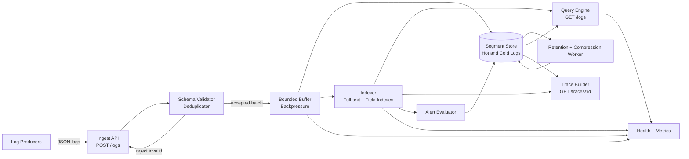

# Log Aggregator — Specification

> **Project ID:** `14_log_aggregator`  
> **Level:** 5 — Resilience and Observability  
> **Status:** spec-in-progress

## Overview

Build a language-neutral log aggregation service in Go, Rust, and Node.js/TypeScript that accepts structured JSON logs, buffers and indexes them, supports low-latency querying, and connects logs into trace-oriented observability workflows through correlation IDs. The service is an educational observability pipeline, not just a CRUD API: learners must reason about ingestion pressure, indexing trade-offs, retention, compression, query shape, and failure isolation.

This project teaches structured logging, aggregation pipelines, search indexes, retention management, compression, alerting rules, and distributed tracing support. Each implementation must expose the same public behavior so reviews and benchmarks can compare runtime choices, data representation, backpressure strategy, and query performance rather than feature drift.

The central comparison question is: **How does ingestion throughput compare for JSON vs protobuf log formats?** JSON is the required baseline contract for this project. Implementations MAY add a protobuf ingestion path for benchmark comparison, but the JSON API defined here remains canonical.

## Learning Objectives

- Primary concept: high-throughput structured log ingestion with queryable indexes and bounded retention.
- Secondary concepts: JSON log envelopes, log levels, source tagging, correlation IDs, full-text search, compression, hot/cold storage, retention policies, alerting rules, trace reconstruction, backpressure, batching, and benchmarkable observability pipelines.

## Functional Requirements

- **RF-001: Structured JSON ingestion.** The service MUST accept structured JSON log entries through `POST /logs` and validate required fields before acknowledging ingestion.
- **RF-002: Batch ingestion.** `POST /logs` MUST accept either one log entry or a bounded batch of log entries so clients can amortize request overhead.
- **RF-003: Stable log identity.** Every accepted log entry MUST have a stable `log_id`; clients MAY provide one, otherwise the service MUST generate one.
- **RF-004: Timestamp handling.** Each log entry MUST include an event timestamp or receive an ingestion timestamp. Queries MUST preserve both event time and ingestion time when both exist.
- **RF-005: Log level filtering.** `GET /logs` MUST support filtering by one or more levels such as `trace`, `debug`, `info`, `warn`, `error`, and `fatal`.
- **RF-006: Source filtering.** `GET /logs` MUST support filtering by source fields including service name, host, environment, and arbitrary source labels.
- **RF-007: Correlation filtering.** `GET /logs` MUST support filtering by `correlation_id`, `trace_id`, and `span_id` so request-scoped logs can be reconstructed.
- **RF-008: Time range filtering.** `GET /logs` MUST support inclusive/exclusive time ranges over event time, with deterministic ordering by event time and stable tie-breaking by `log_id`.
- **RF-009: Full-text search.** `GET /logs?filter=` MUST support full-text search across log message text and configured searchable fields.
- **RF-010: Structured field search.** The query API MUST support exact-match filters for structured attributes such as `attributes.user_id`, `attributes.route`, or `attributes.error_code`.
- **RF-011: Indexing pipeline.** Accepted logs MUST flow through an indexing pipeline that makes recent logs queryable without requiring a process restart or manual index rebuild.
- **RF-012: Retention policies.** The system MUST support configurable retention policies by level, source, environment, or global default; expired logs MUST eventually become unavailable to query APIs.
- **RF-013: Compression.** The storage layer MUST compress cold or persisted log segments and expose compression metrics including raw bytes, compressed bytes, and compression ratio.
- **RF-014: Distributed tracing support.** The system MUST model trace relationships from `trace_id`, `span_id`, `parent_span_id`, `correlation_id`, and optional OpenTelemetry-compatible fields.
- **RF-015: Trace lookup.** `GET /traces/:id` MUST return a trace-centric view containing spans and associated logs ordered by timestamp.
- **RF-016: Alerting rules.** The service MUST support alert rules that evaluate log streams for threshold, rate, and text/field-match conditions.
- **RF-017: Alert events.** When an alert rule condition is met, the service MUST record an alert event with rule id, matched query, evaluation window, severity, and representative matching log ids.
- **RF-018: Operational visibility.** The service MUST expose health and metrics for ingestion rate, buffer depth, indexing lag, dropped/rejected logs, query latency, retention deletions, compression ratio, and alert evaluations.
- **RF-019: Backpressure.** When buffers or index queues are saturated, the service MUST apply explicit backpressure or rejection instead of allowing unbounded memory growth.
- **RF-020: Idempotent ingestion.** Re-ingesting a log with an existing `log_id` from the same source MUST NOT create duplicate query results; the response MUST identify duplicates.

## Non-Functional Requirements

- **RNF-001: Ingest throughput.** The service SHOULD sustain **>50,000 logs/second** for small structured JSON logs in benchmark conditions, or document the runtime/environment bottleneck if this target is not met.
- **RNF-002: Recent query latency.** Queries over recent hot data with selective filters SHOULD complete in **<100 ms p95** under benchmark conditions.
- **RNF-003: Full-text query latency.** Full-text searches over the benchmark recent window SHOULD complete in **<250 ms p95** for documented corpus size and query selectivity.
- **RNF-004: Indexing freshness.** Accepted logs SHOULD become queryable within **1 second p95** under steady-state benchmark load.
- **RNF-005: Bounded memory.** Ingestion buffers, query result sets, alert evaluation windows, deduplication caches, and trace assembly state MUST be bounded by configuration.
- **RNF-006: Durability mode.** Implementations MUST document whether acknowledged logs are durable before indexing, durable after batch flush, or volatile until flush; the mode MUST be visible in health output.
- **RNF-007: Retention lag.** Expired logs SHOULD be removed or made unqueryable within one configured retention sweep interval plus 60 seconds.
- **RNF-008: Compression target.** Cold log segments SHOULD reach at least **3:1 compression ratio** for repetitive JSON benchmark logs, with actual ratios reported.
- **RNF-009: Pagination safety.** Query APIs MUST paginate results and MUST NOT return unbounded result sets.
- **RNF-010: Multi-source isolation.** A high-volume source MUST NOT permanently starve indexing or querying for other sources; queueing, sharding, or fairness decisions must be documented.
- **RNF-011: Clock skew tolerance.** The system MUST handle logs whose event timestamps are out of order or skewed from server time without corrupting indexes.
- **RNF-012: Language neutrality.** Go, Rust, and Node/TypeScript implementations MUST follow this public contract even if their storage engines, async runtimes, compression libraries, and indexing internals differ.

## API / Interface Contract

All implementations MUST expose a JSON HTTP interface. The default bind address is `127.0.0.1`; each implementation MUST document its port, storage path, and benchmark configuration.

### Shared Response Envelopes

Successful responses SHOULD use:

```json
{
  "ok": true,
  "data": {},
  "metadata": {
    "correlation_id": "corr_01JZ...",
    "request_id": "req_01JZ..."
  }
}
```

Error responses SHOULD use:

```json
{
  "ok": false,
  "error": {
    "code": "INVALID_LOG_ENTRY",
    "message": "Human-readable explanation",
    "details": {}
  },
  "metadata": {
    "correlation_id": "corr_01JZ...",
    "request_id": "req_01JZ..."
  }
}
```

### Endpoints

```text
POST /logs → ingest one or more structured JSON logs
  Request single:
    {
      "log_id": "log_123",
      "timestamp": "2026-06-17T12:00:00.123Z",
      "level": "error",
      "message": "payment authorization failed",
      "source": {
        "service": "payments",
        "host": "host-a",
        "environment": "dev",
        "version": "1.2.3"
      },
      "correlation_id": "corr_123",
      "trace_id": "trace_123",
      "span_id": "span_456",
      "parent_span_id": "span_123",
      "attributes": {
        "route": "/checkout",
        "user_id": "user_123",
        "error_code": "CARD_DECLINED"
      }
    }
  Request batch:
    { "items": [LogEntry], "ingest_format": "json" }
  Response 202:
    {
      "ok": true,
      "data": {
        "accepted": 100,
        "duplicates": 2,
        "rejected": 0,
        "batch_id": "batch_123",
        "indexing_status": "queued"
      }
    }
  Errors:
    400 invalid_json | invalid_log_entry | batch_too_large
    409 conflicting_duplicate_log_id
    413 payload_too_large
    429 ingest_backpressure
    503 buffer_unavailable | storage_unavailable

GET /logs?filter=<query> → search and filter logs
  Query parameters:
    filter?: string (full-text query and/or implementation-neutral field query syntax)
    level?: comma-separated list of levels
    source?: service name or source label expression
    correlation_id?: string
    trace_id?: string
    span_id?: string
    start?: RFC3339 timestamp
    end?: RFC3339 timestamp
    limit?: integer (default 100, max documented by implementation)
    cursor?: opaque pagination cursor
    order?: asc|desc (default desc by event timestamp)
  Response 200:
    {
      "ok": true,
      "data": {
        "items": [LogEntry],
        "next_cursor": "opaque-or-null",
        "query": {
          "filter": "payment error",
          "levels": ["error", "fatal"],
          "correlation_id": "corr_123"
        },
        "stats": {
          "matched": 42,
          "scanned_segments": 3,
          "latency_ms": 37
        }
      }
    }
  Errors:
    400 invalid_filter | invalid_time_range | invalid_pagination
    413 query_too_broad
    429 query_rate_limited
    503 index_unavailable
    504 query_timeout

GET /traces/:id → retrieve one trace with associated spans and logs
  Response 200:
    {
      "ok": true,
      "data": {
        "trace": Trace,
        "logs": [LogEntry],
        "partial": false
      }
    }
  Errors:
    400 invalid_trace_id
    404 trace_not_found
    503 index_unavailable

POST /alerts/rules → create or replace an alert rule
  Request: AlertRule
  Response 201:
    { "ok": true, "data": { "rule_id": "rule_123", "status": "enabled" } }
  Errors:
    400 invalid_alert_rule | invalid_filter | invalid_window
    409 rule_id_conflict

GET /alerts/rules → list alert rules
  Response 200:
    { "ok": true, "data": { "items": [AlertRule] } }

GET /alerts/events?rule_id=<id>&limit=100&cursor=<opaque> → list alert events
  Response 200:
    { "ok": true, "data": { "items": [AlertEvent], "next_cursor": "opaque-or-null" } }
  Errors:
    400 invalid_pagination

GET /health → service health and pipeline lag
  Response 200:
    {
      "ok": true,
      "data": {
        "status": "ok" | "degraded",
        "durability_mode": "pre_ack" | "post_batch_flush" | "volatile_until_flush",
        "ingest_rate_per_second": 50000,
        "buffer_depth": 1200,
        "indexing_lag_ms": 250,
        "oldest_unindexed_log_age_ms": 400,
        "query_engine": "ok" | "degraded" | "unavailable",
        "storage": "ok" | "degraded" | "unavailable",
        "alerting": "ok" | "degraded" | "unavailable"
      }
    }

GET /metrics → expose implementation-neutral operational metrics
  Response 200:
    Plain text or JSON metrics including ingest counters, rejected logs, duplicate logs, buffer depth, indexing lag, query latency histograms, retention deletes, compressed bytes, and alert evaluations.
```

## Data Models

```yaml
LogEntry:
  log_id: string (unique per source; generated if omitted)
  timestamp: RFC3339 timestamp (event time; may be client supplied)
  ingested_at: RFC3339 timestamp (server time when accepted)
  level: enum(trace, debug, info, warn, error, fatal)
  message: string (required, searchable, max configured length)
  source: LogSource (required)
  correlation_id: string | null (request or workflow correlation key)
  trace_id: string | null (distributed trace id)
  span_id: string | null (span id within trace)
  parent_span_id: string | null
  attributes: object (flat or nested structured fields, bounded size)
  schema_version: integer (starts at 1)
  payload_size_bytes: integer

LogSource:
  service: string (required logical service name)
  host: string | null
  environment: string | null (for example dev, staging, prod)
  version: string | null
  labels: object (bounded source metadata)

Trace:
  trace_id: string (unique trace identifier)
  correlation_id: string | null
  root_span_id: string | null
  spans: TraceSpan[]
  first_seen_at: RFC3339 timestamp
  last_seen_at: RFC3339 timestamp
  duration_ms: number | null
  service_count: integer
  log_count: integer
  error_count: integer
  incomplete: boolean (true when parent/child span information is missing)

TraceSpan:
  span_id: string
  parent_span_id: string | null
  trace_id: string
  service: string
  name: string | null
  started_at: RFC3339 timestamp | null
  ended_at: RFC3339 timestamp | null
  duration_ms: number | null
  status: enum(ok, error, unknown)
  log_ids: string[]

AlertRule:
  rule_id: string (stable unique identifier)
  name: string (human-readable)
  enabled: boolean
  severity: enum(info, warning, critical)
  filter: string (same field/full-text query syntax used by GET /logs)
  levels: string[] | null
  sources: string[] | null
  condition: AlertCondition
  window_seconds: integer (> 0)
  throttle_seconds: integer (>= 0)
  created_at: RFC3339 timestamp
  updated_at: RFC3339 timestamp

AlertCondition:
  type: enum(threshold_count, rate_per_second, absence, field_match)
  threshold: number | null
  operator: enum(gt, gte, eq, lt, lte) | null
  field: string | null
  value: string | number | boolean | null

AlertEvent:
  alert_event_id: string
  rule_id: string
  triggered_at: RFC3339 timestamp
  evaluation_window_start: RFC3339 timestamp
  evaluation_window_end: RFC3339 timestamp
  matched_count: integer
  representative_log_ids: string[]
  severity: enum(info, warning, critical)
  status: enum(triggered, throttled, resolved)

RetentionPolicy:
  policy_id: string
  selector: object (level/source/environment/global match criteria)
  retain_for_seconds: integer
  compress_after_seconds: integer | null
  delete_after_seconds: integer
  priority: integer (higher wins for overlapping selectors)

IndexSegment:
  segment_id: string
  time_range_start: RFC3339 timestamp
  time_range_end: RFC3339 timestamp
  state: enum(hot, warm, cold, expired)
  log_count: integer
  raw_bytes: integer
  compressed_bytes: integer | null
  indexed_fields: string[]
```

## Architecture

### Diagram



### Components

| Component | Responsibility |
|-----------|----------------|
| Ingest API | Accepts JSON log batches, enforces request limits, returns accepted/duplicate/rejected counts, and propagates request/correlation metadata. |
| Schema Validator | Validates required log fields, normalizes levels and timestamps, bounds attribute sizes, and rejects malformed records. |
| Deduplicator | Prevents duplicate query results for repeated `log_id` values from the same source. |
| Bounded Buffer | Absorbs short ingestion bursts, batches writes/index updates, and applies explicit backpressure when saturated. |
| Segment Store | Stores hot and cold log segments, tracks time ranges, and provides persisted records to query and trace APIs. |
| Indexer | Builds and updates full-text, level, source, correlation, trace, and structured-field indexes. |
| Query Engine | Parses filters, intersects indexes, paginates results, and retrieves matching log entries. |
| Trace Builder | Reconstructs trace/span views from trace IDs, span IDs, parent relationships, and associated logs. |
| Retention + Compression Worker | Applies retention policies, compresses eligible segments, deletes expired segments, and exposes retention lag. |
| Alert Evaluator | Evaluates alert rules over indexed logs and records alert events with throttling. |
| Health + Metrics | Reports pipeline depth, ingest throughput, indexing lag, storage status, query latency, and alert status. |

### Design Decisions

| Decision | Alternatives | Justification |
|----------|--------------|---------------|
| Canonical ingestion uses structured JSON | Plain text logs only; protobuf only | JSON is readable, language-neutral, common in application logging, and matches the catalog learning goal. Protobuf can be an optional benchmark comparison. |
| Query path uses indexes plus segment retrieval | Linear scan for all queries; external search engine | Learners must build and understand indexing trade-offs without outsourcing the core lesson. Segment retrieval keeps source records authoritative. |
| Retention is policy-based | Single global TTL only; manual deletion only | Real observability systems retain error and audit logs differently from verbose debug logs. |
| Tracing is correlation-based, not a full tracing backend | Ignore traces; implement complete OpenTelemetry collector | Project 14 should teach log-trace correlation while staying scoped to log aggregation. |
| Alerting records internal alert events | External notification integrations required | Internal alert events are testable and language-neutral; outbound integrations can be future extensions. |

## Error Handling Strategy

- Validation errors MUST identify the failing field and reject only invalid entries when batch partial acceptance is possible.
- Whole-request JSON parse failures return `400 invalid_json`; valid batches with invalid entries may return `202` with `rejected > 0` and per-entry rejection details when configured for partial acceptance.
- Payloads over configured request size return `413 payload_too_large`; batches over entry-count limits return `400 batch_too_large`.
- Duplicate `log_id` values from the same source are idempotent when the payload matches; conflicting payloads for the same identity return `409 conflicting_duplicate_log_id`.
- Buffer saturation returns `429 ingest_backpressure` with retry guidance; storage or indexer unavailability returns `503`.
- Query parse errors return `400 invalid_filter`; overly broad or unsafe queries return `413 query_too_broad`; timed-out queries return `504 query_timeout`.
- Retention and compression worker failures MUST degrade health and emit metrics but MUST NOT stop ingestion unless storage safety is compromised.
- Alert rule evaluation failures MUST be visible in `/health` and `/metrics`; one failing rule MUST NOT stop other rules from evaluating.
- Error responses SHOULD include the request `correlation_id` when provided, or a generated one otherwise.

## Edge Cases

- Empty request body → `400 invalid_json` and no logs accepted.
- Empty batch → `400 invalid_log_entry` or `400 batch_too_large` with a clear message that at least one item is required.
- Batch contains mixed valid and invalid logs → valid logs may be accepted, invalid logs are reported with indexes and reasons if partial acceptance is enabled.
- Unknown log level → reject with `400 invalid_log_entry`; implementations MUST NOT silently coerce unknown levels.
- Missing timestamp → use server ingestion time as event time and record that event time was server assigned.
- Event timestamp far in the future → accept within configured skew tolerance or reject with `400 invalid_log_entry` when outside tolerance.
- Event timestamp far in the past → accept if still inside retention window; otherwise accept-and-expire or reject according to documented retention behavior.
- Out-of-order logs for one correlation ID → query and trace APIs order by timestamp with stable tie-breaking, not ingestion order alone.
- Very large message or attributes object → reject with `413 payload_too_large` or per-entry validation failure before buffering.
- Source emits more logs than other sources → buffer fairness or sharding MUST prevent permanent starvation of lower-volume sources.
- High-cardinality attribute filters → implementation MUST bound indexed fields and document which fields are indexed by default.
- Trace has missing parent spans → `GET /traces/:id` returns `partial: true` and marks the trace incomplete rather than failing.
- Retention deletes logs referenced by an alert event → alert event remains queryable with representative log ids, but missing log details are reported as expired.
- Compression occurs while a query is reading a segment → query MUST see a consistent result or retry internally without returning corrupted data.
- Process restarts during indexing → implementation MUST rebuild or resume indexes from durable segments according to documented durability mode.

## Acceptance Criteria

- **RF-001:** `POST /logs` accepts a valid structured JSON log and returns an accepted count.
- **RF-002:** A batch request accepts multiple valid log entries and enforces documented batch limits.
- **RF-003:** Accepted logs without `log_id` receive generated IDs; reusing the same ID does not duplicate results.
- **RF-004:** Queries return both `timestamp` and `ingested_at` when available.
- **RF-005:** Filtering by level returns only logs whose level is included in the requested set.
- **RF-006:** Filtering by service/source returns only matching source logs.
- **RF-007:** Filtering by `correlation_id`, `trace_id`, or `span_id` reconstructs request-scoped log sets.
- **RF-008:** Time range queries include only logs in range and produce deterministic ordering.
- **RF-009:** Full-text search finds logs by message terms and excludes non-matching messages.
- **RF-010:** Structured field filters match nested attributes such as `attributes.error_code`.
- **RF-011:** Newly accepted logs become queryable without manual index rebuild.
- **RF-012:** Logs beyond their retention policy become unavailable after retention processing.
- **RF-013:** Compression metrics show raw bytes, compressed bytes, and ratio for cold segments.
- **RF-014:** Logs with trace/span metadata contribute to trace reconstruction.
- **RF-015:** `GET /traces/:id` returns spans and associated logs for an existing trace.
- **RF-016:** Alert rules can be created for threshold, rate, and text/field-match conditions.
- **RF-017:** Matching alert rules record alert events with representative log ids.
- **RF-018:** `/health` and `/metrics` expose ingest, buffer, indexing, query, retention, compression, and alerting data.
- **RF-019:** Saturated buffers return explicit backpressure instead of unbounded memory growth.
- **RF-020:** Duplicate ingestion is idempotent for identical records and conflicts for mismatched records.

## Language-Specific Notes

### Go

- Prefer explicit goroutine ownership for ingest, buffering, indexing, retention, and alert evaluation workers.
- Use bounded channels or queues for backpressure and document worker counts, batch sizes, and flush intervals.
- Keep JSON, compression, and index structures swappable so protobuf-vs-JSON benchmarks can isolate serialization overhead.

### Rust

- Prefer strongly typed log envelopes and explicit error enums for validation, parsing, ingestion, and query failures.
- Use async tasks with bounded channels for pipeline stages and avoid unbounded allocations in full-text search or trace assembly.
- Model storage/index ownership carefully so compression and query reads cannot observe partially rewritten segments.

### Node/TS

- Use streaming/body-size limits for ingestion and avoid parsing unbounded request bodies into memory.
- Use worker queues or batched async loops for indexing and alert evaluation so the HTTP event loop remains responsive.
- JSON-native ergonomics are a strength, but benchmarks must still separate parse time, validation time, buffer time, index time, and query time.

## Dependencies

- Prerequisite projects: Projects 10-12 (`10_distributed_cache`, `11_load_balancer`, `12_distributed_job_scheduler`).
- External tools: HTTP load generator for ingestion/query benchmarks, dataset generator for structured logs, and optional local tracing/log producer fixtures.
- Optional comparison extension: protobuf ingestion path for the catalog key question, while preserving JSON as the canonical required API.
