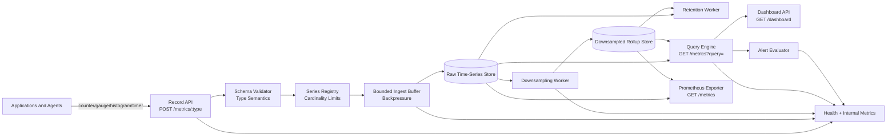

# Metrics Collector & Dashboard — Specification

> **Project ID:** `15_metrics_collector`  
> **Level:** 5 — Resilience and Observability  
> **Status:** spec-in-progress

## Overview

Build a language-neutral metrics collection service in Go, Rust, and Node.js/TypeScript that records application metrics, stores them as time-series data, aggregates them for dashboard queries, exposes a Prometheus-compatible scrape endpoint, and evaluates threshold-based alerts. The project is an educational observability system: learners must understand metric types, timestamped samples, histogram buckets, query windows, percentile accuracy, downsampling, retention, and the latency trade-offs between hot-path recording and read-time aggregation.

This project teaches the core primitives behind production monitoring systems. Counters, gauges, histograms, and timers behave differently, so the API and storage model must preserve those semantics instead of treating every metric as a generic number. Each implementation must expose the same public behavior so reviews and benchmarks can compare runtime choices, data layout, aggregation strategy, and percentile accuracy rather than feature drift.

The central comparison question is: **How do histogram bucket strategies affect p99 accuracy across runtimes?** Implementations MUST support explicit histogram bucket configuration and MUST report enough data for benchmark reviews to compare approximate percentiles with known input distributions.

## Learning Objectives

- Primary concept: time-series metric ingestion, storage, aggregation, and dashboard querying.
- Secondary concepts: counters, gauges, histograms, timers, percentile estimation, bucket design, rolling windows, downsampling, retention, Prometheus exposition format, alert rules, backpressure, query optimization, and benchmarkable observability pipelines.

## Functional Requirements

- **FR-001: Counter recording.** The service MUST accept counter samples through `POST /metrics/counter` and store monotonic increments by metric name and label set.
- **FR-002: Gauge recording.** The service MUST accept gauge samples through `POST /metrics/gauge` and store point-in-time values that may increase or decrease.
- **FR-003: Histogram recording.** The service MUST accept histogram observations through `POST /metrics/histogram`, assign observations to configured buckets, and preserve `count`, `sum`, and bucket counts.
- **FR-004: Timer recording.** The service MUST accept timer observations through `POST /metrics/timer`, store durations as histogram-compatible data, and expose timer-specific units in metadata.
- **FR-005: Metric identity.** The service MUST identify a metric stream by `name`, `type`, and normalized labels; the same name with different labels is a distinct time series.
- **FR-006: Timestamp handling.** Each sample MAY include an event timestamp; otherwise the service MUST assign an ingestion timestamp. Queries MUST use event time and expose ingestion time where useful for debugging lag.
- **FR-007: Time-series storage.** Accepted samples MUST be stored in a time-series model that supports bounded range queries by metric name, labels, and time window.
- **FR-008: Aggregation functions.** `GET /metrics?query=` MUST support `sum`, `avg`, `min`, `max`, `count`, `rate`, `p50`, `p95`, and `p99` over a requested time range and grouping dimensions.
- **FR-009: Histogram percentiles.** Percentile aggregations for histograms and timers MUST be computed from bucketed data and MUST document approximation behavior.
- **FR-010: Dashboard query API.** `GET /dashboard` MUST provide a dashboard-oriented query response containing series data, aggregate summaries, and alert state for one or more panels.
- **FR-011: Downsampling.** The service MUST support configurable downsampling from raw samples into coarser rollups such as 10-second, 1-minute, and 5-minute buckets.
- **FR-012: Retention.** The service MUST enforce configurable retention policies for raw samples and downsampled rollups; expired data MUST eventually become unavailable to query APIs.
- **FR-013: Prometheus-compatible metrics endpoint.** `GET /metrics/export` MUST expose collected metrics in Prometheus text exposition format. For compatibility with the required `/metrics` path, `GET /metrics` MUST return Prometheus text when no `query` parameter is present and JSON query results when `query` is present.
- **FR-014: Alert rule management.** The service MUST support alert rules that evaluate metric aggregations against thresholds over time windows.
- **FR-015: Alert evaluation.** The service MUST evaluate enabled alert rules on a configured interval and record alert state transitions including `pending`, `firing`, and `resolved`.
- **FR-016: Label filtering and grouping.** Query APIs MUST support filtering and grouping by labels such as `service`, `route`, `method`, `status`, `host`, and arbitrary bounded custom labels.
- **FR-017: Operational visibility.** The service MUST expose internal metrics for sample ingestion rate, dropped/rejected samples, write latency, query latency, downsampling lag, retention deletes, alert evaluation duration, and active series count.
- **FR-018: Backpressure.** When ingestion queues, series cardinality limits, or storage limits are saturated, the service MUST reject or throttle requests explicitly instead of allowing unbounded memory growth.
- **FR-019: Idempotent batch ingestion.** Batched metric writes MAY include a `batch_id` and per-sample `sample_id`; replaying the same sample identity MUST NOT create duplicate observations.
- **FR-020: Health reporting.** The service MUST expose `GET /health` with storage, ingestion, query, downsampling, retention, and alerting status.

## Non-Functional Requirements

- **NFR-001: Record latency.** Recording one metric sample on a warm single-node process MUST add less than **0.1 ms p95** in-process hot-path overhead under the benchmark profile, measured before network overhead when a language implementation provides an embeddable recorder and as HTTP handler time otherwise.
- **NFR-002: Query latency.** Dashboard/query API requests over a 1-hour range with bounded series cardinality MUST complete in **<50 ms p99** under the benchmark profile.
- **NFR-003: Ingestion throughput.** The service SHOULD sustain **>100,000 samples/second** for simple counter/gauge samples in benchmark conditions, or document the runtime/environment bottleneck if this target is not met.
- **NFR-004: Bounded cardinality.** Active series, label keys, label values, histogram buckets, query result sets, alert windows, and deduplication caches MUST be bounded by configuration.
- **NFR-005: Aggregation accuracy.** Sum, average, min, max, count, and rate MUST be exact for retained source data; percentile aggregations MUST report bucket-derived approximation caveats.
- **NFR-006: Downsampling freshness.** Raw samples SHOULD become visible to query APIs within **1 second p95** and downsampled rollups SHOULD be available within one downsampling interval plus **5 seconds**.
- **NFR-007: Retention lag.** Expired raw samples and rollups SHOULD be removed or made unqueryable within one configured retention sweep interval plus **60 seconds**.
- **NFR-008: Prometheus compatibility.** The text exposition endpoint MUST produce valid Prometheus metric names, labels, HELP/TYPE metadata where available, histogram bucket lines, `_sum`, and `_count` fields.
- **NFR-009: Restart recovery.** Implementations MUST document whether accepted samples are durable before acknowledgement, buffered until flush, or volatile in memory; restart behavior MUST be visible in health output.
- **NFR-010: Query safety.** Query APIs MUST reject or cap queries that would scan unbounded ranges, return unbounded series, or exceed configured cardinality limits.
- **NFR-011: Alert isolation.** A slow or failing alert rule MUST NOT stop ingestion, dashboard queries, or other alert rules from evaluating.
- **NFR-012: Language neutrality.** Go, Rust, and Node/TypeScript implementations MUST follow this public contract even if their storage engines, concurrency primitives, histogram algorithms, and HTTP frameworks differ.

## API / Interface Contract

All implementations MUST expose a JSON HTTP interface for writes and dashboard queries. The default bind address is `127.0.0.1`; each implementation MUST document its port, storage path, durability mode, retention profile, and benchmark configuration.

### Shared Response Envelopes

Successful JSON responses SHOULD use:

```json
{
  "ok": true,
  "data": {},
  "metadata": {
    "request_id": "req_01JZ...",
    "ingested_at": "2026-06-17T12:00:00.000Z"
  }
}
```

Error responses SHOULD use:

```json
{
  "ok": false,
  "error": {
    "code": "INVALID_METRIC_SAMPLE",
    "message": "Human-readable explanation",
    "details": {}
  },
  "metadata": {
    "request_id": "req_01JZ..."
  }
}
```

### Endpoints

```text
POST /metrics/:type → record one or more metric samples
  Path parameters:
    type: counter | gauge | histogram | timer
  Request single:
    {
      "name": "http_requests_total",
      "value": 1,
      "timestamp": "2026-06-17T12:00:00.123Z",
      "labels": {
        "service": "api",
        "route": "/checkout",
        "method": "POST",
        "status": "200"
      },
      "unit": "requests",
      "sample_id": "sample_123"
    }
  Request batch:
    {
      "batch_id": "batch_123",
      "items": [MetricSample]
    }
  Response 202:
    {
      "ok": true,
      "data": {
        "accepted": 100,
        "duplicates": 2,
        "rejected": 0,
        "active_series": 42,
        "write_status": "queued"
      }
    }
  Errors:
    400 invalid_metric_type | invalid_metric_sample | invalid_timestamp | batch_too_large
    409 conflicting_sample_id
    413 payload_too_large
    422 invalid_metric_semantics
    429 ingestion_backpressure | cardinality_limit_exceeded
    503 storage_unavailable

GET /metrics?query=<expr> → query metric aggregations as JSON
  Query parameters:
    query: string (required for JSON query mode)
    start?: RFC3339 timestamp or relative duration such as -1h
    end?: RFC3339 timestamp (default now)
    step?: duration such as 10s, 1m, 5m
    labels?: label filter expression or comma-separated key=value filters
    group_by?: comma-separated label keys
    limit?: integer (default and max documented by implementation)
  Query examples:
    sum(http_requests_total)
    rate(http_requests_total[5m]) by (service,route)
    avg(cpu_usage_percent) by (host)
    p95(http_request_duration_seconds) by (route)
    p99(job_runtime_seconds)
  Response 200:
    {
      "ok": true,
      "data": {
        "query": "p95(http_request_duration_seconds) by (route)",
        "range": {
          "start": "2026-06-17T11:00:00.000Z",
          "end": "2026-06-17T12:00:00.000Z",
          "step_seconds": 60
        },
        "series": [
          {
            "metric": "http_request_duration_seconds",
            "labels": { "route": "/checkout" },
            "aggregation": "p95",
            "points": [
              { "timestamp": "2026-06-17T11:59:00.000Z", "value": 0.245 }
            ]
          }
        ],
        "stats": {
          "matched_series": 12,
          "scanned_points": 3600,
          "used_rollup": "1m",
          "latency_ms": 18
        }
      }
    }
  Errors:
    400 invalid_query | invalid_time_range | invalid_step | invalid_label_filter
    413 query_too_broad | too_many_series
    429 query_rate_limited
    503 storage_unavailable | query_engine_unavailable
    504 query_timeout

GET /metrics → expose Prometheus-compatible collected metrics when no query parameter is present
  Response 200 text/plain; version=0.0.4:
    # HELP http_requests_total Total HTTP requests.
    # TYPE http_requests_total counter
    http_requests_total{service="api",route="/checkout",method="POST",status="200"} 42 1781707200123
  Errors:
    503 exporter_unavailable

GET /metrics/export → explicit Prometheus-compatible exposition endpoint
  Response: same text/plain format as GET /metrics without query
  Errors:
    503 exporter_unavailable

GET /dashboard → return dashboard panel data and alert state
  Query parameters:
    dashboard_id?: string
    panels?: comma-separated panel ids
    start?: RFC3339 timestamp or relative duration such as -1h
    end?: RFC3339 timestamp
    step?: duration
  Response 200:
    {
      "ok": true,
      "data": {
        "dashboard_id": "default",
        "range": { "start": "-1h", "end": "now", "step_seconds": 60 },
        "panels": [
          {
            "panel_id": "request-latency",
            "title": "Request latency p95",
            "query": "p95(http_request_duration_seconds) by (route)",
            "series": [TimeSeries],
            "summary": { "last": 0.245, "avg": 0.198, "max": 0.412 }
          }
        ],
        "alerts": [AlertState]
      }
    }
  Errors:
    400 invalid_dashboard_query | invalid_time_range
    404 dashboard_not_found
    413 dashboard_too_large
    503 query_engine_unavailable

POST /alerts/rules → create or replace an alert rule
  Request:
    {
      "rule_id": "high-latency-checkout",
      "name": "Checkout p95 latency is high",
      "enabled": true,
      "query": "p95(http_request_duration_seconds{route=\"/checkout\"})",
      "operator": "gt",
      "threshold": 0.5,
      "window_seconds": 300,
      "for_seconds": 120,
      "severity": "warning"
    }
  Response 201:
    { "ok": true, "data": { "rule_id": "high-latency-checkout", "status": "enabled" } }
  Errors:
    400 invalid_alert_rule | invalid_query | invalid_threshold | invalid_window
    409 rule_id_conflict

GET /alerts/rules → list alert rules
  Response 200:
    { "ok": true, "data": { "items": [Alert] } }

GET /alerts/events?rule_id=<id>&limit=100&cursor=<opaque> → list alert events
  Response 200:
    { "ok": true, "data": { "items": [AlertEvent], "next_cursor": "opaque-or-null" } }
  Errors:
    400 invalid_pagination

GET /health → service health and pipeline lag
  Response 200:
    {
      "ok": true,
      "data": {
        "status": "ok" | "degraded",
        "durability_mode": "pre_ack" | "post_batch_flush" | "volatile_until_flush",
        "ingestion": "ok" | "degraded" | "unavailable",
        "storage": "ok" | "degraded" | "unavailable",
        "query_engine": "ok" | "degraded" | "unavailable",
        "downsampling": "ok" | "degraded" | "unavailable",
        "retention": "ok" | "degraded" | "unavailable",
        "alerting": "ok" | "degraded" | "unavailable",
        "active_series": 1200,
        "ingest_queue_depth": 250,
        "oldest_unflushed_sample_age_ms": 35,
        "downsampling_lag_ms": 500,
        "last_retention_sweep_at": "2026-06-17T12:00:00.000Z"
      }
    }
```

## Data Models

```yaml
Metric:
  metric_id: string (stable identity derived from type, name, and normalized labels)
  name: string (Prometheus-compatible name recommended)
  type: enum(counter, gauge, histogram, timer)
  labels: map<string,string> (bounded count and value length)
  unit: string | null (for example requests, bytes, seconds, percent)
  description: string | null
  created_at: RFC3339 timestamp
  last_sample_at: RFC3339 timestamp | null
  schema_version: integer (starts at 1)

MetricSample:
  sample_id: string | null (optional idempotency key)
  metric_id: string
  name: string
  type: enum(counter, gauge, histogram, timer)
  value: number (counter increment, gauge value, histogram observation, or timer duration)
  timestamp: RFC3339 timestamp (event time; may be client supplied)
  ingested_at: RFC3339 timestamp (server time when accepted)
  labels: map<string,string>
  unit: string | null

Histogram:
  metric_id: string
  bucket_bounds: number[] (sorted inclusive upper bounds; may include +Inf)
  buckets: HistogramBucket[]
  count: integer
  sum: number
  min: number | null
  max: number | null
  window_start: RFC3339 timestamp
  window_end: RFC3339 timestamp

HistogramBucket:
  upper_bound: number | "+Inf"
  cumulative_count: integer

TimeSeries:
  series_id: string
  metric_id: string
  name: string
  type: enum(counter, gauge, histogram, timer)
  labels: map<string,string>
  resolution: enum(raw, 10s, 1m, 5m)
  points: TimeSeriesPoint[]
  retained_until: RFC3339 timestamp | null

TimeSeriesPoint:
  timestamp: RFC3339 timestamp
  value: number | null
  count: integer | null
  sum: number | null
  min: number | null
  max: number | null
  histogram: Histogram | null

Alert:
  rule_id: string (stable unique identifier)
  name: string
  enabled: boolean
  query: string (same expression language used by GET /metrics?query=)
  operator: enum(gt, gte, eq, lt, lte)
  threshold: number
  window_seconds: integer (> 0)
  for_seconds: integer (>= 0; condition must hold this long before firing)
  evaluation_interval_seconds: integer (> 0)
  severity: enum(info, warning, critical)
  labels: map<string,string>
  created_at: RFC3339 timestamp
  updated_at: RFC3339 timestamp

AlertState:
  rule_id: string
  status: enum(ok, pending, firing, resolved, error)
  current_value: number | null
  threshold: number
  last_evaluated_at: RFC3339 timestamp
  active_since: RFC3339 timestamp | null
  last_error: string | null

AlertEvent:
  alert_event_id: string
  rule_id: string
  status: enum(pending, firing, resolved, error)
  triggered_at: RFC3339 timestamp
  evaluation_window_start: RFC3339 timestamp
  evaluation_window_end: RFC3339 timestamp
  observed_value: number | null
  threshold: number
  severity: enum(info, warning, critical)

RetentionPolicy:
  policy_id: string
  selector: object (metric name/type/label match criteria)
  raw_retention_seconds: integer
  rollup_retention_seconds: map<resolution,integer>
  downsample_after_seconds: integer
  priority: integer (higher wins for overlapping selectors)

DownsampledWindow:
  metric_id: string
  resolution: enum(10s, 1m, 5m)
  window_start: RFC3339 timestamp
  window_end: RFC3339 timestamp
  aggregate: object (count, sum, min, max, last, histogram buckets where applicable)
```

## Architecture

### Diagram



### Components

| Component | Responsibility |
|-----------|----------------|
| Record API | Accepts counter, gauge, histogram, and timer samples; enforces request limits; returns accepted/duplicate/rejected counts. |
| Schema Validator | Validates metric names, types, values, timestamps, labels, units, and batch size before data enters the ingest buffer. |
| Series Registry | Normalizes labels, assigns stable metric/series identities, enforces cardinality limits, and stores metric metadata. |
| Bounded Ingest Buffer | Absorbs bursts, batches writes, and applies explicit backpressure when queues are saturated. |
| Raw Time-Series Store | Stores accepted raw samples and histogram bucket windows for short-range exact queries. |
| Downsampling Worker | Converts raw samples into coarser rollups while preserving type semantics and histogram bucket counts. |
| Rollup Store | Stores lower-resolution time-series data for longer dashboard ranges and retention-efficient queries. |
| Query Engine | Parses query expressions, chooses raw vs rollup data, applies label filters/grouping, computes aggregations and percentiles, and caps broad scans. |
| Dashboard API | Packages query results, summaries, panel metadata, and alert states for dashboard clients. |
| Prometheus Exporter | Renders current metric values in Prometheus text exposition format, including histogram buckets, `_sum`, and `_count`. |
| Alert Evaluator | Evaluates threshold rules over query windows, tracks pending/firing/resolved states, and records alert events. |
| Retention Worker | Deletes or marks expired raw samples and rollups according to retention policies. |
| Health + Internal Metrics | Reports ingestion, storage, query, downsampling, retention, alerting, and exporter health. |

### Design Decisions

| Decision | Alternatives | Justification |
|----------|--------------|---------------|
| Four metric types are first-class | Store every metric as a generic float | Counter, gauge, histogram, and timer semantics determine valid writes and aggregations. Treating them generically hides the core lesson. |
| Percentiles are histogram-derived | Store every observation forever; use exact quantiles only | Histogram approximation is central to the catalog key question and mirrors production observability trade-offs. |
| `/metrics` is dual-mode by query parameter | Separate JSON query path only; Prometheus path only | The task requires both `GET /metrics?query=` and a Prometheus-compatible `/metrics` endpoint. Query presence cleanly selects JSON mode; no query returns Prometheus text. |
| Downsampling preserves type semantics | Average all points uniformly | Counters, gauges, and histograms downsample differently; preserving semantics prevents misleading dashboards. |
| Alert rules reuse the query engine | Separate alert-specific expression language | Reusing query semantics makes alerts testable and keeps dashboards and alerts consistent. |
| Cardinality is explicitly bounded | Allow arbitrary labels and unlimited series | Unbounded cardinality is the main operational failure mode for metrics systems and must be part of the learning outcome. |

## Error Handling Strategy

- Errors MUST return a stable machine-readable `code`, human-readable `message`, and optional `details` object.
- Unknown metric types return `400 invalid_metric_type`; malformed JSON or request shapes return `400 invalid_metric_sample`.
- Counter samples with negative values return `422 invalid_metric_semantics` unless an implementation explicitly documents reset handling for cumulative counters.
- Gauge samples may be negative; histograms and timers MUST reject negative observations unless explicitly configured for a domain where negative values are meaningful.
- Invalid metric names, label keys, label values, timestamps, units, and bucket configurations MUST identify the failing field in `details`.
- Payloads over configured request size return `413 payload_too_large`; batches over item-count limits return `400 batch_too_large`.
- Replayed `sample_id` values are idempotent when the payload matches; conflicting payloads for the same identity return `409 conflicting_sample_id`.
- Ingestion queue saturation returns `429 ingestion_backpressure` with retry guidance; cardinality limit breaches return `429 cardinality_limit_exceeded`.
- Query parse errors return `400 invalid_query`; unsafe broad queries return `413 query_too_broad` or `413 too_many_series`; timed-out queries return `504 query_timeout`.
- Storage, query engine, exporter, downsampling, retention, or alerting failures MUST degrade `/health` and emit internal metrics; only storage safety failures should stop ingestion.
- A failing alert rule MUST record `AlertState.status = error` and MUST NOT prevent other rules from evaluating.

## Edge Cases

- Empty request body → `400 invalid_metric_sample` and no samples accepted.
- Empty batch → `400 invalid_metric_sample` with a clear message that at least one item is required.
- Batch contains mixed valid and invalid samples → valid samples may be accepted, invalid samples are reported with indexes and reasons if partial acceptance is enabled.
- Unknown metric type in path → reject with `invalid_metric_type`.
- Counter receives a negative value → reject with `invalid_metric_semantics` unless documented reset semantics are enabled.
- Gauge receives `NaN`, `Infinity`, or non-numeric JSON → reject with `invalid_metric_sample`.
- Histogram or timer receives a negative duration/observation → reject with `invalid_metric_semantics`.
- Histogram bucket bounds are unsorted, duplicated, or omit `+Inf` when Prometheus export is enabled → reject or normalize according to documented behavior; behavior must be consistent.
- Same metric name is recorded with two different types → reject the conflicting write with `invalid_metric_semantics` to prevent corrupt queries.
- Label key order differs between writes → normalize labels so identical key/value sets map to the same series.
- Too many labels or high-cardinality labels create too many active series → reject with `cardinality_limit_exceeded` before allocating unbounded state.
- Event timestamp is far in the future → accept within configured skew tolerance or reject with `invalid_timestamp` when outside tolerance.
- Event timestamp is older than raw retention → reject or accept-and-expire according to documented retention behavior.
- Query range has `start >= end` → reject with `invalid_time_range`.
- Query step is smaller than available resolution for a long-retained range → use the nearest valid rollup or reject with `invalid_step`; chosen behavior must be documented.
- Query asks for p99 on gauge data → reject with `invalid_query` unless an implementation explicitly defines percentile-over-samples semantics for gauges.
- Prometheus exporter sees unsupported label characters → escape or sanitize according to Prometheus text format rules.
- Retention deletes raw data while a query is reading → query MUST see a consistent snapshot, use rollups, or retry internally without returning corrupted data.
- Alert threshold flaps around the boundary → `for_seconds` and state transitions MUST prevent rapid firing/resolved churn.
- Process restarts during downsampling → implementation MUST rebuild or resume rollups from retained raw data according to documented durability mode.

## Acceptance Criteria

- **FR-001:** `POST /metrics/counter` accepts a valid counter increment and it appears in a sum/rate query.
- **FR-002:** `POST /metrics/gauge` accepts increasing and decreasing values and latest/average queries reflect recorded samples.
- **FR-003:** `POST /metrics/histogram` records observations into configured buckets and exposes bucket counts, sum, and count.
- **FR-004:** `POST /metrics/timer` records durations and supports percentile queries over the timer metric.
- **FR-005:** The same metric name with different labels creates distinct series; identical labels in different order map to one series.
- **FR-006:** Samples without timestamps receive ingestion timestamps; samples with event timestamps are queryable by event time.
- **FR-007:** A range query returns only points in the requested time window.
- **FR-008:** `sum`, `avg`, `p50`, `p95`, and `p99` queries return expected values for a known fixture distribution.
- **FR-009:** Histogram/timer percentiles are computed from bucket data and documented as approximate.
- **FR-010:** `GET /dashboard` returns panel series, summaries, and alert state for a 1-hour dashboard range.
- **FR-011:** Downsampling creates coarser rollups after the configured interval.
- **FR-012:** Data beyond retention is unavailable to query APIs after retention processing.
- **FR-013:** `GET /metrics` without a query and `GET /metrics/export` return Prometheus-compatible text including histogram bucket, `_sum`, and `_count` lines.
- **FR-014:** `POST /alerts/rules` creates or replaces a threshold alert rule with a valid metric query.
- **FR-015:** Alert evaluation records pending/firing/resolved transitions when metric values cross and recover below thresholds.
- **FR-016:** Label filtering and grouping produce separate grouped series for matching labels.
- **FR-017:** Internal metrics expose ingestion, write, query, downsampling, retention, cardinality, and alerting behavior.
- **FR-018:** Saturated ingestion or cardinality limits return explicit backpressure/cardinality errors instead of unbounded memory growth.
- **FR-019:** Replaying an identical `sample_id` does not duplicate a metric observation; conflicting payloads return `409`.
- **FR-020:** `/health` reports subsystem status and lag fields.
- **NFR-001:** Benchmark evidence shows record latency below **0.1 ms p95** under the defined profile.
- **NFR-002:** Benchmark evidence shows 1-hour dashboard/query requests below **50 ms p99** under the defined profile.

## Language-Specific Notes

### Go

- Prefer explicit goroutine ownership for ingestion, flushing, downsampling, retention, and alert evaluation workers.
- Use bounded channels or queues for backpressure and document batch sizes, flush intervals, and lock granularity around per-series updates.
- Compare histogram bucket update strategies with benchmarks because lock contention can dominate the `<0.1 ms` record-latency target.

### Rust

- Model metric types with enums and typed validation errors so invalid counter/gauge/histogram/timer semantics are rejected at boundaries.
- Use bounded async channels or lock-free/low-contention structures for the hot record path, and make ownership between raw store, rollups, and query snapshots explicit.
- Benchmark percentile calculation and bucket merge strategies independently from HTTP parsing to isolate runtime and data-layout effects.

### Node/TS

- Use runtime validation for metric write schemas and avoid parsing unbounded request bodies into memory.
- Keep ingestion hot paths non-blocking; push downsampling, retention, and alert evaluation into batched async loops or workers so the HTTP event loop remains responsive.
- JSON-native ergonomics are a strength, but benchmarks must separate parse/validation time from series update, storage flush, aggregation, and dashboard rendering time.

## Dependencies

- Prerequisite projects: Projects 10-12 (`10_distributed_cache`, `11_load_balancer`, `12_distributed_job_scheduler`).
- Related observability project: Project 14 (`14_log_aggregator`) for structured operational context and trace/log correlation concepts.
- External tools: HTTP load generator such as `k6` or `wrk`, Prometheus text format parser or scrape fixture, synthetic metric distribution generator, and language-native benchmark tools.
- Optional comparison extension: additional histogram bucket strategies or quantile sketches for benchmarking p99 accuracy, while preserving the required histogram bucket contract.
