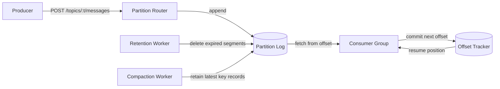

# Mini Message Queue — Specification

> **Project ID:** `16_mini_message_queue`
> **Level:** 6
> **Status:** spec-in-progress

## Overview

Mini Message Queue is a Kafka-like append-only message broker for learning how distributed log systems work. The system exposes topics split into partitions, accepts producer writes into ordered partition logs, lets consumer groups read independently, and records offsets so each group can resume, retry, and replay messages.

The project deliberately focuses on the core mechanics that make log-structured queues different from task queues: immutable ordered records, explicit offsets, retention, replay, partition-level ordering, and compaction. It is a complex capstone because correctness depends on storage layout, concurrency control, API semantics, and performance trade-offs all interacting at once.

The implementation should remain single-node unless a later extension explicitly adds replication. Replication and exactly-once semantics are catalog concepts for the broader project family, but this base specification teaches the durable single-node foundation needed before those features can be designed honestly.

## Learning Objectives

- Primary concept: log-structured message storage with partitioned ordered offsets.
- Secondary concepts: topics, partitions, producer routing, consumer groups, offset tracking, at-least-once delivery, retention, log compaction, replay, backpressure, and performance benchmarking.

## Functional Requirements

- **FR-001:** The system MUST create topics with a configured positive partition count.
- **FR-002:** The system MUST reject duplicate topic creation unless the request is explicitly idempotent and matches the existing topic configuration.
- **FR-003:** The system MUST produce messages to an existing topic and append each accepted message to exactly one partition log.
- **FR-004:** Producers MUST be able to choose a partition directly or provide a message key that deterministically maps to a partition.
- **FR-005:** Each partition MUST assign monotonically increasing zero-based offsets to appended messages.
- **FR-006:** The system MUST preserve message order within a partition.
- **FR-007:** The system MUST expose reads from a topic partition starting at a requested offset with a bounded maximum result count.
- **FR-008:** The system MUST create consumer groups for a topic and assign that group an independent offset per partition.
- **FR-009:** Consumer groups MUST track committed offsets separately from fetched messages so uncommitted messages can be redelivered.
- **FR-010:** The system MUST provide at-least-once delivery for consumer-group reads: once a message is fetched, it is not considered consumed until the consumer commits the next offset.
- **FR-011:** The system MUST allow replay from an explicit offset, even if the consumer group has a later committed offset, as long as the requested offset is still retained.
- **FR-012:** The system MUST enforce message retention by deleting or making unreadable records older than configured age or size limits.
- **FR-013:** The system MUST support log compaction for compacted topics by retaining the latest message per key while preserving offsets as stable positions.
- **FR-014:** The system MUST report topic, partition, and consumer-group metadata including beginning offset, latest offset, committed offsets, and lag.
- **FR-015:** The system MUST make accepted produce operations durable before returning success.

## Non-Functional Requirements

- **NFR-001:** Produce latency for a single message on a warm single-node process MUST be p95 `< 1ms` for a single partition under the benchmark profile.
- **NFR-002:** Sustained produce throughput for one partition MUST exceed `100,000 messages/second` under the benchmark profile.
- **NFR-003:** Consumer reads MUST be sequential and bounded-memory; reading `N` messages MUST NOT require loading the whole partition log.
- **NFR-004:** Offset commits MUST be durable and recoverable after process restart.
- **NFR-005:** The system MUST remain safe under concurrent producers writing to the same partition: offsets must be unique, ordered, and gap-free.
- **NFR-006:** Retention and compaction work MUST NOT block all producers or consumers for the whole broker.
- **NFR-007:** The API MUST return deterministic structured errors with machine-readable error codes.
- **NFR-008:** The implementation MUST expose enough metrics to benchmark append latency, read latency, throughput, retained bytes, compaction duration, and consumer lag.
- **NFR-009:** Storage format choices MUST be documented well enough to compare Go, Rust, and Node/TypeScript implementations.

## API / Interface Contract

### Endpoints

```http
POST /topics → create a topic
  Request:
    {
      "name": "orders",
      "partitions": 3,
      "retentionMs": 86400000,
      "retentionBytes": 1073741824,
      "cleanupPolicy": "delete" | "compact" | "delete,compact"
    }
  Response 201:
    {
      "topic": {
        "name": "orders",
        "partitions": 3,
        "retentionMs": 86400000,
        "retentionBytes": 1073741824,
        "cleanupPolicy": "delete"
      }
    }
  Errors: 400 invalid_topic_config, 409 topic_already_exists
```

```http
POST /topics/:topic/messages → produce a message
  Request:
    {
      "key": "customer-123",
      "value": { "orderId": "o-1", "status": "created" },
      "partition": 0,
      "headers": { "traceId": "abc" }
    }
  Notes:
    - partition is optional.
    - If partition is present, it wins over key-based routing.
    - If neither partition nor key is present, the broker may round-robin or choose partition 0, but the choice must be documented.
  Response 201:
    {
      "topic": "orders",
      "partition": 0,
      "offset": 42,
      "timestamp": "2026-06-17T00:00:00.000Z"
    }
  Errors: 400 invalid_message, 404 topic_not_found, 422 partition_out_of_range, 503 broker_unavailable
```

```http
GET /topics/:topic/partitions/:partition/messages?offset=0&limit=100 → read messages from a partition
  Response 200:
    {
      "topic": "orders",
      "partition": 0,
      "beginningOffset": 0,
      "nextOffset": 3,
      "messages": [
        {
          "offset": 0,
          "key": "customer-123",
          "value": { "orderId": "o-1", "status": "created" },
          "headers": { "traceId": "abc" },
          "timestamp": "2026-06-17T00:00:00.000Z"
        }
      ]
    }
  Errors: 400 invalid_offset_or_limit, 404 topic_or_partition_not_found, 410 offset_no_longer_retained
```

```http
POST /consumers → create or fetch a consumer group for a topic
  Request:
    {
      "groupId": "billing-service",
      "topic": "orders",
      "startFrom": "earliest" | "latest" | { "offset": 10 }
    }
  Response 201:
    {
      "groupId": "billing-service",
      "topic": "orders",
      "offsets": [
        { "partition": 0, "committedOffset": 0, "lag": 43 }
      ]
    }
  Errors: 400 invalid_consumer_group, 404 topic_not_found, 409 consumer_group_conflict
```

```http
GET /consumers/:groupId/topics/:topic/messages?limit=100 → fetch messages for a consumer group
  Response 200:
    {
      "groupId": "billing-service",
      "topic": "orders",
      "messages": [
        {
          "partition": 0,
          "offset": 42,
          "key": "customer-123",
          "value": { "orderId": "o-1", "status": "created" },
          "headers": { "traceId": "abc" },
          "timestamp": "2026-06-17T00:00:00.000Z"
        }
      ],
      "nextOffsets": [
        { "partition": 0, "nextOffset": 43 }
      ]
    }
  Errors: 400 invalid_limit, 404 consumer_group_or_topic_not_found, 410 committed_offset_no_longer_retained
```

```http
POST /consumers/:groupId/topics/:topic/offsets → commit consumer-group offsets
  Request:
    {
      "offsets": [
        { "partition": 0, "offset": 43 }
      ]
    }
  Response 200:
    {
      "groupId": "billing-service",
      "topic": "orders",
      "offsets": [
        { "partition": 0, "committedOffset": 43, "lag": 0 }
      ]
    }
  Errors: 400 invalid_offset_commit, 404 consumer_group_or_topic_not_found, 410 offset_no_longer_retained, 422 offset_out_of_range
```

```http
GET /topics/:topic → inspect topic metadata
  Response 200:
    {
      "topic": "orders",
      "partitions": [
        { "partition": 0, "beginningOffset": 0, "latestOffset": 43, "retainedBytes": 4096 }
      ],
      "cleanupPolicy": "delete"
    }
  Errors: 404 topic_not_found
```

### Data Models

```text
Topic:
  name: string (unique, non-empty, URL-safe)
  partitions: Partition[] (length >= 1)
  retentionMs: integer | null (milliseconds; null means no age-based retention)
  retentionBytes: integer | null (bytes per topic or partition; implementation must document scope)
  cleanupPolicy: enum(delete, compact, delete,compact)
  createdAt: timestamp

Partition:
  topicName: string
  id: integer (0 <= id < topic.partitions.length)
  beginningOffset: integer (lowest retained offset)
  nextOffset: integer (offset that will be assigned to the next append)
  logSegments: LogSegment[] (append-only storage units)
  retainedBytes: integer

Message:
  topicName: string
  partition: integer
  offset: integer (monotonic within partition)
  key: string | null
  value: JSON | bytes (implementation must choose and document encoding)
  headers: map<string,string>
  timestamp: timestamp assigned by broker on append
  tombstone: boolean (true when value is null on compacted topics)

ConsumerGroup:
  groupId: string (unique with topicName)
  topicName: string
  offsets: Offset[] (one per partition)
  createdAt: timestamp
  updatedAt: timestamp

Offset:
  groupId: string
  topicName: string
  partition: integer
  committedOffset: integer (next message to deliver; not the last delivered offset)
  updatedAt: timestamp
```

## Architecture

### Diagram



### Components

| Component | Responsibility |
|-----------|----------------|
| Topic Registry | Validates topic names, stores topic configs, lists partitions. |
| Partition Router | Chooses a partition from explicit partition, key hash, or documented default policy. |
| Partition Log | Appends durable messages, assigns offsets, serves bounded sequential reads. |
| Segment Store | Groups records into files or memory-mapped chunks so retention and reads do not require whole-log scans. |
| Consumer Group Service | Creates groups, initializes offsets, fetches messages from committed positions, reports lag. |
| Offset Tracker | Persists committed next offsets and restores them after restart. |
| Retention Worker | Enforces age and size limits without changing the meaning of retained offsets. |
| Compaction Worker | Rewrites compacted logs so latest record per key remains discoverable and old offsets are represented safely. |
| Metrics Recorder | Records latency, throughput, lag, retained bytes, and compaction/retention timing. |

### Design Decisions

| Decision | Alternatives | Justification |
|----------|--------------|---------------|
| Offsets are partition-local integers | Global offsets, UUID message IDs | Kafka-like systems order independently per partition; local offsets make append and replay cheaper. |
| Offset commits store the next offset to deliver | Store last consumed offset | Storing next offset avoids off-by-one ambiguity and matches replay-from-offset semantics. |
| At-least-once is the base delivery guarantee | At-most-once, exactly-once | At-least-once teaches explicit commit behavior and idempotent consumers without requiring transactions. |
| Retention can remove old offsets | Infinite log only | Real logs are bounded; consumers must handle offsets falling out of retention. |
| Compaction preserves offset identity | Renumber compacted records | Stable offsets are required for replay, lag reporting, and consumer safety. |

## Error Handling Strategy

- Errors MUST return a stable `code`, human-readable `message`, and optional `details` object.
- Client input errors map to `400 Bad Request` when the request shape is invalid.
- Missing topics, partitions, or consumer groups map to `404 Not Found`.
- Duplicate names or incompatible idempotent creates map to `409 Conflict`.
- Requests for offsets below the partition `beginningOffset` map to `410 Gone` because the data once existed but is no longer retained.
- Semantically invalid but well-formed operations, such as producing to partition `99` on a three-partition topic, map to `422 Unprocessable Entity`.
- Temporary durability, lock, or storage availability failures map to `503 Service Unavailable` and MUST NOT acknowledge a produce as successful.
- Produce acknowledgements are idempotency boundaries: if the broker returns success, the message is durable; if it returns failure or times out, the producer may retry and should expect possible duplicates unless it adds its own idempotency key extension.
- Offset commits are monotonic by default: committing an older offset than the current committed offset is rejected unless an explicit replay/reset API is added later.

## Edge Cases

- Creating a topic with `0` or negative partitions → reject with `invalid_topic_config`.
- Creating a topic with an existing name and different configuration → reject with `topic_already_exists`.
- Producing to a missing topic → reject with `topic_not_found`; no implicit topic creation.
- Producing an empty payload → accept if the message value is explicitly `null`; for compacted topics this is a tombstone.
- Producing a message larger than the configured maximum → reject with `invalid_message`.
- Producing concurrently to the same partition → serialize appends so offsets remain unique and gap-free.
- Reading from offset equal to `nextOffset` → return an empty message list with the same `nextOffset`.
- Reading from offset below `beginningOffset` after retention → reject with `offset_no_longer_retained`.
- Reading with a limit larger than the configured maximum → cap it or reject it; the chosen behavior must be documented and consistent.
- Committing an offset beyond `nextOffset` → reject with `offset_out_of_range`.
- Consumer fetch succeeds but commit fails → fetched messages must be redelivered on the next fetch, preserving at-least-once delivery.
- Retention removes a consumer group's committed offset → next group fetch must fail with `committed_offset_no_longer_retained` until the group is reset or recreated.
- Compaction sees multiple records for the same key → retain the latest record and any records needed to preserve safe offset traversal.
- Compaction sees a tombstone record → remove older records for the key and eventually remove the tombstone after the delete retention window if implemented.
- Broker restarts after acknowledged produce → acknowledged messages and next offsets must be recoverable.
- Broker restarts after offset commit → committed offsets must be recoverable.

## Acceptance Criteria

- **FR-001:** Creating a topic with `partitions: 3` returns `201` and metadata lists three partitions.
- **FR-002:** Creating the same topic twice with a different partition count returns `409`.
- **FR-003:** Producing to an existing topic returns topic, partition, offset, and timestamp.
- **FR-004:** Producing with an explicit partition stores the message in that partition; producing with the same key repeatedly maps to the same partition.
- **FR-005:** Consecutive messages in one partition receive offsets `0`, `1`, `2`, with no gaps.
- **FR-006:** Reading from offset `0` returns messages in append order for that partition.
- **FR-007:** Reading with `offset=1&limit=2` returns at most two messages beginning at offset `1`.
- **FR-008:** Creating a consumer group initializes one committed offset per partition.
- **FR-009:** Fetching messages without committing leaves the committed offset unchanged.
- **FR-010:** After a fetch without commit, the same messages are eligible for redelivery.
- **FR-011:** A direct partition read or explicit replay request from an earlier retained offset returns historical messages.
- **FR-012:** After retention advances `beginningOffset`, reads below it fail with `410`.
- **FR-013:** After compaction on a compacted topic, older records for replaced keys no longer appear in compacted reads while latest values remain readable.
- **FR-014:** Topic and consumer metadata report beginning offset, latest offset, committed offset, and lag accurately.
- **FR-015:** Restart verification shows acknowledged messages are still readable.
- **NFR-001:** Benchmark evidence shows p95 produce latency `< 1ms` for the defined single-partition profile.
- **NFR-002:** Benchmark evidence shows sustained throughput `>100,000 messages/second` for the defined single-partition profile.

## Language-Specific Notes

### Go

- Prefer explicit synchronization around per-partition append paths; compare `sync.Mutex`, channels, and batched writer goroutines.
- Use streaming encoders and buffered I/O for segment reads/writes.
- Benchmark with `testing.B`, `go test -bench`, and race checks for concurrent append safety.

### Rust

- Model partition logs with ownership boundaries that make append serialization explicit.
- Compare `tokio` async I/O against blocking file I/O with dedicated append workers.
- Use property-style tests or invariants for offset monotonicity and recovery once implementation begins.

### Node/TS

- Avoid per-message synchronous JSON/file overhead in the hot path unless benchmarked; batch or stream writes where possible.
- Make event-loop blocking visible in benchmarks because p95 latency is a core requirement.
- Define message and API schemas with runtime validation so malformed requests fail predictably.

## Dependencies

- Prerequisite projects: Projects 13-15 (`13_api_gateway_circuit_breaker`, `14_log_aggregator`, `15_metrics_collector`).
- External tools: HTTP load generator such as `k6` or `wrk`, language-native benchmark tools, and a process restart harness for durability checks.
