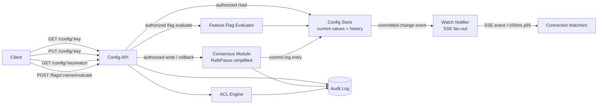

# Distributed Configuration Service — Specification

> **Project ID:** `17_distributed_config_service`  
> **Level:** 6 — Complex Systems  
> **Status:** spec-in-progress

## Overview

Build a language-neutral distributed configuration service in Go, Rust, and Node.js/TypeScript. The service stores configuration key-value pairs, applies writes through a consensus-backed log, exposes low-latency reads, lets clients watch keys for changes, preserves version history, supports rollback, enforces access control per key, and evaluates feature flags with targeting and rollout rules.

This project teaches production-grade distributed coordination. A configuration service is deceptively small at the API boundary, but it must make difficult guarantees: clients need fresh enough values, writes must not split-brain, watchers must be notified quickly without missing updates, rollbacks must be auditable, and feature flags must evaluate deterministically across nodes.

The central comparison question is: **How do watch-notification latency and consensus overhead compare?** Benchmarks and reviews should evaluate write latency under quorum, local read latency, watch notification p95/p99, leader failover behavior, version-history storage cost, ACL enforcement correctness, and implementation complexity across runtimes.

## Learning Objectives

- Primary concept: consensus-backed distributed configuration writes with observable watch/notify semantics.
- Secondary concepts: linearizable writes, low-latency reads, version history, rollback, Server-Sent Events, per-key ACLs, auditability, feature-flag targeting rules, gradual rollout, deterministic hashing, leader failover, and distributed edge-case handling.

## Functional Requirements

- **RF-001:** The service MUST store configuration entries as key-value pairs where keys are stable strings and values are JSON-compatible payloads or opaque strings.
- **RF-002:** The service MUST expose `GET /config/:key` to retrieve the current value, current version, metadata, and caller-visible permissions for a key.
- **RF-003:** The service MUST expose `PUT /config/:key` to create or update a configuration entry.
- **RF-004:** Every successful config write MUST pass through a consensus mechanism before it is acknowledged to the client.
- **RF-005:** Writes MUST be versioned with a monotonic per-key version number and a globally comparable log index or revision.
- **RF-006:** The service MUST retain version history for each key, including value, author identity, timestamp, change reason, and previous version reference.
- **RF-007:** The service MUST support rollback of a key to a previous version while recording the rollback as a new version rather than deleting history.
- **RF-008:** The service MUST expose `GET /config/:key/watch` as a Server-Sent Events stream that notifies authorized clients when the key changes.
- **RF-009:** Watch notifications MUST include key, new version, previous version, change type, log index, and enough metadata for clients to decide whether to fetch the new value.
- **RF-010:** Watchers MUST be able to resume from a known version or log index and receive missed changes that are still retained in history.
- **RF-011:** The service MUST enforce ACLs per key for at least `read`, `write`, `watch`, `rollback`, and `admin` actions.
- **RF-012:** ACL decisions MUST be evaluated before reads, writes, watches, rollbacks, and feature-flag evaluations that expose protected flag state.
- **RF-013:** The service MUST support feature flags as named resources with enabled state, default treatment, targeting rules, and gradual rollout percentage.
- **RF-014:** The service MUST expose `POST /flags/:name/evaluate` to evaluate one flag for a subject and return the selected treatment plus evaluation metadata.
- **RF-015:** Feature-flag targeting MUST support deterministic matching on subject attributes, such as user ID, tenant, region, role, or arbitrary string/number/boolean attributes.
- **RF-016:** Gradual rollout MUST use deterministic hashing so the same subject receives the same treatment for a given flag, seed, and rollout percentage across all nodes.
- **RF-017:** Feature-flag updates MUST be written through the same consensus path and version-history mechanism as configuration entries.
- **RF-018:** The service MUST emit audit records for writes, rollbacks, ACL changes, flag updates, and denied access attempts.
- **RF-019:** The service MUST expose implementation-neutral health and metrics endpoints for consensus state, read latency, write latency, watch lag, watcher count, and notification delivery outcomes.

## Non-Functional Requirements

- **RNF-001:** Local in-memory `GET /config/:key` for an authorized, existing key MUST have p95 latency **< 1 ms** under benchmark conditions, excluding client network overhead when measured in-process.
- **RNF-002:** Watch notifications for committed changes MUST be delivered to connected local watchers within **100 ms p95** after the write is committed by consensus.
- **RNF-003:** Consensus-backed writes SHOULD complete within **50 ms p95** in a healthy three-node local cluster, or the benchmark MUST document the runtime/environment bottleneck.
- **RNF-004:** Reads MUST NOT block on disk I/O or quorum consensus in the normal local-read path after the node has applied the committed log entry.
- **RNF-005:** The service MUST tolerate loss of one node in a three-node cluster while preserving write availability through quorum.
- **RNF-006:** The service MUST reject writes when quorum is unavailable rather than accepting divergent local writes.
- **RNF-007:** Watcher memory and connection resources MUST be bounded by configurable limits for total watchers, watchers per key, notification queue length, and idle timeout.
- **RNF-008:** Version history retention MUST be configurable by maximum versions per key and/or retention duration, with documented behavior when a watcher resumes from a compacted version.
- **RNF-009:** ACL enforcement overhead SHOULD add less than **100 µs p95** to local reads under benchmark conditions.
- **RNF-010:** Feature-flag evaluation SHOULD complete within **1 ms p95** for a flag with up to 20 targeting rules and 20 subject attributes under in-process benchmark conditions.
- **RNF-011:** Implementations MUST provide comparable configuration knobs across languages for cluster node ID, peer addresses, quorum size, read mode, history retention, watcher limits, notification buffer size, ACL mode, and feature-flag hash seed.
- **RNF-012:** Benchmarks MUST document node count, write/read ratio, number of watched keys, watcher fan-out, key cardinality, value size distribution, ACL complexity, feature-flag rule count, and failover scenario.

## API / Interface Contract

### Endpoints

```text
GET /config/:key -> retrieve current configuration value and metadata
  Headers:
    Authorization: bearer token or implementation-defined identity credential
  Query:
    minVersion?: integer (optional; reject stale reads below this version when unsupported)
    includeHistory?: boolean (default false; requires read access)
  Response 200:
    {
      "key": "payments.retry_limit",
      "value": { "maxRetries": 3 },
      "contentType": "application/json",
      "version": 17,
      "logIndex": 1042,
      "updatedAt": "2026-06-17T12:00:00Z",
      "updatedBy": "user:alice",
      "acl": {
        "canRead": true,
        "canWrite": false,
        "canWatch": true,
        "canRollback": false,
        "canAdmin": false
      },
      "history": [Version]
    }
  Errors: 400 invalid key or query, 401 unauthenticated, 403 read denied, 404 key not found, 409 minVersion unavailable on this node, 503 node not ready.

PUT /config/:key -> create or update a configuration value through consensus
  Headers:
    Authorization: bearer token or implementation-defined identity credential
    Idempotency-Key?: string
  Request:
    {
      "value": { "maxRetries": 4 },
      "contentType": "application/json",
      "expectedVersion": 17,
      "reason": "Increase retries after upstream instability",
      "acl": AccessControlList?
    }
  Response 200 existing key updated:
    {
      "key": "payments.retry_limit",
      "version": 18,
      "previousVersion": 17,
      "logIndex": 1048,
      "committed": true,
      "updatedAt": "2026-06-17T12:03:00Z"
    }
  Response 201 new key created:
    Body shape matches 200 with previousVersion null.
  Errors: 400 invalid payload, 401 unauthenticated, 403 write denied, 409 expectedVersion mismatch, 413 value too large, 423 key locked for administrative operation, 503 quorum unavailable, 504 consensus timeout.

GET /config/:key/watch -> watch one key for committed changes using Server-Sent Events
  Headers:
    Authorization: bearer token or implementation-defined identity credential
    Last-Event-ID?: log index or implementation-defined event cursor
  Query:
    fromVersion?: integer
    heartbeatMs?: integer
  Response 200 stream:
    Content-Type: text/event-stream
    event: config.changed
    id: 1048
    data: {
      "key": "payments.retry_limit",
      "changeType": "updated|created|rolled_back|acl_changed|deleted",
      "version": 18,
      "previousVersion": 17,
      "logIndex": 1048,
      "committedAt": "2026-06-17T12:03:00Z"
    }
  Stream events:
    config.changed, config.heartbeat, config.compacted, config.permission_revoked, config.error
  Errors before stream: 400 invalid cursor, 401 unauthenticated, 403 watch denied, 404 key not found, 409 requested version compacted, 429 watcher limit exceeded, 503 node not ready.

POST /config/:key/rollback -> roll back a key to a previous version through consensus
  Request:
    {
      "targetVersion": 12,
      "expectedCurrentVersion": 18,
      "reason": "Rollback unsafe retry change"
    }
  Response 200:
    {
      "key": "payments.retry_limit",
      "version": 19,
      "rolledBackFromVersion": 18,
      "rolledBackToVersion": 12,
      "logIndex": 1051,
      "committed": true
    }
  Errors: 400 invalid target version, 401 unauthenticated, 403 rollback denied, 404 key or version not found, 409 expectedCurrentVersion mismatch, 410 target version compacted, 503 quorum unavailable, 504 consensus timeout.

POST /flags/:name/evaluate -> evaluate a feature flag for one subject
  Headers:
    Authorization: bearer token or implementation-defined identity credential
  Request:
    {
      "subject": {
        "id": "user-123",
        "tenant": "acme",
        "region": "us-east-1",
        "role": "admin",
        "attributes": { "plan": "enterprise", "ageDays": 42 }
      },
      "context": { "requestId": "req-abc" },
      "defaultTreatment": "off"
    }
  Response 200:
    {
      "flag": "new-checkout",
      "enabled": true,
      "treatment": "on",
      "matchedRuleId": "enterprise-admins",
      "reason": "targeting_rule_match|gradual_rollout|default|flag_disabled",
      "version": 9,
      "logIndex": 991,
      "hashBucket": 23.41
    }
  Errors: 400 invalid subject or context, 401 unauthenticated, 403 evaluate denied, 404 flag not found, 503 node not ready.

GET /__config/health -> inspect service health and consensus role
  Response 200:
    {
      "status": "ok|degraded",
      "nodeId": "node-a",
      "role": "leader|follower|candidate|standalone",
      "leaderId": "node-a",
      "lastAppliedLogIndex": 1051,
      "quorumAvailable": true
    }

GET /__config/metrics -> expose implementation-neutral operational metrics
  Response 200:
    Plain text or JSON metrics including read/write latency histograms, consensus commit latency, watcher count, notification lag, ACL denials, feature-flag evaluations, rollback count, and history compaction count.
```

### Data Models

```text
ConfigEntry:
  key: string (non-empty, max 512 bytes, path-like or dot-separated allowed)
  value: json|string|bytes (max configured size)
  contentType: string (for example application/json or text/plain)
  version: integer (monotonic per key, starts at 1)
  logIndex: integer (monotonic consensus log position)
  createdAt: timestamp
  updatedAt: timestamp
  createdBy: string (authenticated principal)
  updatedBy: string (authenticated principal)
  acl: AccessControlList
  deletedAt: timestamp? (nullable tombstone marker when deletes are implemented)

Version:
  key: string
  version: integer
  logIndex: integer
  valueHash: string (stable hash of stored value)
  value: json|string|bytes? (present while retained; may be omitted after compaction)
  contentType: string
  author: string
  reason: string
  changeType: enum(created, updated, rolled_back, acl_changed, deleted)
  previousVersion: integer?
  rolledBackToVersion: integer?
  committedAt: timestamp

AccessControlList:
  key: string
  entries: AccessControlEntry[]
  inheritedFrom: string? (optional namespace or prefix policy)
  version: integer

AccessControlEntry:
  principal: string (user, service, group, role, or wildcard label)
  actions: list<enum(read, write, watch, rollback, admin, evaluate)>
  effect: enum(allow, deny)

Watcher:
  watcherId: string
  key: string
  principal: string
  connectedAt: timestamp
  lastDeliveredLogIndex: integer
  requestedFromVersion: integer?
  status: enum(active, backpressured, closed, permission_revoked)
  queueDepth: integer
  heartbeatIntervalMs: integer

FeatureFlag:
  name: string (stable unique flag name)
  description: string?
  enabled: boolean
  defaultTreatment: string
  treatments: list<string> (for example on, off, variant-a)
  targetingRules: TargetingRule[]
  rolloutPercentage: number (0.0 to 100.0)
  rolloutSeed: string (stable deterministic hash seed)
  version: integer
  logIndex: integer
  acl: AccessControlList
  createdAt: timestamp
  updatedAt: timestamp

TargetingRule:
  ruleId: string
  priority: integer (lower number evaluated first)
  attribute: string (subject field or subject.attributes key)
  operator: enum(equals, not_equals, in, not_in, contains, starts_with, ends_with, greater_than, greater_or_equal, less_than, less_or_equal, exists)
  values: list<string|number|boolean>
  treatment: string
  enabled: boolean

ConsensusRecord:
  logIndex: integer
  term: integer
  operation: enum(config_put, config_rollback, acl_update, flag_put, flag_evaluate_audit, delete)
  keyOrFlagName: string
  proposedBy: string
  committedAt: timestamp?
  quorum: list<string>
```

## Architecture

### Diagram



### Components

| Component | Responsibility |
|-----------|----------------|
| Config API | Exposes HTTP endpoints, validates input, authenticates callers, maps errors, and coordinates reads, writes, watches, rollbacks, and flag evaluation. |
| ACL Engine | Evaluates per-key and per-flag permissions for read, write, watch, rollback, admin, and evaluate actions. |
| Consensus Module | Replicates write, rollback, ACL, and feature-flag changes and commits them only after quorum agreement. |
| Config Store | Maintains current values, version history, tombstones when supported, and indexes needed for low-latency reads. |
| Watch Notifier | Converts committed store changes into ordered SSE events, manages watcher cursors, heartbeats, backpressure, and resume behavior. |
| Feature Flag Evaluator | Applies targeting rules and deterministic rollout hashing to return stable treatments for subjects. |
| Audit Log | Records security- and history-relevant events including writes, rollbacks, denied access, ACL updates, and administrative changes. |
| Metrics/Health Surface | Reports consensus role, quorum health, read/write latency, notification lag, watcher counts, ACL denials, and evaluation counters. |

### Design Decisions

| Decision | Alternatives | Justification |
|----------|--------------|---------------|
| Consensus for writes only | Consensus for all reads; eventual writes | Keeps writes safe while preserving the required <1 ms local read path after committed entries are applied. |
| Server-Sent Events for watches | WebSockets, long polling, polling only | SSE is simple, HTTP-native, ordered, reconnect-friendly, and sufficient for one-way config-change notifications. |
| Rollback as a new version | Mutating history; deleting bad versions | Preserves auditability and teaches immutable history with corrective changes. |
| Deterministic rollout hashing | Random per request; node-local assignment cache | Guarantees stable flag treatment across nodes without coordination on every evaluation. |
| Per-key ACLs | Global-only ACLs; application-side authorization | Configuration and flags often have different sensitivity levels, so access control is part of the storage contract. |
| Bounded watcher queues | Unbounded queues; drop all slow clients immediately | Bounded queues make backpressure visible while allowing controlled recovery or explicit disconnect behavior. |

## Error Handling Strategy

- Validate authentication before resource lookup when possible, but avoid leaking whether protected keys exist to unauthorized callers; implementations MAY return 403 instead of 404 for protected resources.
- Categorize errors as client input (`400`), authentication (`401`), authorization (`403`), missing resource (`404`), conflict (`409`), gone/compacted history (`410`), oversized payload (`413`), locked administrative state (`423`), rate/limit pressure (`429`), quorum or node readiness (`503`), and consensus timeout (`504`).
- Writes and rollbacks MUST be idempotent when the same `Idempotency-Key` is retried with the same payload after a client timeout.
- `expectedVersion` conflicts MUST return the current version and enough metadata for the client to retry intentionally.
- Consensus failures MUST NOT partially update the visible current value; only committed log entries may change `ConfigEntry` or `FeatureFlag` state.
- Watch streams MUST surface resumable errors as SSE `config.error` events when the stream is already open; pre-stream failures use normal HTTP error responses.
- Slow watchers MUST be marked `backpressured`; if their queue exceeds configured bounds, the service MUST close the stream with a final event that includes the last delivered cursor when possible.
- ACL changes that revoke watch permission MUST close affected watch streams with `config.permission_revoked`.
- Rollbacks to compacted versions MUST fail with `410 Gone` unless the implementation can restore from an archival store documented outside the hot-path requirements.

## Edge Cases

- Empty key or invalid key encoding -> reject with `400`; keys must be non-empty and within configured byte length.
- Missing config key -> `GET /config/:key` returns `404` for authorized callers; unauthorized callers receive `403` or a non-enumerating response policy documented by the implementation.
- Concurrent writes with the same `expectedVersion` -> only one can commit; the rest return `409` with current version metadata.
- Leader changes during write -> client may receive `503` or `504`; retry with idempotency key must not create duplicate versions.
- Quorum unavailable -> writes, rollbacks, ACL updates, and flag updates fail closed; local reads may continue from the last applied committed state if the read mode allows it.
- Follower lag -> reads requiring `minVersion` greater than the follower's applied version return `409` or redirect/proxy to a fresher node.
- Watch starts from compacted version -> reject with `409` or `410` and return the earliest available version/log index.
- Watcher disconnects before receiving a notification -> client can reconnect with `Last-Event-ID` or `fromVersion` and receive retained missed events.
- Watcher queue overflow -> close that watcher rather than blocking the consensus apply loop or global notifier.
- ACL revoked while client is connected -> subsequent reads/watches/evaluations are denied and active watches are closed.
- Rollback target equals current version -> reject as a no-op with `409` or commit a documented no-op audit record; behavior must be consistent across languages.
- Feature flag disabled -> evaluation returns the default treatment and reason `flag_disabled` without evaluating targeting rules.
- Multiple targeting rules match -> the first enabled rule by ascending priority wins.
- Gradual rollout boundary values -> 0% never includes subjects through rollout, 100% includes all subjects not captured by earlier rules.
- Missing subject ID for rollout -> reject with `400` unless the flag defines a documented fallback hashing attribute.
- Large value or flag definition -> reject with `413` before attempting consensus replication.
- Clock skew between nodes -> versions and log indexes, not wall-clock timestamps, determine ordering.

## Acceptance Criteria

- RF-001: Config entries can be created and retrieved with stable key, value, content type, version, and metadata.
- RF-002: `GET /config/:key` returns the current authorized value and hides or denies unauthorized access.
- RF-003: `PUT /config/:key` creates and updates entries with request validation and version metadata.
- RF-004: A write is not visible until it is committed through the consensus path.
- RF-005: Repeated writes to one key produce monotonic per-key versions and globally ordered log indexes.
- RF-006: Version history exposes prior values and metadata while retained.
- RF-007: Rollback creates a new version that restores the target value and references the rolled-back version.
- RF-008: `GET /config/:key/watch` opens an SSE stream for authorized watchers.
- RF-009: Watch notifications include key, version, previous version, change type, and log index.
- RF-010: A watcher can resume from a retained cursor and receive missed events in order.
- RF-011: ACLs deny and allow each required action independently per key.
- RF-012: Unauthorized reads, writes, watches, rollbacks, and evaluations are rejected before exposing protected state.
- RF-013: Feature flags store enabled state, default treatment, targeting rules, and rollout percentage.
- RF-014: `POST /flags/:name/evaluate` returns a deterministic treatment and evaluation reason.
- RF-015: Targeting rules match subject attributes according to documented operators.
- RF-016: The same subject receives stable gradual-rollout treatment across nodes for the same flag version and seed.
- RF-017: Feature-flag updates follow consensus and version-history rules.
- RF-018: Audit records exist for writes, rollbacks, ACL changes, flag updates, and denied access attempts.
- RF-019: Health and metrics endpoints expose consensus, latency, watcher, notification, ACL, and feature-flag counters.
- RNF-001/RNF-002: Benchmarks demonstrate local read p95 <1 ms and watch notification p95 <100 ms under documented conditions.

## Language-Specific Notes

### Go

- Use `net/http` for API and SSE streaming; keep watch fan-out explicit with goroutines, channels, bounded buffers, and context cancellation.
- Model consensus with a small in-project Raft-like module or an intentionally simplified interface rather than hiding the lesson behind a large framework.
- Protect current-value indexes with `sync.RWMutex`, `atomic` snapshots, or copy-on-write maps so local reads remain below the latency target.

### Rust

- Use an async HTTP stack such as Axum or Hyper for API and SSE; model watcher lifecycle with bounded channels and cancellation-safe tasks.
- Represent consensus log entries and config/flag state with strongly typed enums and structs so invalid operations are hard to encode.
- Prefer immutable snapshots or `Arc`-shared read views for the low-latency read path; use careful locking boundaries around history mutation and watcher fan-out.

### Node/TS

- Use a minimal HTTP framework or Node HTTP primitives with explicit SSE handling; avoid framework behavior that obscures stream backpressure.
- Type request/response contracts and data models with TypeScript interfaces or schemas so config values, ACLs, and flag rules remain explicit.
- Use deterministic hashing and event-loop-friendly fan-out; avoid blocking JSON/history processing on the same path that delivers watcher notifications.

## Dependencies

- Prerequisite projects: Projects 13-15 from the curriculum catalog.
- Conceptual prerequisites: Project 10 distributed cache, Project 12 distributed job scheduler, Project 13 circuit breaker, Project 14 observability/logging, and Project 15 metrics.
- External tools: local multi-process runner or Docker Compose for cluster simulation, HTTP load generator such as k6 or autocannon, and language-specific benchmark tooling.
