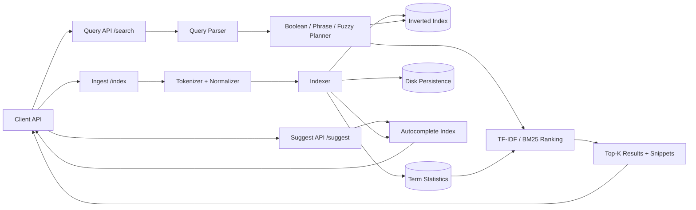

# Search Engine — Specification

> **Project ID:** `18_search_engine`  
> **Level:** 6 — Complex Systems  
> **Status:** spec-in-progress

## Overview

Build a small full-text search engine that can ingest documents, tokenize and normalize text, build an inverted index, rank matching documents, and serve search and autocomplete requests through a stable HTTP API. The system must support boolean query operators, phrase matching, fuzzy matching, incremental index updates, and disk persistence so an index can survive process restart.

This project teaches the core mechanics behind information retrieval systems. Learners should see how raw text becomes searchable terms, how postings lists connect terms to documents, why ranking needs corpus statistics, and how query parsing changes both correctness and performance. The implementation should remain language-neutral so Go, Rust, and Node.js/TypeScript implementations can be compared on index build time, memory usage, persistence strategy, and query latency.

The search engine is not required to match production systems such as Lucene or Elasticsearch. It should be intentionally scoped to a single-node engine with clear module boundaries, deterministic behavior, and enough instrumentation to compare inverted-index construction and top-k retrieval across different corpus sizes.

## Learning Objectives

- Primary concept: building and querying an inverted index for full-text retrieval.
- Secondary concepts: tokenization, normalization, postings lists, term/document statistics, TF-IDF ranking, BM25 ranking, boolean query parsing, phrase queries, edit-distance fuzzy search, prefix-based autocomplete, incremental indexing, and index persistence.

## Functional Requirements

- **FR-001:** The system must accept document indexing requests containing one or more documents with stable IDs, text content, and optional metadata.
- **FR-002:** The system must tokenize document text into searchable terms using deterministic Unicode-aware lowercasing, punctuation handling, whitespace splitting, and configurable stop-word removal.
- **FR-003:** The tokenizer must preserve token positions per document so phrase search and proximity-sensitive ranking can be implemented.
- **FR-004:** The indexer must build an inverted index mapping each normalized term to a postings list of document IDs, term frequencies, and token positions.
- **FR-005:** The indexer must maintain corpus-level term statistics, including document frequency, total term frequency, average document length, and total indexed document count.
- **FR-006:** The search API must return ranked top-k results using either TF-IDF or BM25, with BM25 as the default ranking strategy.
- **FR-007:** Search requests must support explicit ranking strategy selection between `tf_idf` and `bm25`.
- **FR-008:** The query parser must support single-term queries, multi-term queries, parentheses, and boolean operators `AND`, `OR`, and `NOT`.
- **FR-009:** Boolean query evaluation must respect operator precedence: parentheses first, then `NOT`, then `AND`, then `OR`.
- **FR-010:** Phrase search must support quoted phrases, such as `"distributed cache"`, and only match documents containing the phrase terms in adjacent positions and order.
- **FR-011:** Fuzzy search must support approximate term matching using a bounded edit distance for misspellings, with a configurable maximum distance of 0, 1, or 2.
- **FR-012:** Autocomplete must return suggested indexed terms or phrases for a query prefix through `GET /suggest?q=`.
- **FR-013:** Incremental index updates must allow existing documents to be added, replaced, and deleted without rebuilding the full corpus index.
- **FR-014:** Re-indexing a document with an existing ID must replace the previous document content, postings, positions, and document-length statistics atomically from the client's perspective.
- **FR-015:** Deleting a document must remove it from postings lists, document storage, autocomplete structures, and corpus statistics used for ranking.
- **FR-016:** The index must be persisted to disk in a deterministic format and loaded on startup without requiring the original source documents to be re-submitted.
- **FR-017:** Search responses must include document ID, score, matched terms, optional metadata, and short snippets with highlighted matching terms when possible.
- **FR-018:** The system must expose enough index metadata to validate corpus size, unique term count, document count, and ranking statistics during benchmarking.

## Non-Functional Requirements

- **NFR-001:** A fresh index build must process 10,000 documents in less than 30 seconds on the project benchmark machine and corpus.
- **NFR-002:** Search latency for top-10 results must be under 50 ms p95 for warm in-memory queries over a 10,000-document index.
- **NFR-003:** Autocomplete latency must be under 20 ms p95 for prefix suggestions over the same 10,000-document index.
- **NFR-004:** Incremental add, replace, or delete operations for a single document should complete in under 100 ms p95 excluding disk flush time.
- **NFR-005:** Query parsing and evaluation must be deterministic; the same index and query must produce the same ranked result order, including stable tie-breaking by document ID.
- **NFR-006:** Index persistence must be crash-safe enough that a partially written index file is not mistaken for a valid complete index on startup.
- **NFR-007:** The system must avoid unbounded memory growth by compacting or removing empty postings lists after deletions.
- **NFR-008:** Public APIs must return structured JSON errors with stable machine-readable error codes.
- **NFR-009:** The implementation must expose benchmark-relevant metrics for index build duration, loaded document count, unique term count, index byte size, and query latency.
- **NFR-010:** Implementations must remain single-node and language-neutral; external search engines, hosted databases, or Lucene-like libraries must not be used as the core index.

## API / Interface Contract

All endpoints exchange JSON. Query strings are UTF-8. Durations are reported in milliseconds. `limit` defaults to 10 and must be capped by the implementation.

### Endpoints

```text
POST /index -> add, replace, or delete documents in the index
  Request:
    {
      "mode": "upsert | replace | delete",
      "documents": [
        {
          "id": "string",
          "title": "string | null",
          "body": "string",
          "metadata": object
        }
      ],
      "commit": true
    }
  Response 200:
    {
      "accepted": number,
      "indexed": number,
      "deleted": number,
      "replaced": number,
      "failed": [{ "id": "string", "error": ErrorInfo }],
      "document_count": number,
      "unique_terms": number
    }
  Errors: 400 invalid_index_request, 413 document_too_large, 422 invalid_document, 500 index_update_failed

POST /search?q={query} -> parse and execute a search query
  Query parameters:
    q: string (required)
    limit: number (optional, default 10)
    offset: number (optional, default 0)
    ranking: tf_idf | bm25 (optional, default bm25)
    fuzzy: none | auto | 1 | 2 (optional, default none)
  Request body (optional):
    {
      "filters": object,
      "include_snippets": true,
      "highlight": true
    }
  Response 200:
    {
      "query": "string",
      "parsed_query": QueryNode,
      "ranking": "tf_idf | bm25",
      "took_ms": number,
      "total_hits": number,
      "results": [SearchResult]
    }
  Errors: 400 missing_query, 422 invalid_query_syntax, 422 unsupported_query_operator, 500 search_failed

GET /suggest?q={prefix} -> return autocomplete suggestions for a prefix
  Query parameters:
    q: string (required prefix)
    limit: number (optional, default 10)
  Response 200:
    {
      "query": "string",
      "suggestions": [
        { "text": "string", "type": "term | phrase", "score": number, "document_frequency": number }
      ]
    }
  Errors: 400 missing_query, 422 prefix_too_short, 500 suggest_failed
```

## Data Models

```text
Document:
  id: string (stable unique identifier)
  title: string | null
  body: string (non-empty searchable text)
  metadata: object (JSON-serializable, optional filter/display data)
  length: number (token count after normalization)
  version: number (monotonic per document update)
  indexed_at: timestamp

InvertedIndex:
  terms: map<string, PostingList>
  documents: map<string, Document>
  term_stats: map<string, TermStat>
  document_count: number
  total_document_length: number
  average_document_length: number
  autocomplete_terms: prefix-search structure
  persisted_version: string

Posting:
  document_id: string
  term_frequency: number
  positions: number[] (zero-based token offsets)
  field: title | body
  document_version: number

PostingList:
  term: string
  postings: Posting[] (sorted by document_id or internal document ordinal)
  document_frequency: number
  total_term_frequency: number

TermStat:
  term: string
  document_frequency: number
  total_term_frequency: number
  inverse_document_frequency: number
  max_term_frequency: number

QueryNode:
  type: term | phrase | and | or | not
  value: string | null
  children: QueryNode[]
  fuzzy_distance: number | null

SearchResult:
  document_id: string
  score: number
  title: string | null
  metadata: object
  matched_terms: string[]
  snippets: string[]

ErrorInfo:
  code: string
  message: string
  details: object | null
```

## Architecture

### Diagram



### Components

| Component | Responsibility |
|-----------|----------------|
| Ingest API | Validates document update requests and coordinates add, replace, delete, and commit behavior. |
| Tokenizer | Converts document text and query text into normalized tokens with positions. |
| Indexer | Builds and mutates postings lists, document storage, term statistics, and autocomplete structures. |
| Inverted Index | Stores term-to-postings mappings used by boolean, phrase, fuzzy, and ranked retrieval. |
| Query Parser | Parses query strings into an explicit query tree with boolean operators, phrases, and fuzzy flags. |
| Query Planner | Evaluates query trees against postings lists and applies phrase/fuzzy constraints. |
| Ranking Engine | Scores candidate documents using TF-IDF or BM25 and returns deterministic top-k ordering. |
| Autocomplete Engine | Serves prefix suggestions from indexed terms and optional common phrases. |
| Persistence Layer | Saves and loads documents, postings, term stats, and metadata using crash-safe file replacement. |
| Metrics Collector | Records build duration, index size, document counts, unique terms, and query timing. |

### Design Decisions

| Decision | Alternatives | Justification |
|----------|-------------|---------------|
| Use a custom in-process inverted index | External search engines, relational database full-text search | Keeps the project focused on information retrieval internals and enables language comparisons. |
| Preserve token positions in postings | Store only term frequency | Phrase search requires positional postings, and positions also support better snippets. |
| Default to BM25 ranking | TF-IDF only, raw term frequency | BM25 is a standard baseline for modern lexical retrieval while TF-IDF remains useful for comparison. |
| Persist snapshots with atomic replacement | Append-only log only, no persistence | Snapshot persistence is simpler for learners while still teaching restart safety and index serialization. |
| Support incremental updates | Full rebuild after every change | Real search systems must update indexes without rebuilding the entire corpus. |

## Error Handling Strategy

- Request validation errors return 400 or 422 with `ErrorInfo.code`, `message`, and optional field-level `details`.
- Query syntax errors return 422 and must identify the invalid token, unmatched quote, unmatched parenthesis, or unsupported operator where possible.
- Index update failures must not leave the in-memory index half-mutated for a single document; failed documents are reported individually in the `/index` response.
- Persistence should write to a temporary file and atomically rename it into place after checksum or version metadata is complete.
- Startup must reject missing, corrupt, incompatible, or partially written index files with explicit errors and must not silently serve an incomplete index.
- Search over an empty but valid index returns 200 with `total_hits: 0`; it is not an error.
- Idempotent upsert of identical document content should produce the same searchable state even if repeated.

## Edge Cases

- Empty document body -> reject with `invalid_document` unless a non-empty title is configured as searchable text.
- Empty query or whitespace-only query -> return `missing_query`.
- Query containing only stop words -> return zero hits with a warning field or structured `no_searchable_terms` detail.
- Unmatched quote in phrase search -> return `invalid_query_syntax`.
- Unmatched or misordered parentheses -> return `invalid_query_syntax`.
- `NOT` without a positive matching clause, such as `NOT cache`, -> return a bounded result according to documented semantics or reject as `unsupported_query_operator`; implementations must choose and document one behavior consistently.
- Duplicate document IDs in the same `/index` request -> process deterministically or reject with `duplicate_document_id`.
- Replacing a document must remove stale terms that no longer appear in the new version.
- Deleting a missing document ID -> succeed as a no-op and report it separately, or return a stable not-found error; implementations must document the chosen behavior.
- Very common terms with huge postings lists -> ranking and top-k selection must avoid returning unsorted or nondeterministic results.
- Fuzzy search for very short terms -> cap or reject high edit distances to avoid excessive candidate expansion.
- Autocomplete prefix shorter than the configured minimum -> return `prefix_too_short`.
- Corrupt persisted index on startup -> fail fast with a clear error rather than rebuilding from absent source documents.
- Unicode text with accents, emoji, or non-Latin scripts -> tokenize deterministically and document any normalization limitations.

## Acceptance Criteria

- **FR-001:** Submitting valid documents through `POST /index` increases the indexed document count and makes the documents searchable by their terms.
- **FR-002:** Known punctuation, casing, and whitespace examples produce deterministic normalized tokens.
- **FR-003:** A phrase query only matches when token positions are adjacent and ordered.
- **FR-004:** Inspecting or exercising the index shows terms mapped to postings with document IDs, term frequencies, and positions.
- **FR-005:** Corpus statistics update after add, replace, and delete operations.
- **FR-006:** Search returns top-k results ordered by the selected ranking score with deterministic tie-breaking.
- **FR-007:** The same query can be run with `tf_idf` and `bm25`, and the response identifies the ranking strategy used.
- **FR-008:** Boolean queries with `AND`, `OR`, `NOT`, and parentheses produce the expected matching document sets.
- **FR-009:** Operator precedence is observable through queries where precedence changes the result set.
- **FR-010:** Quoted phrases match exact adjacent token sequences only.
- **FR-011:** Fuzzy search finds configured near matches and does not expand beyond the maximum edit distance.
- **FR-012:** `GET /suggest?q=` returns ranked prefix suggestions from indexed vocabulary.
- **FR-013:** Adding, replacing, and deleting individual documents changes subsequent search results without a full rebuild.
- **FR-014:** Re-indexing the same document ID removes stale terms from the old version.
- **FR-015:** Deleted documents no longer appear in postings, suggestions, or search results.
- **FR-016:** After persisting and restarting, search results remain available without re-submitting source documents.
- **FR-017:** Search results include IDs, scores, matched terms, metadata, and snippets when requested.
- **FR-018:** Benchmark or status output exposes document count, unique terms, index size, and timing data.
- **NFR-001:** Benchmark evidence shows 10,000 documents indexed in under 30 seconds.
- **NFR-002:** Benchmark evidence shows p95 top-10 query latency under 50 ms on a warm 10,000-document index.

## Language-Specific Notes

### Go
- Prefer standard-library HTTP and explicit data structures for postings lists, term stats, and persistence.
- Use goroutines carefully for batch indexing, but keep mutation boundaries clear to avoid races in shared index state.

### Rust
- Model index structures with ownership-friendly maps and vectors; make serialization and atomic snapshot writes explicit.
- Favor iterators and sorted postings operations for query evaluation while preserving clear benchmark instrumentation.

### Node/TS
- Keep tokenization, parsing, and ranking pure where possible so behavior is easy to test and benchmark.
- Avoid hiding core index behavior behind third-party search packages; the inverted index must be implemented directly.

## Dependencies

- Prerequisite projects: Projects 13-15.
- External tools: benchmark runner, representative text corpus generator or fixture corpus, and standard HTTP client tooling for API verification.
