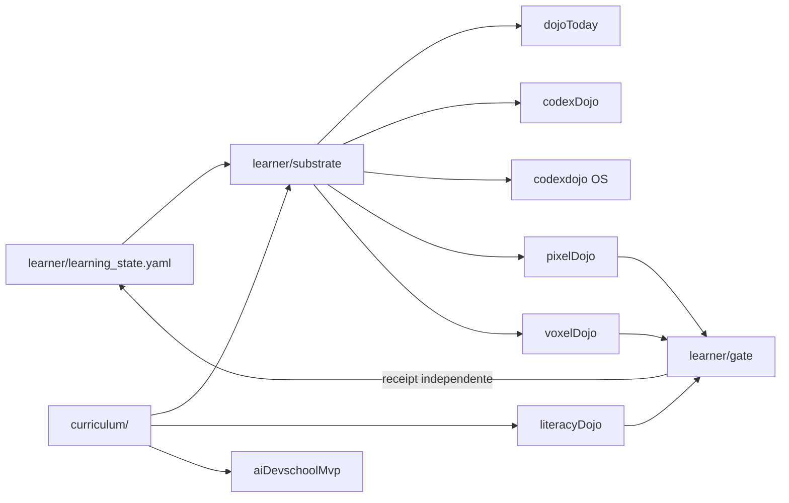

# Manual de Uso e Melhores Práticas do AI DevSchool

> Manual operacional do checkout atual. Os READMEs de cada engine continuam sendo a
> autoridade para detalhes locais; este documento explica como instalar, escolher,
> executar, validar e manter o ecossistema completo.

## 1. O que é o projeto

O AI DevSchool segue a ideia **“one learner, one curriculum, many engines”**:

- `learner/learning_state.yaml` é a fonte canônica do estado do aprendiz;
- `curriculum/` contém as trilhas e projetos;
- `learner/substrate/` valida o estado e gera projeções para as interfaces;
- `learner/gate/` verifica evidências de forma independente;
- `engines/` contém superfícies autônomas para públicos e experiências diferentes.



### Hierarquia de verdade

Quando documentos divergirem, use esta ordem:

1. código, schemas e testes do componente;
2. `learner/learning_state.yaml` para estado do aprendiz;
3. `curriculum/catalog.md` e catálogos locais para currículo;
4. contratos em `docs/design/`;
5. README local do engine;
6. handbook e este manual;
7. planos, auditorias e arquivos históricos.

`ready`, `completed` e `mastered` não são sinônimos:

- `ready`: conteúdo existe e passa seu contrato;
- `completed`: atividade local foi concluída;
- `mastered`: evidência passou por verificador independente e o gate promoveu o estado.

## 2. Pré-requisitos

### Obrigatórios para o núcleo

- Git;
- Python **3.11 ou superior**;
- Node.js **20 ou superior**;
- `uv` para preparar o ambiente Python;
- `pnpm` 9 para workspaces que possuem `pnpm-lock.yaml`.

### Opcionais

- Go 1.22+ para o piloto `01_rate_limiter/go-impl`;
- Rust stable com `rustfmt` e `clippy` para o piloto Rust;
- Chromium do Playwright para smoke/e2e;
- Hermes Agent, OpenClaw ou Claude Code apenas para engines que integram essas plataformas.

## 3. Instalação inicial

Na raiz do repositório:

```bash
./setup.sh
source .venv/bin/activate
python -m pytest -q
```

A raiz não é um workspace Node e não contém `package.json`. Não execute
`npm install` ou `pnpm install` nela; instale cada engine no próprio diretório.

Alternativa explícita com `uv`:

```bash
uv venv --python 3.11 .venv
uv pip install --python .venv/bin/python -e ".[dev]"
source .venv/bin/activate
```

### Regra importante sobre o ambiente Python

Ative `.venv` **antes** de iniciar `codexdojo-os`, `literacyDojo` ou
`dojoToday`. Esses engines chamam verificadores/geradores por `python3`; o
executável resolvido pelo `PATH` precisa ter `pyyaml` e `fsrs`.

Não hardcode caminhos como `/usr/local/bin/python3` em scripts. O mesmo checkout
deve funcionar em Linux, macOS e CI.

### Instalação de dependências JavaScript

Use o gerenciador indicado pelo lockfile:

```bash
# apps npm
cd engines/codexdojo-os-prototype && npm ci
cd engines/literacyDojo && npm ci
cd engines/dojoToday && npm ci

# workspaces pnpm
cd engines/codexDojo && pnpm install --frozen-lockfile
cd engines/pixelDojo && pnpm install --frozen-lockfile
cd engines/voxelDojo && pnpm install --frozen-lockfile
cd engines/miniTown && pnpm install --frozen-lockfile
```

Para desenvolvimento cotidiano, `npm install`/`pnpm install` é aceitável quando a
intenção é atualizar dependências. Em CI e verificação de release, prefira
`npm ci` e `pnpm install --frozen-lockfile`.

## 4. Qual superfície usar

| Objetivo | Superfície | Diretório |
| --- | --- | --- |
| Aprender fundamentos práticos de IA sem programar | LiteracyDojo | `engines/literacyDojo` |
| Explorar uma cidade cozy 3D sem avaliação | MiniTown | `engines/miniTown` |
| Ver a missão/revisão de hoje | DojoToday | `engines/dojoToday` |
| Usar uma jornada educacional integrada | CodexDojo OS | `engines/codexdojo-os-prototype` |
| Acompanhar o ecossistema em dashboard | CodexDojo | `engines/codexDojo` |
| Jogar uma tentativa 2D/PixelQuest | PixelDojo | `engines/pixelDojo` |
| Explorar conceitos em simulações Three.js | VoxelDojo | `engines/voxelDojo` |
| Avaliar a skill experimental C01–C24 | aiDevschoolMvp | `engines/aiDevschoolMvp` |
| Validar o core de referência Ágora | minimaxDojo | `engines/minimaxDojo` |
| Orquestrar o ciclo Spec→Optimize | miniMaxEvolutionEngine | `engines/miniMaxEvolutionEngine` |
| Simular o runner de cinco fases | OpenClaw engine | `engines/openclaw` |

## 5. Uso por engine

### 5.1 Learner Substrate

Sempre edite a fonte canônica primeiro e depois regenere:

```bash
source .venv/bin/activate
python -m learner.substrate
python -m pytest -q learner/substrate/tests
```

Projeções geradas incluem `.mavis/learning_state.yaml`, whiteboards, snapshots do
CodexDojo/OS, DojoToday e slices de revisão Pixel/Voxel. Não edite esses arquivos
manualmente.

O campo `workspace` da projeção MAVIS é relativo (`.`), para que o output seja
reprodutível em qualquer checkout.

### 5.2 DojoToday

```bash
source .venv/bin/activate
cd engines/dojoToday
npm ci
npm run selfcheck
npm run dev
```

Validação:

```bash
npm run selfcheck
npm run lint
npm run build
```

`prebuild` regenera as projeções do substrato. O app é read-only: não agenda,
não avalia e não marca domínio.

### 5.3 LiteracyDojo

```bash
source .venv/bin/activate
cd engines/literacyDojo
npm ci
npm run gen:content
npm run dev
```

Validação:

```bash
npm run lint
npm run test
npm run build
npx playwright install chromium  # primeira execução
npm run test:e2e
npm audit --audit-level=moderate
```

Regras:

- edite lições em `curriculum/ai-literacy/`, nunca em
  `src/data/generated/lessons.ts`;
- mantenha feedback determinístico no caminho principal;
- não persista texto livre/respostas do usuário em evidência ou analytics;
- a aplicação registra no máximo `completed`; o verifier decide promoção.

### 5.4 MiniTown

MiniTown é uma cidade **3D em Three.js**, não um canvas 2D.

```bash
cd engines/miniTown
pnpm install --frozen-lockfile
pnpm dev
```

Validação:

```bash
pnpm lint
pnpm test
pnpm typecheck
pnpm build
pnpm exec playwright install chromium  # primeira execução
pnpm smoke
```

É uma superfície observacional Level 0. Não emite mastery e não altera estado
canônico.

### 5.5 CodexDojo Dashboard

```bash
cd engines/codexDojo
pnpm install --frozen-lockfile
pnpm dev
```

Validação:

```bash
pnpm lint
pnpm test
pnpm build
```

Trate módulos em `src/data/learner.ts` como projeções quando marcados como
gerados.

### 5.6 CodexDojo OS

```bash
source .venv/bin/activate
cd engines/codexdojo-os-prototype
npm ci
npm run dev
```

Validação rápida:

```bash
npm run lint
npm run test
npm run build
```

Validação integrada no navegador:

```bash
npx playwright install chromium  # primeira execução
npm run test:smoke
```

O smoke integrado é longo e inicia servidores em várias portas. Não execute em
paralelo com smokes de LiteracyDojo, PixelDojo ou VoxelDojo. O bridge executa
verificadores Python reais; por isso o ambiente raiz precisa estar ativo.

### 5.7 PixelDojo

```bash
cd engines/pixelDojo
pnpm install --frozen-lockfile
pnpm --filter pixel-quest dev
```

Validação:

```bash
pnpm lint
pnpm test
pnpm typecheck
pnpm build
pnpm smoke
```

O jogo produz evidência bruta; não escreve `mastered` nem altera
`learner/learning_state.yaml`.

### 5.8 VoxelDojo

```bash
cd engines/voxelDojo
pnpm install --frozen-lockfile
pnpm dev:catalog
# ou um jogo específico:
pnpm --filter game-10-hash-ring dev
```

Validação:

```bash
pnpm lint
pnpm test
pnpm typecheck
pnpm build
pnpm smoke
```

Cada jogo deve manter domínio/simulação headless-testável e deixar Three.js
apenas como projeção visual. Não use a quantidade de diretórios como afirmação
de cobertura pedagógica; consulte `docs/GAP_ANALYSIS.md` e o contrato de teaching
games.

### 5.9 minimaxDojo e OpenClaw runner

```bash
# raiz
make test-core
python -m pytest -q engines/openclaw/tests
python -m engines.openclaw --phase spec --project curriculum/01_rate_limiter --mode simulate
```

O core MiniMaxDojo é uma implementação de referência, não um servidor que inicia
14 agentes. O OpenClaw é um runner file-based de checklist: comprova presença,
tamanho mínimo e sequência dos artefatos, mas não compila, revisa nem demonstra
correção semântica ou mastery. O produtor e o verificador devem usar contextos
separados; nunca promova fase ou mastery com base apenas na resposta do modelo.

### 5.10 miniMaxEvolutionEngine e supervisor

Comece sempre por uma leitura sem efeitos:

```bash
python -m engines.miniMaxEvolutionEngine.supervisor status
```

Operação supervisionada:

```bash
python -m engines.miniMaxEvolutionEngine.supervisor tick
python -m engines.miniMaxEvolutionEngine.supervisor poll --interval-seconds 5
```

Autonomia é opt-in, fail-closed e atualmente limitada à transição de spec:

```bash
python -m engines.miniMaxEvolutionEngine.supervisor autonomous-status
AIDEVSCHOOL_AUTONOMOUS_KILL=1 \
  python -m engines.miniMaxEvolutionEngine.supervisor poll --autonomous
```

Não edite ledger, lease ou outbox manualmente. Após interrupção, rode `status` e
use os comandos explícitos de recovery descritos no README do engine.

### 5.11 aiDevschoolMvp (skill instalável)

Este pacote mantém estado/ledger próprios e é um contexto experimental separado,
não uma projeção integrada do learner substrate compartilhado.

Valide sem efeitos antes de instalar:

```bash
python -m engines.aiDevschoolMvp.aidevschool.install --help
python -m engines.aiDevschoolMvp.aidevschool.install --check
python -m pytest -q engines/aiDevschoolMvp/tests
```

A instalação real copia skill/runtime, cria estado e registra revisão recorrente
na plataforma detectada:

```bash
python -m engines.aiDevschoolMvp.aidevschool.install
```

Só rode a instalação após revisar os efeitos. Depois, confirme:

```bash
hermes skills list && hermes cron list
# ou
openclaw skills list && openclaw cron list
```

Não edite `state.json`, `plan.json` ou `ledger.jsonl` à mão; use os scripts
determinísticos empacotados pela skill.

## 6. Projetos do currículo

A trilha ativa é Node-first nos projetos 01–18. Cada implementação possui seu
próprio `package.json`:

```bash
cd curriculum/05_websocket_chat/node-impl
npm install --no-package-lock
npm run lint
npm run test
npm run build
```

No projeto 01 também existem pilotos Go e Rust:

```bash
cd curriculum/01_rate_limiter/go-impl
go test ./...

cd ../rust-impl
cargo fmt --check
cargo clippy --all-targets -- -D warnings
cargo test
```

Não trate implementações históricas removidas ou documentos do Polyglot Arena
como runtime ativo.

## 7. Estratégia de testes

### Check rápido antes de commit

```bash
source .venv/bin/activate
python -m pytest -q
git diff --check
```

No engine alterado, execute sempre `lint + test + build/typecheck` com o comando
local.

### Check de release

1. ambiente limpo e dependências instaladas pelo lockfile;
2. `python -m learner.substrate` se estado/currículo mudou;
3. suíte Python raiz;
4. lint, testes e build de cada engine afetado;
5. smoke/e2e real para mudanças de jornada, bridge, render ou evidência;
6. `npm audit` nos apps npm alterados;
7. `git diff --check` e inspeção de todos os arquivos gerados;
8. CI remoto verde no SHA publicado.

### Smokes devem ser serializados

Os Playwright configs usam portas fixas e alguns testes do OS sobem engines
locais. Execute nesta ordem:

1. `codexdojo-os-prototype: npm run test:smoke`;
2. `literacyDojo: npm run test:e2e`;
3. `miniTown: pnpm smoke`;
4. `pixelDojo: pnpm smoke`;
5. `voxelDojo: pnpm smoke`.

Paralelizar essas famílias pode produzir “port already used” sem defeito no app.

## 8. Melhores práticas

### Estado e projeções

- Edite apenas a fonte canônica e regenere views.
- Revise o diff gerado; paths absolutos, timestamps inesperados e conteúdo local
  são sinais de não determinismo.
- Nunca converta `completed` em `mastered` na UI.
- Evidência deve apontar para artefatos executáveis e verificáveis.

### Código

- Prefira módulos simples e contratos explícitos; não crie abstração sem segundo
  caso real.
- Em TypeScript `NodeNext`, imports relativos usam extensão de runtime `.js`.
- Injete relógio/RNG em lógica determinística e mantenha render separado do
  domínio.
- Ao corrigir bug, reproduza primeiro, adicione regressão e repita a suíte
  específica antes da suíte completa.

### Dependências e segurança

- Não ignore alertas `npm audit` em ferramentas que abrem servidores locais.
- Não rode `npm audit fix --force` cegamente; atualize versões explícitas e
  execute testes/build/e2e.
- Não versione chaves, tokens, `.env`, estado operacional ou dados pessoais.
- Configuração de tutor BYOK permanece local; não envie chave para evidência ou
  telemetria.
- Instalação de skill, criação de cron e modo autônomo são efeitos explícitos,
  nunca etapas implícitas de `--help` ou validação.

### Git e CI

- Trabalhe em branch; não desenvolva diretamente em `main`.
- Commits pequenos e temáticos; não misture artefatos gerados sem revisar.
- Não declare “funciona” apenas porque build passou: valide a jornada real quando
  a mudança for de UI/integração.
- CI de PR é bloqueante para Python, engines TypeScript e os pilotos Go/Rust.

## 9. Troubleshooting

### `ModuleNotFoundError: yaml` ou `fsrs`

```bash
cd <raiz-do-repo>
source .venv/bin/activate
python -c "import yaml, fsrs; print('ok')"
```

### Bridge do OS retorna 422 nos testes

Confirme que `python3` resolve para `.venv/bin/python3`:

```bash
which python3
python3 -c "import yaml, fsrs"
```

### `python3` absoluto não existe

Scripts ativos devem usar `python3` do `PATH`. Não crie symlink global para
contornar; ative o ambiente e corrija o script portátil.

### Playwright sem browser

```bash
npx playwright install chromium
```

Em Linux mínimo pode ser necessário instalar dependências do browser conforme a
documentação do Playwright.

### `port already used`

Não mate processos às cegas. Identifique primeiro:

```bash
ss -ltnp
```

Espere a suíte anterior encerrar ou finalize apenas o servidor pertencente ao
checkout. Não rode os smokes integrados em paralelo.

### Bundle Three.js acima de 500 kB

É warning de desempenho, não falha de build. Antes de adicionar bibliotecas,
considere imports menores, lazy loading e `manualChunks`; valide que a mudança
realmente reduz o bundle e não quebra o smoke.

### Cargo não entende lockfile v4

Use Rust stable recente. A toolchain antiga 1.75 não lê o formato atual:

```bash
rustup update stable
rustup component add rustfmt clippy
```

## 10. Referências

- [Visão do produto](VISION.md)
- [Arquitetura da documentação](DOCUMENTATION.md)
- [Handbook](handbook/README.md)
- [Contrato do substrato](../learner/substrate/interface.md)
- [Gate independente](../learner/gate/README.md)
- [Contrato de teaching games](design/teaching-game-contract.md)
- [Contrato AI Literacy](design/ai-literacy/README.md)
