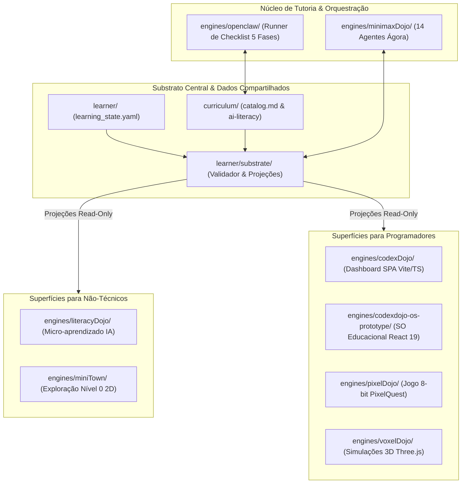
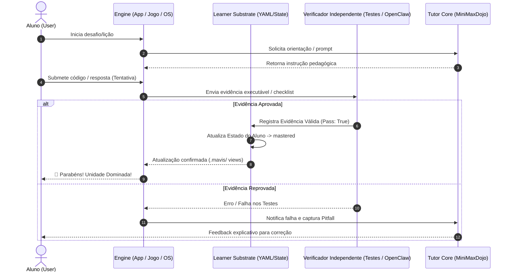
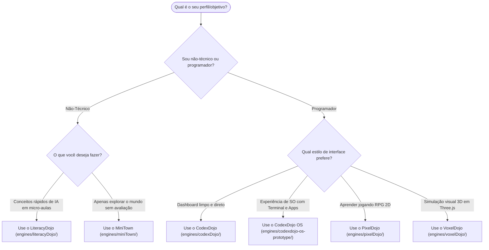

# Manual de Uso e Arquitetura do Ecossistema `aidevschool`

---

## 1. Resumo Executivo: O que foi Entregue e Realmente Funciona

O ecossistema `aidevschool` opera sob o princípio fundamental: **"One learner, one curriculum, many engines"** (Um aluno, um currículo compartilhado, múltiplos motores de aplicação).

Abaixo está o inventário de todas as soluções **entregues, auditadas e empiricamente testadas**:

| Solução / Engine | Público-Alvo | Localização | Status Empírico | Testes Passados | Comando Principal |
| --- | --- | --- | --- | --- | --- |
| **Learner Substrate** | Todos os Engines | `learner/` e `learner/substrate/` | **PASS (100%)** | 81 testes Python | `python3 -m learner.substrate` |
| **MiniMaxDojo Core** | Tutoria IA (14 agentes) | `engines/minimaxDojo/` | **PASS (100%)** | 73 testes Python | `make test-core` |
| **OpenClaw Runner** | Automação / Avaliação | `engines/openclaw/` | **PASS (100%)** | 18 testes Python | `python3 -m pytest engines/openclaw/tests/` |
| **CodexDojo Dashboard** | Programadores / Alunos | `engines/codexDojo/` | **PASS (100%)** | 88 testes Vitest + Build OK | `cd engines/codexDojo && pnpm dev` |
| **CodexDojo OS Prototype** | Programadores / Alunos | `engines/codexdojo-os-prototype/` | **PASS (100%)** | 124 testes Vitest + Build OK | `cd engines/codexdojo-os-prototype && npm run dev` |
| **LiteracyDojo** | Não-Técnicos (Micro-aulas) | `engines/literacyDojo/` | **PASS (100%)** | 68 testes Vitest + 17 lições validadas + Build OK | `cd engines/literacyDojo && npm run dev` |
| **MiniTown** | Não-Técnicos (Nível 0) | `engines/miniTown/` | **PASS (100%)** | 26 testes Vitest + Typecheck OK + Build OK | `cd engines/miniTown && pnpm dev` |
| **PixelDojo (PixelQuest)** | Jogadores 2D / Devs | `engines/pixelDojo/` | **PASS (100%)** | 113 testes Vitest + Typecheck OK + Build OK | `cd engines/pixelDojo && pnpm --filter pixel-quest dev` |
| **VoxelDojo (Three.js)** | Simulações 3D / Devs | `engines/voxelDojo/` | **PASS (100%)** | 350+ testes Vitest em 17 jogos + Typecheck OK | `cd engines/voxelDojo && pnpm dev` |

---

## 2. Diagramas Mermaid de Arquitetura e Fluxo

### 2.1 Visão Geral da Arquitetura do Ecossistema
Este diagrama ilustra como a fonte da verdade (`learner/` e `curriculum/`) alimenta todos os motores de interface e suporte.



---

### 2.2 Ciclo de Aprendizado e Contrato de Verificação Independente (Gates)
> **Regra de Ouro:** A certeza de conclusão nunca reside no Modelo de Linguagem. O estado `mastered` só é atribuído após tentativa do aluno **mais** aceite de evidência por um verificador independente.



---

### 2.3 Matriz de Decisão: Escolhendo a Rota Certa



---

## 3. Detalhamento dos Motores e Como Usá-los

### 3.1 Learner Substrate (`learner/` & `learner/substrate/`)
* **Objetivo**: Fonte única da verdade sobre o progresso do aluno, histórico de revisões (FSRS), registro de armadilhas (pitfalls) e validação de invariantes.
* **Como Funciona**: Armazena o estado em YAML/Markdown. Atualiza projeções derivadas em `.mavis/`.
* **Como Executar/Validar**:
  ```bash
  # Validar o estado e regenerar views derivadas:
  python3 -m learner.substrate

  # Rodar a suíte de testes unitários:
  python3 -m pytest learner/substrate/tests
  ```

---

### 3.2 MiniMaxDojo (`engines/minimaxDojo/`)
* **Objetivo**: Núcleo de tutoria inteligente baseado na especificação "Ágora Continuum", gerenciando 14 papéis de agentes (ex: Guardião, Mentor, Verificador) e o modelo de quadro branco.
* **Como Funciona**: Controla as transições da máquina de estado de tutoria e aplica os limites numéricos definidos em `engines/minimaxDojo/config/learner.yaml`.
* **Como Executar/Validar**:
  ```bash
  make test-core
  ```

---

### 3.3 OpenClaw (`engines/openclaw/`)
* **Objetivo**: Runner de avaliação de 5 fases (Spec, Plan, Code, Test, Grade) baseado em checklists auditáveis.
* **Como Funciona**: Executa simulações sem viés para avaliar a conformidade das entregas de código contra especificações do currículo.
* **Como Executar/Validar**:
  ```bash
  python3 -m pytest engines/openclaw/tests/
  python3 -m engines.openclaw --phase spec --project curriculum/01_rate_limiter --mode simulate
  ```

---

### 3.4 CodexDojo Dashboard (`engines/codexDojo/`)
* **Objetivo**: Dashboard SPA moderno em Vite + TypeScript para acompanhamento de projetos, estado de domínio e ecossistema.
* **Como Executar**:
  ```bash
  cd engines/codexDojo
  pnpm install
  pnpm dev
  ```
* **Comandos de Teste e Build**:
  ```bash
  pnpm run lint && pnpm run test && pnpm run build
  ```

---

### 3.5 CodexDojo OS Prototype (`engines/codexdojo-os-prototype/`)
* **Objetivo**: Sistema Operacional Educacional interativo no navegador (React 19 + Vite) com suporte a Terminal, Launcher de aplicativos e Mentor virtual. Leitor read-only do estado do aluno.
* **Como Executar**:
  ```bash
  cd engines/codexdojo-os-prototype
  npm install
  npm run dev
  ```
* **Comandos de Teste e Build**:
  ```bash
  npm run lint && npm run test && npm run build
  ```

---

### 3.6 LiteracyDojo (`engines/literacyDojo/`)
* **Objetivo**: Aplicação de micro-aprendizado local-first de IA para o público não-técnico. Apresenta 17 lições com conceitos de IA, prompts e verificação prática.
* **Como Executar**:
  ```bash
  cd engines/literacyDojo
  npm install
  npm run gen:content  # Compila lições YAML para TypeScript
  npm run dev
  ```
* **Comandos de Teste e Build**:
  ```bash
  npm run lint && npm run test && npm run build
  ```

---

### 3.7 MiniTown (`engines/miniTown/`)
* **Objetivo**: Superfície aconchegante de exploração 2D (Canvas) Nível 0 para ambientação de alunos iniciantes sem pressionar por avaliações.
* **Como Executar**:
  ```bash
  cd engines/miniTown
  pnpm install
  pnpm dev
  ```
* **Comandos de Teste e Build**:
  ```bash
  pnpm run lint && pnpm run test && pnpm run typecheck && pnpm run build
  ```

---

### 3.8 PixelDojo (`engines/pixelDojo/`)
* **Objetivo**: Motor de jogo 8-bit retro para aprendizado gamificado (`pixel-quest`). Integra um contrato de evidências que envia o resultado da gameplay para a validação de domínio.
* **Como Executar**:
  ```bash
  cd engines/pixelDojo
  pnpm install
  pnpm --filter pixel-quest dev
  ```
* **Comandos de Teste e Build**:
  ```bash
  pnpm run lint && pnpm run test && pnpm run typecheck && pnpm run build
  ```

---

### 3.9 VoxelDojo (`engines/voxelDojo/`)
* **Objetivo**: Catálogo de 17 simulações interativas 3D em Three.js (ex: Hash Ring, Warehouse, Relay Station, Wormhole, Pipeline Plant).
* **Como Executar**:
  ```bash
  cd engines/voxelDojo
  pnpm install
  pnpm dev
  ```
* **Comandos de Teste e Build**:
  ```bash
  pnpm run lint && pnpm run test && pnpm run typecheck && pnpm run build
  ```

---

## 4. Guia Rápido de Instalação (Quick Start)

### Pré-requisitos
- **Node.js**: `v20.x` ou superior
- **pnpm**: `v9.x` ou superior (`npm install -g pnpm`)
- **Python**: `3.10` ou superior

### Inicialização Rápida

1. **Instalar Dependências do Substrato Python (no root)**:
   ```bash
   make install
   make test
   ```

2. **Rodar o Dashboard Principal (CodexDojo)**:
   ```bash
   cd engines/codexDojo
   pnpm dev
   ```

3. **Rodar o SO Educacional (CodexDojo OS)**:
   ```bash
   cd engines/codexdojo-os-prototype
   npm run dev
   ```

4. **Rodar as Micro-Aulas de IA (LiteracyDojo)**:
   ```bash
   cd engines/literacyDojo
   npm run dev
   ```

---

## 5. Regras de Ouro do Ecossistema

1. **Fonte Única da Verdade no Filesystem**: O estado é auditável em Markdown, YAML e NDJSON. Não existe banco de dados SQL/NoSQL centralizado.
2. **Produtor ≠ Verificador**: Quem produz o código ou a resposta nunca valida a própria entrega.
3. **Evidência Obrigatória**: Nenhuma unidade é marcada como `mastered` sem evidências executáveis ou checklists auditáveis válidos.
4. **Isolamento de Motores**: Cada motor (`engines/*`) é uma aplicação autônoma com seus próprios comandos de build/test.
