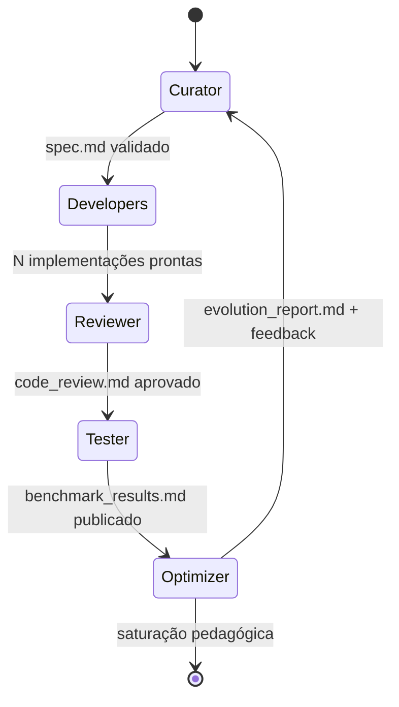
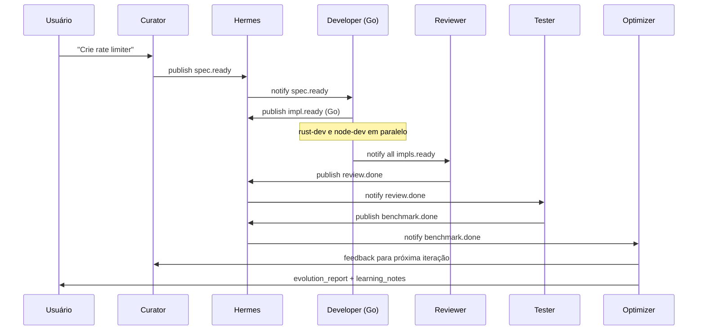
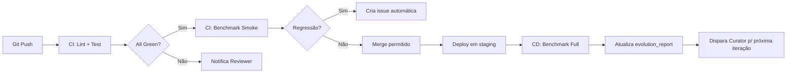

# Arquitetura da Polyglot Evolution Arena (MiniMax Evolution Engine)

> **Ecosistema Global:** AI DevSchool / codexDojo
> **Documento:** 00 — Arquitetura do Projeto
> **Projeto:** Polyglot Evolution Arena (MiniMax Evolution Engine)
> **Plataformas:** OpenClaw e Hermes
> **Versão:** 1.0
> **Status:** Ativo

---

## 1. Visão Geral do Sistema

A **Polyglot Evolution Arena** (gerenciada pelo **MiniMax Evolution Engine**) é um projeto de aprendizado contínuo dentro do ecossistema **AI DevSchool** (codexDojo) baseado em agentes de IA que ensina engenharia de software através da **implementação poliglota comparativa**. O sistema executa um loop fechado de cinco agentes especializados, cada um responsável por uma fase do ciclo de evolução de software, transformando conceitos pedagógicos em artefatos reais, auditáveis e otimizados em múltiplas linguagens de programação.

### 1.1 Missão Pedagógica

O objetivo central é ensinar, de forma prática e iterativa, os seguintes pilares da engenharia de software moderna:

| Pilar | Como é Ensinado |
|-------|-----------------|
| **Princípios de Programação** | Comparação lado a lado de implementações idiomáticas em Go, Rust, Node.js/TypeScript |
| **Qualidade de Código** | Revisões automatizadas com critérios de legibilidade, manutenibilidade e correção |
| **Arquitetura** | Especificações derivadas de requisitos, com diagramas, contratos e decisões documentadas |
| **Escalabilidade** | Benchmarks de carga, profiling de CPU/memória e otimizações sucessivas |
| **Comparação Cross-Technology** | Análise de trade-offs reais entre paradigmas (concorrência,Ownership Model, async runtime, etc.) |

### 1.2 Stack Tecnológica

**Linguagens-alvo (poliglota):**
- **Go** — concorrência via goroutines, simplicidade operacional
- **Rust** — segurança de memória, Ownership Model, zero-cost abstractions
- **Node.js/TypeScript** — ecossistema assíncrono, tipagem gradual, ubiquidade web
- **Extensível** — Python, C++, Java, Kotlin, Swift, Zig

**Plataformas de Orquestração:**
- **OpenClaw** — runtime de agentes com isolamento por worktree, execução paralela e logs estruturados
- **Hermes** — barramento de mensagens para coordenação de handoffs entre agentes
- **MiniMax Agent Team Protocol** — contrato formal de comunicação entre agentes

### 1.3 Princípios Arquiteturais

1. **Idempotência** — qualquer agente pode rerun sem corromper o estado do projeto
2. **Rastreabilidade Total** — toda decisão fica versionada em `docs/` e em git
3. **Poliglota por Design** — nenhuma linguagem é tratada como "primeira classe"
4. **Fail-Fast Pedagógico** — erros viram conteúdo de aprendizado, não são silenciados
5. **Estado em Arquivos** — o filesystem é a fonte da verdade (no database, no lock)

---

## 2. Diagrama de Arquitetura

O diagrama abaixo representa o fluxo completo do ecossistema, incluindo os cinco agentes, o loop de feedback e a estrutura de diretórios.

```mermaid
flowchart TB
    subgraph USER["👤 Usuário / Aprendiz"]
        U1[Define tema<br/>ex: Rate Limiter]
        U2[Consome learning_journal.md]
        U3[Solicita novo idioma<br/>ou agente]
    end

    subgraph OPENCLAW["🦅 OpenClaw — Runtime de Agentes"]
        OC1[Worktree Isolation]
        OC2[Parallel Execution]
        OC3[Structured Logs]
    end

    subgraph HERMES["⚡ Hermes — Message Bus"]
        H1[Spec Published]
        H2[Impl Ready]
        H3[Review Complete]
        H4[Benchmarks Done]
    end

    subgraph LOOP["🔁 MiniMax Evolution Loop (5 Agentes)"]
        direction TB
        A1["🧠 CURATOR<br/><i>Design & Architecture</i><br/>spec.md"]
        A2["🛠️ DEVELOPERS<br/><i>Idiomatic Implementation</i><br/>go-impl/ • rust-impl/ • node-impl/"]
        A3["🔍 REVIEWER / MENTOR<br/><i>Code Review & Pedagogy</i><br/>code_review.md"]
        A4["📊 TESTER<br/><i>Benchmarking & Profiling</i><br/>benchmark_results.md"]
        A5["🚀 OPTIMIZER<br/><i>Evolution & Scaling</i><br/>evolution_report.md"]
    end

    subgraph FS["💾 File System — Fonte da Verdade"]
        F1[projects/NN_name/<br/>docs/spec.md]
        F2[projects/NN_name/<br/>{go,rust,node}-impl/]
        F3[projects/NN_name/<br/>docs/code_review.md]
        F4[projects/NN_name/<br/>benchmarks/]
        F5[projects/NN_name/<br/>docs/evolution_report.md]
        F6[projects/NN_name/<br/>docs/learning_notes.md]
    end

    U1 --> A1
    A1 -->|escreve| F1
    A1 -->|publica| H1
    H1 --> A2
    A2 -->|escreve| F2
    A2 -->|publica| H2
    H2 --> A3
    A3 -->|escreve| F3
    A3 -->|publica| H3
    H3 --> A4
    A4 -->|escreve| F4
    A4 -->|publica| H4
    H4 --> A5
    A5 -->|escreve| F5
    A5 -->|feedback| A1
    A5 -.->|atualiza| F6

    F1 -.-> A2
    F2 -.-> A3
    F3 -.-> A4
    F4 -.-> A5

    F6 --> U2
    U3 --> A1
    A1 --> OC1
    A2 --> OC2
    A5 --> OC3

    style A1 fill:#1e3a8a,color:#fff
    style A2 fill:#065f46,color:#fff
    style A3 fill:#7c2d12,color:#fff
    style A4 fill:#581c87,color:#fff
    style A5 fill:#991b1b,color:#fff
    style LOOP fill:#0f172a,stroke:#fbbf24,stroke-width:3px
    style USER fill:#fef3c7
    style OPENCLAW fill:#dbeafe
    style HERMES fill:#fce7f3
    style FS fill:#e0e7ff
```

**Leitura do diagrama:**

- O **loop central** é estritamente sequencial: Curator → Developers → Reviewer → Tester → Optimizer.
- O **feedback loop** fecha do Optimizer de volta ao Curator, alimentando a próxima iteração com *learnings* extraídos dos benchmarks.
- O **Hermes** age como barramento pub/sub: cada agente anuncia quando seu artefato está pronto.
- O **OpenClaw** provê isolamento, paralelismo e observabilidade — múltiplos Developers (um por linguagem) podem rodar em paralelo.
- O **filesystem** é compartilhado por todos: qualquer agente lê os artefatos do predecessor.

---

## 3. Estrutura de Diretórios

A estrutura abaixo é o **contrato canônico** do ecossistema. Todo projeto deve segui-la para que os agentes consigam localizar artefatos automaticamente.

```
aidevschool/
├── README.md                              # Visão geral do ecossistema
├── learning_journal.md                    # Diário global de aprendizado
├── AGENTS.md                              # Convenções e regras para sub-agentes
│
├── docs/                                  # 📘 Documentação do ecossistema
│   ├── 00_ecosystem_architecture.md       # ← Este documento
│   ├── 01_agent_definitions.md            # Papéis, prompts e responsabilidades
│   ├── 02_learning_path.md                # Trilha pedagógica progressiva
│   ├── 03_metrics_framework.md            # Métricas de qualidade e performance
│   ├── 04_bootstrap_prompts.md            # Prompts de inicialização dos agentes
│   ├── 05_ai_integration_guide.md         # Como integrar novos LLMs e ferramentas
│   └── 06_agora_continuum_operating_model.md # Máquina de estados e portões empíricos
│
├── projects/                              # 🏗️ Projetos evolutivos
│   ├── 01_rate_limiter/
│   │   ├── README.md                      # Resumo executivo do projeto
│   │   ├── docs/
│   │   │   ├── spec.md                    # Especificação (Curator)
│   │   │   ├── code_review.md             # Revisão pedagógica (Reviewer)
│   │   │   ├── benchmark_results.md       # Métricas comparativas (Tester)
│   │   │   ├── evolution_report.md        # Análise de evolução (Optimizer)
│   │   │   ├── learning_notes.md          # Notas de aprendizado acumuladas
│   │   │   └── status.md                  # Estado atual do loop
│   │   ├── go-impl/                       # Implementação idiomática em Go
│   │   │   ├── go.mod
│   │   │   ├── cmd/
│   │   │   ├── internal/
│   │   │   └── README.md
│   │   ├── rust-impl/                     # Implementação idiomática em Rust
│   │   │   ├── Cargo.toml
│   │   │   ├── src/
│   │   │   ├── benches/
│   │   │   └── README.md
│   │   ├── node-impl/                     # Implementação idiomática em Node.js/TS
│   │   │   ├── package.json
│   │   │   ├── src/
│   │   │   ├── tests/
│   │   │   └── README.md
│   │   └── benchmarks/                    # Artefatos de benchmark compartilhados
│   │       ├── scripts/                   # Drivers de carga (k6, wrk, vegeta)
│   │       ├── datasets/                  # Cargas de trabalho reproduzíveis
│   │       └── results/                   # Saídas brutas (JSON/CSV)
│   │
│   ├── 02_key_value_store/
│   ├── 03_message_queue/
│   ├── 04_cron_scheduler/
│   └── ...                                # Projetos infinitos, ordenados por complexidade
│
├── templates/                             # 📋 Templates reutilizáveis
│   ├── spec_template.md
│   ├── code_review_template.md
│   ├── benchmark_template.md
│   ├── evolution_report_template.md
│   ├── learning_notes_template.md
│   └── status_template.md
│
└── .kilo/                                 # ⚙️ Configuração do Kilo CLI
    ├── command/
    └── agent/
```

### 3.1 Convenções de Nomenclatura

| Padrão | Aplicação | Exemplo |
|--------|-----------|---------|
| `NN_nome_em_snake_case` | Diretório de projeto | `01_rate_limiter`, `02_key_value_store` |
| `docs/*.md` | Artefatos de fase | `spec.md`, `code_review.md` |
| `{linguagem}-impl/` | Implementação poliglota | `go-impl/`, `rust-impl/`, `node-impl/` |
| `benchmarks/results/*.{json,csv,md}` | Saídas de benchmark | `2026-06-03_load_test.json` |
| `kebab-case.md` | Documentos | `learning-notes.md` |

### 3.2 O Arquivo `status.md`

Cada projeto possui um `docs/status.md` que rastreia em qual fase do loop ele se encontra:

```markdown
# Status do Projeto: Rate Limiter

**Iteração atual:** 3
**Fase atual:** 🚀 Optimizer
**Próximo agente:** 🧠 Curator (próxima iteração)
**Última atualização:** 2026-06-03T21:30:00Z

## Histórico
- [x] Iteração 1 — loop completo (2026-05-20)
- [x] Iteração 2 — loop completo (2026-05-27)
- [ ] Iteração 3 — em andamento
```

### 3.3 O Arquivo `.mavis/learning_state.yaml`

O modelo Ágora Continuum adiciona uma fonte de verdade para o estado pedagógico. Esse arquivo registra a unidade ativa, o estado da máquina (`apresentando`, `praticando`, `avaliando`, `dominado`), retries, portões empíricos e a próxima ação observável.

Implementadores não devem avançar quando `active_unit.awaiting` exigir uma tentativa do aprendiz. Esse bloqueio existe para preservar productive struggle e evitar dependência de soluções prontas.

---

## 4. O Loop de Evolução Contínua

O coração do sistema é um loop de cinco fases. Cada fase tem **critérios de entrada**, **entregáveis** e **critérios de saída** formalizados.

### 4.1 Diagrama do Loop



### 4.2 Fase 1 — Design & Architecture (Curator)

**Agente:** 🧠 Curator
**Inspiração:** Arquiteto de Software Sênior + Tech Writer

| Aspecto | Detalhe |
|---------|---------|
| **Critérios de Entrada** | Tema do projeto aprovado, `projects/NN_nome/` criado |
| **Entradas** | Tema, restrições, contexto pedagógico, learnings anteriores |
| **Entregáveis** | `docs/spec.md` com: requisitos funcionais, não-funcionais, diagramas, contratos de API, decisões arquiteturais (ADRs) |
| **Critérios de Saída** | Spec revisada e autoavaliada; todos os requisitos são testáveis |
| **Sinal de Handoff** | Publicação de `spec.lock` em `docs/` |

**Saída típica do `spec.md`:**
- 1 página de visão geral
- 5-15 requisitos funcionais (RF)
- 5-10 requisitos não-funcionais (RNF) com métricas
- 2-3 diagramas (C4, sequência, fluxo)
- Contratos de API (OpenAPI, protobuf, traits em Rust, interfaces em Go)
- Critérios de aceitação por requisito

### 4.3 Fase 2 — Idiomatic Implementation (Developers)

**Agente:** 🛠️ Developers (um por linguagem)
**Inspiração:** Engenheiro Sênior especializado na stack

| Aspecto | Detalhe |
|---------|---------|
| **Critérios de Entrada** | `spec.md` aprovado; `spec.lock` presente |
| **Entradas** | Especificação, padrões idiomáticos da linguagem, contexto histórico |
| **Entregáveis** | Implementação completa em `go-impl/`, `rust-impl/`, `node-impl/` com testes unitários, README de uso e `Makefile`/`package.json` reproduzível |
| **Critérios de Saída** | Todos os testes passam; build limpo; cobertura > 80% |
| **Paralelismo** | Em OpenClaw, os três Developers rodam em worktrees isolados simultaneamente |

**Princípios do Developer:**
- **Idiomático primeiro** — seguir convenções da linguagem (gofmt em Go, `cargo clippy` em Rust, ESLint em Node)
- **Sem over-engineering** — implementar apenas o que a spec exige
- **Documentação inline** — comentários explicam o "porquê", não o "o quê"
- **Testes de propriedade** quando aplicável (proptest, quickcheck, fast-check)

### 4.4 Fase 3 — Code Review & Pedagogy (Reviewer/Mentor)

**Agente:** 🔍 Reviewer/Mentor
**Inspiração:** Tech Lead Pedagogo + Engenheiro de Qualidade

| Aspecto | Detalhe |
|---------|---------|
| **Critérios de Entrada** | Implementações completas; testes passando |
| **Entradas** | Código fonte, testes, diff contra iteração anterior |
| **Entregáveis** | `docs/code_review.md` com: análise por linguagem, padrões pedagógicos extraídos, anti-patterns, sugestões priorizadas |
| **Critérios de Saída** | Cada linguagem revisada com nota (0-10) por categoria; lições catalogadas |

**Estrutura do `code_review.md`:**

| Categoria | Avaliação | Nota |
|-----------|-----------|------|
| Corretude | Atende aos RFs? | /10 |
| Idiomacidade | Usa as convenções da linguagem? | /10 |
| Performance | Sem alocações desnecessárias? | /10 |
| Legibilidade | Nomes claros, complexidade ciclomática? | /10 |
| Testabilidade | Cobertura e qualidade dos testes? | /10 |
| Segurança | Sem vetores conhecidos? | /10 |
| **TOTAL** | | **/60** |

**Seção especial: "Lições Pedagógicas"** — comentários que viram conteúdo para `learning_journal.md`.

### 4.5 Fase 4 — Benchmarking & Profiling (Tester)

**Agente:** 📊 Tester
**Inspiração:** Engenheiro de Performance + SRE

| Aspecto | Detalhe |
|---------|---------|
| **Critérios de Entrada** | Code review aprovada; binários/artefatos buildados |
| **Entradas** | Implementações, datasets em `benchmarks/datasets/`, scripts de carga |
| **Entregáveis** | `docs/benchmark_results.md` + arquivos brutos em `benchmarks/results/` |
| **Critérios de Saída** | Comparação entrelinguagens reproduzível; outliers explicados; perfil de CPU/memória disponível |

**Métricas obrigatórias:**

| Métrica | Ferramenta Típica |
|---------|-------------------|
| Latência (p50, p95, p99) | k6, wrk, vegeta, hyperfine |
| Throughput (ops/s) | k6, wrk2, criterion |
| Uso de CPU (%) | perf, py-spy, async-profiler |
| Uso de memória (RSS, heap) | valgrind, heaptrack, clinic.js |
| Alocações (bytes/op) | heaptrack, dhat, memlab |
| Binário/artefato (MB) | `du -sh` |
| Tempo de cold-start | hyperfine --warmup 0 |

**Reprodutibilidade é lei:** todo benchmark é determinístico, versionado e roda em container.

### 4.6 Fase 5 — Evolution & Scaling (Optimizer)

**Agente:** 🚀 Optimizer
**Inspiração:** Arquiteto de Sistemas Distribuídos + Engenheiro de SRE

| Aspecto | Detalhe |
|---------|---------|
| **Critérios de Entrada** | `benchmark_results.md` publicado |
| **Entradas** | Benchmarks, code review, restrições de produção |
| **Entregáveis** | `docs/evolution_report.md` com: gargalos identificados, plano de evolução, novas RFs/RNFs, e — crucial — **feedback para o Curator** |
| **Critérios de Saída** | Decisão explícita: **nova iteração** ou **saturação pedagógica** |

**O `evolution_report.md` contém:**

1. **Top 3 gargalos** (com flame graphs e traces)
2. **Plano de otimização** priorizado (impacto vs. esforço)
3. **Novos requisitos** sugeridos (ex: "suportar sharding para > 10k RPS")
4. **Trade-offs explícitos** — o que se ganha e o que se perde
5. **Feedback Loop** — um bloco estruturado consumido pelo Curator na próxima iteração:

```markdown
## Feedback para o Curator (próxima iteração)

- [ ] Adicionar RF para suporte a múltiplos backends (Redis, in-memory, disk)
- [ ] RNF: latência p99 < 5ms sob carga sustentada
- [ ] Considerar trade-off entre consistência forte vs. eventual
- [ ] Estudo: comparar com Token Bucket vs. Leaky Bucket
```

**Critério de Saturação Pedagógica:** quando o Optimizer determina que novas iterações trazem < 10% de ganho marginal ou cobrem território já bem mapeado, ele declara o projeto "maduro" e recomenda a transição para o próximo da trilha.

---

## 5. Protocolo de Comunicação entre Agentes

O ecossistema adota **file-based event sourcing** como mecanismo primário de comunicação. Isso garante:

- **Auditabilidade total** — toda mensagem é um arquivo git
- **Idempotência** — agentes podem rerun lendo o estado atual
- **Desacoplamento** — agentes não se conhecem diretamente, apenas pelos artefatos

### 5.1 Primitivas de Comunicação

| Primitiva | Localização | Função |
|-----------|-------------|--------|
| **Artefato de entrada** | `projects/NN/docs/spec.md` | Contrato que o agente consome |
| **Artefato de saída** | `projects/NN/docs/<fase>.md` | Entregável que o agente produz |
| **Lock file** | `projects/NN/docs/<fase>.lock` | Sinaliza "saída pronta, próximo pode rodar" |
| **Status file** | `projects/NN/docs/status.md` | Estado global do loop |
| **Notification (Hermes)** | Tópico `minimax.<projeto>.<fase>.done` | Evento broadcast assíncrono |

### 5.2 Formato do Lock File

```json
{
  "phase": "reviewer",
  "agent_id": "reviewer-gpt-4o-iter-3",
  "completed_at": "2026-06-03T21:30:00Z",
  "artifact": "docs/code_review.md",
  "checksum_sha256": "abc123...",
  "next_phase": "tester",
  "ready_for_handoff": true
}
```

A presença de `<fase>.lock` é a **única** condição para o próximo agente iniciar.

### 5.3 Fluxo de Mensagens via Hermes



### 5.4 Garantias do Protocolo

| Garantia | Como é Assegurada |
|----------|-------------------|
| **Entrega** | Lock file é escrito atomicamente (`tmp` + `rename`) |
| **Ordenação** | Status file é atualizado sob mutex (file lock) |
| **Reprodutibilidade** | Cada artefato tem checksum no lock file |
| **Rerun seguro** | Agentes sobrescrevem artefatos da mesma iteração; nunca apagam histórico |
| **Versionamento** | Diretório `iterations/NN/` pode ser ativado opcionalmente para histórico profundo |

### 5.5 Tratamento de Falhas

Quando um agente falha:

1. Ele escreve `docs/<fase>.error.md` com contexto e stack trace
2. Atualiza `status.md` com `phase: failed`
3. Publica no Hermes: `minimax.<projeto>.<fase>.error`
4. O loop **para** — humanos (ou o Curator em modo recovery) decidem o próximo passo

Falhas **nunca** são silenciadas: são oportunidades de aprendizado registradas em `learning_journal.md`.

---

## 6. Extensibilidade do Sistema

A arquitetura foi desenhada para crescer organicamente. Novas linguagens, novos papéis e novas integrações entram sem alterar o contrato central.

### 6.1 Adicionando uma Nova Linguagem

**Exemplo: adicionar Python**

1. **Criar diretório template:**
   ```bash
   mkdir -p projects/01_rate_limiter/python-impl
   ```

2. **Definir convenções em `docs/01_agent_definitions.md`:**
   ```markdown
   ## Python Developer
   - Estilo: PEP 8, Black, mypy strict
   - Testes: pytest + hypothesis
   - Build: poetry
   - Benchmark: pytest-benchmark + locust
   ```

3. **Adicionar template `templates/python-impl_README.md`**

4. **Atualizar `docs/03_metrics_framework.md`** com a linha de base esperada para Python

5. **Pronto.** O Developer Python pode ser instanciado — ele lê `spec.md` e escreve em `python-impl/`.

**Checklist de novas linguagens:**

- [ ] Diretório `{lang}-impl/` documentado
- [ ] Estilo e ferramentas definidos
- [ ] Versão mínima definida (ex: Python 3.12+)
- [ ] Template de benchmark criado
- [ ] Linha base de performance estabelecida (cold start, throughput ingênuo)

### 6.2 Adicionando um Novo Papel de Agente

**Exemplo: Security Auditor**

1. **Definir o papel em `docs/01_agent_definitions.md`:**
   - Nome, missão, ferramentas, entradas, saídas

2. **Criar template de saída em `templates/`:**
   - `security_audit_template.md`

3. **Definir onde o agente entra no loop:**
   - Opção A: **Paralelo ao Reviewer** — audita segurança em paralelo
   - Opção B: **Pós-Reviewer** — refina findings de segurança antes do Tester
   - Opção C: **Pós-Tester** — valida comportamento sob ataque (DoS, fuzzing)

4. **Atualizar o diagrama de arquitetura** (Seção 2)

5. **Adicionar gatilho no Hermes** — tópico `minimax.<projeto>.security.audit.requested`

**Outros papéis sugeridos:**

| Papel | Fase | Valor Pedagógico |
|-------|------|------------------|
| Security Auditor | Pós-Review | Ensina threat modeling, OWASP Top 10 |
| DevOps Agent | Pós-Optimizer | Empacota Docker, CI/CD, observabilidade |
| Documentation Agent | Pós-Review | Gera docs de API, tutoriais, ADRs |
| UX/DX Agent | Pós-Curator | Avalia developer experience do projeto |
| Migration Agent | Iteração N+1 | Migra a versão anterior para a nova |

### 6.3 Adicionando Novas Ferramentas de Benchmark

**Exemplo: integrar `ghz` (gRPC benchmarking)**

1. **Instalar a ferramenta** no ambiente base (Dockerfile do OpenClaw)
2. **Criar driver em `benchmarks/scripts/`:**
   ```bash
   # benchmarks/scripts/run_grpc_bench.sh
   #!/usr/bin/env bash
   ghz --insecure \
       --proto projects/01_rate_limiter/rust-impl/proto/service.proto \
       --call service.RateLimiter.Allow \
       --total 100000 \
       --concurrency 50 \
       --output benchmarks/results/grpc_$(date +%F).json
   ```
3. **Adicionar seção em `docs/benchmark_results.md`** com a nova métrica
4. **Atualizar o Tester agent** para invocar o novo driver

### 6.4 Integração com CI/CD



**Integrações nativas suportadas:**

- **GitHub Actions** — workflows em `.github/workflows/`
- **GitLab CI** — `.gitlab-ci.yml`
- **Nx Cloud** — cache distribuído de builds
- **Sentry** — captura erros em runtime como sinal para o Reviewer
- **Docker** — ambientes reproduzíveis via `Dockerfile` por linguagem

### 6.5 Integração com Novos Modelos de IA

O MiniMax Agent Team Protocol aceita novos modelos transparentemente. Para adicionar um modelo:

1. **Definir adapter** em `.kilo/agent/models/<modelo>.md`
2. **Especificar:**
   - Nome e versão
   - Capacidades (tamanho de contexto, function calling, vision)
   - Custos por token
   - Latência típica
3. **Mapear para papéis** — quais agentes se beneficiam desse modelo
4. **Adicionar em `docs/05_ai_integration_guide.md`**

**Política recomendada:**

| Papel | Modelo Recomendado | Por quê |
|-------|--------------------|---------| 
| Curator | Modelo de raciocínio forte (o3, opus) | Planejamento profundo, trade-offs |
| Developers | Modelo de código (sonnet, gpt-4.1) | Idiomacidade rápida |
| Reviewer | Modelo de raciocínio (opus, o3) | Análise semântica profunda |
| Tester | Modelo de código (haiku, gpt-4.1-mini) | Scripts determinísticos |
| Optimizer | Modelo de raciocínio forte | Identificar gargalos, propor arquiteturas |

### 6.6 Versionamento e Migração

Conforme o ecossistema evolui, as convenções mudam. Para evitar drift:

- **Mudanças breaking** exigem major version bump (1.x → 2.x)
- **Migrações** ficam em `docs/migrations/MM_YY_description.md`
- **O Optimizer** tem um modo `--migrate` que aplica migrações automaticamente
- **O Curator** lê o `CHANGELOG.md` antes de iniciar projetos novos

---

## 7. Resumo Executivo

| Aspecto | Decisão Arquitetural |
|---------|----------------------|
| **Modelo de coordenação** | Loop fechado de 5 agentes com feedback |
| **Comunicação** | File-based event sourcing + Hermes pub/sub |
| **Estado** | Filesystem versionado em git |
| **Isolamento** | Worktrees por agente via OpenClaw |
| **Linguagens** | Poliglota por design, extensível |
| **Qualidade** | Métricas reproduzíveis, code review pedagógico |
| **Evolução** | Loop contínuo até saturação pedagógica |
| **Aprendizado** | `learning_journal.md` + `docs/learning_notes.md` por projeto |

---

## 8. Próximos Passos

1. **Ler** `docs/01_agent_definitions.md` para entender cada agente em detalhe
2. **Seguir** `docs/02_learning_path.md` para iniciar a trilha pedagógica
3. **Configurar** o ambiente conforme `docs/05_ai_integration_guide.md`
4. **Executar** o primeiro projeto: `01_rate_limiter`

---

> **Mantenha este documento vivo.** Toda mudança arquitetural significativa deve ser refletida aqui. A arquitetura é o código do ecossistema.
