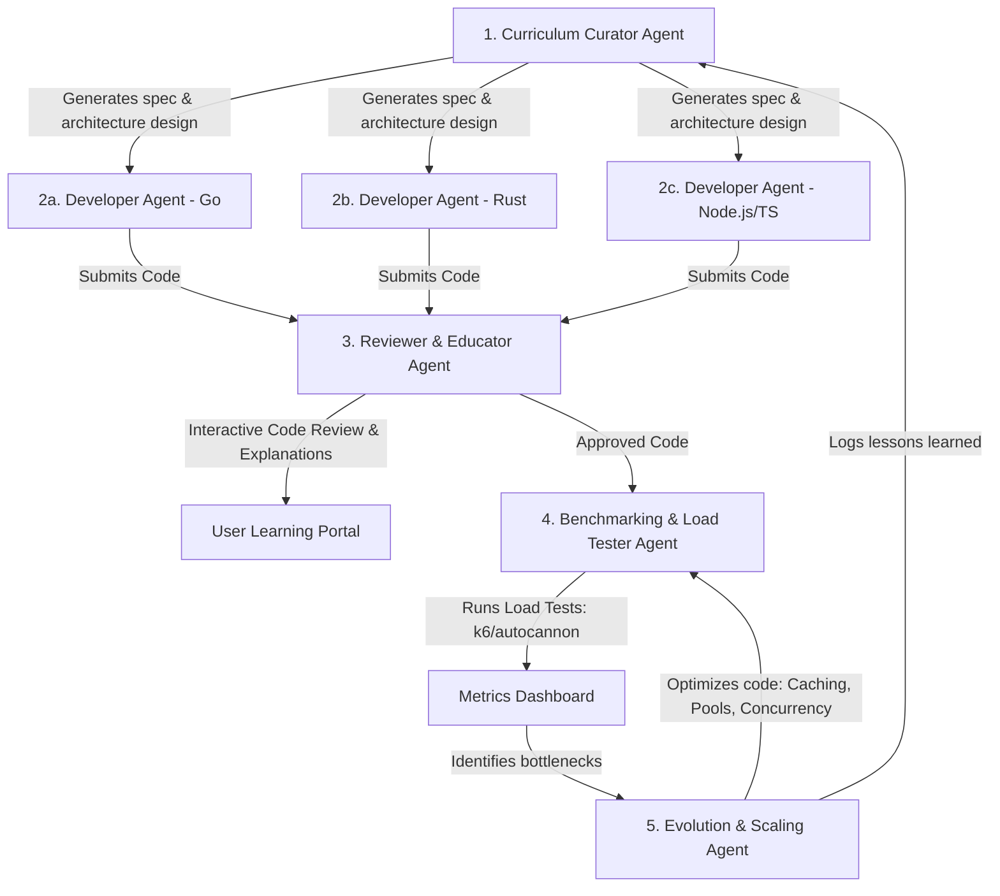

# Polyglot Evolution Arena: MiniMax Evolution Engine 🥋

A specific project idea within the **AI DevSchool** ecosystem. This project runs an autonomous multi-agent team designed to teach software engineering through active project building, idiomatic implementation comparisons, code reviews, load testing, and progressive architectural scaling.

---

## 🏛️ Ecosystem Architecture

The system operates as a continuous loop of five specialized agent roles collaborating to guide the user from core fundamentals to complex distributed systems.

---

## 🤖 Agent Definitions

### 1. Curriculum Curator & Architect (The Architect)
*   **Role**: Selects coding challenges of increasing complexity. Writes specifications, API schemas, and designs the architecture.
*   **Outputs**: `docs/spec.md` with system design requirements, endpoints, and architectural concepts.

### 2. Developer Agents (The Coders)
*   **Role**: Specialized developers for Go, Rust, and Node.js/TypeScript.
*   **Outputs**: Production-ready, idiomatic code containing clean structures, error handling, tests, and Dockerfiles.

### 3. Reviewer & Educator (The Mentor)
*   **Role**: Audits code for clarity, security, and performance.
*   **Outputs**: `docs/code_review.md` including line-by-line critiques, pedagogical comparisons between languages, and quizzes.

### 4. Benchmarking & Load Tester (The Assessor)
*   **Role**: Orchestrates isolated load testing using tools like `k6` or `autocannon` inside Docker.
*   **Outputs**: `docs/benchmark_results.md` comparing latency, throughput, RAM, and CPU usage.

### 5. Evolution & Scaling Agent (The Optimizer)
*   **Role**: Resolves system bottlenecks by applying caching, database indexing, and thread pools.
*   **Outputs**: Optimized code refactors and `docs/evolution_report.md` comparing performance before vs. after.

---

## 📈 Learning Path (18 Projects)

The curator drives you through 6 progressive tiers:

1.  **Green (Fundamentals)**: API servers, token bucket, simple CRUD.
2.  **Yellow (Concurrency)**: WebSockets, worker pools, server-sent events.
3.  **Blue (Architecture)**: Hexagonal architecture, dependency injection, Clean Arch.
4.  **Orange (Scalability)**: Distributed caching, horizontal scaling, job queues.
5.  **Red (Resilience)**: Circuit breakers, distributed logging, tracing.
6.  **Black (Complex Systems)**: Pub-Sub message broker, config engine, custom search indices.

---

## 📊 Metrics Framework

The system aggregates statistics in a comparison matrix to give you data-driven learning:

*   **RPS (Throughput)**: Requests processed per second under heavy concurrent loads.
*   **Latency Profile (p50, p95, p99)**: The worst-case request delays (capturing garbage collection pauses vs memory management).
*   **RAM Footprint**: Memory usage of the runtimes (JVM/V8 vs Go channels vs Rust zero-cost abstractions).
*   **CPU Utilization**: Efficiency of core scheduling models (async/await, threads, event loop).
*   **Lines of Code**: Code velocity and expressiveness comparison.
