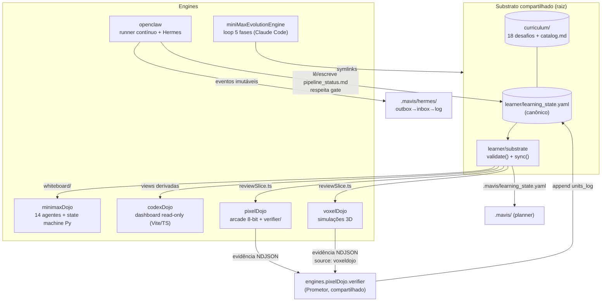

# TDD — Ecossistema AI DevSchool

| Campo          | Valor                                                        |
| -------------- | ------------------------------------------------------------ |
| Tech Lead      | @Daniel Barreto                                              |
| Time           | Daniel (aprendiz/owner) + agentes IA (Claude Code, Mavis, OpenClaw) |
| Épico/Ticket   | [docs/PROMPTS/-01_GOAL.md](../PROMPTS/-01_GOAL.md)           |
| Status         | Documentação as-is (arquitetura vigente)                     |
| Criado         | 2026-07-08                                                   |
| Última revisão | 2026-07-08                                                   |

> **Natureza deste documento:** TDD descritivo do ecossistema **como ele existe hoje** (pós-MVP,
> fechado em 2026-07-05). Documenta decisões arquiteturais, contratos e invariantes — não código
> de implementação. Fontes canônicas citadas em cada seção.

---

## 1. Contexto

O **AI DevSchool** é um ecossistema guarda-chuva (não um produto único) cujo objetivo é um sistema
multi-agente contínuo que ensina **um único aprendiz** a programar melhor — arquitetura, testes,
escalabilidade, integração com IA — por meio de pequenos projetos que evoluem para aplicações
robustas. A inspiração original é o artigo "MiniMax Agent Team: Built for Long-Running Tasks and
Continuous Evolution" ([docs/PROMPTS/-01_GOAL.md](../PROMPTS/-01_GOAL.md)).

**Domínio:** educação técnica assistida por IA (tutoring com verificação empírica), operando
inteiramente sobre o filesystem local — sem backend, sem banco de dados, single-player.

**Princípio operacional:** *1 aprendiz, 1 currículo, vários motores.* O substrato compartilhado
(`curriculum/` e `learner/`) vive apenas na raiz; seis engines independentes o consomem via
symlinks. A certeza de conclusão **nunca vive no modelo de linguagem**: um conceito só vira
`mastered` após tentativa real do aprendiz e evidência executável validada por um verificador
separado.

**Stakeholders:** o aprendiz (usuário único), os agentes orquestradores (produtores e
verificadores) e as plataformas de tooling (Claude Code, Mavis, OpenCode) que leem as views
derivadas.

## 2. Definição do Problema & Motivação

### Problemas que o ecossistema resolve

- **Mastery inflada por IA**: LLMs tendem a marcar conceitos como "dominados" sem evidência.
  - Impacto real medido: 18 masterizações falsas foram revertidas antes do fechamento do MVP
    (2026-07-05). Sem o gate, o estado de aprendizado é fictício.
- **Dependência excessiva de IA no aprendizado**: o aprendiz pode delegar em vez de praticar.
  - Impacto: monitorado via AIDI (AI Dependency Index) e bloqueio `gate.implementation_blocked`,
    que impede a IA de implementar antes de existir tentativa real em `learner/attempts/`.
- **Estado de aprendizado fragmentado entre ferramentas**: cada plataforma (Claude Code, Mavis,
  dashboards) precisaria do seu próprio estado.
  - Impacto evitado: fonte canônica única (`learner/learning_state.yaml`) + views derivadas
    regeneradas, nunca editadas à mão.
- **Afirmações sem evidência** (paridade poliglota, benchmarks, robustez).
  - Impacto: todo claim exige artefato executável (testes, benchmark N≥3, smoke Playwright).

### Por que assim?

- Filesystem como fonte da verdade torna todo o estado auditável por humano e por qualquer agente,
  sem infraestrutura.
- Múltiplos engines permitem testar o mesmo protocolo pedagógico em plataformas diferentes
  (CLI orquestrado, jogo arcade, simulação 3D, runner contínuo) sem duplicar currículo ou estado.

### Impacto de não ter o sistema

- **Aprendizado:** progresso ilusório; `learning_state` sem lastro (regra da casa: não confiar em
  `learning_state` sem checar `attempts/` + evidência).
- **Técnico:** cada engine reinventaria estado e scheduling, com drift inevitável.

## 3. Escopo

### ✅ No escopo (arquitetura vigente)

- Substrato compartilhado: `curriculum/` (18 desafios poliglotas) + `learner/` (estado canônico,
  perfil, pitfalls, journal, attempts, pipeline).
- Gerador de views derivadas: `learner/substrate` (validação de invariantes + `sync()`).
- Seis engines: miniMaxEvolutionEngine, minimaxDojo, codexDojo, pixelDojo (inclui o verificador
  compartilhado), voxelDojo, openclaw.
- Contratos cross-engine: teaching-game contract, contrato de evidência NDJSON, bus Hermes,
  interface do substrato.
- Gate de aprendizado empírico (evidência → verificador → `units_log`) e repetição espaçada FSRS.

### ❌ Fora do escopo

- Backend, rede, multiusuário, persistência em banco — decisão explícita do contrato
  (single-player, filesystem-only).
- polyglotEvolutionArena — rebaixado a arquivo de design em 2026-06-21
  (`docs/design/polyglot-arena/`), fase de proposta.
- Modos não-simulate do openclaw (levantam `NotImplementedError` por design).
- Automação de deploy/CI completa por engine (lacuna conhecida, ver Riscos).

### 🔮 Considerações futuras

- Fechar os 16 projetos do currículo ainda não certificados (2/18 certificados, Node-only).
- Completar 3 conceitos restantes no voxelDojo (15/18 implementados).
- Consolidar tooling compartilhado (workspace único, emissor de evidência unificado).

## 4. Solução Técnica

### 4.1 Visão geral da arquitetura



**Componentes-chave:**

- **Substrato (`learner/` + `curriculum/`)**: única fonte canônica de estado e conteúdo.
- **`learner/substrate` (~2,5k LOC Python)**: guardião de invariantes (`validate()`) e gerador de
  todas as views derivadas (`sync()`); scheduling FSRS centralizado aqui.
- **Verificador compartilhado (`engines/pixelDojo/verifier/`)**: único componente autorizado a
  escrever `units_log`/`mastered`; agnóstico de origem (pixel e voxel).
- **Engines**: superfícies de tentativa e orquestração; nunca escrevem estado canônico
  (exceção controlada: openclaw escreve `pipeline_status.md`).

### 4.2 Engines

| Engine | Papel | Stack | Estado compartilhado |
| ------ | ----- | ----- | -------------------- |
| **miniMaxEvolutionEngine** | Loop de software em 5 fases (Spec→Implement→Review→Benchmark→Optimize) com verificador adversarial; 25 subagents, 18 comandos `/devschool-*`, hook de briefing | Claude Code (`.claude/`) | symlinks para `curriculum/`, `learner/`, `.mavis/` |
| **minimaxDojo** | Tutoring-core "Ágora Continuum": 14 agentes (Maestro, Sócrates, Prometor, Atena, …); state machine determinística de referência com testes de contrato; thresholds em `config/learner.yaml` | Docs/prompts + Python (`core/`) | consome canônico; `whiteboard/` é view derivada |
| **codexDojo** | Dashboard read-only do learner state + contratos de produto (`ecosystem/MANIFEST.md`) | Vite + TS (pnpm), Biome | `src/data/learner.ts` auto-gerado pelo substrato |
| **pixelDojo** | Jogos arcade 8-bit: 1 conceito = 1 mecânica; nível vencido emite evidência. Hospeda o **verificador compartilhado** | Vite + TS + Phaser 3 (app canônico `pixel-quest/`); verifier em Python | emite `pixel-quest/.logs/evidence.ndjson`; nunca escreve em `learner/` |
| **voxelDojo** | Simulações 3D didáticas (anéis, topologias, quóruns); sim core headless determinístico + cena Three.js + níveis L1–L4; piloto `game-10-hash-ring` | Vite + TS + Three.js | evidência com `source: voxeldojo`, verificada pelo verifier do pixelDojo |
| **openclaw** | Runner contínuo file-based do ciclo de 5 fases, sem estado oculto de chat; todo handoff é evento JSON imutável no bus Hermes; só modo `simulate` | Python puro (CLI `python3 -m engines.openclaw`) | lê/escreve `pipeline_status.md`; para se `gate.implementation_blocked` |

Teste de contrato cross-engine: `engines/test_engine_contracts.py`.

### 4.3 Fluxo de dados principal (gate de aprendizado)

1. Substrato publica a fatia de revisão (read-only) para o jogo — scheduling flui **só numa
   direção**: substrato → jogo.
2. Aprendiz joga (pixelDojo/voxelDojo); o jogo emite evidência NDJSON bruta, append-only
   (global do browser + linha `EVIDENCE <json>` no console; `localStorage` nunca conta).
3. `python3 -m engines.pixelDojo.verifier` (contexto Prometor, parte do zero) valida:
   evidência casa com `active_unit` (`unit_id`+`project`); existe `attempt_file` não-vazio;
   `active_unit.state == evaluating`; `ts` estritamente mais novo que a última evidência gateada
   (anti-replay); registro internamente consistente. Mapeia para
   `fail | pass_retried | pass_first_try | pass_exceeds` e valida contra o validador do substrato
   **antes de escrever qualquer byte**; então faz append em `units_log`.
4. `python3 -m learner.substrate` regenera todas as views derivadas (`.mavis/`, dashboard do
   codexDojo, whiteboard do minimaxDojo, review slices).

### 4.4 Bus Hermes (openclaw)

Pub/sub file-backed em `.mavis/hermes/`: eventos JSON imutáveis movem-se
`outbox/ → inbox/ → log/` (ledger de idempotência). Idempotente por
`(topic, unit_id, content_hash)`; repetição = `duplicate`; mesma chave com conteúdo diferente vai
para `conflicts/`. Tópicos canônicos: `dojo.unit.selected`, `dojo.spec.ready`, `dojo.impl.ready`,
`dojo.tests.ready`, `dojo.review.ready`, `dojo.metrics.ready`, `dojo.memory.updated`.
O scheduler mapeia cada fase a uma `PhaseRule` (tópico, adapter produtor, fase de verificação,
próxima fase); segura em `pending_verify_topic` até o verificador passar; 3 FAILs no mesmo tópico
→ blocker em `pipeline_status.md` + halt.

### 4.5 Formatos de dados (filesystem = fonte da verdade)

Todo o estado é Markdown / YAML / NDJSON — auditável e versionável.

**`learner/learning_state.yaml` (canônico, v2):**

```yaml
system: agora-continuum
learner: { ... }
state_machine: presenting -> practicing -> evaluating -> mastered
active_unit:
  promotion_gate: { ... }
  empirical_gate:
    require_executable_evidence: true
    min_coverage: 0.8
    mutation_min: 0.6
gate:
  implementation_blocked: true|false
agent_ownership: { role: agent }
units_log:            # append-only; só o verificador escreve
  - reviews: [ ... ]
streak: { current, longest, freezes }   # freezes cap 2
```

**Evidência NDJSON** (`engines/pixelDojo/EVIDENCE_CONTRACT.md`) — um objeto por linha:

```json
{"source":"voxeldojo","unit_id":"...","project":"...","scenario_id":"...",
 "game":"...","ts":"2026-07-08T12:00:00Z","pass":true,
 "metrics":{"kind":"pixelquest-token-bucket", "...":"..."}}
```

Validada na emissão (`validateEvidenceRecord`); uma linha malformada rejeita o arquivo inteiro.

**Outros formatos:** `pitfalls.md` (append-only: `## [DATA] Título` + Contexto/Erro/Conceito
correto/Reforço agendado); `pipeline_status.md` (Markdown com key-values em bullets, parseado por
regex pelo openclaw — frágil, ver Riscos); `substrate/schema.yaml` define tipos e invariantes
(`UnitKind`, `Rating` FSRS produzido **apenas** por `rating_from_gate_outcome()`, `GateOutcome`).
Views derivadas em `.mavis/` e `whiteboard/` usam nomes de estado em português
(apresentando/praticando/avaliando/dominado).

### 4.6 Interfaces (contratos, não endpoints)

Sistema sem HTTP; as "APIs" são contratos de módulo e CLI:

| Interface | Tipo | Contrato |
| --------- | ---- | -------- |
| `learner.substrate` | Python module | `load_canonical()`, `validate()` (violações de invariantes), `load_and_validate()`, `sync()` — [learner/substrate/interface.md](../../learner/substrate/interface.md) |
| `engines.pixelDojo.verifier` | CLI Python | decide o gate; `--dry-run` decide sem escrever |
| `engines.openclaw` | CLI Python | `--project`, `--mode simulate`, `--phase`, `--max-events`, `--reset`; exit 0 só em `cycle-complete` |
| Teaching-game contract | doc canônico | [docs/design/teaching-game-contract.md](teaching-game-contract.md) — regras 1–8, registry `source` → review slice |
| Hermes | eventos JSON | tópicos `dojo.*`, idempotência por `(topic, unit_id, content_hash)` |

## 5. Invariantes (regras de ouro)

Estas são as decisões arquiteturais mais importantes do ecossistema; qualquer mudança futura deve
preservá-las ([CLAUDE.md](../../CLAUDE.md), [AGENTS.md](../../AGENTS.md)):

1. **Learning gate** — o aprendiz tenta e é avaliado com evidência executável antes de a IA marcar
   `mastered`; `gate.implementation_blocked` bloqueia implementação por IA até existir tentativa
   real em `learner/attempts/`.
2. **Produtor ≠ verificador** — sem auto-verificação; o verificador vê a spec, não o raciocínio do
   produtor. Auditoria de 2026-07-08 encontrou zero violações desta regra.
3. **Sem afirmações sem evidência** — mastery, paridade, benchmark e robustez exigem artefato
   executável (coverage core ≥ 80%, mutation ≥ 60%, benchmark CV < 20%, N≥3).
4. **Filesystem é a fonte da verdade** — sem DB, sem lock; views derivadas são regeneradas, nunca
   editadas à mão nem retro-portadas para o canônico.
5. **Ratings FSRS derivam de gate outcomes** — nunca de auto-relato
   (`rating_from_gate_outcome()` é o único produtor).
6. **1 aprendiz, 1 currículo, N engines** — `curriculum/` e `learner/` nunca são duplicados dentro
   de um engine.
7. **Antes de commit:** rodar `/simplify` no diff e aplicar as recomendações.

## 6. Riscos

Fonte canônica (lista completa, prioridades e status por item):
[docs/TECH_DEBT_AUDIT_2026-07-08.md](../TECH_DEBT_AUDIT_2026-07-08.md) — os riscos mudam de status
lá, não aqui. Os três críticos no fechamento deste TDD:

- **Escrita não-atômica de `learning_state.yaml` no verifier** (#1, P32) — risco de perda do estado
  canônico; mitigar reusando `openclaw.fsio.atomic_write_text`.
- **15/16 `reviewSlice.ts` do voxelDojo são stubs copiados à mão** rotulados "AUTO-GENERATED"
  (#4, P24) — scheduling falso nos jogos; estender `sync_voxel_review_slice`.
- **Views derivadas divergem no AIDI** (#5, P24) — whiteboard 0.50 × dashboard 0.34; definir fonte
  canônica em `learning_state.yaml`.

Infra (ação do usuário): `.git` com 222 MB (rodar `git gc`), 4 binários Go rastreados (~35 MB),
branches obsoletas, sprawl de docs de planejamento na raiz.

## 7. Estratégia de Testes (vigente)

| Tipo | Escopo | Comando |
| ---- | ------ | ------- |
| Contrato cross-engine | registry de engines, regras do contrato | `python3 -m pytest engines/test_engine_contracts.py` |
| Substrato | invariantes, sync, FSRS (`scheduling.py`: 70 testes) | `python3 -m unittest discover -s learner/substrate/tests` |
| openclaw | bus, scheduler, adapters | `python3 -m pytest engines/openclaw/tests/` |
| minimaxDojo | state machine determinística (testes de contrato) | suíte em `core/` |
| codexDojo | lint/test/build | `pnpm run lint\|test\|build` |
| pixelDojo | lint/test/typecheck/build + **smoke Playwright** (evidência de playthrough) | `pnpm run smoke` em `pixel-quest/` |
| voxelDojo | sim core headless (Vitest, proofs determinísticos) + smoke | `pnpm run test\|typecheck\|build\|smoke` por game |

Princípio: nenhum claim sem playthrough Playwright (jogos) ou evidência executável (currículo).
Lacunas conhecidas: ver Riscos #8 e #22.

## 8. Observabilidade & Auditoria

Não há telemetria de produção (sistema local); a observabilidade é **auditabilidade do
filesystem**:

- **Trilha de eventos:** `.mavis/hermes/log/` (ledger imutável de handoffs) + `conflicts/`.
- **Trilha de aprendizado:** `units_log` (append-only, com `reviews[]`), `learner/attempts/`,
  `pitfalls.md`, `journal.md`.
- **Estado de pipeline:** `pipeline_status.md` (por fase/agente); hook de briefing do
  miniMaxEvolutionEngine injeta pipeline + gate no início de cada sessão.
- **Views de leitura:** dashboard codexDojo, whiteboard minimaxDojo, `.mavis/learning_state.yaml`.
- **Sinais de alerta manuais:** divergência entre views derivadas (regenerar via substrato);
  evidência sem `attempt_file`; `learning_state` com mastered sem review no `units_log`
  (violação de invariante — o validador deve pegar).

## 9. Recuperação & Rollback

Sem deploy — "rollback" = recuperação de estado:

- **Git é o mecanismo primário**: todo o estado canônico é versionado; reverter =
  `git checkout` do arquivo canônico + `python3 -m learner.substrate` para regenerar views.
- **Nunca** editar views derivadas para "consertar" estado — corrigir o canônico e regenerar.
- **Gatilho de halt automático:** openclaw para com `gate.implementation_blocked` ou 3 FAILs no
  mesmo tópico (blocker registrado em `pipeline_status.md`).
- **Ponto fraco conhecido:** a escrita não-atômica do verifier (Risco #1) pode corromper
  `learning_state.yaml` — até a correção, o backup é o histórico git.
- **Anti-replay:** `ts` estritamente crescente impede re-gatear evidência antiga após reverts.

## 10. Métricas de Sucesso

| Métrica | Alvo | Medição |
| ------- | ---- | ------- |
| Masterização com lastro | 100% dos `mastered` com review de gate no `units_log` | invariante do schema |
| Cobertura core (gate empírico) | ≥ 80% | `empirical_gate.min_coverage` |
| Mutation score (gate empírico) | ≥ 60% | `empirical_gate.mutation_min` |
| Estabilidade de benchmark | CV < 20%, N≥3 | `benchmarks/results/` por projeto |
| AIDI (dependência de IA) | decrescente | ⚠️ hoje inconsistente entre views (Risco #5) |
| Currículo certificado | 18/18 projetos | hoje: 2/18 (Node-only) |
| Conceitos jogáveis | 18/18 | pixelDojo: 17 games + pixel-quest; voxelDojo: 15/18 |

## 11. Glossário

| Termo | Definição |
| ----- | --------- |
| **Engine (motor)** | Aplicação independente que implementa o protocolo pedagógico sobre o substrato compartilhado |
| **Substrato** | `curriculum/` + `learner/` na raiz; única fonte canônica |
| **Learning gate** | Transição `evaluating → mastered`, exclusiva do verificador, exigindo evidência executável |
| **Gate empírico** | Thresholds numéricos (coverage/mutation/benchmark) exigidos para promoção |
| **Evidência** | Registro NDJSON bruto emitido por um jogo ao vencer um nível; append-only |
| **Prometor** | Papel de verificador adversarial (contexto isolado, parte do zero) |
| **View derivada** | Arquivo regenerado pelo substrato (dashboard, whiteboard, `.mavis/`, review slices); nunca editada à mão |
| **Review slice** | Fatia read-only de scheduling que o substrato publica para os jogos |
| **Hermes** | Bus de eventos file-backed do openclaw (`outbox→inbox→log`) |
| **AIDI** | AI Dependency Index — grau de dependência do aprendiz em relação à IA |
| **FSRS** | Algoritmo de repetição espaçada; ratings derivados de gate outcomes |
| **Ágora Continuum** | Nome do tutoring-core de 14 agentes (minimaxDojo) |

## 12. Alternativas Consideradas (decisões estruturais)

| Decisão | Alternativa rejeitada | Por quê |
| ------- | --------------------- | ------- |
| Filesystem (MD/YAML/NDJSON) como estado | Banco de dados / backend | Auditabilidade humana + por qualquer agente, zero infra, versionável em git; sistema é single-player |
| Verificador único compartilhado no pixelDojo | Um verificador por engine | Produtor≠verificador com um só ponto de escrita em `units_log`; agnóstico de `source` |
| Views derivadas regeneradas | Engines lendo o canônico direto | Cada plataforma precisa de formato próprio (TS, whiteboard MD, YAML pt); regeneração elimina edição manual e drift *(drift ainda ocorre onde o sync não cobre — Risco #4)* |
| Vários engines com o mesmo protocolo | Um único produto | Testar o protocolo pedagógico em plataformas distintas sem duplicar currículo/estado |
| polyglotEvolutionArena rebaixado a design | Manter como engine | Fase de proposta; rebaixado em 2026-06-21 para `docs/design/polyglot-arena/` |

## 13. Questões em Aberto

| # | Questão | Contexto | Status |
| - | ------- | -------- | ------ |
| 1 | Onde vive o AIDI canônico? | Views divergem (0.50 vs 0.34); precisa de campo em `learning_state.yaml` | 🔴 Aberta (Risco #5) |
| 2 | `pipeline_status.md` vira YAML estruturado? | Parse por regex é frágil (Risco #11) | 🔴 Aberta |
| 3 | Workspace compartilhado para os ~35 projetos TS? | 33 `biome.jsonc` idênticos, emissor de evidência ×31 | 🔴 Aberta (Riscos #16–18) |
| 4 | CI mínima por engine — qual plataforma? | voxelDojo/games/openclaw sem jobs | 🔴 Aberta (Risco #8) |
| 5 | Ordem de fechamento dos 16 projetos restantes do currículo | 2/18 certificados; `BACKLOG_STATUS.md` manda no status | 🟡 Em andamento |

## 14. Estado Atual & Roadmap

**Marcos atingidos:**

- 2026-06-21 — arcadeAcademy fundido no pixelDojo; polyglotEvolutionArena rebaixado a design.
- 2026-07-05 — **MVP fechado**: U0 gated com evidência real; 18 masterizações falsas revertidas;
  voxelDojo implementado e verificado (piloto game-10-hash-ring).
- 2026-07-08 — auditoria de tech debt do ecossistema inteiro
  (`docs/TECH_DEBT_AUDIT_2026-07-08.md`).

**Próximos passos sugeridos (ordem por prioridade da auditoria):**

| Fase | Entrega | Fonte |
| ---- | ------- | ----- |
| 1. Integridade | Escrita atômica no verifier (#1); corrigir drift dos 3 testes (#21) | auditoria P32/P24 |
| 2. Contrato | Sync real dos 15 reviewSlices do voxel (#4); AIDI canônico (#5) | auditoria P24 |
| 3. Robustez | Validador completo (#9); Hermes com cache/quarentena (#10); pipeline YAML (#11) | auditoria P18 |
| 4. Evidência por máquina | CI mínima para voxel/games/openclaw (#8); isolamento de testes (#22) | auditoria P18 |
| 5. Consolidação | Workspace + emissor de evidência único (#16–18) | auditoria P14–12 |
| Contínuo | Certificar projetos do currículo (2→18); conceitos voxel (15→18) | catalog.md |

## 15. Referências

- [CLAUDE.md](../../CLAUDE.md) / [AGENTS.md](../../AGENTS.md) — convenções do ecossistema
- [docs/PROMPTS/-01_GOAL.md](../PROMPTS/-01_GOAL.md) — meta fundadora
- [docs/handbook/](../handbook/) — ler primeiro
- [docs/design/teaching-game-contract.md](teaching-game-contract.md) — contrato canônico dos jogos
- [engines/pixelDojo/EVIDENCE_CONTRACT.md](../../engines/pixelDojo/EVIDENCE_CONTRACT.md) — contrato de evidência
- [learner/substrate/interface.md](../../learner/substrate/interface.md) — contrato do substrato
- [engines/codexDojo/ecosystem/MANIFEST.md](../../engines/codexDojo/ecosystem/MANIFEST.md) — mapa requisitos→arquivos
- [docs/TECH_DEBT_AUDIT_2026-07-08.md](../TECH_DEBT_AUDIT_2026-07-08.md) — auditoria de dívida técnica
- [docs/design/spaced-repetition-streak/README.md](spaced-repetition-streak/README.md) — design FSRS/streak
