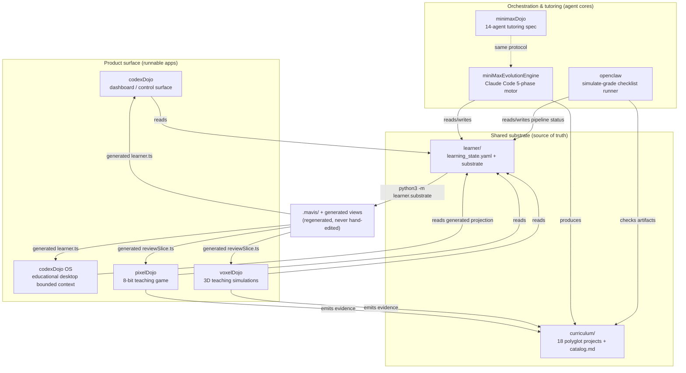
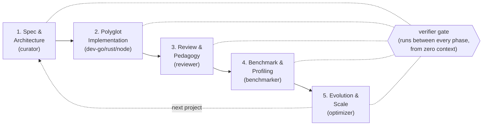
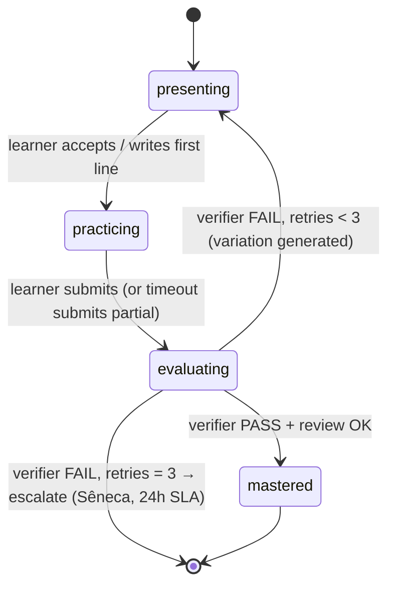
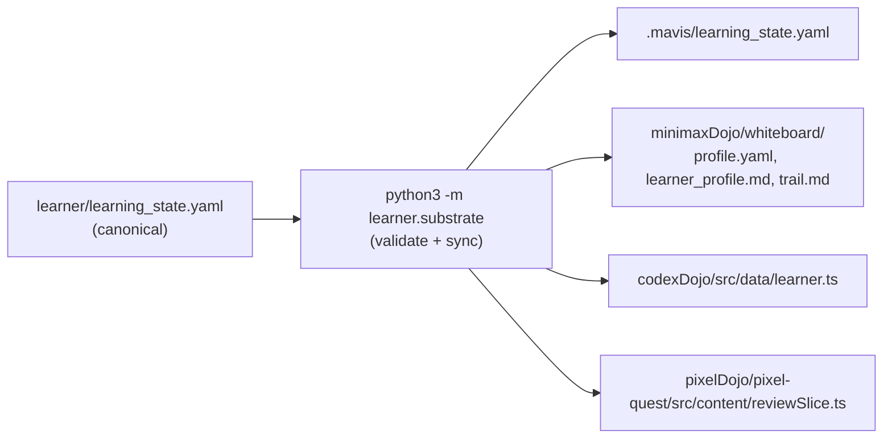

# Architecture

How the engine roles, shared curriculum, and learner substrate fit together — and why the design
is shaped the way it is.

## 1. The core idea

AI DevSchool is a **school**, not a code generator. Its single most important constraint is that
**the certainty of completion never lives in the language model.** A unit of learning is only
`mastered` when two independent things have happened:

1. The **learner attempts** it (productive struggle is preserved).
2. A **separate verifier** runs executable checks — tests, coverage, mutation score, benchmarks —
   from an isolated context, and produces evidence.

Everything in the architecture exists to enforce that constraint: the deterministic state machine,
the producer/verifier separation, the file-based audit trail, and the empirical gates.

## 2. Layered view

The ecosystem is layered. Agents and apps sit on top; the shared substrate sits underneath; the
filesystem is the source of truth for all of it.

| Layer | Members | Responsibility |
| --- | --- | --- |
| **Product surface** | `codexDojo`, `codexdojo-os-prototype`, `pixelDojo`, `voxelDojo` | What a human sees and touches. Each consumes an engine-local derived learner view; none marks mastery. OS window, catalog, terminal, mission, and mentor interactions remain local UI state. |
| **Orchestration / tutoring** | `miniMaxEvolutionEngine`, `minimaxDojo`, `openclaw` | Agent logic plus the simulate-grade artifact checklist. The Claude Code motor owns the interactive cycle; OpenClaw does not. |
| **Shared substrate** | `learner/`, `curriculum/` | The single source of truth. Canonical state in human-readable files; derived views regenerated from it. |

## 3. Engine roles

Each engine is a **separate project** with its own machine surface. They share one curriculum and
one learner — never duplicated, only projected into engine-local generated views.

| Engine | Type | One-liner | Detail |
| --- | --- | --- | --- |
| `engines/codexDojo/` | Runnable app | The user-facing dashboard — a Vite/TypeScript SPA showing the learner snapshot, agent roster, the cycle, and the 18-project roadmap. | [doc](03_engine_codexDojo.md) |
| `engines/codexdojo-os-prototype/` | Runnable app | The canonical educational OS experience with local apps, Learn Mode, and a generated read-only learner snapshot. | [doc](03b_engine_codexdojo-os-prototype.md) |
| `engines/pixelDojo/` | Runnable app | 8-bit teaching games. The canonical game `pixel-quest/` turns one curriculum concept into one arcade mechanic and emits executable evidence when a level is cleared. | [doc](04_engine_pixelDojo.md) |
| `engines/voxelDojo/` | Runnable apps | Three.js teaching simulations with deterministic, headless simulation cores and browser evidence. | [doc](10_engine_voxelDojo.md) |
| `engines/minimaxDojo/` | Agent core | The 14-agent "Ágora Continuum" tutoring core — the state machine, gates, prompts, governance, and a Python reference implementation. Runs on the MiniMax Agent Team platform. | [doc](05_engine_minimaxDojo.md) |
| `engines/miniMaxEvolutionEngine/` | Agent core | The runnable Claude Code orchestration motor: the 5-phase loop (Spec → Implement → Review → Benchmark → Optimize), implemented as `.claude/` subagents and `/devschool-*` slash commands. | [doc](06_engine_miniMaxEvolutionEngine.md) |
| `engines/openclaw/` | Checklist runner | A file-based, simulate-grade runner that advances the 5-phase cycle when required artifacts pass path and size checks. | [engine README](../../engines/openclaw/README.md) |

### Why two agent cores?

`minimaxDojo` and `miniMaxEvolutionEngine` implement the **same protocol** — the same deterministic
state machine, the same adversarial verifier, the same empirical gate, the same agent roles — on
**different platforms**:

- `minimaxDojo` is the **spec / prompt layer** for the MiniMax Agent Team. "Running" it means pasting
  bootstrap prompts. Its `config/learner.yaml` is the canonical numeric-threshold seam, and it ships
  a Python reference implementation of the state machine + gates under `core/`.
- `miniMaxEvolutionEngine` is the **runnable Claude Code motor**. The 14 roles become `.claude/agents/*.md`
  subagents; the loop becomes 18 `/devschool-*` slash commands plus a PhaseRunner protocol and a
  SessionStart hook.

Both are forbidden from forking global learner state.

## 4. The two loops

The ecosystem runs two interlocking loops. Keeping them distinct is essential to understanding the
system.

### 4.1 The software cycle (5 phases)

Tracked in `learner/pipeline_status.md`. Producers create artifacts; the verifier gates each
transition. Status advances **only** after the verifier returns `PASS`.

| Phase | `phase` value | Producer | Key artifacts |
| --- | --- | --- | --- |
| 1 — Spec & Architecture | `spec-done` | `curator` | `curriculum/NN/docs/spec.md` |
| 2 — Polyglot Implementation | `impl-done` | `dev-go`, `dev-rust`, `dev-node` (parallel) | `curriculum/NN/{go,rust,node}-impl/` |
| 3 — Review & Pedagogy | `review-done` | `reviewer` | `code_review.md`, `learning_notes.md`, `quiz.md` |
| 4 — Benchmark & Profiling | `benchmark-done` | `benchmarker` | `benchmark_results.md`, `benchmarks/results/` |
| 5 — Evolution & Scale | `cycle-complete` | `optimizer` | `evolution_report.md` |

### 4.2 The learning gate (per unit)

Tracked in `learner/learning_state.yaml`. This is the gate that preserves productive struggle.
While `gate.implementation_blocked: true`, the AI will not implement the unit — the learner must
attempt the diagnostic first, and that attempt must be evaluated with executable evidence.

The two loops meet at the **diagnostic**: each project's `docs/diagnostic.md` is the learning-gate
challenge. The learner writes an attempt under `learner/attempts/`, the `sonda` agent grades it, and
only then does `implementation_blocked` flip to `false`. A unit never becomes `mastered` from a
diagnostic alone — `mastered` requires Phase-2 verifier evidence.

## 5. The empirical gates (thresholds)

"Executable evidence" is concrete and numeric. The thresholds live in two canonical seams and are
referenced symbolically elsewhere.

| Gate | Threshold | Canonical source |
| --- | --- | --- |
| Core coverage | ≥ 80% | `learner/learning_state.yaml` (`min_coverage: 0.80`); `minimaxDojo/config/learner.yaml` (`cobertura_nucleo_min: 0.80`) |
| Mutation score | ≥ 60% (minimaxDojo pins 65%) | `learning_state.yaml` (`mutation_min: 0.60`); `config/learner.yaml` (`mutation_score_min: 0.65`) |
| Benchmark stability | block speed claims when CV ≥ 20%; ≥ 10 samples + warmup | `config/learner.yaml` (`galileu.cv_max_pct: 20`, `samples_min: 10`) |
| Suite green | 100% | `config/learner.yaml` (`suíte_verde_min: 1.0`) |
| Lints | 0 errors / 0 warnings | `config/learner.yaml` (`lints_erros_max: 0`) |
| Retry budget | ≤ 3 per unit, then escalate | `learning_state.yaml` (`retry_limit: 3`) |

> **Doc note:** there are two slightly different mutation thresholds in the repo — `0.60` in the
> Claude Code engine / learner state, and `0.65` in minimaxDojo's `config/learner.yaml`. The Claude
> Code engine cites the lower bound of the documented "60–70%" band; minimaxDojo pins the seam at
> `0.65`. Treat `config/learner.yaml` as authoritative for minimaxDojo and `learning_state.yaml` as
> authoritative for the gate the runnable apps observe.

The `⟨config: path⟩` convention: prompts and docs reference these numbers symbolically (for
example `⟨config: gates.mutation_score_min⟩`) instead of hardcoding them, so the seam stays in one
place.

## 6. Data flow: one source of truth, many derived views

`learner/learning_state.yaml` is canonical. Everything else that shows learner state is **generated**
from it by the Python substrate. You always edit the canonical YAML, then run a single command to
regenerate the rest.

`sync()` validates the canonical state first (so a sync on invalid state raises), then regenerates
four derived targets. The generated TypeScript files carry a `DO NOT EDIT BY HAND` header. The full
contract is in [Learner substrate](08_learner_substrate.md) and `learner/substrate/interface.md`.

## 7. Producer ≠ verifier, in practice

This separation shows up at every layer:

- In **codexDojo OS**, learner status is a generated read-only projection. Missions, catalog state,
  terminal actions, and mentor responses are local demonstrations; the OS does not write canonical
  learner state or emit verifier-approved mastery evidence.
- In **pixelDojo**, the game is the *attempt surface*. It produces validated evidence records
  (`window.__pixelQuestEvidence`, plus an `EVIDENCE <json>` console line) and stops. It never writes
  `learning_state.yaml`, never appends `units_log`, never sets `mastered`. The Playwright smoke test
  asserts these absences explicitly.
- In **miniMaxEvolutionEngine**, the `verifier` subagent has **no write tools** and starts from a
  clean context with no producer narrative (anti-anchoring). A second `verifier-haiku` runs the same
  contract at a different model tier; disagreement escalates to `seneca`.
- In **minimaxDojo**, the `PROMĘTOR` verifier runs at a different model tier from the generator and
  never receives the producer's context.

## 8. Conventions that hold everywhere

- **One learner, one curriculum, many engines.** Do not duplicate `curriculum/` or `learner/` inside
  an engine; engines use symlinks or root-relative paths.
- **The filesystem is the source of truth.** No database, no lock file for state. Derived views are
  regenerated, never hand-edited or back-ported.
- **Runnable apps vs cores.** Treat `codexDojo`, `codexdojo-os-prototype`, `pixelDojo`, and
  `voxelDojo` as runnable web surfaces. The OS package owns the educational desktop bounded context;
  `minimaxDojo` is the deeper
  tutoring core, `miniMaxEvolutionEngine` is the interactive motor, and `openclaw` is the
  simulate-grade checklist runner.
- **Simplify before commit.** Run `/simplify` on the diff, apply, then commit.

## Anti-patterns

- Do not treat the root as a single Node/Rust/Go project.
- Do not claim mastery, parity, benchmark superiority, or robustness without executable evidence.
- Do not bypass the learning gate because implementation files already exist.
- Do not merge `codexDojo` and `minimaxDojo`; they are separate layers.
- Do not scan or edit generated dependency/build output as source (`node_modules`, `dist`, `target`,
  `.mavis/`, `graphify-out/`).
