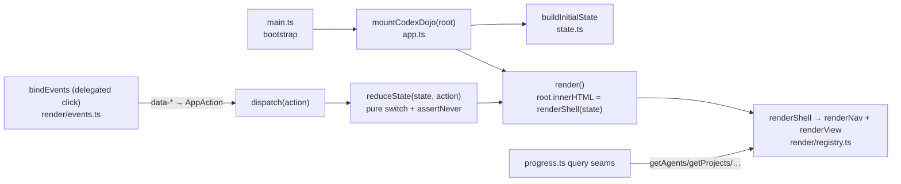

# Engine — codexDojo

**Path:** `engines/codexDojo/` · **Type:** runnable app · **Stack:** Vite + TypeScript (strict),
zero runtime dependencies.

## Purpose

The user-facing **control surface / operational dashboard** for the school. A local single-page app
that visualizes the agent roster, the operating cycle, the project roadmap, and a live learner
snapshot. It also carries the canonical **product-facing ecosystem contracts** under `ecosystem/`.

codexDojo is **read-only** with respect to learner state: it consumes data generated by the Python
substrate and renders it. It never marks mastery.

## Tech stack

| Concern | Choice |
| --- | --- |
| Language | TypeScript 5.9.3, strict (`noUncheckedIndexedAccess`, `exactOptionalPropertyTypes`, `verbatimModuleSyntax`, …) |
| Build / dev | Vite 7.2.7 (no `vite.config.*` → dev binds `127.0.0.1:5173`) |
| Lint / format | Biome 2.3.8 (double quotes, no semicolons, 2-space, width 100) |
| Test | Vitest 4.0.15 + jsdom |
| Runtime deps | none (vanilla DOM via HTML template strings) |
| Entry | `index.html` → `#app` + `/src/main.ts` |

## Commands

| Action | Command | Notes |
| --- | --- | --- |
| Install | `pnpm install` | pnpm required |
| Dev | `pnpm run dev` | `vite --host 127.0.0.1` → http://127.0.0.1:5173/ |
| Build | `pnpm run build` | `tsc --noEmit && vite build` |
| Preview | `pnpm run preview` | `vite preview --host 127.0.0.1` |
| Lint | `pnpm run lint` | `biome check src` |
| Test | `pnpm run test` | `vitest run` |
| Regenerate learner data | `python3 -m learner.substrate` then `pnpm run build` | after any `learner/` change |

## Architecture

Strictly **unidirectional, framework-free, reducer-driven** — a tiny Elm-style loop built from pure
functions and HTML strings.

1. **Mount** — `main.ts` resolves `#app` and calls `mountCodexDojo(root)` (`src/app.ts:13`). It pulls
   agents/stages/projects through the `progress.ts` query seams, throws `AppMountError` if any roster
   is empty, then seeds `state = buildInitialState(...)`.
2. **Render** — `render()` does `root.innerHTML = renderShell(state)`. `renderShell` →
   `renderNav` + `renderView`. `renderView` looks up `viewMeta[state.view].render` in the registry.
   Views are pure `(state) => string` functions.
3. **Events → actions** — `bindEvents` attaches one delegated `click` listener. A declarative
   `intents` table maps each `data-*` attribute (`data-view`, `data-agent`, `data-stage`,
   `data-project`, `data-filter`, `data-action='advance-stage'`) to an `AppAction`.
4. **Reduce** — `dispatch(action)` runs `state = reduceState(state, action)` then re-renders.
   `reduceState` is a pure switch over the `AppAction` union ending in `assertNever`.
5. **Data in** — renderers never import data modules directly; they go through `progress.ts` getters
   (a deliberate query seam) so the source of truth can move without scattering imports.

**Exhaustiveness discipline:** two guards — `assertNever(action)` at runtime in the reducer, and
`Record<View, …>` in `render/registry.ts` (a compile-time guard: adding a `View` variant forces a
registry entry).

## Directory map (`src/`)

| File | Role |
| --- | --- |
| `main.ts` | Bootstrap; throws `AppMountError` if `#app` missing. |
| `app.ts` | Mount + runtime loop: `mountCodexDojo`, `dispatch`, `render`. |
| `state.ts` | State seam: `AppState`, `AppAction`, `buildInitialState`, pure `reduceState`. |
| `domain.ts` | Shared types + const tuples (`views`, `agentGroups`, `projectPhases`), `assertNever`, `LearnerSnapshot`. |
| `cycle.ts` | Pure cycle algebra: `advanceCycle`, `getCycleCompletionPercent`. |
| `progress.ts` | Query seams (getters) between data modules and renderers; `getDashboardStats`. |
| `data/agents.ts` | Static data: `userFacingAgents` (10) + `agents` (14 core, grouped). |
| `data/cycle.ts` | Static data: `cycleStages` (20) + `metrics` (10). |
| `data/projects.ts` | Static data: `projects` (18 `DojoProject`s, p01–p18). |
| `data/ecosystem.ts` | Static data: `ecosystemStatuses` (4). |
| `data/learner.ts` | **AUTO-GENERATED** `learnerSnapshot`. Do not edit by hand. |
| `render/shell.ts` | `renderShell(state)` — sidebar + nav + content. |
| `render/registry.ts` | `viewMeta`, `viewRegistry`, `renderView` dispatch (exhaustiveness guard). |
| `render/nav.ts` | `renderNav`. |
| `render/overview.ts` | Overview / "Painel" view; embeds the learner dashboard. |
| `render/learner.ts` | `renderLearnerDashboard()` — unit state, Dreyfus/Bloom profile, AIDI, pitfalls, reviews, streak. |
| `render/agents.ts` | Agents view; copy-prompt button. |
| `render/cycle.ts` | Cycle view; stage timeline + advance button. |
| `render/roadmap.ts` | Roadmap view; phase filter + project cards. |
| `render/project.ts` | Project briefing view. |
| `render/events.ts` | DOM event seam: `bindEvents`, `intents` table, clipboard copy. |
| `*.test.ts` | ~9 Vitest suites (state, progress, render, events, projects, manifest, links, app, e2e). |

## Views

The `View` union (`domain.ts`): `overview` (label "Painel"), `agents` ("Agentes"), `cycle`
("Ciclo"), `roadmap` ("Roadmap"), `project` ("Projeto"). The roadmap's phase filter lives in
`AppState.projectFilter` (single state source).

## Key symbols

| Symbol | Location |
| --- | --- |
| `mountCodexDojo(root)` | `src/app.ts:13` |
| `AppState` / `AppAction` | `src/state.ts:6` / `:22` |
| `buildInitialState` / `reduceState` | `src/state.ts:31` / `:47` |
| `LearnerSnapshot` type | `src/domain.ts:80` |
| `getDashboardStats()` | `src/progress.ts:111` |
| `renderView` / `viewMeta` | `src/render/registry.ts:28` / `:14` |
| `bindEvents` / `intents` | `src/render/events.ts:30` / `:15` |
| `learnerSnapshot` (generated) | `src/data/learner.ts` |

## The `ecosystem/` contracts

`engines/codexDojo/ecosystem/` holds the product-facing documentation contracts. When you change
prompts, roadmap, gates, memory contracts, or deliverable coverage, update `MANIFEST.md` in the same
change.

| File | What it is |
| --- | --- |
| `MANIFEST.md` | Requirement-coverage manifest; maps every deliverable to concrete files. |
| `OPERATING_MODEL.md` | The file-based multi-agent operating architecture (10 user-facing agents + layered table). |
| `AGENT_PROMPTS.md` | Prompts for the 10 user-facing agents + how each expands into the 14-agent core. |
| `ROADMAP.md` | Product summary of the 18-project / 6-level curriculum (canonical source is `curriculum/catalog.md`). |
| `EVALUATION_MODELS.md` | Seven-dimension code-evaluation model + review-severity scheme. |
| `MEMORY_MODEL.md` | Memory architecture: three layers + canonical files. |
| `MEMORY_CURATION.md` | Operational curation contract (trigger, owner, inputs→outputs). |
| `COMPLETION_AUDIT.md` | Requirement-by-requirement audit with evidence files. |
| `CURRICULUM_SCOPE.md` | Maps requested learning topics to concrete tracks. |
| `LEGACY_MIGRATION.md` | Behavior-preserving refactoring contract. |
| `OPENCLAW_HERMES_RUNBOOK.md` | Continuous-operation runbook. |

## Generated data: `src/data/learner.ts`

This file is produced by `learner/substrate/dashboard_snapshot.py` from `learner/learning_state.yaml`
(plus profile, pitfalls, journal, backlog, predictions). It carries a
`DO NOT EDIT BY HAND — run python3 -m learner.substrate` header. Edit the canonical YAML, regenerate,
then `pnpm run build`. The shape is locked at `src/domain.ts:LearnerSnapshot`.

## Conventions & anti-patterns

- Renderers go through `progress.ts`, never directly through `data/*`.
- Adding a `View` requires a registry entry (the compiler enforces it).
- Never hand-edit `data/learner.ts`.
- Keep `ecosystem/MANIFEST.md` mapped to concrete files.
