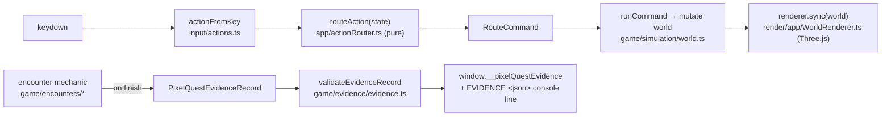

# Engine — pixelDojo

**Path:** `engines/pixelDojo/` · canonical app at `engines/pixelDojo/pixel-quest/` · **Type:** runnable
app · **Stack:** Vite + TypeScript (strict) + Three.js.

## Purpose

**8-bit teaching games** where each game maps **one curriculum concept → one arcade mechanic**, and
clearing a level **emits executable evidence**. A teaching game is the cleanest possible
learning-gate artifact: the game is the **attempt surface**, and a **separate verifier** reads the
evidence and decides mastery. The game never marks mastery itself.

`pixel-quest/` is the canonical implementation — a top-down RPG that exposes the 18 numbered
curriculum projects as labs.

> **Doc note:** `pixelDojo/README.md` describes an older Phaser-based, 12-subject plan. The shipped
> app is **Three.js**, and `pixel-quest/README.md` is the accurate description. Trust the code and
> `pixel-quest/` docs over the top-level README for implementation details.

## Tech stack

| Concern | Choice |
| --- | --- |
| Language | TypeScript 5.9.3, strict |
| Build / dev | Vite 7.2.7 (no `vite.config.*` → dev defaults to `127.0.0.1:5173`) |
| Rendering | Three.js 0.182.0 with an `OrthographicCamera` (the only runtime dependency) |
| Lint / format | Biome 2.3.8 |
| Unit test | Vitest 4.0.15 |
| Browser / smoke test | Playwright 1.57.0 |
| Entry | `index.html` → `#app` + `/src/main.ts` → `new PixelQuestApp(app).start()` |

## Commands

| Action | Command | Notes |
| --- | --- | --- |
| Install | `pnpm install` | run inside `pixel-quest/` |
| Dev | `pnpm run dev` | → http://127.0.0.1:5173/ |
| Build | `pnpm run build` | `tsc --noEmit && vite build` |
| Lint | `pnpm run lint` | `biome check src playwright` |
| Unit test | `pnpm run test` | `vitest run` (~23 tests in `src/tests/`) |
| Smoke | `pnpm run smoke` | `playwright test` — spins its own dev server on `127.0.0.1:4176` |

## Architecture

`PixelQuestApp` (`src/app/PixelQuestApp.ts`) is the runtime hub. On construction it `loadCorePack()`s,
builds the Three.js `WorldRenderer` and the DOM `Hud`, and seeds `world` for the first region.

**Phases.** The game walks the full teaching-game loop:
`briefing → map → practice → duel → evidence → review → gate` (`src/game/phases/types.ts`). Each is
a `WorldMode` / `GamePhase` the router handles distinctly.

**Encounters.** When a duel starts, `createEncounterFromPack(definition)` builds the matching
mechanic from the pack's `EncounterDefinition.kind`. There are four mechanics:

| Mechanic (`kind`) | Concept it teaches | File |
| --- | --- | --- |
| `token_bucket` | timed rate-limiter classifier | `game/encounters/tokenBucket.ts` |
| `sequence_flow` | ordered-flow puzzle | `game/encounters/sequenceFlow.ts` |
| `route_health` | health-routing puzzle | `game/encounters/routeHealth.ts` |
| `policy_gate` | authorization / isolation puzzle | `game/encounters/policyGate.ts` |

New mechanics are added by extending the typed encounter registry (`game/encounters/registry.ts`).

## How a cleared level emits evidence (producer ≠ verifier, in code)

1. The encounter mechanic, on completion, builds a `PixelQuestEvidenceRecord` and logs
   `console.log(\`EVIDENCE ${JSON.stringify(evidence)}\`)` (e.g. `tokenBucket.ts:112`).
2. `PixelQuestApp.applyEncounterInput` detects `encounter.evidence` and calls
   `recordEvidence(world, this.publishEvidence(evidence))`.
3. `publishEvidence` (`PixelQuestApp.ts:315`) runs `attachReviewContext(...)`, then
   `validateEvidenceRecord(...)` (strict gatekeeper), then sets `window.__pixelQuestEvidence`.
4. That is the end of the game's responsibility. The game **never** writes
   `learner/learning_state.yaml`, never appends `units_log`, never sets `mastered`, never uses
   `localStorage` for evidence. A separate verifier in a different context reads the evidence and
   owns the mastery transition.

`validateEvidenceRecord` requires: `source: "pixelquest"`, non-empty `unit_id` / `project` /
`encounter_id`, `game: "PixelDojo Quest"`, ISO `ts`, boolean `pass`, a full numeric `metrics` block,
`review_context.scheduler_source: "learner-substrate"`, and `verifier_required: true`.

### The evidence record (NDJSON unit)

Each `PixelQuestEvidenceRecord` (`game/evidence/types.ts`) carries `source`, `unit_id`, `project`,
`encounter_id`, `game`, `ts`, `pass`, a `metrics` object (e.g. `target_rate`, `observed_admit_rate`,
`max_burst_1s`, `good_admits`, `legit_rejected`, `abusive_admitted`, `abusive_rejected`, `heat_peak`,
`overheated`), and optional `review_context` + `curriculum_context`. One JSON line per cleared
encounter is the NDJSON unit.

## Directory map (`pixel-quest/src/`)

| File / dir | Role |
| --- | --- |
| `main.ts` | Bootstrap: resolve `#app`, `new PixelQuestApp(app).start()`. |
| `app/PixelQuestApp.ts` | Central coordinator: world state, encounters, renderer, HUD, evidence. |
| `app/actionRouter.ts` | Pure input router: `routeAction(state)` → typed `RouteCommand`. |
| `content/types.ts` | Content-pack schema: `ContentPack`, `Region`, `UnitDefinition`, `EncounterDefinition`. |
| `content/curriculumPack.ts` | Generated/curated lab content for the 18 numbered projects. |
| `content/packValidator.ts` | `validateContentPack` — rejects malformed packs (packs can't execute JS). |
| `content/loadCorePack.ts` | `loadCorePack()` — validates + returns `{pack, dialogues}`. |
| `content/reviewSlice.ts` | **AUTO-GENERATED** read-only review/streak slice from the substrate. |
| `content/packs/core/` | Compact core-pack fixture + dialogue assets. |
| `game/simulation/world.ts` | Grid movement, gates, quest progress, `recordEvidence`, transitions. |
| `game/phases/types.ts` | `GamePhase` + `gamePhaseOrder`. |
| `game/encounters/registry.ts` | Typed registry dispatching the 4 mechanics. |
| `game/encounters/{tokenBucket,sequenceFlow,routeHealth,policyGate}.ts` | The 4 mechanics. |
| `game/evidence/evidence.ts` | `validateEvidenceRecord` + `EvidenceValidationError`. |
| `game/evidence/types.ts` | Evidence contract types. |
| `game/review/reviewTrack.ts` | `createReviewTrack`, `attachReviewContext` (read-only projection). |
| `game/input/actions.ts` | `InputAction` union + `actionFromKey`. |
| `render/app/WorldRenderer.ts` | Three.js adapter (not gameplay truth). |
| `ui/Hud.ts` | DOM HUD: briefing, dialogue, practice, encounter, journal, help. |
| `global.d.ts` | Declares `window.__pixelQuestEvidence` and `window.__pixelQuestDebug`. |
| `src/tests/*.test.ts` | ~9 Vitest suites for router, evidence, mechanics, world. |
| `playwright/pixel-quest.spec.ts` | Browser smoke / proof contract. |

## The Playwright smoke test

`playwright/pixel-quest.spec.ts` plays the curriculum quest slice and advances labs. It: asserts the
canvas drew (`toDataURL` length > 1000); plays briefing → Rate Limiter lab → practice → duel; asserts
`window.__pixelQuestEvidence` has the right shape (including `metrics.abusive_admitted === 0`,
`scheduler_source: "learner-substrate"`, `verifier_required: true`); advances to further labs; and
**negatively asserts no mastery side-effects** — `window.__pixelQuestLearningState` is absent, and
`localStorage` keys do not include `learning_state` / `units_log` / `mastered`. This is how the
producer ≠ verifier boundary is enforced as an executable contract.

## Generated data: `src/content/reviewSlice.ts`

Produced by `learner/substrate/dashboard_snapshot.py`; read-only; carries a `DO NOT EDIT BY HAND`
header. The game renders due reviews / streak from it but owns none of that scheduling — the
substrate owns scheduling, the verifier owns mastery.

## Key symbols

| Symbol | Location |
| --- | --- |
| `PixelQuestApp` | `src/app/PixelQuestApp.ts:37` |
| `start()` | `src/app/PixelQuestApp.ts:61` |
| `publishEvidence` (validate + expose) | `src/app/PixelQuestApp.ts:315` |
| `routeAction` | `src/app/actionRouter.ts` |
| `createEncounterFromPack` | `src/game/encounters/registry.ts` |
| `validateEvidenceRecord` | `src/game/evidence/evidence.ts` |
| `PixelQuestEvidenceRecord` | `src/game/evidence/types.ts` |
| `WorldRenderer` | `src/render/app/WorldRenderer.ts` |

## Notable docs

- `pixel-quest/README.md` — accurate description of the shipped app, controls, content packs.
- `pixel-quest/DESIGN.md` — the 8-bit design system (palette, mono typography, 4px grid, 4:3 canvas).
- `pixel-quest/docs/content-packs.md` — the declarative content-pack contract.
- `pixelDojo/PLAN.md` — game-definition template + worked example for Game 01 "GATEKEEPER".

## Conventions & anti-patterns

- Gameplay truth lives in `game/simulation/` and `game/encounters/`, never in the renderer or HUD.
- The game must never write learner state, append `units_log`, set `mastered`, or use `localStorage`
  as evidence.
- Add new mechanics by extending the typed encounter registry.
- Never hand-edit `content/reviewSlice.ts`.
