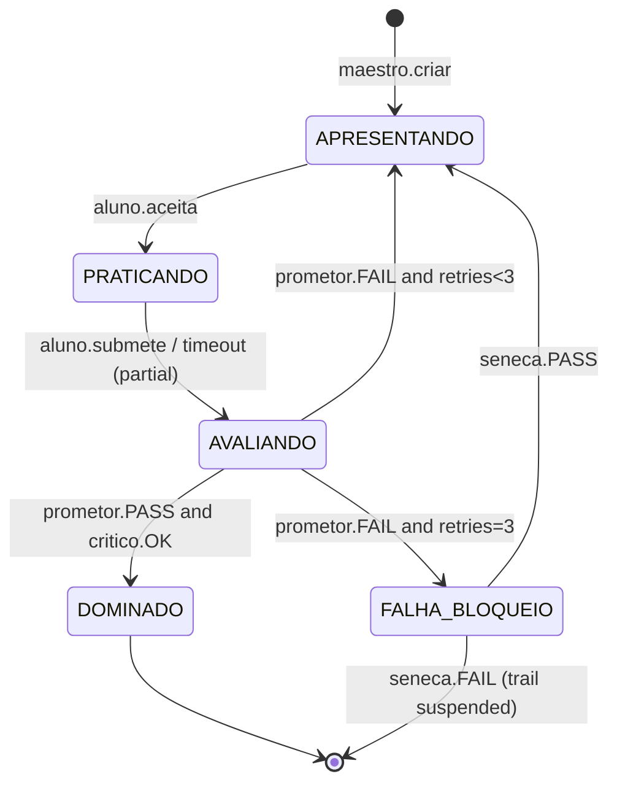

# Engine — minimaxDojo

**Path:** `engines/minimaxDojo/` · **Type:** agent core (spec / prompt layer) · **Platform:** MiniMax
Agent Team.

## Purpose

The **14-agent "Ágora Continuum" tutoring core**. It takes an intermediate programmer from
"I program, but my code isn't robust" to "I write, review and verify professional-quality code
autonomously" — **without creating AI dependency**. The certainty of completion never lives in the
LLM; it lives in **empirical gates** (real tests + mutation testing + statistical benchmarks) judged
by an **adversarial Verifier that starts from zero**.

This is *not* the runnable dashboard. It is the state machine, gates, prompts, governance, whiteboard
model, and a Python reference implementation. Start at `INDEX.md`.

## How you "run" it

minimaxDojo is prompt + config loaded into the MiniMax Agent Team:

1. Fill `config/learner.yaml` (`foco.linguagem` is mandatory — the verifier needs the test runner).
2. Paste `prompts/bootstrap/00_system.md`, then `prompts/bootstrap/01_first_cycle.md` into the platform.
3. `SONDA` diagnoses (10–15 min) → `CARTÓGRAFO` builds the trail → `MAESTRO` runs the state machine;
   each unit passes the empirical gate before `DOMINADO`.

Chat commands: "começar" / "próxima unidade", "tô travado em X" (Sócrates), "revisão do dia" (Mneme),
"auditoria semanal" (Sêneca), "status", "pular para U-NNN" (opens a Sêneca SLA).

## The 14 agents

Organized into five layers (full detail in `docs/01_agent_roster.md`). Model tier in parentheses.

### Layer 1 — Leadership

| # | Agent | Role |
| --- | --- | --- |
| 1 | **MAESTRO** (opus) | Leader; R/A of every unit. Decomposes objective → trail → units → exercises; operates the state machine; orchestrates parallelism; defines verifiable DoD. **Coordinates, does not produce.** |
| 2 | **CRONOS** (sonnet) | Scheduler. Recurring tasks (reviews, reports, audits) in fresh sessions; single ownership per cron (no double execution). |

### Layer 2 — Pedagogy

| # | Agent | Role |
| --- | --- | --- |
| 3 | **SONDA** (sonnet) | Short diagnostic (10–15 min). Classifies Dreyfus × Bloom per concept; pinpoints 3–5 surgical gaps. Does not re-test fundamentals. |
| 4 | **CARTÓGRAFO** (opus) | Robustness-trail planner. Unlocks the next level only by prerequisite proven with executable evidence. |
| 5 | **MESTRE-CONTEÚDO** (sonnet) | Exercise generator (faded worked examples, Parsons problems, incremental projects). Defines the test suite/DoD jointly with PROMĘTOR; withholds solutions from the learner. |
| 6 | **SÓCRATES** (sonnet) | Socratic anti-dependency tutor. Demands the learner's attempt + exact confusion point before any hint. Budget 15 consultations/day. Never delivers a finished solution. |
| 7 | **MNEME** (sonnet) | Spaced repetition. 15–20 min micro-reviews on the forgetting curve; interleaving + active retrieval; prioritizes the learner's pitfalls. |

### Layer 3 — Quality & Metrics

| # | Agent | Role |
| --- | --- | --- |
| 8 | **PROMĘTOR** (opus) | The adversarial Verifier / empirical gate. Starts from zero, mandate of refutation. Runs idiomatic suites in an isolated sandbox. Gate: mutation ≥ 60–70%, core coverage ≥ 80%, real execution. **Different model tier from the generator** for cross-model diversity. |
| 9 | **CRÍTICO** (opus) | Pedagogical reviewer. Reviews code explaining the *why* (idioms, SOLID, patterns, security, tech debt); trains the learner to review peers' code. |
| 10 | **GALILEU** (opus) | Lab + architecture. Benchmarks with statistical rigor (≥10 samples, warmup 500+, median/mean/min/CV%); blocks if CV% ≥ 20%. ADRs in MADR. Default = modular monolith. |
| 11 | **ATENA** (opus) | Metrics panel. Composite Quality Gate over **new** code + learning curve + Dreyfus×Bloom + `ai_dependency_index`. Forbidden from using DORA/velocity as a proxy for individual skill. |

### Layer 4 — Memory / Evolution / Governance

| # | Agent | Role |
| --- | --- | --- |
| 12 | **MNEMOSYNE** (opus) | Memory keeper (3 layers): intra-agent state, handoff files, persistent shared whiteboard. Curated core small & stable; Skills versioned. |
| 13 | **OUROBOROS** (opus) | Continuous self-improvement loop: plan → act → reflect → critique → revise. Stumbles become pitfalls; wins become Skills. |
| 14 | **SÊNECA** (opus) | Human-in-the-loop governance (auto-escala). Full autonomy on reversible/low-risk actions; PAUSE-checkpoint-resume with a 24h SLA on consequential decisions; on SLA expiry → most conservative option + audit log. |

A **RACI matrix** in the roster assigns R/A/C/I across decision types (e.g. "fail a unit": R=PROMĘTOR,
A=Maestro, C=Sêneca, I=Crítico).

## State machine

Unit states (`docs/02_state_machine.md`, mirrored in `config/learner.yaml`):
`APRESENTANDO | PRATICANDO | AVALIANDO | DOMINADO | FALHA_BLOQUEIO`.



**Invariants.** I1 — `DOMINADO` requires a PROMĘTOR positive verdict with executable evidence.
I2 — PROMĘTOR never receives Mestre-Conteúdo's context. I3 — retries ≤ 3, then Sêneca. I4 — timeout
submits a partial (still evaluated). I5 — every decision is logged to `event_log/events.ndjson`.

There are four sub-machines: the AVALIANDO empirical-gate sub-machine (`PRODUCING → VERIFYING → DONE`),
the Sêneca consequential-decision machine, the Skill lifecycle
(`draft → review → versioned → promoted → deprecated`), and the Mneme review machine. The runtime —
not the LLM — guarantees transitions: "Maestro proposes, runtime confirms."

## Empirical gates (the seam)

The `gates:` block of `config/learner.yaml` is the single numeric-threshold seam:

```yaml
mutation_score_min: 0.65
cobertura_nucleo_min: 0.80
suíte_verde_min: 1.0
lints_erros_max: 0
cc_mediana_max: 10
cc_max_revisar: 15
duplicacao_max_pct: 7
td_ratio_max_pct: 5
pr_loc_max: 300
```

Other knobs in the same file: `retries.max_por_unidade: 3`; `socrates.quota_dia: 15`;
`mneme.duracao_max_min: 20`, `min_interleaving_pct: 30`; `galileu.samples_min: 10`, `warmup_min: 500`,
`cv_max_pct: 20`; `atena.aidi_alerta_amarelo: 0.60`, `aidi_alerta_vermelho: 0.75`;
`seneca.sla_horas: 24`. Models: `raciocinio_profundo: opus`, `geracao_alto_volume: sonnet`,
`diversidade_cross_model: true`.

Per-language tooling (`docs/04_empirical_gates.md`): Python = pytest/mutmut/coverage.py/ruff+mypy;
Go = go test+testify/go-mutesting/golangci-lint/benchstat; Rust = cargo test/cargo-mutants/tarpaulin/
clippy/criterion; TS = vitest/stryker/c8/eslint+tsc.

The **`⟨config: path⟩` marker rule:** prompts and docs reference thresholds symbolically (and use
`⟨LINGUAGEM_FOCO⟩` for the focus-language seam) instead of hardcoding values that live in
`config/learner.yaml`.

## Directory map

| Path | Role |
| --- | --- |
| `INDEX.md` | Complete file map / navigation hub — start here. |
| `README.md` | Mission, 14-agent table, ASCII state machine, principles. |
| `AGENTS.md` | Conventions: where to look, the `⟨config: path⟩` rule, anti-patterns. |
| `config/learner.yaml` | The numeric-threshold seam (profile + gates + cron + models). |
| `docs/00_architecture.md` … `07_governance_sla.md` | 8 canonical spec docs + `QUICK_START.md`. |
| `agents/README.md` | Roster only; prompts in `prompts/per_agent/`. |
| `prompts/bootstrap/` | `00_system.md` + `01_first_cycle.md` — paste to instantiate the team. |
| `prompts/per_agent/*.md` | The 14 canonical system prompts (the authoritative prompt bodies). |
| `prompts/cycles/cycle_report.md` | Learner notification template. |
| `core/` | Python reference implementation: `state_machine/`, `gates/`, `memory/`, `scheduler/`. |
| `whiteboard/` | Derived live profile (see below) + config/history files. |
| `tests/` | Contract tests (~813 lines) exercising the `core/` Python. |
| `exercises/`, `reports/`, `src/` | Reserved spec surfaces (redirect to where real artifacts live). |

## The whiteboard is a derived view

`whiteboard/profile.yaml`, `learner_profile.md`, and `trail.md` carry
`derived_from: ../../learner/learning_state.yaml` and are **regenerated** by
`python3 -m learner.substrate`. Config/history files (`cron_registry.yaml`, `decisions/`,
`event_log/`) are hand-maintained / append-only and never auto-regenerated. This enforces the
ecosystem rule that the engine never silently forks global learner state. State values appear here in
UPPERCASE Portuguese (`APRESENTANDO`, …); the Mavis view uses lowercase (`apresentando`, …).

## The Python core (it really runs)

`core/{state_machine,gates,memory}/` ship a deterministic **reference implementation** in Python
(`__init__.py`, 135 / 74 / 128 lines) covered by ~813 lines of contract tests in `tests/`. Only
`exercises/` and `reports/` are README-only. (The
`core/`, `tests/`, and `src/` READMEs were corrected to reflect this — earlier versions called the
code "reserved.")

`core/state_machine/__init__.py` defines `DeterminismError`, `STATES`, `SUB_STATES`,
`MAX_RETRIES = 3`, and `UnitStateMachine`. `core/gates/__init__.py` hardcodes
`DEFAULT_MUTATION_THRESHOLD = 0.65`, `DEFAULT_COVERAGE_THRESHOLD = 0.80`, and a 16-item
`ANTI_PATTERN_BLACKLIST`. The tests import via absolute paths, so run them **from the repo root**:

```bash
python3 -m unittest discover -s engines/minimaxDojo/tests -t .   # 53 tests
```

## Memory system (3 layers)

From `docs/05_memory_system.md`: (1) intra-agent state (one run's experience becomes a hint in the
same agent's next run), (2) handoff files (`.md`, fixed schemas, one per handoff: `unit_spec.md`,
`submission.md`, `verdict.md`, …), (3) the persistent whiteboard/notepad. Rules: the curated core stays
small and stable in-prompt; history is searchable on demand (never raw-dumped); Skills are versioned
via PR and promoted after ≥3 uses without regression.

## Conventions & anti-patterns

- `prompts/per_agent/<name>.md` is canonical; `agents/<id>/README.md` is only an index. Changing an
  agent means touching both.
- Producer ≠ Verifier: the verifier closes gates; content-producing agents never share its context.
- Event/log artifacts are audit records — append, never rewrite.
- Don't mark a unit mastered because prose looks convincing; don't let Socratic help skip the
  learner's attempt; don't change gate thresholds without reconciling `docs/04` + `config/learner.yaml`.
