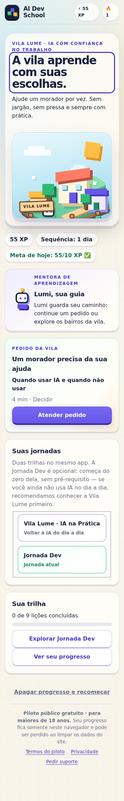
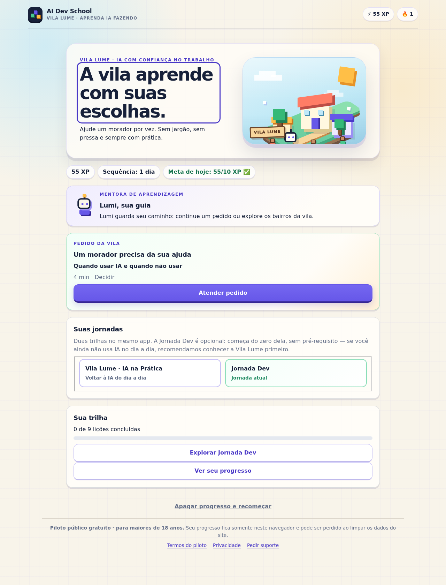

# Quickstart da Jornada Dev (opt-in) — aprendiz e educador

> **Proveniência:** AID-3588 (Docs & Readiness Engineer), produzida após a liberação do PO
> (descrição de AID-3588, 2026-10-01 05:12 UTC) sobre o aceite final de AID-3584.
> **Candidato exato:** PR #638 (Draft, aberto) — head `c02d2954fdbe384e1782cec34a90338ef98285d1`,
> branch `aid3584/dev-journey-optin`, base curada `579ce995` (`aid3453/unify-school`).
> Aceite técnico: LEE r1 (comentário `082f98b8`, head `32546406`) + r2 (comentário `a2617914`,
> head `c02d2954`). Inspeção independente de pixels do PO: PASS (Dev 0/9, CTA legível 360/1280 px).
> **Estado-resumo em uma linha:** a Jornada Dev opcional existe **somente como candidato aceito
> em preview isolado (Draft PR #638, não mergeado, não publicado)** — a URL pública do
> LiteracyDojo segue servindo o comportamento anterior (Trilha Dev "Em breve").

---

## 1. O que é (1 parágrafo)

No app standalone do LiteracyDojo, o cartão **Suas jornadas** da Home passa a oferecer duas
trilhas no mesmo app: **Vila Lume · IA na Prática** (default, 23 lições) e **Jornada Dev**
(opcional, 9 lições do módulo 05 "Dev: contexto e decisão"). A Dev nunca é inferida do
onboarding: é o aprendiz quem escolhe; ela começa do zero dela (primeira lição `l15`, sem
pré-requisitos) e o progresso das duas jornadas vive junto, no mesmo navegador. A UI registra
no máximo `completed` — nunca `mastered`.

## 2. Onde isto existe hoje (preview isolado × URL publicada)

| Superfície | Estado | O que mostra |
| --- | --- | --- |
| **Preview isolado do candidato** (facilitador roda local no head `c02d2954`) | ✅ este guia descreve isto | Cartão "Suas jornadas", CTA "Explorar Jornada Dev", mapa "Mapa da Jornada Dev" |
| **URL publicada** `https://aidevschool-literacydojo.netlify.app/` | ❌ **não tem a jornada Dev** | Comportamento anterior: Trilha Dev "Em breve" na boas-vindas |

**Como rodar o preview isolado** (educador/facilitador, uma vez por sessão — sem contas):

```bash
git fetch origin && git checkout c02d2954fdbe384e1782cec34a90338ef98285d1
cd engines/literacyDojo && npm install && npm run gen:content && npm run dev
# gen:content exige python3 + pyyaml ativos (veja engines/literacyDojo/README.md)
```

Não existe receipt de deploy deste candidato. Enquanto não houver, **não divulgue a URL
publicada como se tivesse a Jornada Dev** — a publicação é papel do FPE pelo fluxo nativo.

## 3. Quickstart do aprendiz — primeira sessão Dev (~10 min)

Abra o endereço que o facilitador passou, no navegador que você vai usar para voltar
(progresso fica neste navegador; não há conta).

1. Na boas-vindas, responda o onboarding curto como faria na Vila Lume. Você entra na Home
   com a jornada default (**Vila Lume · IA na Prática**) ativa.
2. Na Home, encontre o cartão **Suas jornadas**. Ele avisa: a Jornada Dev é opcional, começa
   do zero dela, e se você ainda não usa IA no dia a dia, vale conhecer a Vila Lume primeiro.
3. Escolha deliberadamente: toque em **Jornada Dev** ("9 lições para quem programa com IA
   (opcional)"). O botão passa a mostrar **Jornada atual** e o resumo da trilha muda para a
   Dev (0/9 no início).
4. O botão principal agora diz **Explorar Jornada Dev**. Entre: o mapa é o
   **Mapa da Jornada Dev** (módulo 5 — "Dev: contexto e decisão").
5. A primeira lição disponível é **l15 — "Quando usar IA e quando não usar"** (~4 min). As
   demais começam bloqueadas e destravam na ordem: após `l15` abrem `l16` e `l23`; após
   `l16` abrem `l17`, `l21` e `l22`; após `l21` abrem `l27` e `l28`; após `l22` abre `l29`.
6. Responda, leia o feedback; se errar, use a dica e **Tentar novamente**. Acerto = lição
   **concluída neste navegador** — não é domínio verificado.
7. Para alternar: cartão **Suas jornadas** → **Vila Lume · IA na Prática** ("Voltar à IA do
   dia a dia"). Nada se perde — cada jornada guarda o próprio ponto.
8. Para guardar cópia: **Ver seu progresso → Baixar backup JSON** (veja limites em §5).




## 4. Alternar, retomar e preservar

- **Alternância é escolha sua, sempre reversível:** o app nunca troca de jornada sozinho; o
  default continua IA na Prática, inclusive para quem já respondeu o onboarding como dev.
- **Recarregar mantém as duas jornadas** no mesmo navegador (IndexedDB local). Outro
  navegador, outro aparelho ou limpar os dados do site = começar do zero. Não há conta nem
  sincronização entre dispositivos.
- **Backup JSON:** registra no máximo `completed` (nunca `mastered`); restaurar funciona no
  mesmo perfil do navegador; o arquivo não sincroniza com "conta" porque conta não existe.
- **Conquistas ficam no percurso default:** completar 9/9 da Dev não destrava a conquista de
  trilha completa (conquistas/XP/skills continuam escopadas à Vila Lume).

## 5. Limites reais (não maquiados)

1. **Preview isolado:** o candidato é um Draft PR aberto (#638). Nada aqui está publicado;
   a URL pública serve o comportamento anterior. Sem merge/deploy por este guia (política R1:
   somente FPE).
2. **Evidência local, não certificado:** `completed` é status local; mastery exige verificação
   independente fora do app. Nenhum resultado de aluno, síncrono ou garantia de privacidade é
   produzido por esta orientação.
3. **Backup de progresso limitado:** no máximo `completed`; restauração só no mesmo perfil;
   limpeza de dados sem backup = perda real.
4. **Conquistas não acompanham a Dev:** 9/9 Dev ⇒ conquista de trilha completa segue bloqueada.
5. **Capturas cobrem o estado Home/CTA (r2, 360 e 1280 px):** mapa Dev e lição `l15` têm só
   capturas r1 com lacunas de proveniência declaradas; a jornada IA não teve pixel novo em r2
   (preservada por código/testes). Detalhes em
   [`evidence/dev-journey-optin-2026-10-01/PROVENANCE.md`](evidence/dev-journey-optin-2026-10-01/PROVENANCE.md).
6. **Práticas cotidianas (pg-c01) são planejadas**, não fazem parte deste quickstart
   executável: conteúdo no PR #635 e projeção em AID-3583/PR #636; player ainda não aceito.
7. **Onboarding segue apontando o CTA do OS público** (`?track=dev`) — não confunda: a jornada
   Dev deste guia é a do app standalone, não a do codexDojo OS.

## 6. Checklist do educador — primeira sessão Dev

Copie por sessão. Marque apenas o que **observar ao vivo** no preview isolado do head
`c02d2954`. Este checklist registra observação local da sessão; não produz resultado de
aluno, mastery, sincronização nem garantia de privacidade — e não usa PII.

| # | Verificar (observável) | Passa se | Fonte do comportamento |
| --- | --- | --- | --- |
| 1 | Preparo | Preview rodando no head `c02d2954` (§2); mesmo navegador será reutilizado; sem conta/PII criada | §2 deste guia |
| 2 | Aprendiz acha o cartão "Suas jornadas" e explica a própria escolha | Diz, com as próprias palavras, que a Dev é opcional e começa do zero (sem pré-requisito) | `HomeScreen.tsx` @ `c02d2954` |
| 3 | Escolha deliberada da Dev | Botão "Jornada Dev" aciona ("Jornada atual"), resumo muda para 0/9 — sem inferência do onboarding | `HomeScreen.tsx` + `journeyProgress.ts` @ `c02d2954` |
| 4 | CTA e mapa consistentes | CTA lê "Explorar Jornada Dev"; mapa lê "Mapa da Jornada Dev"; só `l15` disponível, demais bloqueadas | `HomeScreen/TrackMapScreen` @ `c02d2954`; capturas r2 |
| 5 | Primeira tentativa em `l15` | Aprendiz lê o resultado e distingue "concluída neste navegador" de domínio verificado | `l15` prereqs `[]` no `catalog.yaml` @ `c02d2954` |
| 6 | Alternância preserva progresso | Volta à Vila Lume e retorna à Dev; nada sumiu nas duas jornadas | `journeyProgress.ts` (init só de ausentes; idempotente) @ `c02d2954` |
| 7 | Retomada por reload | Recarregar restaura jornada ativa e progresso das duas trilhas no mesmo navegador | `journeySwitchFlow.test.tsx` ("reload (boot) com Dev ativa retoma pela jornada Dev") @ `c02d2954` |
| 8 | Limite de evidência explicado | Aprendiz mostra onde baixa o backup JSON e explica: no máximo `completed`, restauração só no mesmo perfil, sem conta/sync | `student-guide.md` (backup) + `journeyProgress.ts` |
| 9 | Educador registra só o observável | Anota somente os itens acima; sem inventar mastery, resultados, sincronização ou garantias de privacidade | Regra de ouro do produto |

**Interromper e retomar** (mesmo critério do kit do piloto): se o preview não carregar, o
armazenamento estiver bloqueado ou o progresso desaparecer duas vezes, pare a sessão,
preserve o estado e reporte na issue — não repita tentativas nem trate tela em branco como
conclusão.

## 7. Dedup e audiências

- **Guia operacional da escola unificada** (AID-3520, PR #622, draft): audiência **operador**
  — não substitui este quickstart; reutilize dele os fatos de publicação/falso-200.
- **Kit do piloto existente** (`docs/piloto/`, AID-3513): cobre o piloto da URL publicada
  (Vila Lume), onde a Dev ainda é "Em breve" — este guia é o complemento específico do
  candidato Dev opt-in.
- **Guia do estudante** (`student-guide.md`): segue descrevendo a oferta publicada; quando o
  PR #638 for publicado com receipt de deploy, atualize lá e registre a claim com data+fonte.

## 8. Fontes (todas as claims)

| Claim | Fonte verificável |
| --- | --- |
| Candidato/head/base/aceite | PR #638 (GitHub, Draft); AID-3584 comentários `082f98b8`, `a2617914`; `/paperclip/aid3584-evidence/lee-review-verdict.md` |
| Liberação e escopo | Descrição de AID-3588 (PO, 2026-10-01 05:12 UTC) |
| Cartão "Suas jornadas", CTA journey-aware | `engines/literacyDojo/src/screens/HomeScreen.tsx` @ `c02d2954` (`journey-card`, `journey-switch-dev`, `open-map`) |
| Default IA, nunca inferida; init só de ausentes; idempotência | `engines/literacyDojo/src/domain/journeyProgress.ts` @ `c02d2954` |
| Mapa "Mapa da Jornada Dev"; módulo/título | `engines/literacyDojo/src/screens/TrackMapScreen.tsx` @ `c02d2954` |
| 9 lições, `l15` primeiro, prereqs vazios, ordem de desbloqueio | `curriculum/ai-literacy/catalog.yaml` @ `c02d2954` (mod-05 `journey: dev`) |
| Conquistas escopadas ao default (9/9 Dev ⇒ track_complete locked) | Veredito LEE `a2617914`/`e152cfdf` (AID-3584); `journeyProgress.ts` |
| `completed` nunca `mastered`; backup ≤ `completed` | `engines/literacyDojo/README.md` @ `c02d2954`; `docs/product-readiness/student-guide.md` |
| Capturas r2 (hashes/viewport/horários) | `evidence/dev-journey-optin-2026-10-01/` + `PROVENANCE.md`; anexos AID-3584 |
| URL publicada sem a Dev ("Em breve") | `docs/product-readiness/student-guide.md` (oferta publicada, main @ `86fca779`) |
| pg-c01 planejado (fora do quickstart) | PR #635; AID-3583/PR #636; player draft PR #639 sem aceite |
| Como rodar o preview | `engines/literacyDojo/README.md` @ `c02d2954` ("Como rodar") |

---

**Manutenção:** se AID-3584 mudar de head/contrato antes da publicação, este guia perde
validade — aguarde a fonte final em vez de duplicar capturas (regra da issue AID-3588).
Atualização só com nova data + fontes.
