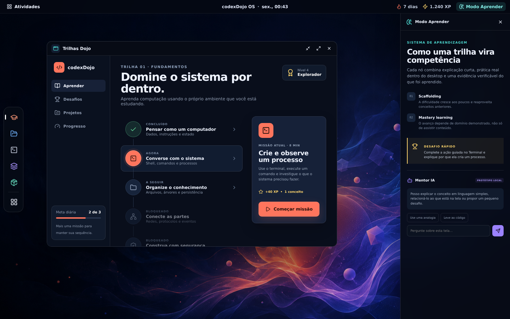

# codexDojo OS — engine 0.1

An educational Linux desktop where each application can become a computing
fundamentals lab.



## Run the OS

Use Node.js 20.19+ or 22.12+. The current lock file uses Vite 8.1.4.

```bash
npm install
npm run dev
```

Open the address printed by Vite. Build the production bundle with:

```bash
npm run build
```

Run the local checks with:

```bash
npm run lint
npm run test
npm run build
npm run test:smoke
```

## Use the Engine Hub

Open **Activities**, search for **Engine Hub**, and select an engine. The Hub
keeps each engine in its own runtime and exposes one bounded interaction:

| Engine | In-OS interaction |
| --- | --- |
| `codexDojo` | Open the real dashboard and copy an agent prompt. |
| `minimaxDojo` | Prepare the current Socratic tutor entrypoint from canonical learner/config state. |
| `miniMaxEvolutionEngine` | Prepare the exact next `/devschool-*` command from pipeline and learning-gate state. |
| `openclaw` | Preview the next checklist without writing pipeline state. |
| `pixelDojo` | Play PixelQuest and return raw attempt evidence to the Hub. |
| `voxelDojo` | Choose any of the 16 game packages; evidence-enabled games return raw attempts to the Hub. |

The three browser engines use these optional production URLs:

```bash
VITE_CODEXDOJO_URL=https://dashboard.example.test/
VITE_PIXELDOJO_URL=https://pixel.example.test/
VITE_VOXELDOJO_URL=https://voxel.example.test/
VITE_VOXELDOJO_URLS='{"game-02-warehouse":"https://warehouse.example.test/","game-10-hash-ring":"https://hash-ring.example.test/"}'
```

`VITE_VOXELDOJO_URL` is the compatibility URL for HASH RING;
`VITE_VOXELDOJO_URLS` maps any catalog game ID to its deployed origin.
Development falls back to `5175`, `5176`, and the 16 fixed voxel catalog ports;
run `pnpm run dev:catalog` from `../voxelDojo` to start them together.

The local Vite bridge exposes three fixed, read-only Python actions. It is
loopback-only, bootstraps a per-process token through a same-origin endpoint,
accepts one JSON action at a time, and never accepts caller-supplied commands or
paths. A normal static build renders local actions unavailable. To create and
serve a local production bundle with the bridge enabled, run:

```bash
npm run preview:integrated
```

Game builds must set `VITE_CODEXDOJO_OS_ORIGIN` to the exact OS origin. Their
evidence emitter verifies the embedding referrer and posts only to that origin.

Teaching games continue to append evidence to their engine-owned browser
channel and console log. When embedded, they also send the same raw record to
the Hub. The Hub validates the frame source and origin, labels the result as
unverified, and never grants mastery.

## Current boundaries

- The top bar and Dojo read `src/data/learner.ts`, a read-only projection
  generated from `learner/learning_state.yaml`.
- Missions, the catalog, Terminal state, and mentor responses remain local UI
  state.
- Engine actions and raw game evidence never mark units as `mastered`.
- The OS has no deployed backend, persistent virtual filesystem, or external
  mentor provider. The bridge is a local Vite dev/preview adapter only.

## Implemented surfaces

- Desktop shell, top bar, dock, searchable launcher, and movable windows.
- Catalog with more than 50 apps and explicit maturity states.
- Contextual Learn Mode and a deterministic local mentor prototype.
- Tracks, local Terminal commands, Files, and an architecture map.
- Engine Hub with six external engine adapters and raw-evidence receipts.
- Desktop, tablet, and mobile layouts.

See `docs/PLANO_INICIAL.md` for the product plan and
`../../docs/handbook/03b_engine_codexdojo-os-prototype.md` for the ecosystem
boundary.
